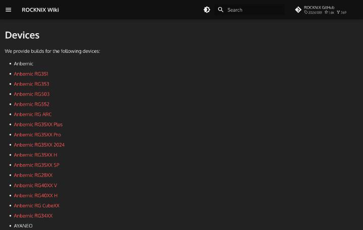
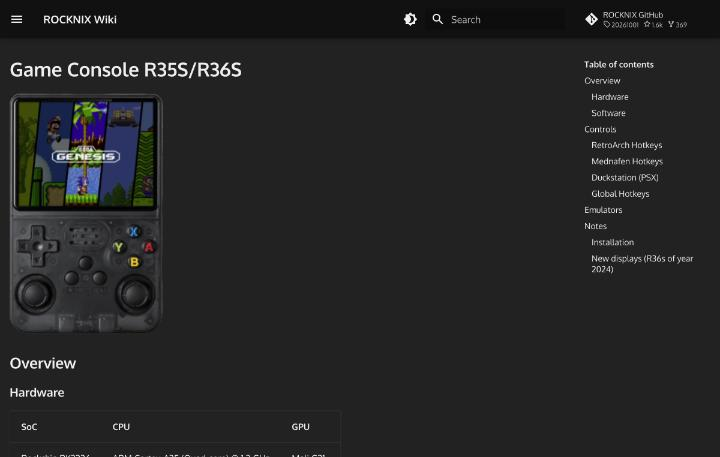

# 中華ゲーム機の全体像

このリポジトリで扱うのは、中国のメーカーが作る、レトロゲームのエミュレーションを主な用途にした携帯ゲーム機です。中国語では「掌机」(携帯ゲーム機)に「开源」(オープンソース)や「复古」(レトロ)を付けて「开源掌机」「复古掌机」と呼びます。

この記事は、後続の記事を読むための地図です。ブランド、SoC、価格帯、機種の形の4つの軸で、どんな機種があるのかを整理します。数値は、出典ページに書かれていたものだけを使いました。ページどうしで値が食い違う箇所は、食い違いのまま書いてあります。

中国語の情報は、百度貼吧の[开源掌机吧](https://tieba.baidu.com/f?kw=%E5%BC%80%E6%BA%90%E6%8E%8C%E6%9C%BA)に集まっています。このコミュニティは、ページの表示によると関注者が7.9万人、投稿数が143.1万件で、2014年3月に作られました。

## 機種の形

携帯機は、まず形で分かれます。掌机圈の機種ページには「握持类型」(握り方の種類)という欄があり、同じ3.5インチの画面でも、機種によって形が違います。たとえばR36Sは「竖版」(縦型)、RG-35XX Hは握持類型の欄が空欄、GKD Bubbleは「横版」(横型)、Miyoo Flipは「翻盖/折叠」(折りたたみ式)と書かれています([R36S](https://zhangjiquan.com/handheld/r36s)、[RG-35XX H](https://zhangjiquan.com/handheld/rg-35xx-h)、[GKD Bubble](https://zhangjiquan.com/handheld/gkd-bubble)、[Miyoo Flip](https://zhangjiquan.com/handheld/miyoo-355-flip))。

RG-35XX Hのページは、別名として「周哥35XXH,35XX横版机」を載せています。「横版机」は横型の機種という意味で、型番の後ろにHが付く機種を、横型として呼ぶ習慣があると読めます。ただし、この読み方を裏づける説明は、ページには書かれていませんでした。

画面の縦横比も、機種によって違います。4:3の機種は、旧世代のゲーム機の映像にそのまま合う比率です。16:9の機種は、PSP以降の映像に合う比率でもあります。掌机圈の6機種の一覧では、RG40XXH、RG406V、Novaが4:3で、RG556、RP4 Pro、RP5が16:9でした([仕様の比較](02-devices.md))。

## ブランドと愛称

製品を作っているブランドは、OSの対応機種一覧が手がかりです。[ROCKNIXの対応機種一覧](https://rocknix.org/devices/)には、Anbernic、AYANEO、AYN、GameForce、Hardkernel、MagicX、Mangmi、Powkiddy、Retroidが載っています。[Knulliの対応機種一覧](https://github.com/knulli-cfw/knulli.org/blob/main/docs/devices/index.md)には、これらに加えて、MiyooとTrimUIも載っているのが違いです。

ROCKNIXの一覧を数えると、Anbernicが15件、Powkiddyが12件で、AYANEO、AYN、Retroidがそれぞれ5件、Hardkernelと名前のない機種が3件ずつ、GameForceとMagicXとMangmiが1件ずつ、合計51件の項目が並んでいます([ROCKNIXの対応機種一覧](https://rocknix.org/devices/))。什么值得买のAI生成記事は、対応機種が49から66に増えたと書いていますが、この数え方とは合いませんでした。数え方の違いか、記事の誤りかは、確認できていません。

ROCKNIXの一覧を数えると、Anbernicが15件、Powkiddyが12件、AYANEOとAYNとRetroidが5件ずつ、Hardkernelと名前のない機種が3件ずつ、GameForceとMagicXとMangmiが1件ずつで、合計51件が並んでいます([ROCKNIXの対応機種一覧](https://rocknix.org/devices/))。什么值得买のAI生成記事は、対応機種が49から66に増えたと書いています。この数え方とは合わず、理由は確認できませんでした。

中国語の掲示板では、ブランドに愛称が付いています。機種のデータベースの[掌机圈](https://zhangjiquan.com/handhelds)は、Anbernicの[RG-406V](https://zhangjiquan.com/handheld/rg-406v)と[RG-556](https://zhangjiquan.com/handheld/rg-556)を、それぞれ「周哥RG-406V」「周哥RG556」という別名で載せています。「周哥」がAnbernicの愛称です。Retroidは「沙雕」と呼ばれ、掌机圈には[Retroid Pocket 5](https://zhangjiquan.com/handheld/retroid-pocket-5)の別名として「沙雕5,RP 5」、[Retroid Pocket 4 Pro](https://zhangjiquan.com/handheld/retroid-pocket-4-pro)の別名として「沙雕4 Pro,RP4 Pro」、[Retroid Pocket Nova](https://zhangjiquan.com/handheld/retroid-pocket-nova)の別名として「沙雕 Nova」が載っています。隠語の詳細は [中国語の語彙と隠語](11-chinese.md) にまとめました。

各ブランドの位置づけについて、什么值得买に載った記事は、Miyooを小型で200元以内の機種を出すブランド、GKD(老张)をOSの最適化に強いブランド、Anbernicを品ぞろえの最も広いブランドと説明しています。この記事は、ページ上で「AIGC文章」(AI生成の記事)と表示されているため、数値や評価を裏づけとして使うときは、ほかの出典で確認する必要があります([2026开源掌机红黑榜](https://post.smzdm.com/p/aww5ev54/))。

## 3.5インチ級の小型機

画面が3.5インチで640×480の機種は、価格が低く、種類が多い一群です。掌机圈の各ページから、4機種を並べます。

| 項目 | R36S | RG-35XX H | GKD Bubble | Miyoo Flip |
|---|---|---|---|---|
| 発売 | 2023年11月 | 2024年1月 | 2024年10月 | 2024年12月 |
| 形 | 縦型 | 記載なし | 横型 | 折りたたみ式 |
| SoC | RK3326 | 全志H700 | RK3566 | RK3566 |
| メモリ | 1GB DDR3L | 1GB LPDDR4 | 1GB LPDDR4 | 1GB |
| 電池 | 3500mAh | 記載なし | 4000mAh | 3000mAh |
| 重さ | 記載なし | 180g | 227g | 165g |
| 価格の表示 | 40ドル | 50〜75ドル | 379元 | 発売時339元 |

出典は、[R36S](https://zhangjiquan.com/handheld/r36s)、[RG-35XX H](https://zhangjiquan.com/handheld/rg-35xx-h)、[GKD Bubble](https://zhangjiquan.com/handheld/gkd-bubble)、[Miyoo Flip](https://zhangjiquan.com/handheld/miyoo-355-flip)の各ページです。R36Sの重さの欄は「-」で、RG-35XX Hの電池の欄は空でした。

R36Sのページは、エミュレーションの目安として、SNESまでとPS1(60FPS)、2DのPSPの多くが遊べると書いています。3DのPSPはフレームスキップが必要で、N64とDreamcastは、動かしやすい一部のゲームだけだそうです。RG-35XX Hのページは、N64、PSP、Dreamcastの大部分が遊べると書いており、同じH700のRG-40XXHのページとは、書き方が違います。

Miyoo Flipのページは、2024年12月30日の月曜の午後2時に、淘宝の公式企業店で発売され、最初の300台を339元で売り、1週間後に369元へ戻すとのことです。GKD Bubbleはタッチ画面つきで、ストレージの欄は「内置 32 GB MicroSD」です。

R36Sに載るRK3326について、掌机圈のページは、PassMarkの多コアスコアを440としています。T820の5577と比べると、12倍以上の差があります。ただし、このスコアが何の条件で測られたのかは、ページに書かれていません。

## 性能を決めるSoC

携帯機の性能は、ほぼSoCで決まります。この調査で確認できたSoCを、おおむね性能の低い順に並べると次のようになります。RK3566の位置は、H700との優劣を直接比べた出典が見つからなかったため、H700の次に置いただけです。

| SoC | 主な機種 | 出典 |
|---|---|---|
| Rockchip RK3326 | R35S、R36S | [ROCKNIX R35S/R36S](https://rocknix.org/devices/unbranded/game-console-r35s-r36s/) |
| Allwinner H700 | RG40XXH、RG35XX系、RG CubeXX | [掌机圈 RG-40XXH](https://zhangjiquan.com/handheld/rg-40xxh) |
| Rockchip RK3566 | Miyoo Flip、GKD Bubble | [掌机圈 Miyoo Flip](https://zhangjiquan.com/handheld/miyoo-355-flip) |
| Unisoc T820(虎贲T820) | RG406V、RG556 | [掌机圈 RG-406V](https://zhangjiquan.com/handheld/rg-406v) |
| MediaTek Dimensity 1100 | Retroid Pocket 4 Pro | [掌机圈 RP4 Pro](https://zhangjiquan.com/handheld/retroid-pocket-4-pro) |
| Snapdragon 865 | Retroid Pocket 5 | [掌机圈 RP5](https://zhangjiquan.com/handheld/retroid-pocket-5) |
| Snapdragon 8 Gen 2 | Retroid Pocket Nova、AYN Odin 2 | [掌机圈 Nova](https://zhangjiquan.com/handheld/retroid-pocket-nova)、[ROCKNIX Odin 2](https://rocknix.org/devices/ayn/odin2/) |

R36Sは、ROCKNIXのページによると、Cortex-A35の4コア1.3GHz、Mali G31、1GBのDDR3、3.5インチ640×480の画面という構成です。H700は、掌机圈のRG-40XXHのページでCortex-A53の4コア1.5GHz、Mali-G31 MP2、1GBのLPDDR4とされています。ROCKNIXのRG40XX Hのページは、同じH700について、標準で1.4GHzで動作し、設定でオーバークロックすると1.5GHzになると書いています([ROCKNIX RG40XX H](https://rocknix.org/devices/anbernic/rg40xx-h/))。

RK3566は、掌机圈のMiyoo Flipのページで、Cortex-A55の4コア1.8GHz、GPUがMali-G52 2EEの850MHzと書かれています。GKD Bubbleのページも、同じ値です。

T820は、掌机圈のRG-406VとRG-556のページで、Cortex-A76とCortex-A55の8コア(2.1〜2.7GHz)、GPUがMali-G57 MP4(850MHz)と記載されています。同じページは、このSoCのPassMark多コアスコアを5577としています。

Dimensity 1100とSnapdragon 865は、掌机圈によると、前者がCortex-A78の8コア(2.6GHz)とMali-G77 MC9、後者がCortex-A77とCortex-A55の8コア(1.8〜2.84GHz)とAdreno 650です。Snapdragon 8 Gen 2のNovaは、Cortex-X3を含む8コア(2.0〜3.2GHz)とAdreno 740で、メモリはLPDDR5Xの8〜12GBです。

## 価格帯

価格帯の分け方には、100〜200元をR36Sのような入門機、300〜500元をRG35XXシリーズなどの中堅機、1000〜3000元をRetroid Pocket 5やRG556などの上位機とする記事があります。これもAIGCと表示された[2026开源掌机红黑榜](https://post.smzdm.com/p/aww5ev54/)の記述です。

掌机圈が示す価格帯は、RG-40XXHが300〜500元、Retroid Pocket 5が1000〜1500元、Retroid Pocket Novaが1500〜2000元です。RG-556とRetroid Pocket 4 Proは150〜200ドルと表示されています。

どの価格帯を選ぶかは、遊びたいゲームの機種で決まります。何が動くかは [何が動くか](06-emulation.md) にまとめました。

## OSの欄と、AndroidとLinuxの両方に対応する機種

掌机圈の仕様表には、OSの欄があります。RG-40XXH、RG-35XX H、R36S、Miyoo Flip、GKD Bubbleの5機種は「开源系统」、RG-556は「安卓」(Android)と書かれています。RG-406Vの欄には、記載がありませんでした。「开源系统」と書かれた機種でも、具体的なOSの名前は、ページに書かれていません。

Retroidの公式ショップのRetroid Pocket 5のページは、OSをAndroid 13と書いています([goretroid.com](https://www.goretroid.com/en-jp/products/retroid-pocket-5))。一方で、ROCKNIXの対応機種にもRetroid Pocket 5が入っています。同じ機種について、Androidと、入れ替えて使うLinuxの両方の選択肢があることになります。入れ替えの手順は [OSの種類](03-os.md) と [CFWの導入](04-install-cfw.md) にまとめました。

## ROCKNIXの機種ページで分かること

ROCKNIXの機種ページは、SoCやメモリだけでなく、使うドライバーと操作の組み合わせまで書いています。R35S/R36Sのページは、カーネルがメインラインLinuxで、GPUのドライバーはlibmali(GLES 3.2)とPanfrost(GL 3.1/GLES 3.1)、画面の合成はSway、操作画面はEmulation Stationだと書いています([ROCKNIX R35S/R36S](https://rocknix.org/devices/unbranded/game-console-r35s-r36s/))。

同じページには、RetroArchのホットキーも載っています。SELECTを押しながらSTARTを2回押すとゲームを終了し、SELECTとR1でセーブ、SELECTとL1でロードです。SELECTとR2を押すと早送りになります。

RG35XX Hのページでは、同じ操作の起点がMENUボタンです。H700の機種として、カーネルはメインラインLinux、GPUのドライバーはPanfrostと書かれ、設定でオーバークロックを選ぶと1.5GHzで動くとあります([ROCKNIX RG35XX H](https://rocknix.org/devices/anbernic/rg35xx-h/))。

上位機のAYN Odin 2とRetroid Pocket Novaのページは、SoCがSnapdragon 8 Gen 2(SM8550)で、GPUのドライバーはFreedrenoとTurnipと書いています。操作の起点は、HOMEボタンになっています([ROCKNIX Odin 2](https://rocknix.org/devices/ayn/odin2/)、[ROCKNIX Nova](https://rocknix.org/devices/retroid/retroid-pocket-nova/))。この2機種のページは、ファンをカーネルが管理すること、ジョイスティックのLEDの色や電池残量の表示を選べることも書いています。

## 価格の見方

掌机圈の価格の欄は、「价格区间」(価格帯)と「起售价格」(発売時の価格)が基本です。R36Sは価格帯が「$0 - $50」で、起售価格が40ドルでした。RG-35XX Hは「$050 - $75」と表示されています。

機種のページに通販の購入リンクがあれば、「到手价」と「券面额」が付きます。RG-35XX Hのリンクは、到手価格が379元、クーポンの額が50元でした。同じページの下には、「优惠购机」(お得に買う)という見出しで、購入リンクが再掲されています。

ドルと元の両方が使われますが、日付と為替の条件は分かりません。そこで、価格は表示された通貨のまま書きます。

Retroid Pocket 5の公式ショップには、「Refurbished」(整備品)と書かれた版があり、156ドルで、確認した時点で売り切れでした。同じショップの通常版は、定価が209ドル、割引価格が179ドルです([goretroid.com](https://www.goretroid.com/en-jp/products/retroid-pocket-5))。掌机圈の1000〜1500元という表示とは、通貨も売っている版も違うため、直接は比べられません。

整備品のページのスペック欄は、CPUがCortex-A77の1コア2.8GHzと3コア2.4GHz、Cortex-A55の4コア1.8GHz、メモリが8GBのLPDDR4x、ストレージが128GBのUFS 3.1とTFカードスロット、画面が5.5インチのAMOLEDで1080pの60fps、電池が5000mAhです。掌机圈のページは、メモリを「6または8GB」と書いています。この違いの理由は、確認できませんでした。

## 販売経路

Retroidは、中国向けの公式サイトを持っています。トップページの下部に、販売の窓口として「天猫旗舰店」と「淘宝企业店」が並んでいます([Retroid中国公式サイト](https://www.retroid.cn/))。サイトの著作権表示は、「2023 深圳市驰晶科技有限公司」です。連絡先は、メールアドレスのほか、販売前後の問い合わせを淘宝のカスタマーサービスに任せると書かれています。

国外から買うときの経路は [買い方](09-buying.md) に書きました。

## 掲示板のコメントの読み方

掌机圈のコメント欄には、購入者の短い感想が載ります。RP4 Proには、「起手1500我说冤大头,闲鱼700只能给一句水桶机皇」という書き込みがありました([掌机圈 RP4 Pro](https://zhangjiquan.com/handheld/retroid-pocket-4-pro))。RP5には、2025年7月付けで「性价比超神」が載っています([掌机圈 RP5](https://zhangjiquan.com/handheld/retroid-pocket-5))。

RG-35XX Hには、2025年2月18日付けで「握持手感较差,其他还行吧」(握った感触はよくないが、ほかはまあまあ)という書き込みがあります([掌机圈 RG-35XX H](https://zhangjiquan.com/handheld/rg-35xx-h))。コメントは1人の感想で、数も少ないため、機種の評価として一般化はできません。

## この記事で出てくる中国語

本文に出てきた、機種や価格の表示に使われる中国語を、読み方と一緒にまとめました。

| 中国語(簡体字) | ピンイン | 日本語の意味 | 出典 |
|---|---|---|---|
| 掌机 | zhǎngjī | 携帯ゲーム機 | [开源掌机吧](https://tieba.baidu.com/f?kw=%E5%BC%80%E6%BA%90%E6%8E%8C%E6%9C%BA) |
| 开源 | kāiyuán | オープンソース | [开源掌机吧](https://tieba.baidu.com/f?kw=%E5%BC%80%E6%BA%90%E6%8E%8C%E6%9C%BA) |
| 复古 | fùgǔ | レトロ | [开源掌机吧](https://tieba.baidu.com/f?kw=%E5%BC%80%E6%BA%90%E6%8E%8C%E6%9C%BA) |
| 开源系统 | kāiyuán xìtǒng | オープンソースのOS | [掌机圈 RG-35XX H](https://zhangjiquan.com/handheld/rg-35xx-h) |
| 安卓 | ānzhuō | Android | [掌机圈 RG-556](https://zhangjiquan.com/handheld/rg-556) |
| 横版 | héngbǎn | 横型 | [掌机圈 GKD Bubble](https://zhangjiquan.com/handheld/gkd-bubble) |
| 竖版 | shùbǎn | 縦型 | [掌机圈 R36S](https://zhangjiquan.com/handheld/r36s) |
| 翻盖 | fāngài | 折りたたみ式 | [掌机圈 Miyoo Flip](https://zhangjiquan.com/handheld/miyoo-355-flip) |
| 握持类型 | wòchí lèixíng | 握り方の種類 | [掌机圈 RG-35XX H](https://zhangjiquan.com/handheld/rg-35xx-h) |
| 价格区间 | jiàgé qūjiān | 価格帯 | [掌机圈 RG-35XX H](https://zhangjiquan.com/handheld/rg-35xx-h) |
| 起售价格 | qǐshòu jiàgé | 発売時の価格 | [掌机圈 RG-35XX H](https://zhangjiquan.com/handheld/rg-35xx-h) |
| 到手价 | dàoshǒujià | クーポンを引いた実際の支払額 | [掌机圈 RG-35XX H](https://zhangjiquan.com/handheld/rg-35xx-h) |
| 券面额 | quànmiàn'é | クーポンの額 | [掌机圈 RG-35XX H](https://zhangjiquan.com/handheld/rg-35xx-h) |
| 优惠购机 | yōuhuì gòujī | お得に買う | [掌机圈 RG-35XX H](https://zhangjiquan.com/handheld/rg-35xx-h) |
| 天猫旗舰店 | Tiānmāo qíjiàndiàn | 天猫の公式ストア | [Retroid中国公式サイト](https://www.retroid.cn/) |
| 淘宝企业店 | Táobǎo qǐyèdiàn | 淘宝の企業ストア | [Retroid中国公式サイト](https://www.retroid.cn/) |
| 性价比 | xìngjiàbǐ | 費用に対する性能の割合 | [掌机圈 RP5](https://zhangjiquan.com/handheld/retroid-pocket-5) |
| 闲鱼 | xiányú | 中古取引サイトの名前 | [掌机圈 RP4 Pro](https://zhangjiquan.com/handheld/retroid-pocket-4-pro) |
| 冤大头 | yuāndàtóu | 損をする人 | [掌机圈 RP4 Pro](https://zhangjiquan.com/handheld/retroid-pocket-4-pro) |
