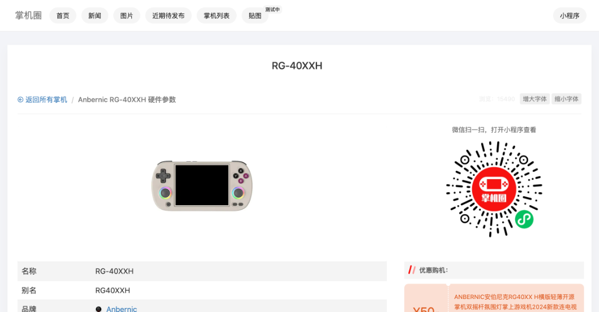
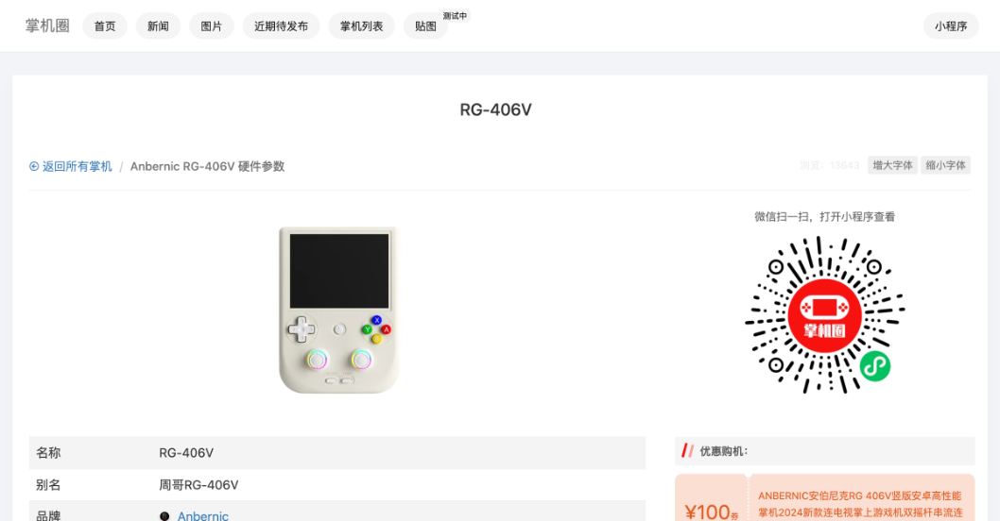
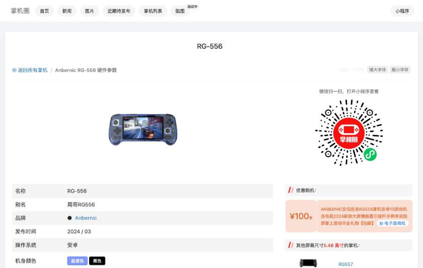
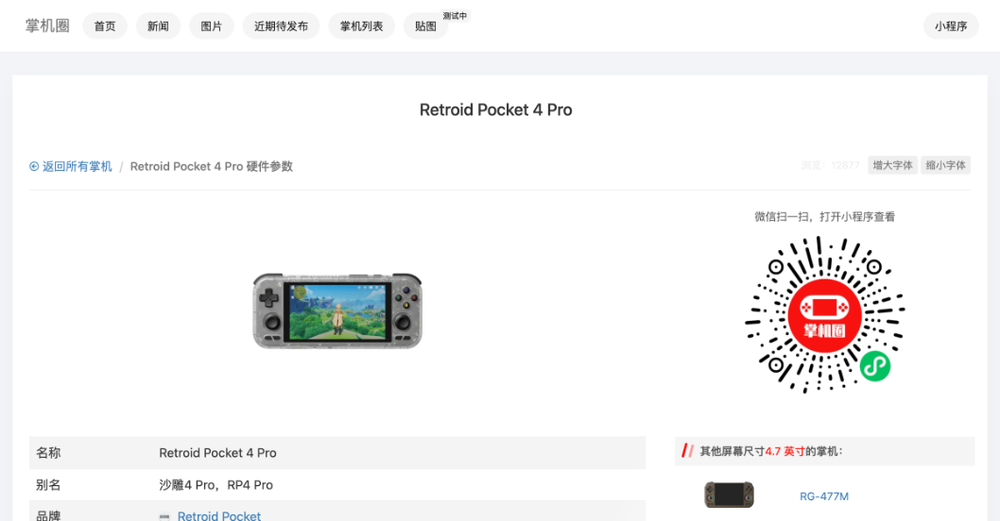
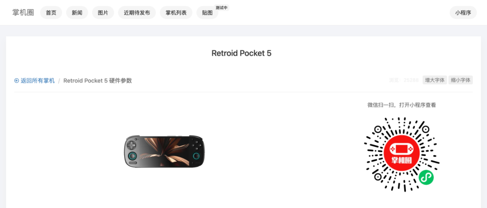
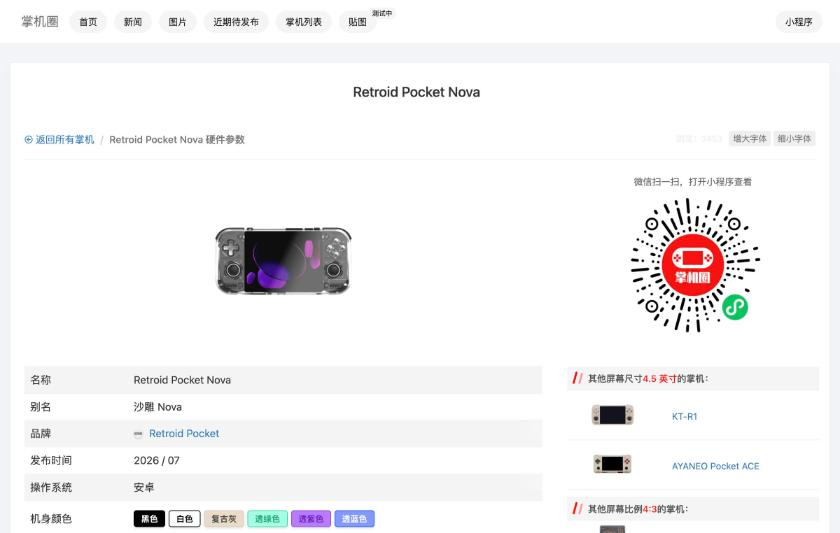

# 主要機種の違い

このページでは、遊ぶ機種を選ぶ候補になった6機種を、仕様のデータベースである[掌机圈](https://zhangjiquan.com/handhelds)の各ページをもとに比べます。掌机圈の数値は、ユーザーの投稿を含む情報です。公式の仕様表ではないため、電池容量のように載っていない項目は、ほかの出典を探す必要があります。

## 仕様の一覧

| 項目 | RG40XXH | RG406V | RG556 | RP4 Pro | RP5 | Nova |
|---|---|---|---|---|---|---|
| 発売 | 2024年7月 | 2024年9月 | 2024年3月 | 2024年1月 | 2024年9月 | 2026年7月 |
| 画面 | 4.0インチ 4:3 | 4.0インチ 4:3 | 5.48インチ 16:9 | 4.7インチ 16:9 | 5.5インチ 16:9 | 4.5インチ 4:3 |
| 画素密度 | 200 | 300 | 400 | 325.61 | 400.5 | 355.6 |
| リフレッシュレート | 60Hz | 60Hz | 60Hz | 60Hz | 60Hz | 120Hz |
| SoC | H700 | T820 | T820 | Dimensity 1100 | Snapdragon 865 | Snapdragon 8 Gen 2 |
| メモリ | 1GB LPDDR4 | 8GB LPDDR4X | 8GB LPDDR4X | 8GB LPDDR4x | 6/8GB LPDDR4 | 8〜12GB LPDDR5X |
| ストレージ | SDカード | 128GB UFS 2.2 | 128GB UFS 2.2 | 128GB UFS 3.1 | 128GB UFS 3.1 | 128〜256GB |
| 無線 | Wi-Fi 5、BT 4.2 | Wi-Fi 5、BT 5.0 | Wi-Fi 5、BT 5.0 | Wi-Fi 6、BT 5.2 | Wi-Fi 6、BT 5.1 | Wi-Fi 7、BT 5.3 |
| 重さ | 208g | 289g | 331g | 261g | 280g | 255g |
| 冷却 | 記載なし | ヒートパイプとファン | ヒートパイプとファン | ファン | ファン | ファン |
| 価格の表示 | 300〜500元 | 1048元(券後) | 1199元(券後) | 150〜200ドル | 1000〜1500元 | 1500〜2000元 |

出典は、[RG40XXH](https://zhangjiquan.com/handheld/rg-40xxh)、[RG406V](https://zhangjiquan.com/handheld/rg-406v)、[RG556](https://zhangjiquan.com/handheld/rg-556)、[RP4 Pro](https://zhangjiquan.com/handheld/retroid-pocket-4-pro)、[RP5](https://zhangjiquan.com/handheld/retroid-pocket-5)、[Nova](https://zhangjiquan.com/handheld/retroid-pocket-nova)の各ページです。RG40XXHの冷却欄は空で、RG406VとRG556の1048元と1199元は、掌机圈が載せている購入リンクの到手価格(クーポン適用後)です。

## Anbernic RG40XXH

H700を載せた横型の4インチ機です。掌机圈では、サイズが163×79×16mmで、SDカードスロットが2つ、出力はMini HDMIと記載されています。対応するゲームの形式は、PSP、DOS、NDS、N64、PS1、DC、アーケード、GBA、GBC、GB、SFC、FC、MAME、MDなどとされています。

什么值得买の[RG40XXH実測記事](https://post.smzdm.com/p/aqrg0rx2/)は、電池を3200mAh、重さを208gとし、FC、SFC、GBA、GB、PS1は問題なく動くと書いています。PSPとN64は一部が遊べる程度とされています。この記事もAIGCの表示があり、掲載された数値は、上の掌机圈のページと照らして使う必要があります。

この機種は、OSの選択肢が広いのが特徴です。[ROCKNIX](https://rocknix.org/devices/anbernic/rg40xx-h/)と[Knulli](https://github.com/knulli-cfw/knulli.org/blob/main/docs/devices/anbernic/rg40xx-h.md)の両方が公式に対応しています。

## Anbernic RG406V

縦型の4インチ機で、SoCは虎贲T820です。掌机圈によると、メモリは8GB、ストレージは128GBのUFS 2.2で、冷却にはヒートパイプとファンを使い、ジャイロとホールスティックを備えています。重さは289gです。対応するゲームは、掌机圈の欄では「N64、DC、PSP」とされ、PS2は書かれていません。

画面は4インチで、画素密度が300あります。4:3の画面なので、16:9のPSPの映像を表示すると、上下に黒帯が入ります。

## Anbernic RG556

横型で5.48インチの大きな画面を持つ機種です。SoCはRG406Vと同じT820で、掌机圈の記載では、重さが331g、画素密度が400、ホールスティックとホールトリガーを備えています。対応するゲームについて、掌机圈は、N64、Dreamcast、PSPがすべて満足なフレームレート、GameCubeとWiiは大部分が遊べる、PS2は一部が遊べる、Switchは簡単なゲームだけ、と書いています。

## Retroid Pocket 4 Pro

Dimensity 1100を載せた4.7インチの横型機です。掌机圈では、重さが261gで、WiFi 6とBluetooth 5.2に対応し、出力はMicro HDMIとUSB-Cです。対応するゲームは、GameCube、Wii、PS2までとされ、Switchは簡単な小さなゲームだけと書かれています。

同じページには、購入者のコメントとして「起手1500我说冤大头,闲鱼700只能给一句水桶机皇」が載っています。発売直後の1500元は高いと感じたが、閑魚で700元なら、弱点の少ない万能機として評価する、という内容です。

## Retroid Pocket 5

Snapdragon 865を載せた5.5インチの横型機です。掌机圈の記載では、サイズが199.2×78.5×15.6mmで、重さは280g、最大輝度は500ニト、出力はUSB-Cです。対応するゲームは、GameCube、Wii、PS2までとされ、一部のSwitchのゲームも動きます。

この機種は、OSの選択肢でも他の機種より恵まれています。[ROCKNIX](https://rocknix.org/devices/retroid/retroid-pocket-5/)と[Knulli](https://github.com/knulli-cfw/knulli.org/blob/main/docs/devices/goretroid/retroid-pocket-5.md)の両方に対応ページがあります。Knulliのページには、準備したSDカードを挿し、音量上キーを押したまま起動して、表示されるメニューから起動を選ぶ手順が書かれています。

## Retroid Pocket Nova

2026年7月に発売された新しい機種です。Snapdragon 8 Gen 2を載せ、画面は4.5インチの4:3で、リフレッシュレートが120Hzです。掌机圈では、サイズが169.9×84.1×26.3mm、重さが255gで、WiFi 7とBluetooth 5.3に対応しています。対応するゲームは、一部のSwitchまでとされています。

購入者のコメントには、「PS3のエミュレーターやPCのエミュレーターも遊べ、8 Gen 2のドライバーも整っていて、255gで手のひらに収まり、性能、放熱、電池、重さのすべてが整った完成された機種」という趣旨の評価があります。[LineageOS](https://wiki.lineageos.org/devices/RPN)の公式対応機種にもなっています。
