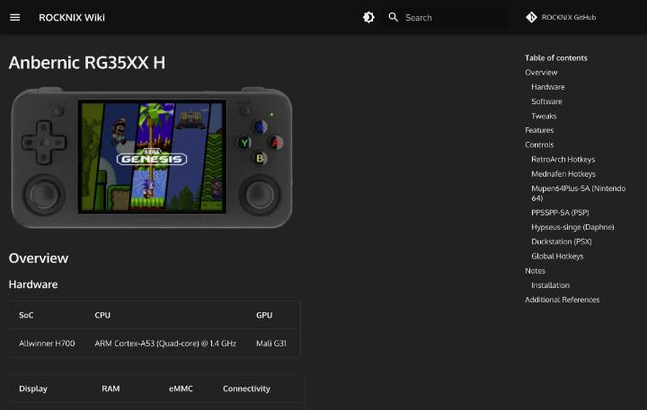

# 主要機種の違い

このページでは、遊ぶ機種を選ぶ候補になった6機種を、仕様のデータベースである[掌机圈](https://zhangjiquan.com/handhelds)の各ページをもとに比べます。掌机圈の数値は、ユーザーの投稿を含む情報です。公式の仕様表ではないため、電池容量のように載っていない項目は、ほかの出典を探す必要があります。

## 仕様の一覧

| 項目 | RG40XXH | RG406V | RG556 | RP4 Pro | RP5 | Nova |
|---|---|---|---|---|---|---|
| 発売 | 2024年7月 | 2024年9月 | 2024年3月 | 2024年1月 | 2024年9月 | 2026年7月 |
| 画面 | 4.0インチ 4:3 | 4.0インチ 4:3 | 5.48インチ 16:9 | 4.7インチ 16:9 | 5.5インチ 16:9 | 4.5インチ 4:3 |
| 画素密度 | 200 | 300 | 400 | 325.61 | 400.5 | 355.6 |
| リフレッシュレート | 60Hz | 60Hz | 60Hz | 60Hz | 60Hz | 120Hz |
| SoC | H700 | T820 | T820 | Dimensity 1100 | Snapdragon 865 | Snapdragon 8 Gen 2 |
| メモリ | 1GB LPDDR4 | 8GB LPDDR4X | 8GB LPDDR4X | 8GB LPDDR4x | 6/8GB LPDDR4 | 8〜12GB LPDDR5X |
| ストレージ | SDカード | 128GB UFS 2.2 | 128GB UFS 2.2 | 128GB UFS 3.1 | 128GB UFS 3.1 | 128〜256GB |
| 無線 | Wi-Fi 5、BT 4.2 | Wi-Fi 5、BT 5.0 | Wi-Fi 5、BT 5.0 | Wi-Fi 6、BT 5.2 | Wi-Fi 6、BT 5.1 | Wi-Fi 7、BT 5.3 |
| 重さ | 208g | 289g | 331g | 261g | 280g | 255g |
| 冷却 | 記載なし | ヒートパイプとファン | ヒートパイプとファン | ファン | ファン | ファン |
| 価格の表示 | 300〜500元 | 1048元(券後) | 1199元(券後) | 150〜200ドル | 1000〜1500元 | 1500〜2000元 |

出典は、[RG40XXH](https://zhangjiquan.com/handheld/rg-40xxh)、[RG406V](https://zhangjiquan.com/handheld/rg-406v)、[RG556](https://zhangjiquan.com/handheld/rg-556)、[RP4 Pro](https://zhangjiquan.com/handheld/retroid-pocket-4-pro)、[RP5](https://zhangjiquan.com/handheld/retroid-pocket-5)、[Nova](https://zhangjiquan.com/handheld/retroid-pocket-nova)の各ページです。RG40XXHの冷却欄は空で、RG406VとRG556の1048元と1199元は、掌机圈が載せている購入リンクの到手価格(クーポン適用後)を示しています。

## 仕様表の項目の読み方

掌机圈の機種ページは、仕様を項目ごとの表にして載せています。項目名は中国語で、「发布时间」(発売時期)、「机身颜色」(本体の色)、「外观尺寸」(外形寸法)、「重量」(重さ)、「屏幕尺寸」(画面サイズ)、「屏幕比例」(縦横比)、「屏幕刷新率」(リフレッシュレート)、「处理器」(SoC)、「内存」(メモリ)、「存储」(ストレージ)、「电池」(電池)、「散热」(冷却)、「连接性」(無線)、「视频输出」(映像出力)、「模拟器支持」(エミュレーションの目安)が並びます([RG-35XX Hのページ](https://zhangjiquan.com/handheld/rg-35xx-h))。

項目が空欄の機種もあります。上の一覧でRG40XXHの冷却を「記載なし」としたのは、このためです。ページの下には、「信息补充或纠错」(情報の補足や訂正)というボタンがあり、利用者が訂正を送れます。ページ内の説明は、掲載する仕様がネット上の情報の収集で、漏れや誤りがあり得ると断っています。

エミュレーションの目安の欄は、1行の短い文です。たとえばRG-35XX Hは「N64,PSP和Dreamcast大部分可玩」、R36Sは「SNES FX和3D PS1(60 FPS)…」と書かれています。測定の条件は書かれていないため、遊べるかどうかの目安にとどまります。

## Anbernic RG40XXH

H700を載せた横型の4インチ機です。掌机圈では、サイズが163×79×16mmで、SDカードスロットが2つ、出力はMini HDMIと記載されています。対応するゲームの形式は、PSP、DOS、NDS、N64、PS1、DC、アーケード、GBA、GBC、GB、SFC、FC、MAME、MDなどです。

什么值得买の[RG40XXH実測記事](https://post.smzdm.com/p/aqrg0rx2/)は、電池を3200mAh、重さを208gとし、FC、SFC、GBA、GB、PS1は問題なく動くと書いています。PSPとN64は一部が遊べる程度です。この記事もAIGCの表示があり、掲載された数値は、上の掌机圈のページと照らして使う必要があります。

この機種は、OSの選択肢が広いのが特徴です。[ROCKNIX](https://rocknix.org/devices/anbernic/rg40xx-h/)と[Knulli](https://github.com/knulli-cfw/knulli.org/blob/main/docs/devices/anbernic/rg40xx-h.md)の両方が公式に対応しています。

## Anbernic RG406V

縦型の4インチ機で、SoCは虎贲T820です。掌机圈によると、メモリは8GB、ストレージは128GBのUFS 2.2で、冷却にはヒートパイプとファンを使い、ジャイロとホールスティックを備えています。重さは289gです。対応するゲームは、掌机圈の欄では「N64、DC、PSP」とされ、PS2は書かれていません。

画面は4インチで、画素密度が300あります。4:3の画面なので、16:9のPSPの映像を表示すると、上下に黒帯が入ります。

## Anbernic RG556

横型で5.48インチの大きな画面を持つ機種です。SoCはRG406Vと同じT820で、掌机圈の記載では、重さが331g、画素密度が400、ホールスティックとホールトリガーを備えています。対応するゲームについて、掌机圈は、N64、Dreamcast、PSPがすべて満足なフレームレート、GameCubeとWiiは大部分が遊べる、PS2は一部が遊べる、Switchは簡単なゲームだけ、と書いています。

## Retroid Pocket 4 Pro

Dimensity 1100を載せた4.7インチの横型機です。掌机圈では、重さが261gで、WiFi 6とBluetooth 5.2に対応し、出力はMicro HDMIとUSB-Cです。対応するゲームは、GameCube、Wii、PS2までとされ、Switchは簡単な小さなゲームだけと書かれています。

同じページには、購入者のコメントとして「起手1500我说冤大头,闲鱼700只能给一句水桶机皇」が載っています。発売直後の1500元は高いと感じたが、閑魚で700元なら、弱点の少ない万能機として評価する、という内容です。

## Retroid Pocket 5

Snapdragon 865を載せた5.5インチの横型機です。掌机圈の記載では、サイズが199.2×78.5×15.6mmで、重さは280g、最大輝度は500ニト、出力はUSB-Cとされています。対応するゲームは、GameCube、Wii、PS2までで、一部のSwitchのゲームも動きます。

この機種は、OSの選択肢でも他の機種より有利です。[ROCKNIX](https://rocknix.org/devices/retroid/retroid-pocket-5/)と[Knulli](https://github.com/knulli-cfw/knulli.org/blob/main/docs/devices/goretroid/retroid-pocket-5.md)の両方に対応ページがあります。Knulliのページには、準備したSDカードを挿し、音量上キーを押したまま起動して、表示されるメニューから起動を選ぶ手順が書かれています。

## Retroid Pocket Nova

2026年7月に発売された新しい機種です。Snapdragon 8 Gen 2を載せ、画面は4.5インチの4:3で、リフレッシュレートが120Hzです。掌机圈では、サイズが169.9×84.1×26.3mm、重さが255gで、WiFi 7とBluetooth 5.3に対応しています。対応するゲームは、一部のSwitchまでです。

購入者のコメントには、「PS3のエミュレーターやPCのエミュレーターも遊べ、8 Gen 2のドライバーも整っていて、255gで手のひらに収まり、性能、放熱、電池、重さのすべてが整った完成された機種」という趣旨の評価があります。[LineageOS](https://wiki.lineageos.org/devices/RPN)の公式対応機種にもなっています。

## 3.5インチ級の4機種

上の6機種とは別に、掌机圈で3.5インチ画面の機種も調べました。対象はR36S、RG-35XX H、GKD Bubble、Miyoo Flipの4機種で、画面は640×480、縦横比は4:3、60Hzという共通の値です。

### R36S

2023年11月に発売された縦型の機種で、掌机圈のブランド欄は「Game Console」という総称のような表記です。SoCはRK3326で、Cortex-A35の4コア(1.3〜1.5GHz)とMali-G31 MP2(650MHz)、メモリは1GBのDDR3Lを載せています。ストレージは外付けのMicroSDが2枚、電池は3500mAh、接続の欄はUSB-C OTG、スピーカーの欄はモノラルとなっています([掌机圈 R36S](https://zhangjiquan.com/handheld/r36s))。

ROCKNIXのページは、同じ機種を「R35S/R36S」としてまとめ、メモリは1GBのDDR3、画面は3.5インチ640×480と記載しています([ROCKNIX R35S/R36S](https://rocknix.org/devices/unbranded/game-console-r35s-r36s/))。2024年のR36Sには、新しい画面を載せたものがあり、動かすには追加の作業が必要とされています。ページは、画面の種類に合うオーバーレイのファイルを、起動用の領域に置く手順を説明しています。

### RG-35XX H

2024年1月に発売された、Anbernicの機種です。掌机圈では、外形寸法が145×69×16mm、重さが180gで、H700(Cortex-A53の4コア1.5GHz、Mali-G31 MP2の650MHz)と、1GBのLPDDR4を載せています。ストレージは外付けのMicroSDが2枚、無線はWiFi 5とBluetooth 4.2、映像出力はMini HDMIです。3.5mmのイヤホン端子と、ステレオのスピーカーも備えています([掌机圈 RG-35XX H](https://zhangjiquan.com/handheld/rg-35xx-h))。

ROCKNIXのページは、同じ機種のH700を1.4GHzと書き、設定でオーバークロックすると1.5GHzになるとしています。ページは、無線のLANをオンにする場所をEmulationStationのメインメニューのネットワーク設定と案内し、電源LEDの色を選べること、Bluetoothの音声とコントローラーに対応することも書いています([ROCKNIX RG35XX H](https://rocknix.org/devices/anbernic/rg35xx-h/))。

### GKD Bubble

2024年10月に発売された、タッチ画面つきの横型機です。掌机圈では、外形寸法が166.8×82×24mm、重さが227gで、SoCがRK3566(Cortex-A55の4コア1.8GHz、Mali-G52 2EEの850MHz)、メモリが1GBのLPDDR4、電池が4000mAhです。映像出力はMicro HDMI、スピーカーはステレオで、振動の機能があります。価格は379元と書かれています([掌机圈 GKD Bubble](https://zhangjiquan.com/handheld/gkd-bubble))。

### Miyoo Flip

2024年12月に発売された、折りたたみ式の機種です。掌机圈では、外形寸法が82×80×20mmで、重さは165gで、重さが載る3機種のなかで最も軽くなっています。SoCはGKD Bubbleと同じRK3566です。電池は3000mAh、無線はWiFi 5とBluetooth 5.2、映像出力はMini HDMIで、スピーカーはモノラルです。本体の色には、黒、白、黄、復古灰の4色があります([掌机圈 Miyoo Flip](https://zhangjiquan.com/handheld/miyoo-355-flip))。

ページの別名の欄には、「Miyoo 翻盖机,翻米,蜜柚Flip,米柚翻盖掌机」が並んでいます。型番ではなく、形(翻盖)や、ブランド名の中国語の当て字で呼ばれている様子が分かります。

## 数値で見る違い

ここまでの10機種を、掌机圈の数値で比べた結果が次のとおりです。重さは、165gのMiyoo Flipから331gのRG556までの幅です。間には、RG-35XX Hの180g、RG40XXHの208g、GKD Bubbleの227g、Novaの255g、RP4 Proの261g、RP5の280g、RG406Vの289gが入ります。R36Sは、重さの欄が空でした。

価格は、R36Sの40ドル(起售价格)から、Novaの1500〜2000元(価格帯)までの差があります。ただし、ドル表示と元表示が混ざるため、順位は付けられません。

SoCの世代は、H700とRK3566の機種が小型で軽く、T820以上の機種が重いという対応になっています。これは10機種の数値を並べた結果にすぎず、一般的な法則としては確かめていません。

## OSの対応状況

公式のOSが、どの機種に対応しているかを、これまでに確認した一覧から表にします。「一覧にない」は、その一覧に当てはまる機種名が見つからなかったという意味にすぎません。対応しないと断言するものではありません。

| 機種 | ROCKNIX | Knulli | そのほか |
|---|---|---|---|
| RG40XXH | あり | あり | muOSの対応機種データにRG40XX-H |
| RG-35XX H | あり | あり | muOSの対応機種データにRG35XX H |
| R36S | あり(R35S/R36S) | 一覧にない | ArkOSの説明は確認できなかった |
| RG406V | 一覧にない | 一覧にない | 確認できなかった |
| RG556 | 一覧にない | 一覧にない | 確認できなかった |
| RP4 Pro | 一覧にない | 一覧にない | 確認できなかった |
| RP5 | あり | あり(GoRetroid) | 確認できなかった |
| Nova | あり | 一覧にない | LineageOSの公式対応(コード名RPN) |
| Miyoo Flip | 一覧にない | あり | GammaOS Coreの対応機種 |
| GKD Bubble | 一覧にない | 一覧にない | GammaOS Coreの対応機種 |

出典は、[ROCKNIXの対応機種一覧](https://rocknix.org/devices/)、[Knulliの対応機種一覧](https://github.com/knulli-cfw/knulli.org/blob/main/docs/devices/index.md)、[GammaOS Core](https://github.com/TheGammaSqueeze/GammaOSCore)、[LineageOS Wiki](https://wiki.lineageos.org/devices/RPN)、[MustardOSのリポジトリ](https://github.com/MustardOS)です。RG406VとRG556は、ROCKNIXの一覧にあるRG552やRG353とは、型番が別です。

## Retroid Pocket 5の公式ショップの記載

Retroidの公式ショップのRetroid Pocket 5のページは、5.5インチのAMOLED、1080pの60fps、5000mAhの電池、アクティブ冷却、Android 13、アナログのL2とR2、3Dのホールスティックを挙げています。無線はWi-Fi 6とBluetooth 5.1で、公式のOTAによる差分のアップデートに対応するとあります([goretroid.com](https://www.goretroid.com/en-jp/products/retroid-pocket-5))。

掌机圈のRP5の欄は、無線をWiFi 6とBluetooth 5.1、メモリを6または8GBとしています。無線の規格は、公式ショップと掌机圈で一致しました。メモリは、整備品のページが8GBで、掌机圈の6または8GBとは表記が違います。電池の容量は、掌机圈のRP5のページに数値がなく、公式ショップの5000mAhだけが手がかりです。

## この記事で出てくる中国語

仕様の表に並ぶ項目名を、読み方と一緒に確認します。

| 中国語(簡体字) | ピンイン | 日本語の意味 | 出典 |
|---|---|---|---|
| 发布时间 | fābù shíjiān | 発売時期 | [掌机圈 RG-35XX H](https://zhangjiquan.com/handheld/rg-35xx-h) |
| 机身颜色 | jīshēn yánsè | 本体の色 | [掌机圈 RG-35XX H](https://zhangjiquan.com/handheld/rg-35xx-h) |
| 外观尺寸 | wàiguān chǐcùn | 外形寸法 | [掌机圈 RG-35XX H](https://zhangjiquan.com/handheld/rg-35xx-h) |
| 重量 | zhòngliàng | 重さ | [掌机圈 RG-35XX H](https://zhangjiquan.com/handheld/rg-35xx-h) |
| 屏幕尺寸 | píngmù chǐcùn | 画面サイズ | [掌机圈 RG-35XX H](https://zhangjiquan.com/handheld/rg-35xx-h) |
| 屏幕比例 | píngmù bǐlì | 画面の縦横比 | [掌机圈 RG-35XX H](https://zhangjiquan.com/handheld/rg-35xx-h) |
| 屏幕刷新率 | píngmù shuāxīnlǜ | 画面のリフレッシュレート | [掌机圈 RG-35XX H](https://zhangjiquan.com/handheld/rg-35xx-h) |
| 处理器 | chǔlǐqì | プロセッサー(SoC) | [掌机圈 RG-35XX H](https://zhangjiquan.com/handheld/rg-35xx-h) |
| 内存 | nèicún | メモリ | [掌机圈 RG-35XX H](https://zhangjiquan.com/handheld/rg-35xx-h) |
| 存储 | cúnchǔ | ストレージ | [掌机圈 RG-35XX H](https://zhangjiquan.com/handheld/rg-35xx-h) |
| 电池 | diànchí | 電池 | [掌机圈 RG-35XX H](https://zhangjiquan.com/handheld/rg-35xx-h) |
| 散热 | sànrè | 冷却 | [掌机圈 RG-35XX H](https://zhangjiquan.com/handheld/rg-35xx-h) |
| 连接性 | liánjiēxìng | 無線などの接続 | [掌机圈 RG-35XX H](https://zhangjiquan.com/handheld/rg-35xx-h) |
| 视频输出 | shìpín shūchū | 映像出力 | [掌机圈 RG-35XX H](https://zhangjiquan.com/handheld/rg-35xx-h) |
| 模拟器支持 | mónǐqì zhīchí | エミュレーションの目安 | [掌机圈 RG-35XX H](https://zhangjiquan.com/handheld/rg-35xx-h) |
| 信息补充或纠错 | xìnxī bǔchōng huò jiūcuò | 情報の補足や訂正 | [掌机圈 RG-35XX H](https://zhangjiquan.com/handheld/rg-35xx-h) |
