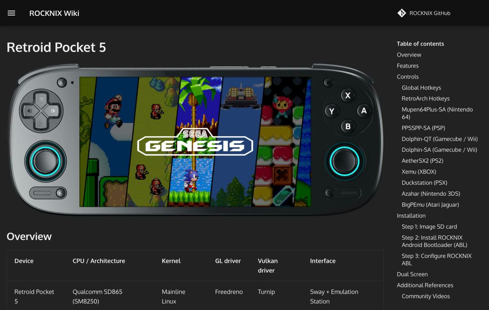

# CFWを入れる手順

このページでは、公式の文書が書いている手順から、ROCKNIXとKnulliの導入を整理します。どちらも、機種に合ったイメージをSDカードに書き込み、機種に挿して起動する流れです。機種によって、書き込みの前後に追加の作業があります。OSそのものの違いは [OSの選択肢](03-os.md) にまとめました。

CFWは、カスタムファームウェアの略です。中国語圏では、OSを入れ替える作業を「刷机」(刷機)と呼び、OSやその中身を「固件」(ファームウェア)や「系统」と呼ぶ例があります。百度の検索結果では、RG40XX Hのような機種の「刷机」「固件」について、動画や文書が並んでいました([百度の検索結果](https://www.baidu.com/s?wd=RG40XXH%20%E5%88%B7%E6%9C%BA%20%E5%9B%BA%E4%BB%B6%20Knulli%20%E6%95%99%E7%A8%8B))。

## 共通する考え方

ROCKNIXの[公式の導入手順](https://rocknix.org/play/install/)は、機種用のイメージをダウンロードして、SDカードか内蔵ストレージに書き込み、起動してインストールを進める流れです。書き込みには、Windowsなら公式の「ROCKNIX Image Burner」を使えます。ツールを開いたら、メーカーと機種を選び、「Write Image to Drive」を押すだけです。手動で行う場合は、リリースページからSoC別のイメージを取得して解凍し、Rufus、Raspberry Pi Imager、Win32 Disk Imager、または `dd` で書き込みます。

イメージの選び方には、注意が必要です。ROCKNIXの手順は、例としてGameforce Aceには「ROCKNIX-RK3588」のイメージを使うと書いています。迷ったときは、対応機種の一覧で、自分の機種に合うイメージを確認します([導入手順](https://rocknix.org/play/install/))。

Knulliの[導入手順](https://github.com/knulli-cfw/knulli.org/blob/main/docs/play/install.md)も、ほぼ同じです。リリースページの「Installation Package Downloads」から機種用のイメージを取得し、複数の部分に分かれている場合は7zipで解凍して、SDカードに書き込みます。例として、RG35XXには「rg35xx」のイメージを使うと書かれています。分割された部品はすべて同じフォルダに置き、001を7zipで展開する決まりです。書き込みの道具として、Rufus、Balena、Raspberry Pi Imager、Win32 Disk Imager、`dd` が挙がっています。

書き込み後に、Windowsが読めないパーティションの初期化を促しても、初期化してはいけません。Knulliのドキュメントは、Windowsが強く勧めても、読めないパーティションは決して初期化しないよう求めています。Windowsに新しいドライブがいくつか表示され、読めないという警告が出るのは、Linuxのファイルシステムを読めないためで、状態としては正常だと説明しています([導入手順](https://github.com/knulli-cfw/knulli.org/blob/main/docs/play/install.md)、[パーティションの解説](https://github.com/knulli-cfw/knulli.org/blob/main/docs/guides/partitioning.md))。

対応するビルドがない機種に注意が必要です。Knulliの導入手順は、「Installation Package Downloads」に載っていない機種には、まだ公開されたビルドがないと書き、別の機種のパッケージを使わないよう警告しています([導入手順](https://github.com/knulli-cfw/knulli.org/blob/main/docs/play/install.md))。

起動は、機種の電源を切った状態でSDカードを挿し、電源を入れて行います。機種によっては、起動順を設定してSDカードを先にする必要があります。Knulliの場合、2枚目のSDカードスロットがある機種では、初回の起動の間は、そのスロットは空にしておく決まりです。

起動のあとの動きも、公式の文書に書かれています。ROCKNIXは、インストールの処理を終えると機種を再起動し、そのままEmulationStationが開きます([導入手順](https://rocknix.org/play/install/))。Knulliも、インストールの処理が自動で進みます。数分かかる段階もあるため、待つ必要があります。終わるとEmulationStationが起動します([導入手順](https://github.com/knulli-cfw/knulli.org/blob/main/docs/play/install.md))。

## ROCKNIXの注意点

ROCKNIXのOS領域はext4でフォーマットされていて、Windowsでは直接読めません。ゲームを追加するには、ネットワーク転送、USB接続、2枚目のSDカードなどを使います。2枚目のSDカードは、ext4、FAT32、exFATのいずれでも、起動時に自動で認識されます。なお、x86の機種では、ROCKNIXにインストール用のツールが入っていて、EmulationStationのツールのメニューから使えます([導入手順](https://rocknix.org/play/install/))。

## H700のAnbernic機の追加手順

ROCKNIXは、H700を載せたAnbernic機では、書き込みのあと、起動の前に、1回だけ手作業が必要だと書いています([導入ガイド](https://rocknix.org/configure/h700-installation/))。ROCKNIXのパーティションの `device_trees` フォルダから、機種に対応するDTBファイルを、パーティションの一番上のフォルダにコピーします。コピーしたファイルは、小文字の `dtb.img` に名前を変えます。最後に、パソコンの「取り出し」機能でSDカードを安全に外し、機種に挿して起動する流れです。取り出しの手順を省くと、SDカードが起動できなくなることがあり、その場合は最初の書き込みからやり直します。

この手作業は、最初の1回だけです。導入ガイドは、通常の更新では必要ないと書いています([導入ガイド](https://rocknix.org/configure/h700-installation/))。

DTBのファイル名は、機種ごとに決まっています。たとえば、RG40XX Hは `sun50i-h700-anbernic-rg40xx-h.dtb`、RG40XX Vは `sun50i-h700-anbernic-rg40xx-v.dtb`、RG CubeXXは `sun50i-h700-anbernic-rgcubexx.dtb` です。RG35XXの系統は、基板のリビジョンによって2種類のDTBがあります。外から見ても違いが分からないので、画面が乱れたときは、電源を10秒押し続けて切り、書き込みからやり直して、もう一方のDTBを試す流れです。

2種類あるのは、RG35XX 2024、H、Plusです。それぞれに、末尾が `-rev6-panel` のファイルがあります。SPは、v2用の `sun50i-h700-anbernic-rg35xx-sp-v2-panel.dtb` が別にあります([導入ガイド](https://rocknix.org/configure/h700-installation/))。

ROCKNIXのソースコード(コミット `ae41127`)では、2種類あるDTBが、この導入ガイドの一覧よりも増えています。[config.xml](https://github.com/ROCKNIX/distribution/blob/ae41127cee7e3e81b1ab3b17b676d91be5165e61/projects/ROCKNIX/config.xml)のH700の一覧には、`sun50i-h700-anbernic-rg40xx-h-v2-panel`、`sun50i-h700-anbernic-rg40xx-v-v2-panel`、`sun50i-h700-anbernic-rg34xx-sp-v2-panel` もあります。RG40XX H用の[v2-panelのDTS](https://github.com/ROCKNIX/distribution/blob/ae41127cee7e3e81b1ab3b17b676d91be5165e61/projects/ROCKNIX/devices/H700/linux/dts/allwinner/sun50i-h700-anbernic-rg40xx-h-v2-panel.dts)は、通常のRG40XX H用のDTSを読み込み、画面の部品の指定を `anbernic,rg40xx-v2-panel` に変えているだけです。2つの違いは画面の部品だけなので、RG40XX Hでも、画面が乱れたらもう一方のDTBを試すことになると考えられます。実機では、まだ確かめていません。

同じソースでは、H700向けのイメージが、DDR3版とDDR4版の2種類に分かれています(config.xml)。違いは、起動の最初にメモリを使える状態にするU-Bootの部分です。RG40XXHのメモリは、掌机圈ではLPDDR4と記載されているため([主要機種の違い](02-devices.md))、DDR4版が合うはずです。ダウンロードの前に、ROCKNIXの機種のページで確かめてください。DTBとDDR3版、DDR4版の仕組みは、[電源を入れてから](19-boot.md)で詳しく扱っています。

## Retroid Pocket 5へのROCKNIX導入

Retroid Pocket 5は、Androidの内蔵ストレージを残したまま、SDカードからROCKNIXを起動できます。[公式ページ](https://rocknix.org/devices/retroid/retroid-pocket-5/)の手順は次のとおりです。

1. SM8250版のROCKNIXを、SDカードに書き込みます。
2. AndroidでSDカードの `rocknix_abl` フォルダを内部ストレージの一番上にコピーします。
3. 設定の「Handheld Settings」、「Advanced」、「Run Script as Root」で、`rocknix_abl` フォルダを選びます。
4. `backup_abl.sh` を実行して、現在のABLをバックアップします。
5. `flash_abl.sh` を実行して、ROCKNIXのABLを書き込みます。
6. 再起動して、音量の下を押したままROCKNIXのABLに入ります。音量の上と下で項目を選び、電源ボタンで決定します。
7. 「Set device model」で、Retroid Pocket 5またはVisionox版を選びます。
8. 「Switch boot mode」で、ブートモードをLinuxにします。
9. 「Start」を選ぶと、ROCKNIXが起動します。

ABLは、OSを起動する前に動く、最初のソフトウェアです。書き換えるとOSを入れ替えられますが、手順を誤ると機種が起動しなくなるおそれがあります。手順の4が、現在のABLを必ずバックアップする手順です。ROCKNIXのRetroid Pocket 6とAYN Odin 2のページにも、同じ手順の記載があります。

手順の1で、ページは、最新のナイトリービルドからSM8250版を取得するよう書いています。Retroid Pocket 5のページには、内蔵ストレージへのインストールの項目もありますが、手順の中身までは、確認していません([Retroid Pocket 5](https://rocknix.org/devices/retroid/retroid-pocket-5/))。

ROCKNIXのABLを入れたあとに、Androidへ戻る方法は、このページには書かれていませんでした。ブートモードの項目が「Linux」に切り替える選択肢だと分かるだけで、戻し方は確認できていません。確認できるのは、元のABLのバックアップ手順が、手順の4にあることだけです。

## Retroid Pocket 5へのKnulli導入

Knulliの[Retroid Pocket 5のページ](https://github.com/knulli-cfw/knulli.org/blob/main/docs/devices/goretroid/retroid-pocket-5.md)が書いているのは、SDカードを使う方法です。Knulliを書き込んだSDカードを挿して、機種の電源を切ってから、音量の上を押したまま電源を入れます。簡単な文字だけのメニューが表示されるので、「Boot」の選択は音量の上と下、決定は電源ボタンです。メニューは、画面が横向きではなく、縦向きに表示されることがあります。

ROCKNIXとKnulliでは、押すボタンが違います。ROCKNIXのABLに入るときは音量の下、Knulliのメニューに入るときは音量の上です。両方とも、そのあとの操作は音量の上下と電源ボタンです。ページの「Installation」の最初の文には、AndroidとLinuxの両方を起動できると書かれています。ただし、その文の機種名は、RP5のページなのに「Retroid Pocket Mini」でした。

Knulliでは、ほかにも事前の準備が必要な機種があります。Miyooの Flip、Retroid Pocket Flip 2、Retroid Pocket Mini、Retroid Pocket Mini V2です。導入の最初の段階で、これらの機種は、機種のページの「Installation」の準備をしておくよう案内されています([導入手順](https://github.com/knulli-cfw/knulli.org/blob/main/docs/play/install.md))。

## Knulliのパーティションと初回起動

Knulliを書き込むと、SDカードは6つの区画に分かれます。[パーティションの解説](https://github.com/knulli-cfw/knulli.org/blob/main/docs/guides/partitioning.md)によると、内訳は、約36MBの未割り当て領域、20MBと16MBのLinux用領域、約4GBのFAT32の `BATOCERA`、512MBの `SHARE`、残りの空き領域です。ゲームやテーマ、セーブデータは `SHARE` に置きます。`SHARE` は、初回の起動で、SDカードの残りの空き領域まで広がり、exFATで初期化されます。そのため、初回の起動は時間がかかる点に注意が必要です。

`BATOCERA` の区画には、KNULLIのOSが入ったイメージファイル(`boot/batocera`)と、起動に必要な `bootlogo.bmp` のようなファイルがあります。書き込みで、SDカードにもともとあったファイルは、すべて消えます。以前のフォーマットや区画の数は、関係ありません。区画が小さい理由は、どの容量のSDカードにも書き込めるようにするためで、公式は8GB以上と書いています([パーティションの解説](https://github.com/knulli-cfw/knulli.org/blob/main/docs/guides/partitioning.md))。

`/userdata`、`SHARE`、シェア区画、ユーザーデータ区画は、すべて同じ保存場所を指す呼び名です。2枚目のSDカードを使うと、`/userdata` は1枚目の `SHARE` ではなく、2枚目を指すようになります。そのため、2枚のSDカードを同時にゲームの保存場所にはできません([パーティションの解説](https://github.com/knulli-cfw/knulli.org/blob/main/docs/guides/partitioning.md))。

ゲームの置き場所を、2枚目のSDカードにする構成も選択肢です。Knulliは、使い続けるなら2枚構成を強く勧めています。1枚目をOSだけに使い、ゲームやテーマ、セーブデータを2枚目に置く形です。2枚構成にするときは、初回の起動のあとで、内部ストレージと外部ストレージの切り替えを手動で行う必要があります([クイックスタート](https://github.com/knulli-cfw/knulli.org/blob/main/docs/play/quick-start.md))。

## ファイルシステムの選び方

SHAREの区画は、Knulli Gladiatorのリリースより前はext4で、それ以降はexFATが既定です。ext4が既定だった理由はPortMasterのゲームの問題で、その問題が解消されたための変更です。ext4のほうが速く、書き込みの途中で中断されたときのファイルシステムの破損にも強いと、公式は書いています。WindowsやmacOSから直接読めることが重要でなければ、ext4に変える選択も可能です([パーティションの解説](https://github.com/knulli-cfw/knulli.org/blob/main/docs/guides/partitioning.md))。

昔のKnulliがext4を既定にした経緯は、別の文書に詳しく出ています。PortMasterの多くのゲームは、シンボリックリンクに頼っていました。exFATはシンボリックリンクを使えないため、動かないゲームや、設定と進行状況を保存できないゲームが出たのです。PortMasterの側で、シンボリックリンクの代わりにバインドマウントを使う修正が、ほとんどのゲームに入りました。文書が更新された時点で、PortMasterのポートは1009本、まだ影響が残るのは約25本です([PortMasterとexFAT](https://github.com/knulli-cfw/knulli.org/blob/main/docs/guides/portmaster-and-exfat.md))。

ext4にする場合、Windowsからは直接読めなくなります。そのため、ゲームの追加はWi-Fiか、USBでの転送が中心になります。文書は、Wi-Fiのない機種、たとえばRG28XXやRG35XX 2024では、exFATのままにするのが無難だと書いています([PortMasterとexFAT](https://github.com/knulli-cfw/knulli.org/blob/main/docs/guides/portmaster-and-exfat.md))。

ファイルシステムを変えるときは、Knulliの内蔵のフォーマッターを使います。メインメニューのSystem settingsの「Frontend developer options」にある「Format a disk」で、対象と、ext4かexFATかを選びます。「Format now」のあとは、再起動が必要です。WindowsやmacOS、Linuxのパソコンで直接フォーマットするのは避けるよう、公式は求めています([フォーマットの説明](https://github.com/knulli-cfw/knulli.org/blob/main/docs/play/add-games/formatting.md))。

ROCKNIXにも、保存の方式があります。外部のSDカードをext4にすると、内蔵ストレージと外部ストレージを統合する「Merged Storage」を使えます。この方式は、既定では無効です。無効のときや、exFATかFAT32のときは、外部カードのroms フォルダが、そのままゲームの置き場所になる「Simple Storage」です([ゲームの追加](https://rocknix.org/play/add-games/))。

## つまずきやすい点と対処

Knulliの文書には、導入でつまずいたときの手がかりが、いくつか載っています。1つ目は、`SHARE` がWindowsに表示されない場合です。Windowsが、広がったあとの `SHARE` にドライブ文字を割り当てないことがあるという説明です。スタートメニューで「disk management」を検索して、ディスクの管理を開き、SDカードの `SHARE` を右クリックして、ドライブ文字を割り当てます([パーティションの解説](https://github.com/knulli-cfw/knulli.org/blob/main/docs/guides/partitioning.md))。

2つ目に、`/userdata` が正しく広がっていない、またはマウントできていない場合を挙げます。文書の症状は、128GBのSDカードなのに容量不足と言われること、起動のたびにWi-Fiの情報やテーマの設定が消えることです。原因として挙がるのは、手作業でフォーマットや区画のサイズを触ったこと、SDカードや書き込みソフトの不調、壊れたイメージのファイルなどです。パソコンから安全な取り外しをせずにSDカードを抜いたときにも、起きる場合があります([パーティションの解説](https://github.com/knulli-cfw/knulli.org/blob/main/docs/guides/partitioning.md))。

対処の基本は、イメージをダウンロードし直して、書き込み直すことです。Windowsでは、Rufusの使用を強く勧めています。それでも直らなければ、SDカードの故障を疑います。2枚構成の場合は、2枚目のSDカードがexFATかext4かを確認してください。Knulliが対応するのは、この2つだけです([パーティションの解説](https://github.com/knulli-cfw/knulli.org/blob/main/docs/guides/partitioning.md))。

3つ目は、Wi-Fiにつながらない場合です。クイックスタートは、ルーターの暗号化がWPA2とWPA3の併用だと、つながらないことがあると書いています。その場合は、WPA1とWPA2に切り替えます。代わりに、実験的な機能「WIRELESS_HYBRID_FIX」を、System Settingsの「Services」で有効にする方法もあります([クイックスタート](https://github.com/knulli-cfw/knulli.org/blob/main/docs/play/quick-start.md))。ネットワークの文書は、この問題をAnbernicのH700機で報告されたものとして扱っていて、実験的な機能はKnulli Fireflyから使えるとしています([ネットワーク](https://github.com/knulli-cfw/knulli.org/blob/main/docs/configure/networking.md))。

Wi-Fiの内蔵がない機種、たとえばRG35XX 2024とRG28XXでも、USBのWi-Fiドングルを使えます。対応は、RTL8192cuかRTL8188eu/usのチップのものです。KNULLIのコミュニティは、TP-LinkのTL-WN725Nを強く勧めています。ドングルを挿したあとで、ServicesのENABLE_WIFI_DONGLEをオンにします([ネットワーク](https://github.com/knulli-cfw/knulli.org/blob/main/docs/configure/networking.md))。

ROCKNIXの側でも、手がかりがあります。ゲームが表示されない競合が起きたときは、`/usr/bin/cleanup_overlay` を実行すると解決できることが多く、実行すると機種が再起動します。`/storage/roms` にゲームのフォルダが出ないときは、microSDに `roms` ディレクトリがあるかを確認して、再起動します([ゲームの追加](https://rocknix.org/play/add-games/))。2枚目のカードを認識しないときは、System Settingsで「Autodetect Games Card」がオンかを確認して、再起動します。

## ゲームを追加する方法

ROCKNIXの[ゲームの追加](https://rocknix.org/play/add-games/)には、ネットワーク転送、USBガジェット、SDカード、USBドライブ、Linuxパソコン、NFSの方法があります。ネットワーク転送は、機種をWi-Fiにつなぎ、HTTP、SMB、SFTPのいずれかで接続する方法です。接続のユーザー名は `root` で、パスワードは初期値が `rocknix` です。ファイルを追加したあとは、STARTメニューのゲーム設定から、ゲームリストを更新します。

ネットワーク転送の細部も、ページに書かれています。HTTPは、ネットワーク設定で「Simple HTTP Server」を有効にし、ブラウザで機種のIPアドレスを開く方法です。SMBでは、Windowsのネットワークの種類を「プライベート」にすると、エクスプローラーのネットワークに機種が表示されます。表示されないときは、`\\ホスト名.local` か `\\IPアドレス` で開きます。macOSの場合は、Finderで「Cmd+K」を押し、`smb://` に続けて宛先を入れる形です。SFTPのポートは22です([ゲームの追加](https://rocknix.org/play/add-games/))。

USBケーブルでの転送には、2つのモードがあります。ネットワークのガジェット(旧ECM)は、パソコンと機種の間にネットワーク接続を作り、そのうえでSambaかSFTPを使う方法で、ページは「最も便利」と書いています。ファイル転送のガジェット(旧MTP)は、簡単に見えても制限があり、OSによっては追加のドライバやソフトが必要で、転送に失敗して、やり直すこともあります([ゲームの追加](https://rocknix.org/play/add-games/))。

SDカードを機種から出して使う方法もあります。2枚のSDカードスロットがある機種で、2枚目をゲームに使うなら、FAT32、exFAT、ext4、btrfsのいずれかでフォーマットしたカードをスロット2に入れて、起動します。起動が終わると、2枚目のカードに `roms` ディレクトリが自動で作られます([ゲームの追加](https://rocknix.org/play/add-games/))。

ROCKNIXには、リカバリーモードもあります。ほとんどの機種では、起動のときに音量の下を押し続けて入ります。機種のストレージがパソコンにUSBのマスストレージとして見え、ROMの管理、区画のフォーマット、ROCKNIXのクリーンインストールが可能です。終わったら、すべてのドライブを取り出してから、音量の上を押すと、通常の起動に戻ります。RK3566の機種では、入る前にUSBでパソコンにつないでおく必要があります。Retroid Pocket 5とMiniでは、GRUBのメニューで「RECOVERY」を選びます([ゲームの追加](https://rocknix.org/play/add-games/))。

Knulliでは、Windowsのエクスプローラーで `\\KNULLI`、macOSのFinderで `smb://KNULLI` を開くと、機種のフォルダが見えます。`roms` フォルダの中身は、機種ごとのサブフォルダです。BIOSは、Knulliの[BIOSの説明](https://github.com/knulli-cfw/knulli.org/blob/main/docs/play/bioses.md)にあるとおり、KNULLIに付属していません。BIOSには著作権があるため、自分で用意する必要があります。必要なBIOSは、ゲーム設定の「Missing BIOS check」で確認できます。

ext4にしていない場合は、ゲーム用のSDカードをパソコンに挿して、直接コピーしても構いません。ネットワーク転送でホスト名を変えた人は、`KNULLI` の部分を、そのホスト名に読み替える必要があります([クイックスタート](https://github.com/knulli-cfw/knulli.org/blob/main/docs/play/quick-start.md))。

## 導入後の設定と更新

Knulliのクイックスタートは、導入後の流れを、順番に書いています。Wi-Fiは、STARTボタンでメインメニューを開き、「Network settings」で設定します。PortMasterが必要なら、Wi-Fiにつないだ状態で、「Ports」の「Install.PortMaster」を実行する流れです。表紙や説明を付けたいときは、内蔵のスクレイパーを使い、ScreenScraper、TheGamesDB、ArcadeDBから取得できます。RetroAchievementsは、ゲーム設定の「RetroAchievement Settings」で、アカウントを入力します([クイックスタート](https://github.com/knulli-cfw/knulli.org/blob/main/docs/play/quick-start.md))。

最初にゲームを起動する前に、ホットキーを覚えるよう、クイックスタートは勧めています。ROCKNIXの機種のページにも、ホットキーの一覧があります。Retroid Pocket 5では、RetroArchの保存がHOMEとR1、読み込みがHOMEとL1の同時押しです([Retroid Pocket 5](https://rocknix.org/devices/retroid/retroid-pocket-5/))。

セキュリティについても、注意が書かれています。Knulliは、既定ではルートのパスワードが要求されず、ネットワークにつなぐと、同じネットワークの人がデータを見られる状態になります。メインメニューのSystem settingsの「Security」で「Enforce security」をオンにして、再起動すると、ランダムなルートのパスワードが使われる仕組みです。自分の管理外のネットワークにつなぐのは、避けるよう勧められています([ネットワーク](https://github.com/knulli-cfw/knulli.org/blob/main/docs/configure/networking.md))。ROCKNIXのルートのパスワードは、初期値が `rocknix` で、System Settingsの「Security」で変えられます([ゲームの追加](https://rocknix.org/play/add-games/))。

更新の方法は、2つのOSで異なります。ROCKNIXは、OTAか、`.tar` を手動で置く方法です。KNULLIの更新の文書は、大きな更新と小さな更新を分けています。たとえば、20240721からFireflyへの更新のような大きな更新は、再書き込みが必要で、設定もすべて初期化されます。更新の前に、`userdata` フォルダのバックアップを取る流れです。更新のあと、前の `system` フォルダを戻してはいけません([更新](https://github.com/knulli-cfw/knulli.org/blob/main/docs/play/update.md))。

小さな更新では、機種用の「ブートパッケージ」を取得して、BATOCERAの区画にある `boot/batocera` を入れ替えます。古いファイルは、消すか、`batocera.bak` のように名前を変えて残します。残しておけば、前のバージョンへ戻せる点が利点です。取得したパッケージの中の `batocera.update` を `boot` フォルダにコピーして、`batocera` に名前を変え、機種を再起動すると、更新が自動で始まります。ブートパッケージは、機種名を含み、名前が `boot.gz` などで終わり、サイズが約1.5〜2.0GBのものです([更新](https://github.com/knulli-cfw/knulli.org/blob/main/docs/play/update.md))。

Knulliの更新の文書は、OTAの更新のメニューは表示されるが、OTAのサーバーが用意されていないため、手動の更新をお願いすると書いています。同じ文書の別の節には、OTAの手順もあります。2つの記述が食い違うため、どちらが最新かは確認できませんでした([更新](https://github.com/knulli-cfw/knulli.org/blob/main/docs/play/update.md))。

## この記事で出てくる中国語

次の表は、この記事の導入に関わる語です。ピンインは声調記号つきで書きました。出典は、百度の検索結果のページで、語が実際に表示されていたものです。

| 中国語(簡体字) | ピンイン | 日本語の意味 | 出典 |
| --- | --- | --- | --- |
| 刷机 | shuā jī | 機器のOSを書き換えること | [百度の検索結果](https://www.baidu.com/s?wd=RG40XXH%20%E5%88%B7%E6%9C%BA%20%E5%9B%BA%E4%BB%B6%20Knulli%20%E6%95%99%E7%A8%8B) |
| 固件 | gùjiàn | ファームウェア | [百度の検索結果](https://www.baidu.com/s?wd=RG40XXH%20%E5%88%B7%E6%9C%BA%20%E5%9B%BA%E4%BB%B6%20Knulli%20%E6%95%99%E7%A8%8B) |
| 教程 | jiàochéng | 手順の解説、チュートリアル | [百度の検索結果](https://www.baidu.com/s?wd=RG40XXH%20%E5%88%B7%E6%9C%BA%20%E5%9B%BA%E4%BB%B6%20Knulli%20%E6%95%99%E7%A8%8B) |
| 刷系统 | shuā xìtǒng | OSを書き込むこと | [百度の検索結果](https://www.baidu.com/s?wd=RG40XXH%20%E5%88%B7%E6%9C%BA%20%E5%9B%BA%E4%BB%B6%20Knulli%20%E6%95%99%E7%A8%8B) |
| 更新系统 | gēngxīn xìtǒng | OSを更新すること | [百度の検索結果](https://www.baidu.com/s?wd=RG40XXH%20%E5%88%B7%E6%9C%BA%20%E5%9B%BA%E4%BB%B6%20Knulli%20%E6%95%99%E7%A8%8B) |
| 读卡器 | dúkǎqì | カードリーダー | [百度の検索結果](https://www.baidu.com/s?wd=RG40XXH%20%E5%88%B7%E6%9C%BA%20%E5%9B%BA%E4%BB%B6%20Knulli%20%E6%95%99%E7%A8%8B) |
| TF卡 | TF kǎ | microSDカード | [百度の検索結果](https://www.baidu.com/s?wd=RG40XXH%20%E5%88%B7%E6%9C%BA%20%E5%9B%BA%E4%BB%B6%20Knulli%20%E6%95%99%E7%A8%8B) |
| 格式化 | géshìhuà | フォーマットすること | [百度の検索結果](https://www.baidu.com/s?wd=RG40XXH%20%E5%88%B7%E6%9C%BA%20%E5%9B%BA%E4%BB%B6%20Knulli%20%E6%95%99%E7%A8%8B) |
| 备份 | bèifèn | バックアップ | [百度の検索結果](https://www.baidu.com/s?wd=RG40XXH%20%E5%88%B7%E6%9C%BA%20%E5%9B%BA%E4%BB%B6%20Knulli%20%E6%95%99%E7%A8%8B) |
| 变砖 | biànzhuān | 機器が起動しなくなること(いわゆる文鎮化) | [百度の検索結果](https://www.baidu.com/s?wd=RG40XXH%20%E5%88%B7%E6%9C%BA%20%E5%9B%BA%E4%BB%B6%20Knulli%20%E6%95%99%E7%A8%8B) |
| 下载 | xiàzài | ダウンロード | [百度の検索結果](https://www.baidu.com/s?wd=RG40XXH%20%E5%88%B7%E6%9C%BA%20%E5%9B%BA%E4%BB%B6%20Knulli%20%E6%95%99%E7%A8%8B) |
| 安伯尼克 | Ānbóníkè | Anbernicの中国語表記 | [百度の検索結果](https://www.baidu.com/s?wd=RG40XXH%20%E5%88%B7%E6%9C%BA%20%E5%9B%BA%E4%BB%B6%20Knulli%20%E6%95%99%E7%A8%8B) |
