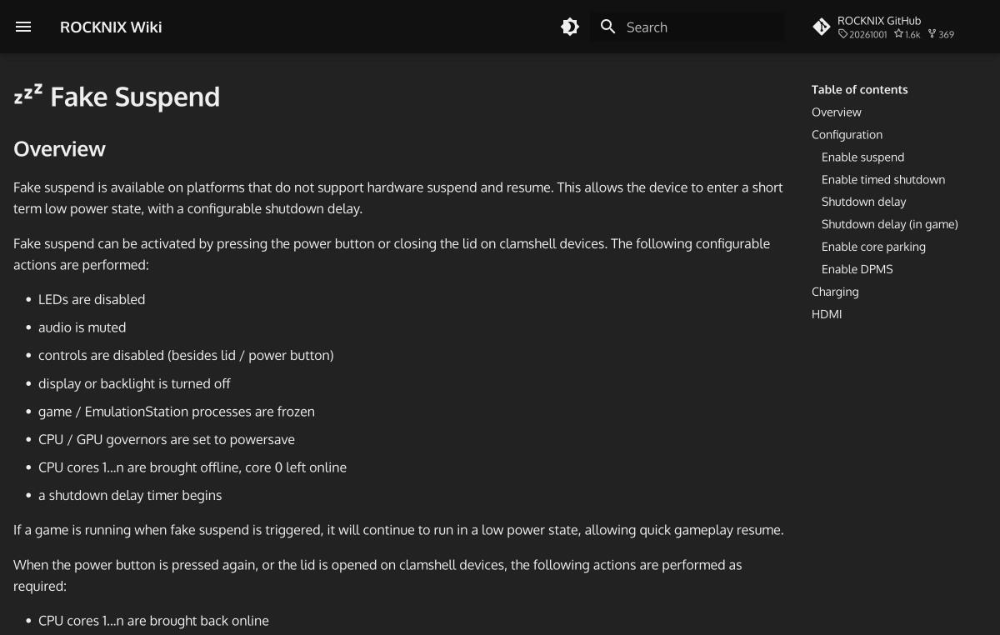

# 改造できること

携帯ゲーム機の改造は、ソフトウェア、OS、ハードウェアの3つに分けられます。ここでは、公式の文書や掲示板の投稿から確認できた範囲で、実際にできる改造を整理します。確認できなかった点は、その旨を書いたうえでの整理です。

## 見た目と使い勝手の調整

もっとも手軽なのは、ソフトウェアの設定です。Knulliの[公式ドキュメント](https://github.com/knulli-cfw/knulli.org/blob/main/docs/about-knulli.md)は、標準の機能として、ScreenScraperなどからのカバー画像と説明の自動取得、テーマの切り替え、画面の枠(ベゼル)の装飾、ゲームの自動分類とお気に入りのコレクション、セーブデータの同期、RGB LEDの設定を挙げています。同じドキュメントには、ブートロゴ、背景音楽、シェーダーを変える方法の説明ページがあるとのことです。以下では、そのページを順に読んで確認できた内容を書きます。

ROCKNIXも似た機能を備えています。[公式Wiki](https://rocknix.org/)の説明では、電力と性能のプロファイル、Bluetoothでの音声とコントローラー、HDMI出力、クラウド同期、VPN、RetroAchievements、ゲーム情報の自動取得が使えるとのことです。RG40XX Hでは、設定でCPUのオーバークロックを選べ、1.5GHzで動作します([ROCKNIX RG40XX H](https://rocknix.org/devices/anbernic/rg40xx-h/))。電源LEDについては、色の候補から選ぶか、消すかのどちらかができ、選んだ結果は再起動しても残ると書かれています。ただし、ほかの発光パターンには対応していません。

### テーマ

Knulliの標準のフロントエンドはEmulationStationで、標準のテーマはArt Book Nextです。BatoceraのCarbonテーマとKnulliテーマも最初から入っていて、3つとも、リリースのたびに自動で更新されます([Themes](https://github.com/knulli-cfw/knulli.org/blob/main/docs/configure/customization/themes.md))。メインメニューの「User Interface Settings」にある「Theme Configuration」からは、画面の縦横比、システム画面の絵柄、ゲームの絵柄の種類、説明文の表示、文字の大きさ、配色、起動中のスプラッシュ画面を選べます。配色の候補には、SteamOS、SNES、Famicom、DMG、OLEDの名前を冠したものがあります。

見た目を自分の画像に変えるとき、テーマのXMLを直接いじる必要はありません。ドキュメントによると、`/userdata/theme-customizations/art-book-next/` というフォルダを作り、その下に画像や配色の設定を置くと、テーマが更新されても変更が残ります。ROCKNIXでも考え方は同じで、保存先は `~/roms/rocknix/theme-customizations/art-book-next/` です([ROCKNIXのThemes](https://rocknix.org/configure/themes/))。標準のテーマは、どちらもArt Book Nextで、ROCKNIX側の説明では、対応する縦横比に16:9、4:3、16:10、5:3、3:2、1:1が挙げられています。

フロントエンドそのものを取り替える道もあります。Pegasusの[README](https://github.com/mmatyas/pegasus-frontend)は、テーマで、画面の部品、メニュー、アニメーションまで、すべて変えられるとの説明です。天馬Gの場合、内蔵のテーマは8種類です([模拟器游戏 篇四](https://zhuanlan.zhihu.com/p/703325151))。ゲームごとのカバーや動画は、`metadata.pegasus.txt` と `media` フォルダで追加できます。仕組みの詳細は、[フロントエンドと天馬G](05-frontend-tianma-g.md) に書いた通りです。

### ブートロゴと背景音楽

Knulliのブートロゴは、電源を入れてからEmulationStationが起動するまでの間に表示される画像です。SDカードの `knulli` パーティションにある `bootlogo.bmp` を、本体の画面と同じ解像度のビットマップに差し替えると変わります。RG35XX Plus、H、SP、2024の系統なら、640×480の画像です。手順は、本体を止めてSDカードを抜き、パソコンで `knulli` パーティションを開いてファイルを置き換え、カードを戻して起動する流れです。Windowsが壊れたドライブだと警告しても、無視するよう書かれています。元のファイルのバックアップも勧められています。この方法に対応しない機種があることも、同じページに書かれています([Boot Logo](https://github.com/knulli-cfw/knulli.org/blob/main/docs/configure/customization/bootlogo.md))。

背景音楽は、`userdata` フォルダの中の `music` フォルダに、MP3かOGGの曲を入れると、標準の曲の代わりに流れます。条件は、サンプルレートが44100Hz、ビットレートが最大256kb/sです。機種ごとに曲を分けたいなら、`roms` フォルダと同じ名前のサブフォルダを作ります。この場合、最上位には曲を置かないよう説明されています。たとえば、SNESなら `snes` です。曲を入れたあとは、メニューの「Sound Settings」で、フロントエンドの音楽の切り替えや、音量、曲名の表示時間を設定できます([Background Music](https://github.com/knulli-cfw/knulli.org/blob/main/docs/configure/customization/background-music.md))。

### シェーダーとベゼル

シェーダーは、ゲームの画面の見た目を変える小さなプログラムです。画質を上げるものと、昔の液晶やブラウン管の雰囲気をわざと出すものがあります。Knulliは、あらかじめ用意した設定の組を、全体、機種ごと、ゲームごとに選べるようにしています。全体の設定は、Startボタンでメインメニューを開き、「Game Settings」の「Game Rendering & Shaders」から「Shader Set」を選ぶ方法です。機種ごとの設定は全体の設定を上書きし、ゲームごとの設定は機種ごとの設定を上書きします([Shaders](https://github.com/knulli-cfw/knulli.org/blob/main/docs/configure/customization/shaders.md))。

組の中身も、ドキュメントに書かれています。「Curvature」は、多くの据え置き機にcrt-lottes-fastを使い、携帯機の多くにzfast-lcdを使います。「Enhanced」は、アンチエイリアスのadvanced-aaが基本です。「Retro」は、sharp-bilinear-simpleが基本です。「Retrovibes」の系統は、H700とA133で速度を落とさないことを狙った組で、画面の解像度ごとに480p、720p、768pの版があります。「RCG」の組は、Retro Game Corpsの推奨をもとにした設定です。整数倍の拡大が必要なものと、そうでないものに分かれます。すべての機種で同じ結果になるわけではないと、ドキュメントは断っています。RetroArchのコア以外では、シェーダーが効かないエミュレーターも一部にあるとのことです。

ROCKNIXの文書は、自分で組を作る手順も載せています。[公式のShaders](https://rocknix.org/configure/shaders/)のページには、GBA向けの2段のシェーダーを作る例があります。1段目にvba-colorを読み込み、シェーダーの段数を2にして、2段目にLCD1xを選ぶ流れです。パラメーターは、Darkenが0.25、Brighten Scanlinesが28.00、Brighten LCDが6.00です。保存するときは「Simple Presets」をオフにして、名前をつけます。保存した組は、機種ごとの詳細設定の「Shader Set」の一覧に出てくるとのことです。段を増やすと速度が落ちる点は、同じページの注意書きにあります。

ベゼルは、ゲームの縦横比と画面の縦横比が違うときに、余った黒い部分に絵を置く機能です。Knulliの標準の組「Default-KNULLI」は、4:3、1:1、16:9に対応しているため、本体の画面にも、HDMIでつないだテレビにも使えます。ただし、ベゼルが効くのはRetroArchのコアだけです。ベゼルの多くは特定の縦横比に合わせて作られていて、画面と合わないと、適用されないか、位置がずれます。Batocera向けの組の多くは16:9を想定しているので、4:3の画面の機種では使えないものがあります([Bezel Decorations](https://github.com/knulli-cfw/knulli.org/blob/main/docs/configure/customization/bezel-decorations.md))。ROCKNIXのページも、RetroArchのオーバーレイの用途として、余白を埋めること、走査線を再現すること、タッチ画面にボタンを表示することの3つを挙げています。単独のエミュレーターでは、オーバーレイに未対応です([Overlays](https://rocknix.org/configure/overlays/))。

### 画面の色と発光

Knulliには、Scarabのリリースから「Display Settings」のメニューがあります。「Device Settings」の中にあり、色温度を変えられます。標準の値は50です。大きくすると赤みが、小さくすると青みが強くなります。機種によっては、このメニュー自体が出ないと明記されています([Display Settings](https://github.com/knulli-cfw/knulli.org/blob/main/docs/configure/display-settings.md))。RGB LEDは、RG40XX HとVで最初から使えます。標準は、Knulliのロゴに合わせた緑です。低電池の表示、充電中の表示、RetroAchievementsを取ったときのアニメーションにも使えます。ただし、電池の残りが一定以下になるとRGBを切る機種があり、その場合は電池の表示が使えません([RGB LEDs](https://github.com/knulli-cfw/knulli.org/blob/main/docs/configure/rgb-leds.md))。

## 電源と電池の設定

次に、電池の持ちに関する設定です。Knulliは、Firefly以降のリリースで、「Power Management」のメニューを備えています。画面を暗くする、画面を消す、サスペンドする、電源を切る、のどれかを、放置した時間で選べます。設定は2段階で、1段目をサスペンド、2段目を電源オフにすれば、一定時間後に電源まで切れる形です。ドキュメントは、機種によってはサスペンド中でも電池の減りが驚くほど速く、ソフトでは直せないと注意しています。RG35XX SPのような蓋つきの機種では、蓋を閉じたときの動作も選べます([Power Management](https://github.com/knulli-cfw/knulli.org/blob/main/docs/configure/power-management.md))。

そのため、Knulliは「Quick Resume」を勧めています。電源ボタンを2秒ほど押して正しく終了すると、対応するエミュレーターなら進行状況が自動で保存されます。次に電源を入れたときは、最後に遊んだゲームが起動し、保存した場所から再開できる仕組みです。有効にするには、「Game Settings」で「Auto Save/Load」と「Quick Resume Mode」を入れます。ポートの多くや、自動保存に対応しないエミュレーターでは、自分で保存と読み込みをする必要があります。起動を繰り返してしまう場合は、設定ファイルの `system/knulli.conf` から、`global.quickresume`、`bootgame.cmd`、`bootgame.path` の3行を消します([Quick Resume](https://github.com/knulli-cfw/knulli.org/blob/main/docs/configure/quick-resume.md))。

ROCKNIXの「Fake Suspend」は、ハードウェアのサスペンドに対応しない機種のための仕組みです。電源ボタンか蓋で、LEDを消し、音を止め、画面を消し、ゲームとEmulationStationのプロセスを止めます。CPUとGPUの設定は省電力にして、コア0以外のCPUコアをオフにし、終了までのタイマーを始めます。ゲーム中の標準の待ち時間は15分で、メニューにいるときは0分です。設定画面では、停止までの時間のほか、コアを止めるかどうかと、DPMSで画面を消すかどうかも選べます。コアを止めると、特定のコアに固定した設定が失われるという注意もあります。充電器をつないだ状態では、画面などは止まっても、シャットダウンはされません。HDMIをつないだ状態では、これらの動作が起きないので、蓋を閉じたまま据え置きにできます([Fake Suspend](https://rocknix.org/configure/fake-suspend/))。

電池の残量表示の改善もあります。Knulliの「BatteryPlus」は、電源管理ICが報告する値ではなく、電池の電圧から残量の割合を計算します。ドキュメントによると、AnbernicのH700を使うRG XXシリーズでは、ICの値が0から1パーセントの時点で、実際には1時間ほど遊べることがあるそうです。精度を上げるには、電源を入れたまま100パーセントまで充電し、充電器を外して15秒ほど待つ、という較正を一度します。設定ファイル `knulli.conf` の `system.batteryplus.mode` を `pmic` にすると、ICの値に戻せます([BatteryPlus](https://github.com/knulli-cfw/knulli.org/blob/main/docs/configure/batteryplus.md))。

## OSの入れ替え

OSを入れ替えると、機種の性格が変わります。機種ごとの選択肢は [OSの選択肢](03-os.md)、導入の手順は [CFWを入れる手順](04-install-cfw.md) にまとめました。Androidの機種でも、[GammaOS Core](https://github.com/TheGammaSqueeze/GammaOSCore)のように、SDカードから起動して、rootとMagiskを使える環境があります。このOSは、画面をマウスのように操作するモードや、ファイルアクセスの制限を緩める設定も備えています。READMEの説明では、GammaOS CoreはLineageOSをもとにしたAndroid 13 TVの軽量版です。メモリの使用量を減らすために、大きく手を入れたとのことです。

OSは、入れて使うだけでなく、手を加える対象でもあります。ROCKNIXの[Modifying ROCKNIX](https://rocknix.org/contribute/modify/)は、ソースを手元でビルドしたあと、1つのパッケージだけを作り直す方法、パッケージにパッチを当てる方法、変更を入れたイメージを作る方法を、コマンドつきで載せたものです。前提として、変更していないブランチのビルドを先に成功させ、基準を作るよう求められています。

Knulliには、パッチを手動で当てる手順の解説もあるとのことです。[Patches and Overlays](https://github.com/knulli-cfw/knulli.org/blob/main/docs/configure/patches-and-overlays.md)のページは、通常のアップデートの方法ではなく、Linuxに詳しい上級者向けの入門と明記しています。作業にはSSHで本体に入る必要があり、先にWi-FiとSSHを使える状態にしておくよう書かれています。Knulliは、システム全体が読み取り専用のSquashFSに入っていて、書き込めるのは `/userdata` だけです。この制約のため、変更を残すには、オーバーレイという方法を使う形です。一般の利用者には必要ない知識だと、ページ自体が述べています。

## 放熱の改造

ハードウェアの改造で、実例が詳しく残っているのが、RG40XXHの放熱です。百度貼吧に2025年11月に載った投稿が、手順を写真つきで書いています([给RG40XXH改造散热](https://tieba.baidu.com/p/10191425150))。

投稿者は、ゲームを遊ぶと背面の右側が熱くなり、右手が汗ばむので、分解して調べました。背面のカバーには、黒い絶縁紙の「青稞纸」が貼ってあり、厚さは0.5mmありました。その下には、電池が動かないよう、厚さ2mmの発泡材が2枚あります。投稿者は、この絶縁紙を、H700に布団をかぶせるようなものだと感じました。そこで、絶縁紙を外し、H700の上に熱伝導パッドを貼りました。使ったパッドの厚さは5.5mmです。電池とカバーの間に2mmの隙間があるため、電池が動かないように、適当なものを貼っておけばよいとも書いています。

結果として、遊んでいる間、背面で熱くなるのは、H700の真上の小さな部分だけになり、右手が熱くならなくなりました。投稿者は、H700は全力で動かしても極端には熱くならず、熱を外側のカバーに逃がせば、熱がこもらないと説明しています。参考にしたのは、動画サイトBilibiliで見た、「A122」と書かれたチップに熱伝導パッドと銅箔を使う方法だと書かれています。

コメント欄には、熱を逃がす薄い銅箔の厚さを尋ねる人がいました。投稿者の答えは、約0.1mmで紙のような薄さ、というものです。熱伝導パッドは、いちばん安いもので十分で、40XXHなら5mmのものか、2.5mmを2枚重ねればよいという回答です。「こんなことをして本当に効果があるのか」という疑問には、「効果は、パッドを付けないより温度が低くなる程度で、必須ではない」という趣旨の回答がありました。投稿者は、RG40XXHに放熱の部品が付いていないのは、メーカーが省いたためだと見ています(投稿ではAnbernicを「周割」と書いています)。この説明は、投稿者の見解です。

別のコメントは、シリコンのパッドを置くだけでよかったのでは、と書いています。さらに別のコメントは、海外のレビューでも、40XXHは発熱が問題だと言われていた、と書いています。投稿者は、セットトップボックスでH700を使うときは、アルミの放熱片を貼るだけで、ファンも要らないほどだと返しました。外殻に穴があることも理由に挙げています。ソフト側の工夫も話題になりました。あるコメントは、H700ではPS1を2倍の解像度にすると重いと指摘しています。投稿者は、フィルターとマスクを切れば止まらないと返し、ドリームキャストのエミュレーターも、640×480にすれば止まらないと書いています。

この投稿の最後には、RG40XXHの十字キーは軽く誤入力が出るが、BluetoothとWi-Fiがあることは便利で、コントローラーをつないで遊ぶ体験が特によい、という感想も添えられていました。

## メモリの増設は意味があるか

もう一つの例は、RG40XXHのメモリを1GBから2GBにする、という相談です。2025年1月の百度貼吧のスレッドで、投稿者は、基板に直接はんだづけして増やせるかを尋ねています([周哥掌机 改内存可行吗](https://tieba.baidu.com/p/9414324153))。

返信は、技術的には可能とする意見と、意味が薄いとする意見に分かれました。可能とする側は、スマートフォンのRAM増設と同じ原理で、ソフトの側の変更が必要になるだけだと書いています。別のユーザーは、3566系列の機種について、Linux版は「0+1」、Android版はたいてい「32+2」だったが、チップを替えて「256+4」にした人がいて、その人はこの掲示板に、有料で請け負う投稿をしていたと書きました。数字の意味は説明がなく、容量の組と読めますが、確認はできていません。別のユーザーは、3566の機種を「4+128」に改造したらAndroidが軽くなったと書いています。ただし、H700の機種は、改造する必要がないという意見です。

意味が薄いとする側は、この機種の足を引くのはメモリではなくCPUだと書いています。2GBでもPS2は遊べないので、効果があるのかと疑う返信もあります。改造の費用を加えると、もっと性能のよい別の機種が買える、という意見も複数ありました。投稿者本人は、PGM2のゲームは1GBでは足りないようなので、2GBにしたいと返しています。中古販売サイトの闲鱼に、改造した機体を扱う人がいる、という返信もありました。この改造の手順の実例は、このスレッドでは確認できませんでした。確認できたのは、議論の内容だけです。

## スマホをゲーム機にする

別の方向の改造として、手元の古いスマホを使う方法があります。CSDNの記事の筆者は、使っていなかった小米9(Snapdragon 855)にコントローラーをつけて、レトロゲーム機として使いました。筆者は、中古の小米9が350元で、コントローラーを足しても、RG406Vの半額程度に収まり、性能は2倍になると書いています。比較の根拠は、T820がSnapdragon 855よりCPUもGPUも大幅に低いという点です([天马G前端的使用](https://blog.csdn.net/fanged/article/details/152960565))。この記事は個人の見解で、記事の日付は2025年10月です。

## この記事で出てくる中国語

改造の話題には、部品や作業を表す語が多く出ます。次の語は、この記事で引用した投稿とページに実際に出てきたものです。「魔改」は、百度の検索結果に出た商品の見出しにある「官方魔改系统」という表記で確認しました。意味の説明は、そのページでは確認できなかったため、一般的な使い方として書いています。

| 中国語(簡体字) | ピンイン | 日本語の意味 | 出典 |
|---|---|---|---|
| 散热 | sàn rè | 放熱 | [貼吧の放熱改造](https://tieba.baidu.com/p/10191425150) |
| 发热 | fā rè | 発熱 | [貼吧の放熱改造](https://tieba.baidu.com/p/10191425150) |
| 导热垫 | dǎo rè diàn | 熱伝導パッド | [貼吧の放熱改造](https://tieba.baidu.com/p/10191425150) |
| 铜箔 | tóng bó | 銅箔 | [貼吧の放熱改造](https://tieba.baidu.com/p/10191425150) |
| 泡棉 | pào mián | 発泡材 | [貼吧の放熱改造](https://tieba.baidu.com/p/10191425150) |
| 青稞纸 | qīng kē zhǐ | 絶縁紙の名前 | [貼吧の放熱改造](https://tieba.baidu.com/p/10191425150) |
| 后盖 | hòu gài | 背面のカバー | [貼吧の放熱改造](https://tieba.baidu.com/p/10191425150) |
| 满载 | mǎn zài | 全力で動かすこと | [貼吧の放熱改造](https://tieba.baidu.com/p/10191425150) |
| 串键 | chuàn jiàn | 十字キーなどの誤入力 | [貼吧の放熱改造](https://tieba.baidu.com/p/10191425150) |
| 蓝牙 | lán yá | Bluetooth | [貼吧の放熱改造](https://tieba.baidu.com/p/10191425150) |
| 内存 | nèi cún | メモリー | [貼吧の増設スレッド](https://tieba.baidu.com/p/9414324153) |
| 焊 | hàn | はんだづけする | [貼吧の増設スレッド](https://tieba.baidu.com/p/9414324153) |
| 改装 | gǎi zhuāng | 部品を替えて作り変える | [貼吧の増設スレッド](https://tieba.baidu.com/p/9414324153) |
| 改机 | gǎi jī | 改造した機体、または改造すること | [貼吧の増設スレッド](https://tieba.baidu.com/p/9414324153) |
| 瓶颈 | píng jǐng | ボトルネック | [貼吧の増設スレッド](https://tieba.baidu.com/p/9414324153) |
| 魔改 | mó gǎi | 大きく手を加えた改造 | [百度の検索結果](https://www.baidu.com/s?wd=RG40XXH%20%E9%AD%94%E6%94%B9%20%E6%94%B9%E6%9C%BA%20%E6%8E%8C%E6%9C%BA) |

## 改造の注意点

OSの書き換えやハードウェアの改造は、故障や保証の失効につながるおそれがあります。ROCKNIXのRetroid Pocket 5の手順は、ABLを書き換える段階で、現在のABLをバックアップするスクリプトを先に実行し、そのあとで書き込むスクリプトを実行する順序になっています([ROCKNIX Retroid Pocket 5](https://rocknix.org/devices/retroid/retroid-pocket-5/))。Knulliのブートロゴの手順も、元のファイルの控えを取るよう勧めています。

ハードウェアの分解は、この調査では、放熱パッドを貼る例と、メモリの増設の議論だけを確認しました。基板の改造の手順や、電池の交換は、確認した文書がないため、ここでは扱いません。画面の交換も同様です。放熱パッドの効果についても、投稿者本人が、必須ではないと答えています。数値の測定は、投稿では確認できませんでした。
