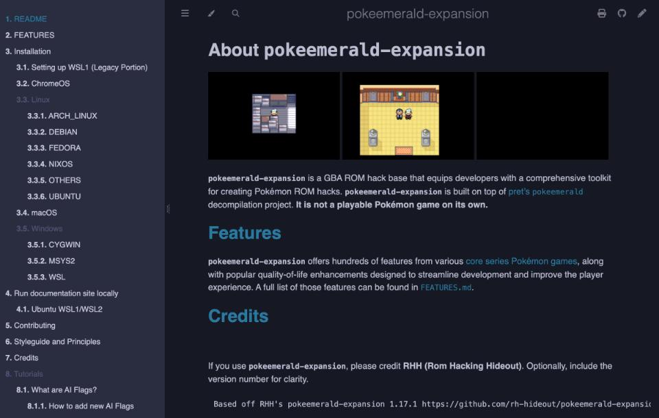

# ポケモンのROM hack

ポケモンの改造版は、中国語で「口袋妖怪改版」と呼ばれ、大きなコミュニティを作っています。作る側の道具は、オープンソースで公開されたものが中心で、ソースからビルドする方法と、ROMのデータを直接編集する方法があります。この記事は、公式のREADMEやドキュメントで確認できた範囲で、道具の役割と最小の手順を整理したものです。

## 作り方の分類

作り方は、大きく3つに分かれます。1つ目は、作者が公開した差分のパッチを、元のROMに適用して遊ぶ方法です。2つ目は、HexManiacAdvanceのような専用のエディタで、ROMのデータを直接書き換える方法になります。3つ目は、ゲームのソースコードを逆アセンブルまたは逆コンパイルして作ったプロジェクトを、ビルドする方法です。

後ろの2つの違いについて、pretのWikiは、はっきりした立場を取っています。「[Why should I use this over binary hacking?](https://github.com/pret/pokeemerald/wiki/Why-should-I-use-this-over-binary-hacking)」という頁によると、バイナリの改造は新しい機能を足しにくく、値を変えても、それが何の動作に対応するのかが分かりにくいそうです。逆コンパイルされたプロジェクトでは、Cのコードを直接書けて、データの置き場所(オフセット)を気にしなくてよいことが、最大の利点とされています。リンカが参照を計算し直すため、空き容量の心配がありません。変更の履歴はGitが管理するので、ROMの控えを大量に残す必要もない、という説明です。そのかわり、C系の言語の経験があると望ましいとも書かれています。

## ソースからビルドする

[pret](https://pret.github.io/)は、ポケモンの逆アセンブルと逆コンパイルのプロジェクトを公開している団体です。[pokered](https://github.com/pret/pokered)は赤と青、[pokecrystal](https://github.com/pret/pokecrystal)はクリスタルの逆アセンブルで、いずれもアセンブリ言語で書かれています。[pokeemerald](https://github.com/pret/pokeemerald)はエメラルド、[pokefirered](https://github.com/pret/pokefirered)はファイアレッドとリーフグリーンの逆コンパイルで、C言語です。READMEには、ビルドして得られるROMの種類と、それぞれのSHA1の値が書かれています。たとえば、pokeemeraldが作る `pokeemerald.gba` のSHA1は `f3ae088181bf583e55daf962a92bb46f4f1d07b7` です。

ビルド環境の作り方は、[pokeemeraldのINSTALL.md](https://github.com/pret/pokeemerald/blob/HEAD/INSTALL.md)が説明しています。Windows 10と11では、WSL1が最も速く、強い推奨があります。遅さの目安は、msys2がWSL1の約2倍、Cygwinが約5〜6倍だそうです。WSL2は、ファイルをWSL2側に置けば、WSL1より速い場合もあります。ただし、Qt 5.15.2より前のバージョンを使うPorymapのようなツールは、WSL2のネットワークドライブのパスを読めないことがあります。必要なパッケージは、Ubuntuでは `build-essential`、`binutils-arm-none-eabi`、`git`、`libpng-dev` の4つです。

### 最小のビルド手順

INSTALL.mdに書かれた手順を、Ubuntu系の環境でたどると、次のようになります。INSTALL.mdには、ROMを用意する工程が出てきません。ソースだけからROMが作られる形です。

1. パッケージを入れます。`sudo apt install build-essential binutils-arm-none-eabi git libpng-dev` です。
2. `git clone https://github.com/pret/pokeemerald` で、プロジェクトを取得します。
3. 同じ階層で `git clone https://github.com/pret/agbcc` を実行し、`cd agbcc`、`./build.sh`、`./install.sh ../pokeemerald` の順に、コンパイラをプロジェクトに入れます。
4. `cd pokeemerald` で移動し、`make` を実行します。成功すると、`pokeemerald.gba` ができます。

速くしたいときは、`nproc` の値を調べて `make -j` に続けます。元のゲームと同一かどうかは、`make compare` で確かめられます。同一なら、最後に `pokeemerald.gba: OK` と出て、違いがあれば `FAILED` と出る仕組みです。コンパイラの節では、devkitARMが入っている場合は `make modern` を実行するだけでよい、と案内されています。この方法で、agbccの手順を省けるかどうかは、確認できませんでした。デバッグ情報つきのビルドには、`make modern DINFO=1` が案内されています。

### pokeemerald-expansion

エメラルドをもとにした改造の元になるプロジェクトとして、[pokeemerald-expansion](https://github.com/rh-hideout/pokeemerald-expansion)があります。READMEによると、pretのpokeemeraldの上に作られた、ROM hackの基盤です。これ自体は遊べるゲームではありません。ポケモンのシリーズに登場した何百もの機能と、遊びやすさを上げる機能を備えています。使うときは、RHH(Rom Hacking Hideout)をクレジットとして書くよう求められます。READMEの例文は、`Based off RHH's pokeemerald-expansion 1.17.1` で始まる1行です。公式のポケモンのゲームとは通信できません。公式のゲームとの互換性が必要なら、pret側のpokeemeraldを使う、という案内です。READMEには、GitHubの「Download Zip」を使うと、コミット履歴が含まれず、更新やブランチの統合ができないため、使わないように、との注意書きも添えられています。

ビルドの手順は、[INSTALL.md](https://github.com/rh-hideout/pokeemerald-expansion/blob/master/INSTALL.md)が説明しています。OSごとの準備を終えたあと、`git clone https://github.com/rh-hideout/pokeemerald-expansion`、`cd pokeemerald-expansion`、`make` の3つが必要です。成功すると、メモリの使用量の一覧が表示され、`pokeemerald.gba` ができあがる流れです。環境の説明は、pret側とやや食い違う点があります。Windowsについては、WSL2が最も速く、WSL1は約7倍、Msys2は約20倍、Cygwinは約30倍遅いとのことで、WSLの系統だけが推奨されています。Ubuntu、Debian、Arch、NixOS、Fedora、macOS、ChromeOSには、それぞれ別の手順の頁があるという構成です。測定の条件は書かれていないため、2つのプロジェクトの数値を、そのまま比べるのは避けたほうがよいでしょう。

使う枝は3つから選べます。最新のパッチのリリースは、公式にリリースされた機能とバグ修正を含む枝です。`master` は、そこに、その後の修正が加わった枝になります。`upcoming` は、リリース前の新機能も含む枝で、修正は不定期に取り込まれるとのことです。pokeemeraldから乗り換えるには、gitのリモートにRHHを追加して、選んだ枝を `git pull` します。pokeemerald側が最新でない場合は、マージの衝突を自分で解決しなければなりません。

機能の一覧は、[FEATURES.md](https://github.com/rh-hideout/pokeemerald-expansion/blob/master/FEATURES.md)にあります。戦闘の面では、メガ進化、ダイマックス、テラスタルなどの仕組み、ダブルの野生戦、技の物理と特殊の分類、第9世代までの道具、特性、技の効果が挙げられています。トレーナーのチームは、Pokémon Showdownのチームの書式に対応していて、ビルダーで作った結果を貼りつけられるとのことです。種の追加も簡単になっており、素のpokeemeraldでは20以上のファイルを触る作業が、およそ5つで済む、と書かれています。機能の多くは、`include/config/` の設定ファイルで、オンとオフを切り替える設計です。

新しいポケモンを足す手順は、[How to add new Pokémon species](https://github.com/rh-hideout/pokeemerald-expansion/blob/master/docs/tutorials/how_to_new_pokemon.md)の頁に、例つきで載っています。流れは、種の定数を宣言し、種の情報を定義し、グラフィックを入れ、技と進化を決めて、出現させる順番です。定数は、末尾に足して、既存の番号を動かさないよう書かれています。保存データに番号が入るため、番号を変えると、セーブ内の種が変わってしまうからです。フォームや性別による違いなど、任意の項目もあります。ポケモンのサマリー画面でSelectを押すと、スプライトの確認用のデバッグ画面が開くという案内も、同じ頁に載っています。

### 最小の改造の例

作業の感覚をつかむには、pret側のWikiにある「[Change Starter Pokémon](https://github.com/pret/pokeemerald/wiki/Change-Starter-Pok%C3%A9mon)」が小さな例です。この頁によると、ソースの `src/starter_choose.c` にある3つの種の定数を書き換えるだけで、最初のポケモンを変えられます。たとえば、`SPECIES_TREECKO`、`SPECIES_TORCHIC`、`SPECIES_MUDKIP` を、`SPECIES_CHIKORITA`、`SPECIES_CYNDAQUIL`、`SPECIES_TOTODILE` に置き換えれば、第2世代の組になる、という例です。種の定数の名前は、ポケモンの名前の前に `SPECIES_` を付けた形が多く、迷うときは `src/data/text/species_names.h` で確かめるよう書かれています。

レベルを変えるには、`src/battle_setup.c` の `ScriptGiveMon(starterMon, 5, ...)` の5を、3に変えます。ファイルを保存して `make` で作り直せば、結果を確認できる流れです。この頁は、pokeemerald向けに書かれたもので、pokeemerald-expansionでは、ファイルの構成が変わっている可能性があります。実際のファイルを確かめてから使ってください。

Wikiには、ほかにも多くの手順が載っています。[Tutorials / Mods](https://github.com/pret/pokeemerald/wiki/Tutorials)の頁は、難度を星1から3で分け、バグ修正、画面、道具、スクリプト、戦闘、音楽などの分野で整理した一覧です。星1は、特定の行の追加と削除、または機能ブランチの取り込みだけで済むものとされています。[Feature Branches](https://github.com/pret/pokeemerald/wiki/Feature-Branches)には、DexNavや夜昼の仕組みなど、取り込んで使える枝が並ぶ構成です。行き詰まったときの質問先は、[Getting Help](https://github.com/pret/pokeemerald/wiki/Getting-Help-with-the-Decomps)の頁にまとめられています。RH Hideout、pret、Team Aqua's Hideoutという3つのDiscordサーバーと、それぞれのチャンネルが挙がっています。

## 地図とデータを編集する

[Porymap](https://github.com/huderlem/porymap)は、pokeruby、pokeemerald、pokefireredのための地図エディタです。[公式のガイド](https://huderlem.github.io/porymap/)があり、WindowsとmacOSには配布ビルドがあるものの、Linuxではソースからのビルドが基本です。

ガイドの[Introduction](https://huderlem.github.io/porymap/manual/introduction.html)は、Porymapを、従来のバイナリ改造で使われたAdvance Mapに相当するもの、と位置づけています。重要なのは、PorymapがROMのファイルを読み書きしない点です。読み書きの対象は、逆コンパイルされたプロジェクトのファイルで、Gitで版を管理するよう強く勧められています。使い始める前に、プロジェクトを用意して、ROMのビルドが通ることを確かめるよう求められます。

最初の操作は、`File > Open Project…` で、プロジェクトのフォルダを選ぶことです。pokeemeraldなら、最初に表示される地図はPetalburg Cityです。ガイドの例では、鉛筆ツールで草地に花を描き、`File > Save` で保存して、ROMをビルドし直すと、ゲームの中で反映を確かめられます。注意として、ゲーム内でセーブすると、その場所の地図の一部が保存データにも入ります。編集した地図の上でセーブしたことがあるなら、ゲーム内で地図を読み込み直す必要がある、との注意です。ビルドで `NODEP=1` を使うと、データの変更が無視されることがあるため、勧められていません。

編集できる範囲は広く、[ガイドの頁](https://huderlem.github.io/porymap/)に分かれています。地図のタイル、当たり判定、地図のつながり、ヘッダー、イベント(人物、看板、ワープ、スクリプトなど)、野生ポケモンの出現、タイルセット、リージョンマップが対象です。イベントの詳細欄は、元に戻す機能がないため、Gitを使うよう警告されています。野生ポケモンの頁では、表のセルを選んで、種、最小レベル、最大レベルを直接書き換えられ、出現率も変えられます。新しい地図は、`File > New Map...` から、名前、グループ、大きさ、タイルセットなどを決めて作る流れです。

Porymapは、JavaScriptで拡張できます。ガイドの例には、昼と夜でパレットを切り替えるもの、独自の筆、タイルの誤りの検出、地図の自動生成、草の模様をばらけさせるものが挙げられています。ソースから自分でビルドする場合、これらの機能にはQtのqmlモジュールが必要です。Porymapが読み書きするファイルの一覧も公開されていて、たとえば `data/maps/` の下の `map.json` や、`data/layouts/layouts.json`、`src/data/wild_encounters.json` が入っています。Porymapが書き込むファイルは、手で直さないほうがよい、との注意が添えられています。

スクリプトの記述には、[Poryscript](https://github.com/huderlem/poryscript)という選択肢もあるとのことです。READMEの説明では、pokeemerald、pokefirered、pokerubyのスクリプト言語にコンパイルされる、より高い水準の言語です。`if`、`elif`、`else`、`while`、`switch` による制御、文字の自動改行、地図ごとのスクリプトの整理などが、利点として挙げられています。オンラインの試し場と、VS Codeの拡張も公式に案内されています。pret Wikiの[Useful Modding Tools](https://github.com/pret/pokeemerald/wiki/Useful-Modding-Tools)の整理では、Porymapは事実上必須、Poryscriptは複雑なスクリプトを書く人向けの位置づけです。背景画像のタイルマップの編集には、Tilemap Studioが紹介されています。

## ROMを直接編集する

[HexManiacAdvance](https://github.com/haven1433/HexManiacAdvance)は、ポケモンのGBA作品のためのエディタです。READMEによると、対象はRuby、Sapphire、FireRed、LeafGreen、Emeraldの英語版で、ポケモン、トレーナー、技、アイテムのデータ、地図とイベント、テキスト、画像、イベントスクリプトを編集できます。IPSとUPSのパッチを作成して適用する機能や、作業中のバックアップを書き出す機能もあります。動作には、Windowsと.NET 6.0が必要です。

ほかにも、READMEには、図鑑の並べ替え、フェアリータイプの追加、新しい技や教え技の追加、タイプを変える特性の追加といった機能が挙がっています。元の場所に収まらなくなったテキストは、自動で別の場所へ移し替えられるそうです。ライセンスはMITで、Discordの利用者コミュニティもあります。

使い方は、[公式Wiki](https://github.com/haven1433/HexManiacAdvance/wiki)の入門の頁にあります。「[Basic Tutorial 01: Pokemon Editing](https://github.com/haven1433/HexManiacAdvance/wiki/Basic-Tutorial-01:-Pokemon-Editing)」によると、手順は、HexManiacを開き、ポケモンのGBA作品のROMを読み込んで、「Pokemon」の箱か、「Explore More」の欄の `data.pokemon` から、ポケモンの表へ入る流れです。名前は10文字まで、種族値は255までで、並びがHP、攻撃、防御、素早さ、特攻、特防の順になる点に注意が必要だと書かれています。1つのタイプだけにしたい場合は、同じタイプを2回入れる方法です。なお、この頁の筆者は、ポケモンのROMを渡すことも、入手先を示すこともできないと、はっきり述べています。

スターターの変更は、[Basic Tutorial 10](https://github.com/haven1433/HexManiacAdvance/wiki/Basic-Tutorial-10:-Starter-Pokemon-Editing)に載っています。「Data」の「Pokémon Stats」で、名前、スプライト、アイコンを書き換え、エミュレーターで確かめる流れです。FireRedとEmeraldで手順が分かれる点が書かれ、カジノの景品の変更のような実験的な部分については、バックアップを多めに取るよう注意されています。[Wiki](https://github.com/haven1433/HexManiacAdvance/wiki/What-are-HMA-Scripts%3F)には、拡張子 `.hma` のスクリプトの説明もあります。IPSファイルのように読める簡単なものから、コードを挿入するものまで、中身はさまざまです。メニューの `Utilities -> Scripts` から、公式のものを選べます。フェアリータイプの追加、戦闘スクリプトの拡張、新しい特性の表などが並んでいる、という説明です。

[FAQ](https://github.com/haven1433/HexManiacAdvance/wiki/Hex-Maniac-Advance-%E2%80%90-Frequently-Asked-Questions)には、制約も書かれています。他人が作った改造版は、データが移動していて、HexManiacが拾えない場合があるため、編集できません。第9世代のポケモンも、自動では入りません。HUBOLという拡張が足すのは第4世代から第8世代までで、第9世代は、既存のポケモンを自分で置き換える形になると書かれています。FAQは、ポケモンを作るための別の道具、Pokémon Essentialsとの違いも説明しています。Essentialsは、RPG Makerの上でゲームを作る道具です。HMAは、既存のGBAのROMを編集する道具で、元の386種のポケモンなどがすべて入った状態から始まります。

## パッチを自分のデータに当てる

差分のパッチは、IPS、UPS、BPSなどの形式です。HexManiacAdvanceが作れるパッチは、IPSとUPSの2種類です。遊ぶ側では、RetroArchが、パッチを自動で当てる「ソフトパッチ」に対応しています。[Libretroの文書](https://docs.libretro.com/guides/softpatching/)によると、`rom.bin` を読み込むとき、同じ場所に `rom.ups`、`rom.ips`、`rom.bps` があれば、起動時に自動で当たります。対応する形式はUPS、IPS、BPSで、XDeltaはコンパイル時の設定しだいです。複数のパッチは、`rom.ips`、`rom.ips1`、`rom.ips2` のように、拡張子に数字を付けると、順に当たります。ゲームボーイアドバンスのコアでは、対応表では、mGBAが対応するコアとして挙がっています。なお、ROMをメモリ上で読み込める実装でだけ自動パッチが働く、という条件が付くとのことです。

当てる対象は、自分で用意した原作のROMだけにしてください。パッチは差分の情報だけで、原作のデータは含みません。この調査では、ROMとパッチの入手先は調べておらず、リンクも載せていません。自分のデータの扱いについては、[自分のデータとフリーゲーム](13-own-data-and-free-games.md)を参照してください。

## 中国語のコミュニティ

中国語のコミュニティは、百度貼吧に集まっています。

[口袋改版资源吧](https://tieba.baidu.com/f?kw=%E5%8F%A3%E8%A2%8B%E6%94%B9%E7%89%88%E8%B5%84%E6%BA%90)は、ページの表示によると、関注者が26.1万人、投稿数が164.5万件です。上部のタブには、精華、人気、最新、吧友互助(コミュニティ内の助け合い)、画像と文章の攻略、汉化発布、改版発布、改版教程があります。固定された投稿は、2021年3月26日付の「本吧資源導航」で、ゲームのファイル、攻略、秘籍、エミュレーター、チートコード、補助ツール、改造の教程、ツール、素材などを集めた目次とされています。

「汉化」は、外国語のゲームを中国語にすることです。この掲示板では、「汉化发布」が、「改版发布」と並ぶタブの名前になっています。ただし、中国語化の作り方を説明した投稿は、今回確認できませんでした。

[口袋妖怪改版吧](https://tieba.baidu.com/f?kw=%E5%8F%A3%E8%A2%8B%E5%A6%96%E6%80%AA%E6%94%B9%E7%89%88)は、関注者が4.9万人、投稿数が12.7万件で、2012年3月に作られました。タブには、NDSの教程、GBAの教程、資源のダウンロード、動画があります。掲げているスローガンは「改版技术是未来活跃的源泉」(改造の技術が、これから活発になる源泉)です。

口袋改版资源吧に載っていた改版の一例が、「宝可梦 水银」です。投稿の声明によると、ファイアレッドをもとに作った非営利のROM hackで、物語と内容は、金銀水晶とハートゴールド・ソウルシルバーをもとにした二次創作とされています。ポケモンのシリーズに関する権利は、任天堂などに属すると、声明にも書かれています。

pretやRHHの質問先は、Discordです。中国語で質問できる場があるかどうかは、この調査では確認できませんでした。

## この記事で出てくる中国語

次の語は、この記事で引用した掲示板のページに実際に出てきたものです。「汉化」と「改版」は、掲示板のタブの名前として確認しました。「宝可梦」は、改版の題名にあります。

| 中国語(簡体字) | ピンイン | 日本語の意味 | 出典 |
|---|---|---|---|
| 口袋妖怪 | kǒu dài yāo guài | ポケットモンスターの中国語名 | [口袋妖怪改版吧](https://tieba.baidu.com/f?kw=%E5%8F%A3%E8%A2%8B%E5%A6%96%E6%80%AA%E6%94%B9%E7%89%88) |
| 宝可梦 | bǎo kě mèng | ポケモンの別の中国語名 | [口袋改版资源吧](https://tieba.baidu.com/f?kw=%E5%8F%A3%E8%A2%8B%E6%94%B9%E7%89%88%E8%B5%84%E6%BA%90) |
| 改版 | gǎi bǎn | 改造版 | [口袋改版资源吧](https://tieba.baidu.com/f?kw=%E5%8F%A3%E8%A2%8B%E6%94%B9%E7%89%88%E8%B5%84%E6%BA%90) |
| 改版发布 | gǎi bǎn fā bù | 改造版の公開 | [口袋改版资源吧](https://tieba.baidu.com/f?kw=%E5%8F%A3%E8%A2%8B%E6%94%B9%E7%89%88%E8%B5%84%E6%BA%90) |
| 改版教程 | gǎi bǎn jiào chéng | 改造の手順書 | [口袋改版资源吧](https://tieba.baidu.com/f?kw=%E5%8F%A3%E8%A2%8B%E6%94%B9%E7%89%88%E8%B5%84%E6%BA%90) |
| 汉化 | hàn huà | 中国語化 | [口袋改版资源吧](https://tieba.baidu.com/f?kw=%E5%8F%A3%E8%A2%8B%E6%94%B9%E7%89%88%E8%B5%84%E6%BA%90) |
| 汉化发布 | hàn huà fā bù | 中国語化の公開 | [口袋改版资源吧](https://tieba.baidu.com/f?kw=%E5%8F%A3%E8%A2%8B%E6%94%B9%E7%89%88%E8%B5%84%E6%BA%90) |
| 吧友互助 | bā yǒu hù zhù | 掲示板の仲間による助け合い | [口袋改版资源吧](https://tieba.baidu.com/f?kw=%E5%8F%A3%E8%A2%8B%E6%94%B9%E7%89%88%E8%B5%84%E6%BA%90) |
| 资源导航 | zī yuán dǎo háng | 資料の目次 | [口袋改版资源吧](https://tieba.baidu.com/f?kw=%E5%8F%A3%E8%A2%8B%E6%94%B9%E7%89%88%E8%B5%84%E6%BA%90) |
| 攻略 | gōng lüè | 攻略 | [口袋改版资源吧](https://tieba.baidu.com/f?kw=%E5%8F%A3%E8%A2%8B%E6%94%B9%E7%89%88%E8%B5%84%E6%BA%90) |
| 秘籍 | mì jí | 裏技集、秘伝の書 | [口袋改版资源吧](https://tieba.baidu.com/f?kw=%E5%8F%A3%E8%A2%8B%E6%94%B9%E7%89%88%E8%B5%84%E6%BA%90) |
| 金手指 | jīn shǒu zhǐ | チートコード | [口袋改版资源吧](https://tieba.baidu.com/f?kw=%E5%8F%A3%E8%A2%8B%E6%94%B9%E7%89%88%E8%B5%84%E6%BA%90) |
| 模拟器 | mó nǐ qì | エミュレーター | [口袋改版资源吧](https://tieba.baidu.com/f?kw=%E5%8F%A3%E8%A2%8B%E6%94%B9%E7%89%88%E8%B5%84%E6%BA%90) |
| 辅助工具 | fǔ zhù gōng jù | 補助ツール | [口袋改版资源吧](https://tieba.baidu.com/f?kw=%E5%8F%A3%E8%A2%8B%E6%94%B9%E7%89%88%E8%B5%84%E6%BA%90) |
| 教程 | jiào chéng | 手順書、チュートリアル | [口袋妖怪改版吧](https://tieba.baidu.com/f?kw=%E5%8F%A3%E8%A2%8B%E5%A6%96%E6%80%AA%E6%94%B9%E7%89%88) |
| 置顶 | zhì dǐng | 先頭に固定する | [口袋改版资源吧](https://tieba.baidu.com/f?kw=%E5%8F%A3%E8%A2%8B%E6%94%B9%E7%89%88%E8%B5%84%E6%BA%90) |

## 注意点

パッチを当て済みのROMを配る配布サイトも存在するようです。原作のROMの再配布にあたり、権利の面で問題があります。パッチ(差分のファイル)だけを入手し、自分で用意した原作のROMに適用するのが安全です。この調査では、ROMとパッチの配布先のリンクは記録していません。

pokeemerald-expansionは、公式のゲームと通信できません。HexManiacAdvanceは、他人の改造版を編集する用途には向きません。道具ごとに対象が決まっているので、作りたいものに合う道具を選ぶ必要があります。
