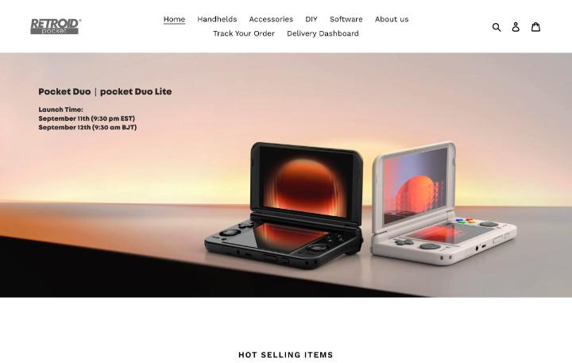
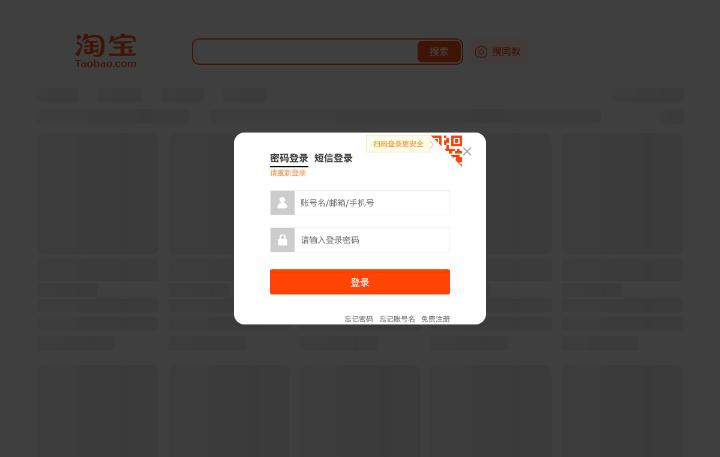

# 中国の機種を買う方法

日本から中国メーカーの携帯ゲーム機を買う方法は、大きく四つあります。中国向けの公式店、海外向けの公式ストア、代行購入サービス、中古の個人売買です。この記事は、2026年10月3日に実際にページを開いて確認できたことを、サイトごとに整理したものです。価格や送料は日々変わるため、購入前に必ず画面で見直してください。

確認できなかったことは、その旨を書きました。ログインが必要なサイトでは、ログインを避けたため、検索結果や価格を見ていません。

## 中国向けの公式の販売経路

Retroidの中国の[公式サイト](https://www.retroid.cn/)は、販売の入口として「天猫旗舰店」(天猫の公式店舗)と「淘宝企业店」(淘宝の企業店)を載せています。サイトのトップページには、新製品のRP DUOの予約販売が、「RP DUO预售进行中」(予約販売の実施中)と表示されていました。連絡先のページの記載では、電話窓口は準備中で、販売前後の問い合わせは淘宝のカスタマーサービスに連絡する形です。

上部のメニューには、ホーム、商城(ショップ)、社区(コミュニティ)、サービスとサポート、マイページが並びます。ページの下部では、商品が「掌机」と「配件」(アクセサリー)に分かれ、サポートとして「使用指南」(使い方のガイド)と「下载中心」(ダウンロードセンター)が案内されています([retroid.cn](https://www.retroid.cn/))。サイトの著作権表示は、深圳の会社名義でした。

天猫と淘宝の店は、中国国内の消費者向けです。日本への発送や、日本語での対応があるかどうかは、店のページを見られなかったため、確認できませんでした。日本から注文するなら、次に挙げる海外向けのストアか、代行購入が現実的な選択肢になります。

## 海外向けの公式ストア

Retroidには、英語で買える海外向けのストアがあります。[goretroid.com](https://www.goretroid.com/en-jp)にアクセスすると、日本向けの表示(en-jp)に移り、価格は米ドルで表示されました。

2026年10月3日の表示では、Retroid Pocket Duoが269ドル、Duo Liteが149ドルから、Novaが239ドルから、Pocket 6が244ドルからでした。Pocket 5はセール価格で179ドル(通常価格209ドル)、Classicはセール価格で99ドル(通常価格149ドル)です([goretroid.com](https://www.goretroid.com/en-jp))。トップのバナーには、Pocket DuoとDuo Liteの発売日が、米国東部時間の9月11日21時30分(北京時間の9月12日9時30分)と書かれていました。

### Retroidの配送と返品の規定

[配送ポリシー](https://www.goretroid.com/en-jp/policies/shipping-policy)によると、配送業者は4PXとDHLです。4PXの所要日数は約15日から60日で、国によっては45日から90日かかると書かれています。早く受け取りたい場合は、DHLを選ぶよう案内があります。DHLでは、遠隔地の追加料金が約50ドルかかる場合があるという記載です。発送までの目安は1日から7日で、日曜と中国の祝日は出荷しません。荷物の追跡は、サイトが紹介する追跡サービスの[17track](https://www.17track.net/zh-cn)などで行います。

[返品ポリシー](https://www.goretroid.com/en-jp/policies/refund-policy)は、購入価格に税が含まれないと明記しています。EUでは20%から24%の税がかかり、米国では800ドルを超える荷物に課税される、という説明です。日本の扱いは、ページに書かれていませんでした。税を払わずに荷物が返送された場合、料金は返金されません。

返品は、荷物を受け取ってから15日以内で、未使用かつ元の箱に入った状態が条件です。返送の送料は購入者の負担で、返金から差し引かれます。セール品は返金の対象外で、通常価格の商品だけが返金できると書かれています。交換が認められるのは、初期不良か破損の場合だけです。つまり、セール中の機種は、気に入らなくても返品できない可能性があります。

### Anbernicの公式ストア

Anbernicの公式サイト[anbernic.com](https://anbernic.com/)は、Shopifyで作られた英語のストアです。トップページには、RG DS PlusやRG 35、RG 55G1などの紹介が並び、支払い方法はクレジットカード、デビットカード、PayPalと書かれていました。保証は購入から12か月です。

[配送ポリシー](https://anbernic.com/policies/shipping-policy)では、処理期間は2日から4営業日で、米国、豪州、スペイン、英国には海外倉庫があります。中国からの出荷は、国慶節の休みが9月30日から10月5日までのため、遅れるという告知が出ていました。海外倉庫の商品は、その影響を受けないと書かれています。海外倉庫の商品は、届け先の国が限られ、チェックアウトで配送方法が選べなければ、その国に送れないという意味です。

注文のキャンセルは、注文から12時間以内に、サポートのチケットで申し込みます。配送された荷物が届かない場合は、追跡上の配達日から14日以内に連絡しなければ、請求が受け付けられません。荷物が紛失した場合の申し立ては、発送日から30日以内が目安です。

[返品ポリシー](https://anbernic.com/policies/refund-policy)は、日本を含む地域に限って、15日以内の返品に対応すると書いています。対象は、米国、EU、カナダ、豪州、英国、日本です。個人的な理由で返品する場合の費用は、注文金額の25%に、返送ラベルの料金を足した額です。25%が35ドルに満たないときは、35ドルとして計算されます。初期不良は、無償で交換や返品を受け付けますが、システムの更新で直る不具合は、初期不良に入りません。15日を過ぎた場合は、12か月の保証の間、交換用の部品を無償で送る形になります。

ここまでを比べると、Retroidの海外ストアは、セール品が返金できず、返送料は購入者の負担です。Anbernicは、日本が返品の対象国に入っていますが、気に入らない場合の返品は、注文金額の25%以上が引かれます。どちらも、返品を前提に気軽に試す買い方には向きません。

### AYNの公式サイト

AYNの[公式サイト](https://www.ayntec.com/)では、Thorが予約受付、Odin2 Portalが購入可能という表示でした。Thorは、Snapdragon 8 Gen 2、6インチのAMOLED、Android 13、6000mAhの電池という説明です。ここでは価格、配送、返品の規定のページまでは開いていないため、確認できませんでした。

### 公式の海外ストアを使うときの注意

三つの公式ストアは、いずれも英語で、日本語の窓口はありません。支払い方法、送料、税、保証の条件は、ストアごとに違います。注文の前に、配送ポリシーと返品ポリシーのページを読み、特に、返品の条件と、関税を誰が払うかを確認する必要があります。日本の関税や消費税の扱いは、この調査では確認していないため、税関や公式の情報で確認してください。

## 中国のECサイトの壁

中国のECサイトは、検索の段階でログインを求めるものが多くなっています。この調査では、閑魚の商品ページは、ログインなしで見られましたが、検索はログイン画面が表示されて結果が出ませんでした。淘宝も同じで、検索のURLを開くと、パスワードのログインとQRコードのログインのポップアップが出ました。京東は検索の途中で認証のページに移りました。中古サイトの转转(Zhuanzhuan)は、試した検索のURLが404でした。

ログインを代行することはできないため、これらのサイトでの検索は、自分のアカウントで行う必要があります。また、日本から中国のECサイトで買う場合、アカウントの作成、本人確認、支払い方法、日本への発送の可否は、サイトごとに違います。この調査では、いずれも確認できていません。日本語の説明が必要な人は、次の代行購入サービスのほうが、ハードルが低くなります。

## 代行購入サービスCNFans

CNFansは、淘宝の商品を、ログインなしで検索できる代行購入サービスです。検索のURLは `https://cnfans.com/search?keywords=<中国語のキーワード>&searchType=keywords` の形で、価格は米ドルで表示されます。通貨は、USD、EUR、CNYなどが選べ、日本円はありません。

検索のキーワードは、短いほどよく当たります。「安伯尼克 RG406V」のような短い語では機種の商品が並びましたが、語を足して「安伯尼克 256G 游戏内存卡」のようにすると、ドライブレコーダー用のSDカードのような無関係な商品が混ざりました。商品名は、機械翻訳された英語で表示されるため、中国語の元の名前と、意味がずれることがあります。

商品ページでは、色や容量のオプションを切り替えても、価格の表示が変わりませんでした。そのため、構成ごとの正確な価格は、カートに入れるまで分かりません。

注文の流れは、ページの説明によると、次のとおりです。まず、商品の名前かリンクで検索して、支払いをします。CNFansが購入を代行するのは、中国時間の9時から18時の間です。商品はCNFansの倉庫に届き、検品写真が3〜7枚撮られます。内容を確認したあとは、国際配送の方法を選ぶ流れです。商品ごとに、中国国内の送料が0元と表示されていました。

検品の範囲は限られています。CNFansの商品ページ([検索結果](https://cnfans.com/search?keywords=RP5%E9%A2%84%E8%A3%85%E5%A4%A9%E9%A9%AC&searchType=keywords)から開けます)に載っているアフターサービスの説明は、電子機器とデジタル商品について、外観に問題がないか、付属品がそろっているかを確認するだけで、電源を入れて機能を確認することはできないと書いています。倉庫に着いたあとで不満があれば、5日以内の返品申請が可能です。返品の費用は、1点につき手数料が約0.75ドルで、返送料と合わせて約3ドルです。特注の商品は返品できません。

送れない品物として、ナイフ類、ライター、液体、食品、種子、磁気部品などが挙げられています。税関の扱いは、国によって違うという記載です。商品の品質や真贋については、CNFansが判断できない旨がページに明記されています。国際配送の方法と料金は、支払い後の画面で選ぶ流れですが、この調査では、支払いに進まなかったため、配送方法の画面は確認できませんでした。

## ゲーム入りの商品の扱い

中国のECサイトには、ゲームを最初から入れた「预装」の商品が多く出ています。2026年10月3日に、Retroid Pocket 5向けの「天馬G入り」の商品を調べたところ、CNFansの扱いが商品ごとに分かれました([検索結果](https://cnfans.com/search?keywords=RP5%E9%A2%84%E8%A3%85%E5%A4%A9%E9%A9%AC&searchType=keywords))。

本体と天馬G入りカードのセットとして出ていた3件のうち、2件は商品ページを開いても購入できず、「商品に権利侵害の疑いがあるため、代行購入できない」という英語のメッセージが表示されました。ほかの1件は、トップページへ戻されました。本体にゲームを入れたセットが、CNFansでは買えない可能性が高い、という結果です。

一方で、RP5向けの天馬Gのメモリカード単体の出品は、ページを開けました。出品の説明には、この商品はメモリカードだけで、手元に届いたあとでチュートリアルに従ってインストールするとあります。オプションは、128GBから2TBまでの6種類で、表示された最安の価格は、298元、米ドルで52.43ドルでした。

出品の文面には、収録ゲームのタイトルや本数の記載がありません。天馬Gのパックは約2.8TBと、128GBのカードに入らない大きさです([模拟器游戏 篇四](https://zhuanlan.zhihu.com/p/703325151))。購入前に、収録内容を出品者に確認する必要があります。

ここで、権利の面での注意があります。市販のゲームを大量に収録したカードや本体は、収録されたゲームの権利者の許可を得ているとは限りません。CNFansが「権利侵害の疑い」を理由に代行を断った商品があることは、この点を示す一つの事実です。ただし、断られた理由の詳細は、ページに書かれていませんでした。この記事は、ゲーム入りのカードを勧めません。自分で用意したデータを使う方法と、権利の考え方は、[ROMとBIOSの扱い方](12-roms-and-bios.md)と[自分のデータと無料のゲーム](13-own-data-and-free-games.md)にまとめています。

## 価格の見方

[掌机圈](https://zhangjiquan.com/handhelds)は、機種のページに、購入リンクの到手価格(クーポン適用後の実際の価格)を載せています。載っていた金額は、RG-406Vが1048元(100元のクーポン)、RG-556が1199元(100元のクーポン)、RG-40XXHが418元(50元のクーポン)、Retroid Pocket 5が1598元でした。リンクの日付は掲載されていないため、現在の価格とは限りません。ほかの価格帯は [主要機種の違い](02-devices.md) にまとめています。

同じRetroid Pocket 5でも、販売元によって価格の通貨と水準が変わります。海外向けの公式ストアでは、2026年10月3日にセール価格で179ドルでした([goretroid.com](https://www.goretroid.com/en-jp))。CNFansで見た「天馬G入り」と書かれた本体の出品は、281.15ドルと298.75ドルでした。構成も付属品も違うため、同じ条件の価格比較にはなりません。

CNFansの表示から、換算の比率を計算できます。メモリカードの出品は、298元と52.43ドルが同時に表示されていたため、1元あたり約0.1759ドルです。この比率で、281.15ドルを元に戻すと約1598元、298.75ドルでは約1698元になります。これは、画面の数字から私が計算した値で、CNFansが公表している為替レートではありません。ただ、掌机圈のRetroid Pocket 5の購入リンクの価格(1598元)と一致しているため、この出品の米ドルの価格は、元の価格を同じ比率で換算しただけだと推測できます。ただし、商品が同じかどうかは確認できていません。

為替の比率は日によって動くため、この数字を今後も当てはめることはできません。日本円に直すときは、購入時点のカード会社や銀行のレートを使ってください。

## 出品者に確認する質問

中国語の出品者に質問する例を挙げます。「收录游戏列表能发我吗」は「収録ゲームのリストを送れますか」、「PS2和PSP的游戏有多少个」は「PS2とPSPのゲームは何本ありますか」、「内存卡保修多久」は「メモリーカードの保証はどのくらいですか」という意味です。CNFansの経由では出品者に直接質問できないため、淘宝や閑魚のチャットが必要になります。

CNFansの出品には、「需要其他机器的卡请备注」(ほかの機種のカードが必要なら備考に書いてください)という注意書きがありました。備考が実際に出品者へ届くかどうかは、注文に進まなかったため、確認できていません。

## 買う前に見直す点

ここまでの確認をもとに、買う前に見直す点を整理します。最初に確認するのは機種のOSです。RetroidやAYNのAndroid機は、公式のストアで買えます。Linux系のOSを入れたい場合は、機種ごとの対応状況を、[OSの選択肢](03-os.md)で先に確認できます。

返品の条件は販売元ごとに違い、Retroidはセール品が返金できず、Anbernicは日本からの返品に対応しても注文金額の25%以上が引かれる仕組みです。CNFansの場合は、返品の申請が倉庫に着いてから5日以内で、機能の検品もありません。税の扱いも見ておく点で、Retroidは価格に税が含まれないと明記し、Anbernicはヨーロッパ宛ての関税を購入者の負担と書いています。日本での税の扱いは、この調査の範囲外でした。

また、レビューサイトの購入リンクには、紹介料が発生するものがあります。[Retro Game Corps](https://retrogamecorps.com/)は、AmazonやeBay、AliExpressなどへのリンクに、紹介のコードが付く場合があると、サイト上に明記しています。リンクを使う前に、こうした表示の有無を見ておくと、収益の仕組みが分かって安心です。AI生成と表示された記事の扱いは、[コミュニティと情報源](10-communities.md)に書きました。

## この記事で出てくる中国語

本文に出てきた買い物の中国語を、公式サイトや出品ページで確認できたものに限って並べます。

| 中国語(簡体字) | ピンイン | 日本語の意味 | 出典 |
|---|---|---|---|
| 掌机 | zhǎngjī | 携帯ゲーム機 | [retroid.cn](https://www.retroid.cn/) |
| 天猫旗舰店 | tiānmāo qíjiàndiàn | 天猫の公式店舗 | [retroid.cn](https://www.retroid.cn/) |
| 淘宝企业店 | táobǎo qǐyèdiàn | 淘宝の企業店 | [retroid.cn](https://www.retroid.cn/) |
| 商城 | shāngchéng | ショップ | [retroid.cn](https://www.retroid.cn/) |
| 配件 | pèijiàn | アクセサリー | [retroid.cn](https://www.retroid.cn/) |
| 预售 | yùshòu | 予約販売 | [retroid.cn](https://www.retroid.cn/) |
| 即将开放 | jíjiāng kāifàng | まもなく開始 | [retroid.cn](https://www.retroid.cn/) |
| 预装 | yùzhuāng | あらかじめ入れてある | [CNFans](https://cnfans.com/search?keywords=RP5%E9%A2%84%E8%A3%85%E5%A4%A9%E9%A9%AC&searchType=keywords) |
| 内存卡 | nèicúnkǎ | メモリーカード | [CNFans](https://cnfans.com/search?keywords=RP5%E9%A2%84%E8%A3%85%E5%A4%A9%E9%A9%AC&searchType=keywords) |
| 机器 | jīqì | 機械、ここでは本体 | [CNFans](https://cnfans.com/search?keywords=RP5%E9%A2%84%E8%A3%85%E5%A4%A9%E9%A9%AC&searchType=keywords) |
| 备注 | bèizhù | 備考 | [CNFans](https://cnfans.com/search?keywords=RP5%E9%A2%84%E8%A3%85%E5%A4%A9%E9%A9%AC&searchType=keywords) |
| 天马 | tiānmǎ | 天馬、フロントエンドの名前 | [CNFans](https://cnfans.com/search?keywords=RP5%E9%A2%84%E8%A3%85%E5%A4%A9%E9%A9%AC&searchType=keywords) |
| 到手价 | dàoshǒujià | クーポン適用後の実際の価格 | [掌机圈](https://zhangjiquan.com/handhelds) |
| 登录 | dēnglù | ログイン | [淘宝](https://s.taobao.com/search?q=Retroid+Pocket+5) |
| 使用指南 | shǐyòng zhǐnán | 使い方のガイド | [retroid.cn](https://www.retroid.cn/) |
