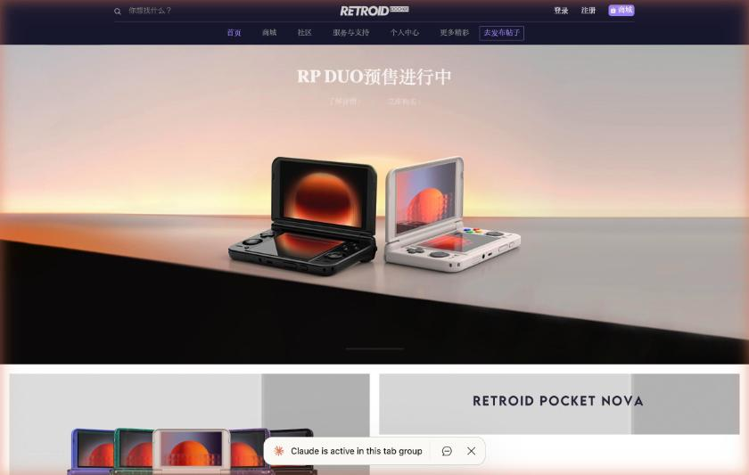

# 中国の機種を買う方法

日本から中国の携帯ゲーム機を買う方法は、公式の販売店を使う方法と、代行購入サービスを使う方法に分かれます。この記事では、2026年10月3日に実際に確認できたことを、サイトごとに整理します。

## 公式の販売経路

Retroidの中国の[公式サイト](https://www.retroid.cn/)は、販売の入口として「天猫旗舰店」(天猫の公式店舗)と「淘宝企业店」(淘宝の企業店)を載せています。サイトのトップページには、新製品のRP DUOの予約が表示されていました。連絡先のページには、電話窓口は準備中で、販売前後の問い合わせは淘宝のカスタマーサービスに連絡するよう書かれています。

中国のECサイトは、検索の段階でログインを求めるものが多くなっています。この調査では、閑魚の商品ページは、ログインなしで見られましたが、検索はログイン画面が表示されて結果が出ませんでした。淘宝も同じで、京東は検索の途中で認証のページに移りました。中古サイトの转转(Zhuanzhuan)は、試した検索のURLが404でした。ログインを代行することはできないため、これらのサイトでの検索は、自分のアカウントで行う必要があります。

## 代行購入サービスCNFans

CNFansは、淘宝の商品を、ログインなしで検索できる代行購入サービスです。検索のURLは `https://cnfans.com/search?keywords=<中国語のキーワード>&searchType=keywords` の形で、価格は米ドルで表示されます。通貨は、USD、EUR、CNYなどが選べ、日本円はありません。

検索のキーワードは、短いほどよく当たります。「安伯尼克 RG406V」のような短い語では機種の商品が並びましたが、語を足して「安伯尼克 256G 游戏内存卡」のようにすると、ドライブレコーダー用のSDカードのような無関係な商品が混ざりました。

商品ページでは、色や容量のオプションを切り替えても、価格の表示が変わりませんでした。そのため、構成ごとの正確な価格は、カートに入れるまで分かりません。

注文の流れは、ページの説明によると、次のとおりです。まず、商品の名前かリンクで検索して、支払いをします。CNFansは、中国時間の9時から18時の間に、代わりに購入します。商品は、CNFansの倉庫に届き、3〜7枚の検品写真が撮られます。内容を確認したあとで、国際配送の方法を選びます。商品ごとに、中国国内の送料が0元と表示されていました。

検品の範囲は限られています。CNFansの商品ページ([検索結果](https://cnfans.com/search?keywords=RP5%E9%A2%84%E8%A3%85%E5%A4%A9%E9%A9%AC&searchType=keywords)から開けます)に載っているアフターサービスの説明は、電子機器とデジタル商品について、外観に問題がないか、付属品がそろっているかを確認するだけで、電源を入れて機能を確認することはできないと書いています。倉庫に着いたあとで不満があれば、5日以内に返品を申請できます。返品の費用は、1点につき手数料が約0.75ドルで、返送料と合わせて約3ドルです。特注の商品は返品できません。

送れない品物として、ナイフ類、ライター、液体、食品、種子、磁気部品などが挙げられています。税関の扱いは、国によって違うと書かれています。商品の品質や真贋は、CNFansが判断できないと、ページに明記されています。

## ゲーム入りの商品の扱い

2026年10月3日に、Retroid Pocket 5向けの「天馬G入り」の商品を調べたところ、CNFansの扱いが商品ごとに分かれました([検索結果](https://cnfans.com/search?keywords=RP5%E9%A2%84%E8%A3%85%E5%A4%A9%E9%A9%AC&searchType=keywords))。本体と天馬G入りカードのセットとして出ていた3件のうち、2件は商品ページを開いても購入できず、「商品に権利侵害の疑いがあるため、代行購入できない」という英語のメッセージが表示されました。ほかの1件は、トップページへ戻されました。本体にゲームを入れたセットが、CNFansでは買えない可能性が高い、という結果です。

一方で、RP5向けの天馬Gのメモリカード単体の出品は、ページを開けました。出品の説明には、この商品はメモリカードだけで、手元に届いたあとでチュートリアルに従ってインストールするとあります。オプションは、128GBから2TBまでの6種類で、表示された最安の価格は、298元、米ドルで52.43ドルでした。

出品の文面には、収録ゲームのタイトルや本数の記載がありません。天馬Gのパックは約2.8TBと、128GBのカードに入らない大きさです([模拟器游戏 篇四](https://zhuanlan.zhihu.com/p/703325151))。購入前に、収録内容を出品者に確認する必要があります。

## 価格の目安

[掌机圈](https://zhangjiquan.com/handhelds)は、機種のページに、購入リンクの到手価格(クーポン適用後の実際の価格)を載せています。載っていた金額は、RG-406Vが1048元(100元のクーポン)、RG-556が1199元(100元のクーポン)、RG-40XXHが418元(50元のクーポン)、Retroid Pocket 5が1598元でした。リンクの日付は掲載されていないため、現在の価格とは限りません。ほかの価格帯は [主要機種の違い](02-devices.md) にまとめています。

## 出品者に確認する質問

中国語の出品者に質問する例を挙げます。「收录游戏列表能发我吗」は「収録ゲームのリストを送れますか」、「PS2和PSP的游戏有多少个」は「PS2とPSPのゲームは何本ありますか」、「内存卡保修多久」は「メモリーカードの保証はどのくらいですか」という意味です。CNFansの経由では出品者に直接質問できないため、淘宝や閑魚のチャットが必要になります。
