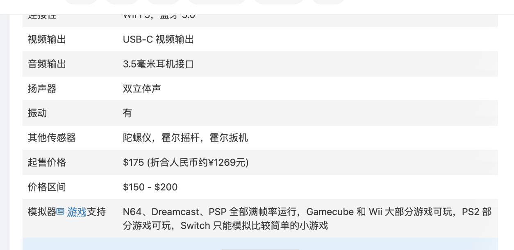

# 中国語の学び方

このリポジトリは、中国語の勉強も目的の1つにしています。携帯ゲーム機の出品、仕様表、掲示板には、同じ語が何度も出てきます。語彙は、実際に見たページから拾うと、意味を文脈ごと覚えられます。この記事では、どのページから何が学べるかを整理します。語彙の一覧は [語彙表](../chinese/vocabulary.md)、掲示板の隠語は [隠語集](../chinese/slang.md)、検索に使った語は [検索キーワード](../chinese/search-keywords.md) にあります。

## 仕様表から覚える語彙

掌机圈の機種のページは、仕様表の項目が決まっているため、機器の語彙を覚えるのに向いています。[RG-406Vのページ](https://zhangjiquan.com/handheld/rg-406v)には、「发布时间」(発売時期)、「外观尺寸」(外形寸法)、「外壳材质」(外装の素材)、「屏幕尺寸」、「屏幕分辨率」(画面の解像度)、「屏幕比例」(アスペクト比)、「屏幕刷新率」、「处理器」、「CPU核心和线程数」、「GPU」、「连接性」、「视频输出」、「音频输出」、「扬声器」(スピーカー)、「起售价格」、「价格区间」、「模拟器支持」といった項目が並びます。値の側にも、「散热管,散热风扇」(ヒートパイプとファン)、「霍尔摇杆」(ホール効果のスティック)、「陀螺仪」(ジャイロ)、「双立体声」(ステレオスピーカー)のような語があります。

購入リンクの欄には、「到手价」(クーポンなどを引いた実際の価格)と「券面额」(クーポンの額)、「下单链接」(注文のリンク)が並びます。実際の出品を読むときに、そのまま使える語です。

## 出品から覚える語彙

CNFansで見つけた天馬Gのカードの出品は、短い文で、重要な語がそろっています。画像には、「此链接不包含机器」(このリンクには本体を含まない)、「预装RP5天马G专用内存卡」(RP5用の天馬Gを事前に入れた専用メモリーカード)、「需要其他机器的卡请备注」(ほかの機種用のカードが必要なら、備考に書いてください)と書かれています([検索結果](https://cnfans.com/search?keywords=RP5%E9%A2%84%E8%A3%85%E5%A4%A9%E9%A9%AC&searchType=keywords))。ページの説明には、「此商品链接只有内存卡 请知悉」(この商品はメモリーカードだけです)、「玩家到手后可根据教程安装」(購入者は、届いたあとで手順書に従って入れられます)、「傻瓜式操作」(誰でもできる簡単な操作)があります。

これらの文から、「预装」(あらかじめ入れてある)、「专用」(専用)、「内存卡」(メモリーカード)、「教程」(手順書)、「备注」(備考)、「傻瓜式」(誰でもできる)といった語を拾えます。

## 掲示板から覚える語彙と隠語

[RG40XXHの放熱改造の投稿](https://tieba.baidu.com/p/10191425150)は、機器の語彙が豊富です。「发热」(発熱)、「散热」(放熱)、「导热垫」(熱伝導パッド)、「泡棉」(発泡材)、「铜箔」(銅箔)、「满载」(全力で動かすこと)、「串键」(十字キーの誤入力)のような語が出てきます。投稿者は、メーカーのAnbernicを「周哥」ではなく、揶揄を込めた「周割」と書いています。

ブランドには、愛称があります。掌机圈は、Anbernicの[RG-406V](https://zhangjiquan.com/handheld/rg-406v)の別名を「周哥RG-406V」、Retroidの[Retroid Pocket 5](https://zhangjiquan.com/handheld/retroid-pocket-5)の別名を「沙雕5,RP 5」と載せています。購入者のコメントも、言い回しの勉強になります。[RP4 Proのページ](https://zhangjiquan.com/handheld/retroid-pocket-4-pro)には、「起手1500我说冤大头,闲鱼700只能给一句水桶机皇」というコメントがあります。「冤大头」は、損をする人を指す言い方です。「水桶机皇」は、弱点の少ない万能機の王という意味に読めます。[Retroid Pocket Novaのページ](https://zhangjiquan.com/handheld/retroid-pocket-nova)のコメントは、この機種を「完美毕业掌机」(完璧な最終機)と呼んでいます。「毕业」(卒業)は、これ以上買い替える必要がない、という意味で使われています。

## ソフトウェアの語彙

天馬Gの紹介記事には、ソフトウェアの語彙が集まっています。「前端」(フロントエンド)、「整合包」(まとめパック)、「汉化」(中国語化)、「精简」(軽量化)、「懒人包」(手間のかからない簡易パック)、「封面」(カバー画像)、「信息差」(情報の差)といった語です([模拟器游戏 篇四](https://zhuanlan.zhihu.com/p/703325151))。CSDNの記事は、「配置」(設定)、「主题包」(テーマのパック)、「权限」(権限)といった語を使います([天马G前端的使用](https://blog.csdn.net/fanged/article/details/152960565))。

## 学び方の例

効率のよい進め方を、3つ挙げます。1つ目は、仕様表の項目名を、日本語と対応づけて覚えることです。2つ目は、出品の説明文を、短い文ごとに区切って読むことです。3つ目は、掲示板の投稿から、動詞と、道具の名前を拾うことです。

声調と簡体字の勉強には、仕様表の語が向いています。中国語は、同じ漢字でも意味が日本語と違うことがあります。たとえば「内存」はメモリー、「存储」はストレージ、「刷新率」はリフレッシュレートです。
