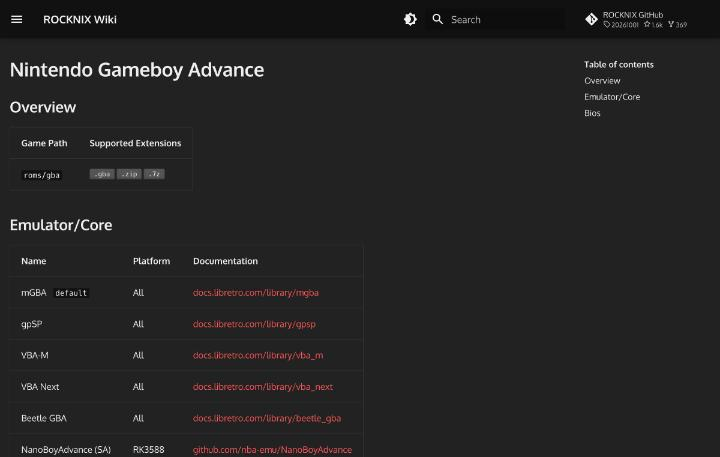

# ROMとBIOSの扱い方

エミュレーターで遊ぶには、ゲームのデータ(ROM)と、機種によっては、元のゲーム機の起動用データ(BIOS)が必要です。このページでは、ROMとBIOSの置き方、正しいデータかを確かめる方法、メタデータの整え方、権利の考え方を、公式の文書から整理します。入手先の案内や、配布のリンク、ダウンロードの手順は書きません。ROMとBIOSには著作権があり、配布されているものの多くが、権利者の許可を得ていないためです。

## ファイルの種類と拡張子

ROMの形式は、機種ごとに違います。ROCKNIXのWikiは、機種ごとのページに、ゲームを置くフォルダと、対応する拡張子を表にしています。たとえば、ゲームボーイアドバンスは `roms/gba` で、拡張子は `.gba`、`.zip`、`.7z` です([GBAのページ](https://rocknix.org/systems/gba/))。PlayStationは `roms/psx` で、`.bin`、`.cue`、`.chd`、`.iso` など11種類が並びます([PSXのページ](https://rocknix.org/systems/psx/))。PlayStation 2は `roms/ps2` で、`.chd`、`.iso`、`.mdf`、`.cso`、`.gz` です([PS2のページ](https://rocknix.org/systems/ps2/))。ドリームキャストは `roms/dreamcast` で、`.lst`、`.bin`、`.dat`、`.zip`、`.7z` が挙がっています([ドリームキャストのページ](https://rocknix.org/systems/dreamcast/))。

同じ表には、使えるエミュレーターやコアの一覧もあり、GBAではmGBAが既定です。ROCKNIXの文書は、機種ごとに必要なファイルが違うため、詳しくは機種別のページを見るように案内しています([ゲームの追加](https://rocknix.org/play/add-games/))。

RetroArchの文書は、ディスクを使う機種のデータを、zipにまとめないのが一般的な目安だと書いています([ROMs, Playlists, and Thumbnails](https://docs.libretro.com/guides/roms-playlists-thumbnails/))。拡張子の対応は、エミュレーターごとに違うため、迷ったときは、使うOSの機種別ページで確かめてください。

## BIOSとは何か

Knulliの[BIOSの説明](https://github.com/knulli-cfw/knulli.org/blob/main/docs/play/bioses.md)では、BIOSはコンピューターのハードウェアに低水準でアクセスする基本的なソフトウェアです。一部のゲーム機にもBIOSがあり、エミュレーションで必要になる場合があります。BIOSもゲームと同じく著作権で保護されるため、KNULLIには付属しません。利用者が自分で用意する決まりだと、同じ文書は説明しています。

RetroArchの文書では、BIOSは、コアが再現する機器のOSのコピーです。コアによって、BIOSが必須のものと、任意のものがあります。同じ文書の例では、Beetle PSX HWとSwanStationは必須、mGBAとPCSX ReARMedは任意です([BIOS](https://docs.libretro.com/guides/bios/))。BIOSがなくても動くコアがあるのは、HLE(高水準エミュレーション)という方法があるためです。HLEは、機器の実際の動作ではなく、出力を再現しようとする方法で、不具合や表示の乱れがよく起きると、同じ文書にあります。

RetroArchとlibretroは、著作権のあるシステムファイルやゲームの内容を配布しないと、この文書は明記しています。利用者が自分で、BIOSとゲームを、お住まいの地域の法に従って用意する決まりです。

## 置き場所と名前

ROCKNIXでは、ゲームを `roms` フォルダに入れ、BIOSは `roms/bios` の下に置きます。たとえば、[Retroid Pocket 5のページ](https://rocknix.org/devices/retroid/retroid-pocket-5/)は、PS2のエミュレーターに必要なBIOSのファイル名と置き場所を `/roms/bios/aethersx2/bios`、XboxのxemuのBIOSを `/roms/bios/xemu/bios`、PS1のDuckStationのBIOSを `/roms/bios` とのことです。ファイル名は決まっています。Knulliは、エミュレーターがBIOSのファイルを、非常に決まった名前で、ときには決まったサブフォルダの中に期待すると説明しています。Knulliは大文字と小文字を区別するため、名前の大文字と小文字も合わせることが必要です。

ROCKNIXの機種別ページは、BIOSの置き場所も明記しています。GBAのページは、ファイル名、MD5の値、置き場所の表です。PS2のページは、表のファイルのうち、少なくとも1つが必要だと書いています。ドリームキャストのページは、必要なファイルの一覧を、libretroのFlycastの文書に任せています([Flycast](https://docs.libretro.com/library/flycast/))。

Knulliの置き場所は、ROCKNIXとは違う形です。Knulliは、すべてのデータを `/userdata` に置きます。その中に、BIOSの `bios`、ゲームの `roms`、セーブの `saves`、スクリーンショットの `screenshots`、テーマの `themes` などがあります。`roms` の中には、機種ごとのサブフォルダがあり、たとえば、スーパーファミコンは `snes`、ゲームボーイは `gb` です。Knulliは、`roms` のサブフォルダの中のゲームだけを探します。ほかの場所に置いたゲームは、ゲームとして認識されません。保存先の仕組みの詳細は、[ゲームの保存先](https://github.com/knulli-cfw/knulli.org/blob/main/docs/play/add-games/game-storage.md)にあります。

RetroArchの場合は、事情が違います。ROMは、RetroArchが読める場所なら、どこに置いてもかまいません。機種名のフォルダに分ける置き方は、よくある例ですが、必須ではありません。BIOSは、ふつう、RetroArchの「system」ディレクトリに置きます。設定の「ディレクトリ」の項目と、コアの文書で、場所を確かめるよう案内されています。OSごとに置き場所が違うため、使う環境の文書を先に読んでください。

ROCKNIXの保存先は、2つの方式です。ext4でフォーマットしたmicroSDを使うと、内蔵ストレージと外部ストレージを合わせて使う「Merged Storage」を選べます。この方式は、初期状態では無効で、有効にした場合の既定の保存先は外部です。無効のときと、ExFATやFAT32のときは、「Simple Storage」になり、外部カードの `roms` フォルダの内容が、`/storage/roms` に見えます。フォルダが表示されないときは、microSDに `roms` ディレクトリがあるかを確かめて、再起動する、という案内です。競合が起きたときのための、`/usr/bin/cleanup_overlay` というコマンドもあり、実行すると端末が再起動します([ゲームの追加](https://rocknix.org/play/add-games/))。

## ファイルの転送

ROCKNIXは、ファイルを転送する方法を、複数用意しています。ネットワーク経由は、HTTP、SMB、SFTPの3つです。USBでつなぐ方法は、ネットワークとして見せるモードと、ファイル転送のモードの2通りです。SDカードを抜いてパソコンで開く方法、リカバリーモード、USBドライブ、Linuxパソコン、NFSの方法も説明されています。ゲームを追加したあとは、STARTボタンからゲーム設定を開き、ツールの「Update Gamelists」を実行すると、一覧に反映されます。ネットワークの接続には、ユーザー名とパスワードが必要で、パスワードは、設定の「Security」で変更できます([ゲームの追加](https://rocknix.org/play/add-games/))。

Knulliも、SMBによる無線の転送、USB接続、SDカードの直接の操作を用意しています([ゲームの追加](https://github.com/knulli-cfw/knulli.org/blob/main/docs/play/add-games/index.md))。どちらのOSも、転送のあとに一覧の更新が必要な点は、同じです。

## 正しいデータかを確かめる

Knulliには、BIOSが足りているかを調べる機能があります。STARTボタンのメニューから、ゲーム設定の「Missing BIOS check」を開くと、足りないBIOSと、チェックサムが合わないBIOSが分かります。チェックサムが合わなくても、実際には動く場合があるため、置き場所が正しければ、ゲームを起動して試すこと、という案内です。Windowsでは、ファイルの拡張子を表示させておくと、`.bin.bin` のような二重の拡張子や、`.bin.zip` のような間違いを防げます。ゲームを起動するときに、BIOSの不足を警告する機能もあり、設定で切ることも可能です。

このチェックでは、見る点が4つあります。ファイルの置き場所が、`bios/ファイル名` か、`bios/サブフォルダ/ファイル名` か。名前が、空白やアンダースコアまで含めて正確か。大文字と小文字が合っているか。そして、ファイルが本当にないのか、チェックサムだけが違うのか、の4点です。チェックサムが違うだけなら、別のファイルが入っている可能性があり、見つからない場合とは対処が別物です。

ROMの内容が正しいかも、チェックサムで確かめられます。pretの[pokeemerald](https://github.com/pret/pokeemerald)のREADMEには、ビルドで作れるROMのSHA1の値が載っています。それぞれに、ROMのデータベース「No-Intro」の記録へのリンク付きです。ビルドしたROMのSHA1がこの値と同じなら、期待どおりのデータだと確認できます。

RetroArchでは、チェックサムを、ゲームの一覧を作る場面で使うのが特徴です。コンテンツのスキャナーは、既知の正しいコピーのデータベースと照合します。照合の鍵は、ディスク以前の小さなデータではCRCのチェックサム、ディスクのゲームでは、データの中に埋め込まれたシリアル番号です。SHA1などのハッシュは、データベースに情報として入っていますが、照合には使いません。既定の「strict」のスキャンは、データベースにないファイルを一覧に入れず、「loose」にすると、入れます。照合に成功すると、ファイル名とは別に、データベースの名前が付きます。サムネイルは、その名前をもとに探されます([Databases](https://docs.libretro.com/guides/databases/))。

このデータベースの元になっているのは、clrmameproの形式の.datファイルです。上流のグループとして、No-Intro、Redump、GameTDBなどが挙げられています。No-Introの公式サイトは、自分たちを、ROMやデジタルゲームの最良のコピーを記録し、ROM管理ソフト向けのDATファイルとオンラインのデータベースを提供する団体と説明しています。同じページは、配布や共有には関わらず、一覧のデータを入手する手助けもしない、と明記しています([No-Intro](https://no-intro.org/))。

チェックサムの値を計算する方法は、この調査で読んだ文書には、書かれていませんでした。OSごとの計算の手順は、確認できていません。

## ゲームの管理とメタデータ

ROMを増やすと、一覧の見た目を整える作業が必要になります。Knulliは、ScreenScraper、TheGamesDB、ArcadeDBから、カバー画像や説明を自動で取得する機能付きです。ROCKNIXにも、同じ目的のスクレイパーがあります。Pegasusは、ゲームごとの情報を `metadata.pegasus.txt` に書き、カバーや動画を、`media/<ゲーム名>/` の決まった名前のファイルで探します([Pegasusのメタデータ](https://github.com/mmatyas/pegasus-docs/blob/master/docs/user-guide/meta-files.md))。仕組みは [フロントエンドと天馬G](05-frontend-tianma-g.md) に書きました。

Knulliの文書によると、内蔵のスクレイパーは、ROMのファイル名を手がかりに、情報を探します。名前に `(U)` や `(EU)` のような地域の表記があれば、それも考慮されます。名前が正しくないと、ゲームを特定できません。ScreenScraperは、アカウントでのログインが必要で、無料で登録できると、Knulliの文書にあります。1日に取得できる量に上限を設ける取得元があるため、設定を整えてから実行するよう勧められています。1本ずつ取得する場合の操作は、ゲームを起動するボタンの長押しと、ゲームメニューの「Scrape」の選択です。名前が違って見つからないときは、「Input」で、ゲームの名前を手で入れます。多くのゲームをまとめて取得するときは、メインメニューの「Scraper」で、対象の機種や、最近取得したゲームを除くかなどを絞ってから、「Scrape now」を選びます。取得のあとは、「Update gamelists」で、一覧に反映します([Scraping](https://github.com/knulli-cfw/knulli.org/blob/main/docs/play/scraping.md))。

ほかのEmulationStation系の端末で取得した情報を移すときは、機種のフォルダごとコピーし、`gamelist.xml` も差し替えます。`gamelist.xml` には、取得した画像への参照が入っているため、これがないと、画像が表示されません。ROCKNIXの文書は、スクレイピングに、インターネット接続とScreenScraperのアカウントが必要だと書いています。ユーザー名とパスワードを、メインメニューの「Scraper」に入れ、取得する項目をチェックボックスで選ぶ手順です。プレビュー画像と、題名、発売日、開発元などは、自動で取得されます([Scraping](https://rocknix.org/configure/scraper/))。ログインの情報は、各自で入力するもので、このリポジトリには書きません。

Pegasusのアセットの探し方は、優先順位があります。ゲームごとにメタデータファイルで指定したもの、コレクションの既定として指定したもの、`media/<ゲーム名>/` の中の決まった名前のファイル、第三者のデータソースの順です。多くのゲームには、Universal XML Scraper、Steven Selph's Scraper、Skraper.net、Skyscraperなどのスクレイパーを使えると、公式の文書が紹介しています([meta-assets.md](https://github.com/mmatyas/pegasus-docs/blob/master/docs/user-guide/meta-assets.md))。

RetroArchは、プレイリストと、サムネイルの仕組みを持っています。ROMは、機種ごとのフォルダに分けると管理しやすいものの、必須ではありません。プレイリストは、スキャナーで作るほか、手で編集することもできます。サムネイルは、ゲーム内のスナップショット、タイトル画面、ボックスアートの3種類で、オンラインアップデーターから、プレイリスト単位で取得します。ただし、この一括の取得は、ユーザーが自分で設定したサムネイルを上書きする場合があると、警告があります([ROMs, Playlists, and Thumbnails](https://docs.libretro.com/guides/roms-playlists-thumbnails/))。

## 改造とパッチ

ゲームの改造では、元のROMを書き換えた完成品を配る代わりに、差分のパッチを使う方法があります。[HexManiacAdvance](https://github.com/haven1433/HexManiacAdvance)は、IPSとUPSのパッチの作成と適用が可能です。パッチだけを共有し、利用者が自分のROMに当てる形なら、原作のデータそのものの再配布を避けられます。詳細は [ポケモンのROM hack](08-pokemon-hacking.md) に書きました。

RetroArchは、パッチを、起動時に自動で当てる「ソフトパッチ」に対応しています。対応する形式は、UPS、IPS、BPS、xdeltaです。`rom.bin` を読み込むときに、同じ名前の `rom.ups`、`rom.ips`、`rom.bps` があれば、自動でパッチが当たります。複数のパッチを当てたいときは、`rom.ips`、`rom.ips1`、`rom.ips2` のように、拡張子の末尾に数字を付け、この順で適用される仕組みです。ただし、自動のパッチは、コアがROMをメモリから読み込む場合に限られます。コアごとの対応表があり、たとえば、GBAではmGBA、VBA-M、VBA Next、Meteorが対応で、ゲームボーイのSameBoyは非対応です。メガドライブのGenesis Plus GXは対応しますが、マスターシステムでは非対応と、機種によって違います([Softpatching ROMs](https://docs.libretro.com/guides/softpatching/))。

## 中国語の記事でROMとBIOSに触れる箇所

中国語の記事は、ROMの話題に、率直な表現を使います。CSDNの天馬Gの記事の筆者は、ROMの内容を「比较敏感」と書き、合法と非法の区別があるため、エミュレーターの制作者や各工房は、少なくとも表向きには、ROMを提供しない、と説明しています。「敏感」は、扱いに注意が要る、という意味の語です。続けて、国内には「跳坑者联盟」の整合包があり、中身は充実していると書いています。このリポジトリでは、こうしたパックの入手方法は扱いません([天马G前端的使用](https://blog.csdn.net/fanged/article/details/152960565))。

同じ記事は、天馬Gを、ROMの管理ソフトとエミュレーターの起動ソフトを合わせたものだと説明しています。「配置文件」(設定ファイル)、「ROM 路径」(ROMのパス)、「启动脚本」(起動スクリプト)といった語は、天馬Gの複数のアプリが設定やパスを共有する仕組みを説明する文で出てくる語です。Linux系のOSの欠点としては、「BIOS / Core 手动配置」が必要だと書かれています。「手动」は、手作業の意味です。

また、記事は、ROMのファイルに加えて、主画像、副画像、紹介動画、メタデータが必要だと説明しています。メタデータは「精简包」に入っているものを使えばよく、「跳坑者联盟」の発表物なら、最初から用意されているそうです。仕組みは、前の節の、スクレイパーやPegasusのメタデータと同じ考え方です。

ROM hackの掲示板は、「口袋改版资源吧」のように、名前に「资源」(リソース)と「改版」(改造版)を含みます。掲示板の説明は、ゲームのファイル、エミュレーター、チートコード、ツールなどを含む、資源の目次を挙げています([口袋改版资源吧](https://tieba.baidu.com/f?kw=%E5%8F%A3%E8%A2%8B%E6%94%B9%E7%89%88%E8%B5%84%E6%BA%90))。ここにある語を知っておくと、ゲームの改造の情報を、中国語で探しやすくなります。ただし、ROMそのものの入手は、このリポジトリの対象外です。

## 権利の考え方

このリポジトリで確認できた公式の文書は、どれも、ROMとBIOSを付属させないと書いています。KnulliはBIOSを同梱せず、pretは、ビルドの手順と、確認用のSHA1だけを公開しています。RetroArchとlibretroも、システムファイルとゲームの内容を共有しないと明記し、利用者が自分で用意する決まりです。No-Introも、ROMの一覧のデータを作る団体であって、入手の手助けはしないと書いています。

天馬Gのパックは、CSDNの記事によると、エミュレーターの制作者や工房が公式には提供しない種類のデータが入っていて、国内のコミュニティが整理したものです([天马G前端的使用](https://blog.csdn.net/fanged/article/details/152960565))。こうしたパックの入手は、権利の面で問題があるため、このリポジトリでは扱いません。

何が適法かは、国と地域で違います。この調査では、日本を含む各国の法律の条文や、公的な解説は、開いて確認していません。そのため、このリポジトリは、法的な判断を示しません。確認できたのは、各公式の文書が、ROMとBIOSを自分で用意するよう求めていることだけです。

自分で用意する方法として、手元に持っているゲームのカートリッジやディスクから、データを取り出す方法があります。必要な機器と価格、オープンソースのツール、権利のないゲームの遊び方、BIOSの代替は、[自分で用意するデータと権利のないゲーム](13-own-data-and-free-games.md)にまとめました。

## この記事で出てくる中国語

次の表は、この記事の中国語の節で触れた語を、ピンインと意味とあわせてまとめたものです。

| 中国語(簡体字) | ピンイン | 日本語の意味 | 出典 |
|---|---|---|---|
| 敏感 | mǐngǎn | 扱いに注意が要る、敏感な | [天马G前端的使用](https://blog.csdn.net/fanged/article/details/152960565) |
| 合法 | héfǎ | 適法である | [天马G前端的使用](https://blog.csdn.net/fanged/article/details/152960565) |
| 非法 | fēifǎ | 違法である | [天马G前端的使用](https://blog.csdn.net/fanged/article/details/152960565) |
| 提供 | tígōng | 提供する | [天马G前端的使用](https://blog.csdn.net/fanged/article/details/152960565) |
| 工作室 | gōngzuòshì | 工房、スタジオ | [天马G前端的使用](https://blog.csdn.net/fanged/article/details/152960565) |
| 跳坑者联盟 | Tiàokēzhě Liánméng | 天馬Gのパックを作る国内のグループの名前 | [天马G前端的使用](https://blog.csdn.net/fanged/article/details/152960565) |
| 精简包 | jīngjiǎnbāo | 軽量化したパック | [天马G前端的使用](https://blog.csdn.net/fanged/article/details/152960565) |
| 配置文件 | pèizhì wénjiàn | 設定ファイル | [天马G前端的使用](https://blog.csdn.net/fanged/article/details/152960565) |
| 路径 | lùjìng | パス、ファイルの場所 | [天马G前端的使用](https://blog.csdn.net/fanged/article/details/152960565) |
| 启动脚本 | qǐdòng jiǎoběn | 起動スクリプト | [天马G前端的使用](https://blog.csdn.net/fanged/article/details/152960565) |
| 手动 | shǒudòng | 手作業の | [天马G前端的使用](https://blog.csdn.net/fanged/article/details/152960565) |
| 管理器 | guǎnlǐqì | 管理ソフト | [天马G前端的使用](https://blog.csdn.net/fanged/article/details/152960565) |
| 资源 | zīyuán | 資源、リソース | [口袋改版资源吧](https://tieba.baidu.com/f?kw=%E5%8F%A3%E8%A2%8B%E6%94%B9%E7%89%88%E8%B5%84%E6%BA%90) |
| 改版 | gǎibǎn | 改造版 | [口袋改版资源吧](https://tieba.baidu.com/f?kw=%E5%8F%A3%E8%A2%8B%E6%94%B9%E7%89%88%E8%B5%84%E6%BA%90) |
