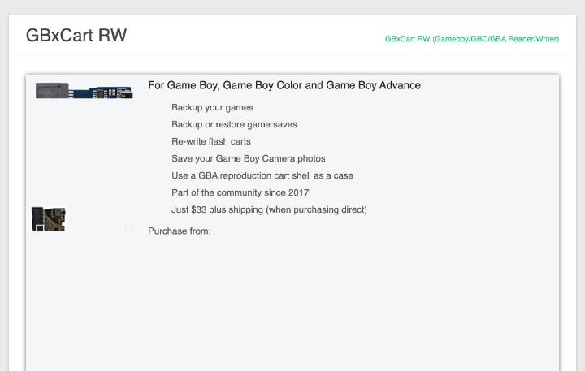
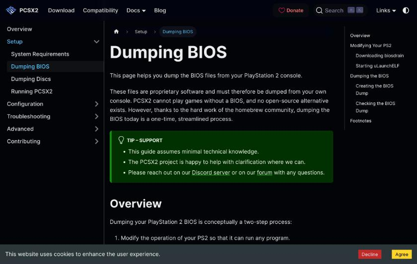
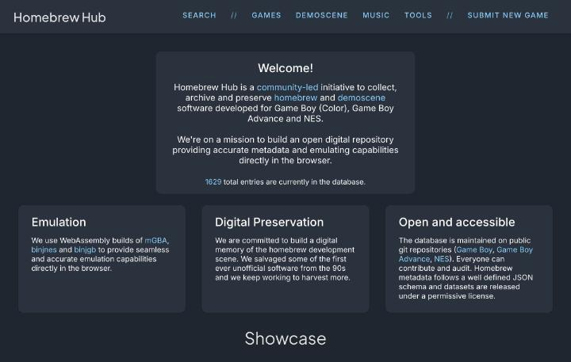
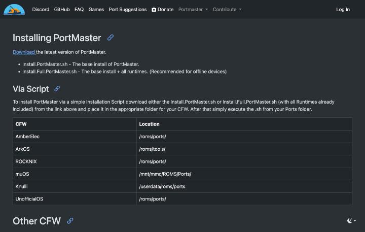
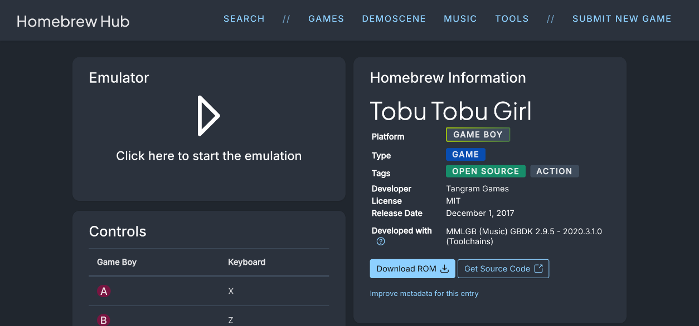

# 自分で用意するデータと権利のないゲーム

ROMとBIOSの置き方は [ROMとBIOSの扱い方](12-roms-and-bios.md) に書きました。この記事では、権利の面で問題なく遊べるデータの用意の仕方を、三つに分けて整理します。手元のカートリッジとディスクから自分で吸い出す方法、ホームブリューなど自由に配布されているゲーム、BIOSの代わりになるオープンソースの実装です。どれも公式の文書で確認した内容だけを書いています。

## 自分で吸い出す

libretroの[BIOSの説明](https://github.com/libretro/docs/blob/master/docs/guides/bios.md)は、RetroArchとlibretroが、著作権のあるシステムファイルやゲームのデータを共有しないと書いています。利用者が、それぞれの国の法律に従って、BIOSとゲームを自分で用意する前提です。ゲームの取り込みの[ガイド](https://github.com/libretro/docs/blob/master/docs/guides/import-content.md)も、内容を合法的に入手済みであることを前提にしています。

ゲームボーイとゲームボーイアドバンスのカートリッジは、専用のリーダーとソフトで吸い出せます。[FlashGBX](https://github.com/lesserkuma/FlashGBX)は、Windows、Linux、macOSで動くソフトで、ROMとセーブデータの取り出し用です。対応するリーダーは、GBxCart RW、GBFlash、Joey Jr、Game Bubの四つです。吸い出した結果を保存の記録に残す、ダンプレポートの生成機能もあります。画面の言語は英語、ドイツ語、簡体字中国語で、中国語の学習にも役立ちます。

## 吸い出しに必要なハードウェアと価格

カートリッジの吸い出しには、専用のリーダーが必要です。確認できた価格は、次のとおりです。

| 機器 | 価格 | 対応 | 出典 |
|---|---|---|---|
| GBxCart RW | 33ドルと送料(直販の場合) | GB、GBC、GBA | [GBxCart RW公式](https://www.gbxcart.com/) |
| Joey Jr | 42ドル | GB、GBC、GBA | [BennVenn's Shop](https://bennvenn.myshopify.com/collections/game-cart-to-pc-interface/products/usb-gb-c-cart-dumper-the-joey-jr) |

GBxCart RWの公式ページには、バックアップ、セーブの退避と復元、フラッシュカートの書き込みに使えると書かれています。Windowsでは、CH340/CH341のドライバーが必要です。Joey Jrのページによると、ソフトやドライバーは要らず、外付けのハードディスクのように使えます。ROMとセーブは、ドラッグで取り出せます。USB-Cケーブルは付属しません。Macでは隠しファイルがセーブを壊すおそれがあるため、FlashGBXの利用が勧められています。ファームウェアは、そのページのもの以外で更新しないよう強調されています。同じ店では、JoeyN64が55ドルで売られていました。

ほかに、GBFlashがあります。[GBFlash](https://github.com/simonkwng/GBFlash)は、32ビットのARMプロセッサを積んだ、GB/GBAのカードを高速に書き込む機器です。READMEによると、最速で毎秒550キロバイトを超えます。FlashGBXも公式に対応済みです。価格のページは、この調査では確認できませんでした。Game Bubは、公式サイトで「オープンソースのFPGAレトロエミュレーション携帯機」と紹介されていますが、価格はトップページにありません。

## オープンソースの選択肢

吸い出しの周りには、オープンソースのソフトとハードが多くあります。ソフトは、FlashGBXがGPL-3.0です。[Open Source Cartridge Reader](https://github.com/sanni/cartreader)は、PCなしで、ROMとセーブをSDカードに吸い出せる、作りやすく改造しやすいリーダーです。ライセンスはGPL-3.0で、ファミコン、スーパーファミコン、NINTENDO64、ゲームボーイカラー、ゲームボーイアドバンス、メガドライブ、マスターシステムに対応します。アダプターを使うと、バーチャルボーイ、ゲームギア、PCエンジン、ワンダースワン、ネオジオポケット、Atari系などにも対応します。READMEの案内によると、開発は[oscartreaderのGitHub組織](https://github.com/oscartreader)に移りました。そこには、ファームウェア、カートリッジのデータベース、ハードウェアの設計ファイルが、別々のリポジトリで公開されています。設計ファイルがあるため、基板を自分で発注して作る学習にも向きます。完成品の価格は、この調査では確認できませんでした。

PS2のディスクは、[PCSX2の公式文書](https://pcsx2.net/docs/setup/discs/)に手順があります。Windowsでは、MPFというツールが使え、内部ではRedumperが動きます。ImgBurnも紹介されていますが、インストーラーにはアドウェアが含まれるとの警告つきです。PS2のBIOSについても、PCSX2は[BIOSの取り出し方](https://pcsx2.net/docs/setup/bios/)を文書にしています。

DuckStationは、PS1のBIOSが必要で、手元のゲーム機から取り出して使う方針です。BIOSの取り出しには、ゲーム機本体の改造が必要になることがあります。この調査では、その具体的な手順までは確認していません。

## 権利のないゲームを遊ぶ

ホームブリューは、個人やチームが作って、自由に配布しているゲームを指します。[Homebrew Hub](https://hh.gbdev.io/)は、ゲームボーイ、ゲームボーイアドバンス、ファミコン用のホームブリュー、デモ、音楽カートリッジ、ツールを集めたデータベースです。トップページの表示では、登録数は1629件で、ブラウザ上で動くエミュレーターも付属です。データは、ゲームボーイ用が[gbdev/database](https://github.com/gbdev/database)、ゲームボーイアドバンス用が[gbadev-org/games](https://github.com/gbadev-org/games)、ファミコン用が[nesdev-org/homebrew-db](https://github.com/nesdev-org/homebrew-db)という公開リポジトリで管理されています。

トップページには、2026年6月13日から9月14日に開かれたGBA Jam 2026など、ゲーム制作のイベントの告知もあります。ゲームごとのページが、作者や権利の扱いの記載先です。削除の依頼の扱いは、サイトの「disclaimer/DMCA」のページが確認先です。遊ぶ前に各ゲームのライセンス表記を見る習慣をつけると、安全に遊べます。

Linux系のOSには、PortMasterがあります。[PortMasterの公式サイト](https://portmaster.games/)によると、これは、携帯機のLinux向けにポート(PC向けゲームの移植版)を入れて、更新と削除を管理するプログラムです。ダウンロード量は8MBで、ジャンルやランタイムで絞り込めます。2023年11月5日に、新しい版が告知されました。[導入のページ](https://portmaster.games/installation.html)は、Install.PortMaster.shを入手し、OSごとの決まったフォルダに置いて実行する手順を書いています。置き場所は、ROCKNIXが `/roms/ports/`、muOSが `/mnt/mmc/ROMS/Ports/`、Knulliが `/userdata/roms/ports`、ArkOSが `/roms/tools/` です。全部入りの版は、オフラインの機器に向くと説明されています。

ほかに、権利の面で確認しやすいゲームもあります。[Freedoom](https://github.com/freedoom/freedoom)は、Doomのエンジンで遊べる、自由な内容のFPSです。ステージ、絵、効果音、音楽までそろっていますが、動かすには別にエンジンが要ります。[ScummVM](https://github.com/scummvm/scummvm)は、アドベンチャーゲームを動かす仕組みで、ゲームのデータファイルは利用者が用意する前提です。無料で配布されているゲームがどれかは、ScummVMの文書からは確認できませんでした。

### Homebrew Hubの見方

Homebrew Hubの[免責のページ](https://hh.gbdev.io/disclaimer)には、サイトの方針が書かれています。掲載されているROM、遊べるゲーム、ホームブリュー、ツールは、いずれも自由なソフトウェアで、ライセンスはそれぞれ違うという説明です。市販の著作物は、運営の知る限り含まれていないとも書かれています。万一、許可のない内容が載ったときは、連絡を受けて取り下げる方針です。開発者本人には、理由を問わず、エントリーの削除、ROMの削除、ブラウザ上での再生の禁止、表示内容の編集という権利があります。

個別のゲームのページには、ライセンスと開発環境の情報が並びます。たとえば「Tobu Tobu Girl」のページには、対応機種がゲームボーイ、種類がゲーム、タグが「OPEN SOURCE」と「ACTION」と表示されます。開発者はTangram Games、ライセンスはMIT、公開日は2017年12月1日です。開発環境の欄には、音楽のMMLGBと、ツールチェーンのGBDK 2.9.5-2020.3.1.0とあります。ページの左側は、ブラウザで遊べるエミュレーターと、キーボードの操作表です。右側の情報の下には、ROMのダウンロードのボタンと、ソースコードへのリンクが並びます。キーボードの操作は、AボタンがXキー、BボタンがZキーでした。

このページの見方を覚えておくと、遊ぶ前に、ライセンスと配布の条件を確認できます。ソースコードが公開されたゲームは、[自作ゲームの記事](14-making-games.md)で使ったGBDKの実例としても読めます。

### ScummVMが公式に配布する無料のゲーム

ScummVMは、アドベンチャーゲームを動かす仕組みです。READMEによると、動かすにはゲームのデータファイルが必要で、複数のゲームを一度に追加する「Mass Add」もあります。ScummVMの公式サイトには、[無料のゲームのダウンロードページ](https://www.scummvm.org/games/)があります。2026年10月3日に開いたとき、ページの見出しは「Game downloads for ScummVM version 2026.3.0」でした。

ページの説明は、現在は11本の無料のゲームを置いていると書いています。Beneath a Steel Sky、Broken Sword 2.5、DreamWeb、Flight of the Amazon Queen、Lure of the Temptress、Drascula: The Vampire Strikes Back、Soltys、Sfinx、The Griffon Legend、Nippon Safes, Inc.、Mystery Houseです。ほかに、God of Thunder、SLUDGEエンジンで作られた多くの作品、WAGEの作品集、Helga Deep In Troubleも並んでいます。Mystery Houseは、Apple II版のパブリックドメインの版と表示されています。

サイズの差が大きい点にも注目してください。Beneath a Steel Skyは、フロッピー版が7.3 MiB、CD版が66.2 MiBでした。Flight of the Amazon Queenのフロッピー版は6.8 MiBで、元のままのCD版は107.4 MiBです。Broken Sword 2.5は、859.7 MiBと大きなデータでした。各ファイルには更新日が付き、SHA-256を確認するリンクも並びます。携帯機のOSでScummVMを動かせるかは、この調査では確認できていません。

### libretroで取り込む流れ

RetroArchを使う場合の、データの取り込みは、libretroの[取り込みのガイド](https://github.com/libretro/docs/blob/master/docs/guides/import-content.md)に手順があります。ガイドの冒頭には、内容を合法的に入手済みであることが前提だと書かれています。

最初の作業は、メインメニューの「Online Updater」から「Update Databases」を選ぶことです。データベースと、コア情報のファイルを更新します。次に「Import Content」で、フォルダを走査します。走査は再帰的なので、サブフォルダに整理したままで構いません。既定の自動走査は「strict」で、内容のCRCチェックサム、またはディスクのシリアルが、データベースと一致する必要があります。一致しないものも加える「loose」の走査も選べます。最後に、必要なら「Playlist Thumbnails Updater」で、箱絵などのサムネイルを取得する手順です。手動で走査した内容にサムネイルを付けるには、プレイリストの名前と項目の名前が、サムネイルのサイトのものと一致する必要があります。

コアは、「Online Updater」の「Core Downloader」から入れます。この項目が見えないときは、「Settings」の「User Interface」の「Menu Item Visibility」で、「Show Core Downloader」を有効にします。パッケージ管理ソフトで入れたRetroArchでは、この項目が出ないことがあり、その場合の手順は[コアの入れ方のガイド](https://github.com/libretro/docs/blob/master/docs/guides/download-cores.md)にあります。BIOSの置き場所は、通常はRetroArchの「system」ディレクトリです。

## BIOSの代わりになる実装

エミュレーターによっては、BIOSなしで動かせます。libretroの文書には、HLEという方式の説明があります。元の動作そのものを再現せず、出力だけを再現する方式で、不具合が起きやすいとのことです。

[mGBA](https://github.com/mgba-emu/mgba)は、ゲームボーイアドバンスのBIOSを内蔵の実装で代替できます。外部のBIOSを読み込むこともできます。libretroの表では、mGBAのBIOSは任意です。同じ表で、PCSX ReArmedも任意で、Beetle PSX HWとSwanStationは必須です。ゲームボーイアドバンス向けには、MITライセンスの代替BIOSとして、[Cult-of-GBA/BIOS](https://github.com/Cult-of-GBA/BIOS)もあります。

PS1には、[PCSX-Redux](https://github.com/grumpycoders/pcsx-redux)のOpenBIOSがあります。READMEによると、市販のBIOSなしでPS1のゲームを起動できる、MIPS R3000A向けのBIOS実装です。市販のBIOSは著作権で保護されているため、その代替になるとも書かれています。ビルドには、MIPSのツールチェーンが必要です。

PS2は事情が違います。この調査で読んだPCSX2の公式文書は、BIOSを手元のゲーム機から取り出す方法だけを案内していて、オープンソースの代替には触れていません。

## この記事で出てくる中国語

この記事は、英語の公式文書が中心です。中国語は、CNFansの出品ページで確認した、ゲーム入りのカードを売る商品の説明に出る語を載せます。出品ページの内容は、[CNFansの出典ノート](../sources/cnfans.md)にあります。

| 中国語 | ピンイン | 日本語の意味 | 出典 |
|---|---|---|---|
| 开源 | kāiyuán | オープンソース | [开源掌机吧](https://tieba.baidu.com/f?kw=%E5%BC%80%E6%BA%90%E6%8E%8C%E6%9C%BA) |
| 掌机 | zhǎngjī | 携帯ゲーム機 | [掌机圈](https://zhangjiquan.com/handhelds) |
| 游戏 | yóuxì | ゲーム | CNFansの出品ページ |
| 模拟器 | mónǐqì | エミュレーター | [天马G前端的使用](https://blog.csdn.net/fanged/article/details/152960565) |
| 预装 | yùzhuāng | あらかじめ入れてある | CNFansの出品ページ |
| 内存卡 | nèicún kǎ | メモリーカード | CNFansの出品ページ |
| 专用 | zhuānyòng | 専用 | CNFansの出品ページ |
| 机器 | jīqì | 機械、ここでは本体 | CNFansの出品ページ |
| 玩家 | wánjiā | プレイヤー、遊ぶ人 | CNFansの出品ページ |
| 备注 | bèizhù | 備考、注文のときのメモ | CNFansの出品ページ |

「预装」は、「预装RP5天马G专用内存卡」のような題名に出ます。ゲームやエミュレーターを入れた状態で売る、という意味です。この種の商品は、権利の面で問題のある中身を含む場合があります。先に[ROMとBIOSの記事](12-roms-and-bios.md)の考え方を読んでおくと安心です。

## 学べること

吸い出しの作業で、カートリッジのメモリマッパーやセーブデータの仕組みを学べます。FlashGBXの対応一覧には、MBC1やMBC5など、ゲームボーイのマッパーが並んでいます。代替BIOSは、ソースコードを読めるため、ゲーム機の起動の流れを知る教材です。ホームブリューはGBA Jamのようなイベントで作られていて、自分で作る側に回る入り口にもなります。
