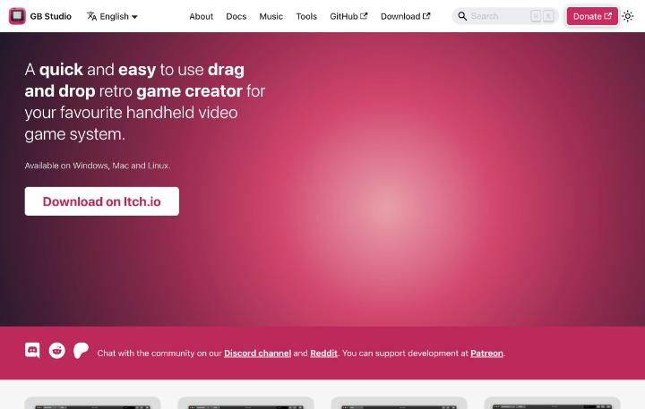
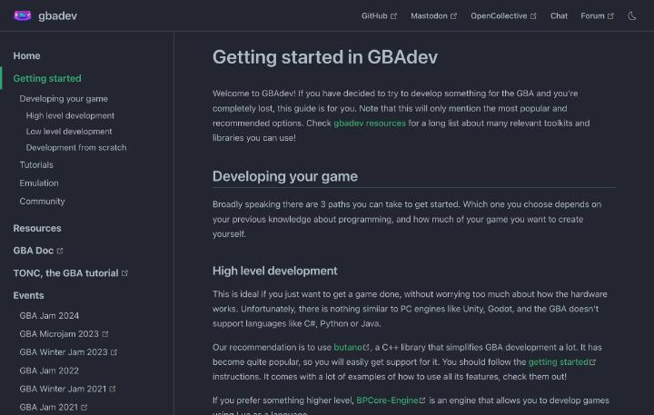
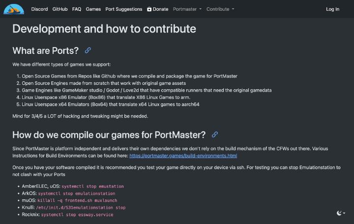
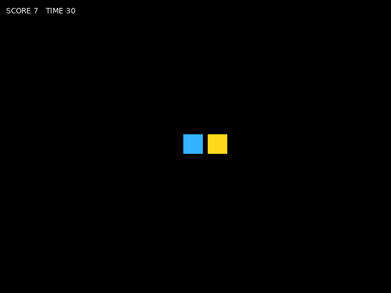
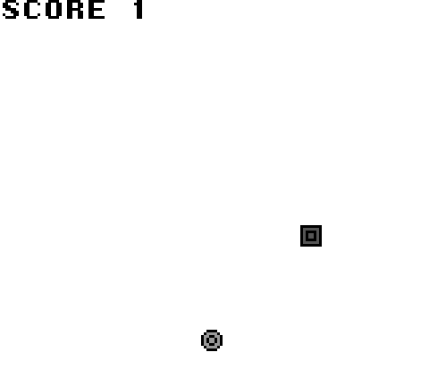

# 自作ゲームを作る方法とオープンソースのツール

携帯機で遊ぶ自作ゲームは、機種ごとに作り方が違います。この記事では、ゲームボーイ、ゲームボーイアドバンス、Linux系の携帯機の三つに分けて、プログラミングの方法とオープンソースのツールを整理します。出典は公式のページです。作ったゲームの配布先は [自分で用意するデータと権利のないゲーム](13-own-data-and-free-games.md) にあります。

## コードを書かずに作る

プログラミングの経験がなくても、ゲームボーイのゲームは作れます。[GB Studio](https://www.gbstudio.dev/)は、ドラッグ&ドロップで作るゲーム制作ツールです。公式のページによると、見下ろし型、プラットフォーム型、シューティングなどを作れ、音楽の編集機能も内蔵しています。完成したゲームは本物のROMファイルとして書き出せるので、ゲームボーイのエミュレーターで遊べます。ブラウザ用の書き出しもあり、itch.ioへの公開も可能です。対応OSはWindows、Mac、Linuxです。ソースコードは[GitHub](https://github.com/chrismaltby/gb-studio)にあり、ライセンスはMITと確認できました。



## ゲームボーイをCやアセンブリで作る

コミュニティの[gbdev.io](https://gbdev.io/)は、ゲームボーイの開発に取り組む非営利の集まりです。技術資料のPan Docs、資料集のawesome-gbdev、アセンブラのRGBDS、CコンパイラのGBDK 2020などを運営しています。[資料の一覧ページ](https://gbdev.io/resources.html)は、道具を種類ごとに並べた一覧です。

アセンブラでは、[RGBDS](https://github.com/gbdev/rgbds)が、ゲームボーイとゲームボーイカラー向けの標準的な開発ツールと位置づけられています。ライセンスはMITです。ブラウザ上で試せるRGBDS-Liveもあります。学習用には、アセンブリで作るチュートリアル「GB ASM Tutorial」が向いています。Hello Worldから始めてアルカノイド風のゲームを作り、最後にシューティングを仕上げる構成です。

Cで書くなら、[GBDK 2020](https://github.com/gbdk-2020/gbdk-2020)です。メンテナンスされているGBDKで、SDCCのツールチェーンを使い、Cコンパイラ、アセンブラ、リンカー、ライブラリを提供します。ライセンスは、GitHubの自動判定では種類を特定できないため、リポジトリのLICENSEで確認してください。GBDKの上に作るエンジンとして、ZGBとRetr0 GBが紹介されています。

画像と音の道具も、公開されています。タイルを編集するTilemap Studio、サウンドドライバーのDevSoundX、音楽を作るhUGETrackerなどです。動作の確認には、mGBA、SameBoy、Emulicious、BGBなどのエミュレーターを使います。Emuliciousは、VS Codeからソースを見ながらデバッグできるという紹介です。

完成したゲームは、実機のフラッシュカートに書き込んでも遊べます。書き込みにも使えるのは、[吸い出しの記事](13-own-data-and-free-games.md)で紹介した GBxCart RW と FlashGBX です。

## ゲームボーイアドバンスを作る

GBAは、[gbadev.net](https://gbadev.net/)が、コミュニティの拠点です。[導入のガイド](https://gbadev.net/getting-started.html)は、道筋を三つに分けています。



高水準の道は、ゲームを作ることを優先する人向けです。ガイドは、UnityやGodotのようなPC向けのエンジンはなく、C#、Python、Javaも使えないと書いています。おすすめは、C++のライブラリの[Butano](https://github.com/GValiente/butano)で、ライセンスはZlibです。Luaで書くBPCore-Engineもあります。

低水準の道は、I/Oレジスタを直接扱う人向けです。ガイドが最も人気とするのは、devkitARMとlibtoncの組み合わせで、チュートリアルの「Tonc」は現在で最も良い教材とされています。ほかに、NimのNatuやRustのagbも紹介されています。ツールチェーンには、CMakeを使うgba-toolchainと、Mesonを使うmeson-gbaも選べる、という案内です。2003年が最後のリリースのDevKit Advanceは、古すぎるため使わないよう警告されています。ライブラリなしで一から作る道もありますが、助けを得にくいので、慣れた人向けです。

エミュレーターは、NanoBoyAdvance、mGBA、no$gbaが推奨されています。NanoBoyAdvanceは最も正確ですが、デバッグ機能がありません。GitHubのリポジトリは、2026年6月21日の更新を最後にアーカイブされました。mGBAにはGDBをつなげるので、PCのプログラムのようにデバッグできます。no$gbaは正確さで劣る一方、優れたデバッガー付きです。

## Linux系の携帯機に作る

ROCKNIX、Knulli、muOSなどのLinux系OSでは、PortMasterの仕組みを使います。[PortMasterの開発ページ](https://portmaster.games/porting.html)は、対応するゲームを5種類に分けています。GitHubなどのオープンソースのゲームをコンパイルして包むもの、一から作られたオープンソースのエンジン、GameMakerやGodot、LÖVEのような、元のデータが必要なエンジン、そしてBox86とBox64でx86のLinuxゲームを動かすものです。



制約は大きいです。同じページは、多くのOSには完全なOpenGLがなく、X11もWestonもないと書いています。RockchipのAnbernic機は、古い3.x系のカーネルと、Mali用の独自ドライバーを使うため、使えるのはOpenGL ESだけです。OpenGL 2.x相当の機能は、GL4ESという変換のライブラリで補います。出力は、KMS/DRMかSDL2になり、VulkanとX11は使えません。

作る側から見て使いやすいのは、公式の実行環境が用意された道具です。SDL 1.2はsdl12-compatで変換できます。Godot 3は、FRTというエクスポートテンプレートで動かします。FRTではジョイスティックの処理が無効なので、操作の割り当てはgptokeybの担当です。LÖVEには、バージョンごとのaarch64版があります。Godot 4、Java、LibGDX、SFML、SDL3、Allegroは、WestonPackというランタイムの対象です。Javaの例として、Minecraft用のランチャーやUncivが挙げられています。

コントローラーの操作は、gptokebyでキーボードやマウスに割り当てます。`./gptokeyb "application" -c mykeymaps.gptk` のように呼び出し、STARTとSELECTでの終了にも対応する形です。開発中は、SSHで機器に入って試すことが勧められています。その際は、フロントエンドを止めてください。ROCKNIXでは `systemctl stop essway.service`、Knulliでは `/etc/init.d/S31emulationstation stop` が使えます。完成後は、同じサイトの[パッケージのガイド](https://portmaster.games/packaging.html)に沿って、ポートの形に整える流れです。

LÖVEを使う場合、KMS/DRMにはマウスカーソルがないため、ゲームごとに、ソフトウェアで描くカーソルを入れる必要があると、同じページに説明があります。

## 最小のゲームを作る

ここからは、実際に手を動かします。同じ「コインを集める」ゲームを、LÖVE(Lua)とGBDK(C)の二通りで作りました。コードは、この調査の中でビルドして、動作を確かめたものです。ソースはリポジトリの[examples/love2d-coin](../examples/love2d-coin)と[examples/gbdk-coin](../examples/gbdk-coin)にあります。

### ROMは必要か、何で作るか

ROMが要るかは、遊ぶ機器で決まります。ゲームボーイとゲームボーイアドバンスは、エミュレーターも実機のフラッシュカートも、ROMファイルを読み込む仕組みです。GB Studioの公式ページにも、完成品を本物のROMファイルとして書き出せるとあります。GB向けの自作では、ROMを作る手順が必ず入ります。

Linux系のOSでは、ROMを作る必要はありません。PortMasterの[開発ページ](https://portmaster.games/porting.html)が、LÖVEのゲームを対応するエンジンに挙げていて、[パッケージのガイド](https://portmaster.games/packaging.html)のLÖVE用の起動スクリプトは、`lovegame`というフォルダをそのまま実行する形です。Luaのファイルを置いたフォルダが、ゲームの本体になります。

言語は、LÖVEがLua、GBDKがCです。最初の一本には、LÖVEをおすすめします。PCですぐ動かせて、コードも短く、画面の確認が速いためです。GBDKは、ROMの仕組みを学ぶ二本目に向いています。Android機向けの作り方は、この調査では扱っていません。

### LÖVEで作る(ROMなし)

LÖVEは、Luaで書く2Dゲームのフレームワークです。[公式のリリースページ](https://github.com/love2d/love/releases/tag/11.5)には、11.5のmacOS用、Windows用、Linux用のAppImage、Android用のAPKが並んでいます。macOSでは、Homebrewのcaskが2026年9月1日に無効化されていて、`brew install --cask love`が失敗しました。理由は、macOSのGatekeeperの検査に通らないためと表示されます。この調査では、リリースページのmacOS用のzipを展開して使いました。

作るファイルは二つだけです。まず、窓の大きさを決める`conf.lua`です。

```lua
function love.conf(t)
  t.window.title = "Coin Catcher"
  t.window.width = 640
  t.window.height = 480
end
```

続いて、ゲーム本体の`main.lua`を書きます。

```lua
local SIZE = 32
local SPEED = 240
local TIME_LIMIT = 30

local player, coin, score, timeLeft

local function placeCoin()
  coin.x = love.math.random(0, 640 - SIZE)
  coin.y = love.math.random(0, 480 - SIZE)
end

local function reset()
  player = { x = 304, y = 224 }
  coin = { x = 100, y = 100 }
  score = 0
  timeLeft = TIME_LIMIT
  placeCoin()
end

local function isDown(key, padButton)
  if love.keyboard.isDown(key) then
    return true
  end
  local pad = love.joystick.getJoysticks()[1]
  return pad ~= nil and pad:isGamepad() and pad:isGamepadDown(padButton)
end

local function overlaps(a, b)
  return a.x < b.x + SIZE and b.x < a.x + SIZE
     and a.y < b.y + SIZE and b.y < a.y + SIZE
end

function love.load()
  reset()
end

function love.update(dt)
  if timeLeft <= 0 then
    return
  end
  timeLeft = timeLeft - dt

  local dx, dy = 0, 0
  if isDown("left", "dpleft") then dx = dx - 1 end
  if isDown("right", "dpright") then dx = dx + 1 end
  if isDown("up", "dpup") then dy = dy - 1 end
  if isDown("down", "dpdown") then dy = dy + 1 end

  player.x = math.max(0, math.min(640 - SIZE, player.x + dx * SPEED * dt))
  player.y = math.max(0, math.min(480 - SIZE, player.y + dy * SPEED * dt))

  if overlaps(player, coin) then
    score = score + 1
    placeCoin()
  end
end

function love.draw()
  love.graphics.setColor(1, 0.85, 0.1)
  love.graphics.rectangle("fill", coin.x, coin.y, SIZE, SIZE)
  love.graphics.setColor(0.2, 0.7, 1)
  love.graphics.rectangle("fill", player.x, player.y, SIZE, SIZE)
  love.graphics.setColor(1, 1, 1)
  love.graphics.print(string.format("SCORE %d   TIME %d", score, math.max(0, math.ceil(timeLeft))), 10, 10)
  if timeLeft <= 0 then
    love.graphics.printf("TIME UP  Press Enter / A", 0, 220, 640, "center")
  end
end

function love.keypressed(key)
  if key == "escape" then
    love.event.quit()
  elseif key == "return" and timeLeft <= 0 then
    reset()
  end
end

function love.gamepadpressed(_, button)
  if button == "a" and timeLeft <= 0 then
    reset()
  end
end
```

LÖVEは、決まった名前の関数を、決まったタイミングで呼びます。`love.load`は起動時に一度、`love.update(dt)`は毎フレーム、`love.draw`は描画のたびの呼び出しです。`dt`は前のフレームからの経過秒数で、移動量を`SPEED * dt`にすれば、フレームの速さに関係なく同じ速さで動きます。

`isDown`は、キーボードの矢印キーと、ゲームパッドの十字キーの両方を扱う関数です。携帯機では、十字キーがゲームパッドとして届く場合があるため、両方に対応させています。当たり判定の`overlaps`は、二つの四角が重なるかを、四辺の位置の比較だけで調べます。

動かし方は、ゲームのフォルダを、LÖVEに渡すだけです。

```sh
love examples/love2d-coin
```

macOSで展開したzipを使う場合は、アプリの中の実行ファイルを呼びます。たとえば`love.app/Contents/MacOS/love examples/love2d-coin`です。矢印キーで青い四角を動かし、黄色い四角に触れると得点が増えます。制限時間は30秒で、終わったあとはEnterで再開できます。



動作は、入力を模擬するテスト用のスクリプトでも確認しました。0.1秒だけ右へ押し続けると、速さ240で24ピクセル進みます。コインの位置まで動くと、得点が0から1に増えました。画面の端では位置が止まり、時間切れのあとは得点が動きません。Enterを押すと、得点は0に戻りました。

携帯機に入れるときは、PortMasterの流れに合わせます。パッケージのガイドでは、ポートの名前は、小文字の英数字とピリオド、アンダースコアだけです。起動スクリプトは、大文字を含む名前で、`.sh`で終わります。LÖVE用の例は、`source $controlfolder/runtimes/"love_11.5"/love.txt`でランタイムを読み込み、`$LOVE_RUN "$GAMEDIR/lovegame"`でゲームを起動する形です。ランタイムは11.5で、この記事で動かしたLÖVEと同じ版です。ただし、この起動スクリプトを実際の携帯機で動かす確認は、この調査ではできていません。置き場所は、ROCKNIXが`/roms/ports/`、Knulliが`/userdata/roms/ports`です。公式のポートとして登録するなら、`port.json`、`README.md`、スクリーンショット、`gameinfo.xml`が必要になります。複数のOSと解像度でのテストも、PortMasterは求めています。

### GBDKで作る(ROMあり)

GBDK-2020は、ゲームボーイ用のCコンパイラとライブラリのセットです。[公式のリリースページ](https://github.com/gbdk-2020/gbdk-2020/releases/tag/4.5.0)から、4.5.0のmacOS(Apple Silicon)用の`gbdk-macos-arm64.tar.gz`を取りました。展開すると、`bin/lcc`というコンパイラが入っています。遊ぶ側のエミュレーターには、mGBAを使います。macOSでは`brew install mgba`で入りました。

ゲームのコードは、次の`main.c`です。

```c
#include <gb/gb.h>
#include <gbdk/console.h>
#include <stdint.h>
#include <stdio.h>

#define PLAYER 0
#define COIN 1

static const uint8_t tiles[] = {
    0xFF, 0xFF, 0x81, 0xFF, 0xBD, 0xFF, 0xA5, 0xFF,
    0xA5, 0xFF, 0xBD, 0xFF, 0x81, 0xFF, 0xFF, 0xFF,
    0x3C, 0x3C, 0x7E, 0x42, 0xFF, 0x99, 0xFF, 0xA5,
    0xFF, 0xA5, 0xFF, 0x99, 0x7E, 0x42, 0x3C, 0x3C,
};

static uint8_t px = 80, py = 80;
static uint8_t cx = 120, cy = 100;
static uint8_t seed = 1;
static uint8_t score = 0;

static uint8_t rnd(void) {
    seed = (uint8_t)(seed * 75u + 74u);
    return seed;
}

static void place_coin(void) {
    cx = 8 + (rnd() % 144);
    cy = 24 + (rnd() % 120);
}

static uint8_t near(uint8_t a, uint8_t b) {
    return (a > b ? a - b : b - a) < 8;
}

void main(void) {
    uint8_t keys;

    set_sprite_data(0, 2, tiles);
    set_sprite_tile(PLAYER, 0);
    set_sprite_tile(COIN, 1);
    SHOW_SPRITES;

    gotoxy(0, 0);
    printf("SCORE %u", (unsigned int)score);

    while (1) {
        keys = joypad();
        seed = (uint8_t)(seed + 1);

        if ((keys & J_LEFT) && px > 8) px--;
        if ((keys & J_RIGHT) && px < 160) px++;
        if ((keys & J_UP) && py > 16) py--;
        if ((keys & J_DOWN) && py < 152) py++;

        if (near(px, cx) && near(py, cy)) {
            score++;
            place_coin();
            gotoxy(0, 0);
            printf("SCORE %u", (unsigned int)score);
        }

        move_sprite(PLAYER, px, py);
        move_sprite(COIN, cx, cy);
        vsync();
    }
}
```

ゲームボーイの画面は、タイルという8×8の絵を並べて作ります。[Pan Docs](https://gbdev.io/pandocs/Tile_Data.html)によると、1タイルは16バイトで、1行を2バイトで表します。最初のバイトが色の番号の下位ビット、次のバイトが上位ビットで、1ピクセルが2ビット、つまり4色です。スプライトでは、色の番号0が透明になります。コードの`tiles`は、この形式で書いた2枚のタイルで、1枚目がプレイヤーの四角、2枚目がコインの丸です。

[OAMの説明](https://gbdev.io/pandocs/OAM.html)によると、スプライトの位置は、画面の位置にYは16、Xは8を足した値で指定します。そのため、コードの移動範囲は、Xが8から160、Yが16から152です。`move_sprite`には、このずれを含めた値を渡します。`set_sprite_data`でタイルをVRAMに送り、`set_sprite_tile`でスプライトに割り当て、`vsync`で画面の更新を待つ流れです。得点は、`gotoxy`と`printf`による背景の文字です。

ビルドに必要なのは`lcc`を呼ぶ一行だけで、`Makefile`にまとめてあります。

```make
GBDK_HOME ?= $(HOME)/gbdk

coin.gb: main.c
	GBDK_HOME=$(GBDK_HOME)/ $(GBDK_HOME)/bin/lcc -o $@ main.c

clean:
	rm -f coin.gb *.o *.lst *.map *.sym *.asm *.ihx *.noi
```

`make GBDK_HOME=$HOME/gbdk`で、`coin.gb`という32キロバイトのROMができます。mGBAで開くには、次のとおりです。

```sh
mgba coin.gb
```

ビルドで、二つの失敗がありました。一つ目は、コンパイラの`lcc`が、実行しても何も出力せず、終了コード133で止まった問題です。原因は、GBDKを置いたフォルダのパスが長いことでした。`lldb`で調べると、`lcc`が文字列バッファの検査に失敗していました。`$HOME/gbdk`のような、短いパスに置くと、直ります。二つ目は、`gotoxy`が「暗黙の宣言」とエラーになった問題です。宣言は`<gbdk/console.h>`にあり、`<gb/gb.h>`には含まれません。

動作は、PyBoyというオープンソースのエミュレーターで、ボタン入力を模擬して確かめました。右ボタンを押すと、スプライトのX座標が増えます。上ボタンを押し続けると、Y座標は16で止まりました。プレイヤーをコインの位置まで動かすと、画面に`SCORE 1`と出て、コインは別の場所へ移りました。



確認はPCのエミュレーター上で終えています。実機のフラッシュカートへ書き込むには、[吸い出しの記事](13-own-data-and-free-games.md)のFlashGBXと、対応するカートが必要です。携帯機のエミュレーターで遊ぶなら、ROMを、そのOSのゲームボーイ用ROMフォルダに置いてください。フォルダの名前は、OSごとの文書で確認する必要があります。

### 次の一歩

LÖVEのコードの発展先は、敵の追加、効果音、ステージの拡張などです。GBDKのコードなら、背景のタイルで地面を描く、複数のコインを置く、音を鳴らす、といった進め方があります。前の章で挙げた公式のチュートリアルやサンプルを、そのまま教材にできます。

## 学べること

ゲームボーイは、CPUとメモリの仕組みを少ない命令で学べる教材です。Pan DocsとGB ASM Tutorialがそろい、エミュレーターのデバッガーで動作を確認できます。GBAでは、devkitARMとlibtoncを使い、I/Oレジスタを直接扱う練習ができます。Linux系の携帯機は、SSHで入ってビルドし、グラフィックスAPIの制約に合わせる経験の場です。移植の作業は、OpenGL ESとKMS/DRMの違いを学ぶ入り口にもなります。
