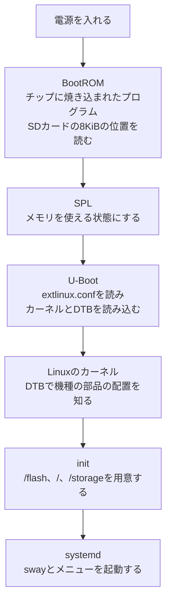
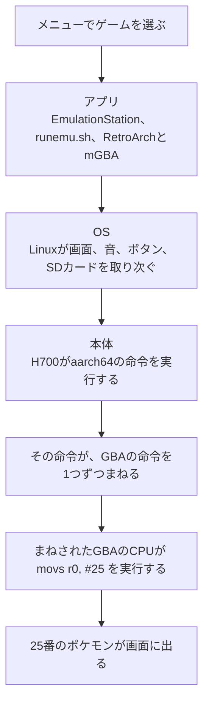

# RG40XXHで学ぶコンピュータの仕組み

この記事では、RG40XXHでゲームを遊ぶ流れを、目に見えるところから順にたどり、最後はCPUの命令まで降ります。コンピュータサイエンスを学んでいない読み手を想定し、用語は出てきたところで説明します。

仕組みの説明の多くは、ROCKNIXのソースコードを読んで確かめました。参照したのは、[ROCKNIX/distribution](https://github.com/ROCKNIX/distribution)のコミット `ae41127` です。ゲームの例には、自作のサンプル(このリポジトリの [examples](../examples/README.md))と、[pokeemerald-expansion](https://github.com/rh-hideout/pokeemerald-expansion)のコミット `dfb0f84` を使いました。実機での確認はまだしていません。実機で確かめるべき点は、本文の中でその都度書きます。

## 三つの層で見る

RG40XXHは、昔のゲーム機のふりができる、小さなコンピュータです。DSやPSPは、その機種のソフトしか動かない専用の機械でした。RG40XXHの中身は、スマートフォンに近い汎用の部品です。その上で、GBAやDSのふりをするソフトを動かして、昔のゲームを遊びます。

全体は、スマートフォンと同じように、三つの層に分けて考えると分かりやすくなります。

| 層 | スマートフォン | RG40XXH |
|---|---|---|
| アプリ | LINE、カメラ、ゲーム | ゲーム一覧のメニュー、エミュレーター、ゲームのファイル |
| OS | iOS、Android | Linux(純正のもの、またはROCKNIXなど) |
| 本体 | CPU、メモリ、画面 | CPUのH700、1GBのメモリ、4インチの画面、ボタン、Wi-Fi |

本体は手で触れる部品で、OSは部品をまとめて動かす基本のソフトです。アプリは、遊ぶために使うソフトにあたります。この記事は、上のアプリの層から始めて、OS、本体の順に降りていきます。

## OSはSDカードに入っている

RG40XXHには、内蔵のストレージがありません。掌机圈の仕様表でも、ストレージの欄はSDカードで、スロットは2つです([主要機種の違い](02-devices.md))。OSもゲームも、SDカードに入っています。

このため、カードを差し替えるだけで、OSが入れ替わります。純正のカードを抜いてROCKNIXを書き込んだカードを挿せば、ROCKNIXの機械として起動し、純正のカードに戻せば元どおりです。OSを入れ替えることを、CFW(カスタムファームウェア)と呼びます。[CFWを入れる手順](04-install-cfw.md)は、別のOSをSDカードに書き込む手順のことです。

## ゲームのファイルは数字の並び

ゲームのソフトは、写真や音楽と同じファイルです。ファイルの正体は0から255までの数が一列に並んだもので、この1つの数を1バイトと呼びます。

写真のファイルでは数字が色を表し、ゲームのファイルでは数字の多くがゲーム機への命令を表します。違いは、数字を誰がどう読むかだけです。ファイル名の末尾の `.gba` や `.jpg` は拡張子と呼び、数字の並びを何として読むかの目印になります。

## SDカードとファイルシステム

SDカードの中は、フォルダとファイルで整理されています。ROCKNIXでは、GBAのゲームを `/storage/roms/gba` に、ゲームボーイのゲームを `/storage/roms/gb` に置きます([gba.conf](https://github.com/ROCKNIX/distribution/blob/ae41127cee7e3e81b1ab3b17b676d91be5165e61/config/emulators/gba.conf)、[gb.conf](https://github.com/ROCKNIX/distribution/blob/ae41127cee7e3e81b1ab3b17b676d91be5165e61/config/emulators/gb.conf))。決まったフォルダに置く理由は、後で説明するメニューが、フォルダの名前で機種を判断するためです。

同じSDカードを、MacでもRG40XXHでも読めるのは、カードの中の整理の決まりを両方が知っているからです。この決まりを、ファイルシステムと呼びます。FAT32やexFATが代表的なものです。ROCKNIXは、2枚目のSDカードを、ext4、FAT32、exFATのどれでも認識します([CFWを入れる手順](04-install-cfw.md))。

## エミュレーターは通訳

RG40XXHの中には、GBAの部品は入っていません。GBAのゲームを動かしているのは、エミュレーターというソフトです。

ゲームのファイルの命令は、ゲーム機のCPUの言葉で書かれています。GBAのCPUはARM7TDMIで、pokeemerald-expansionもこのCPU向けにビルドする設定です([Makefile](https://github.com/rh-hideout/pokeemerald-expansion/blob/dfb0f84374230f4d462191601179b742f9f077df/Makefile))。RG40XXHのH700は、Cortex-A53です([H700のoptions](https://github.com/ROCKNIX/distribution/blob/ae41127cee7e3e81b1ab3b17b676d91be5165e61/projects/ROCKNIX/devices/H700/options))。どちらもARMの一族ですが、世代が違い、命令の言葉も違います。エミュレーターは、GBAの命令を1つずつ読み、H700の命令に訳しながら実行します。画面、音、ボタン、セーブ用のチップのふりも、エミュレーターの役目です。

訳しながら実行する分、元のゲーム機より速いCPUが必要です。GBAやゲームボーイは軽く、PSPのように新しい機種ほど重くなります。RG40XXHでの目安は、[何が動くか](06-emulation.md)にまとめています。

## ゲーム一覧のメニュー

電源を入れると出てくるゲーム一覧は、EmulationStationというアプリです。役目は受付係に近く、仕事は3つあります。ゲームを探すこと、一覧を見せること、選ばれたゲームを担当のエミュレーターに渡すことです。

受付係は、機種ごとの設定を集めた `es_systems.cfg` という名簿を使います。ROCKNIXは、機種ごとの設定ファイルから、この名簿をビルドの時に組み立てます([config/functions](https://github.com/ROCKNIX/distribution/blob/ae41127cee7e3e81b1ab3b17b676d91be5165e61/distributions/ROCKNIX/config/functions))。GBAの設定は次のとおりです。

```sh
SYSTEM_NAME="gba"
SYSTEM_FULLNAME="Game Boy Advance"
SYSTEM_PATH="/storage/roms/gba"
SYSTEM_EXTENSION=".gba .zip .7z"
```

`SYSTEM_PATH` が探すフォルダで、`SYSTEM_EXTENSION` が対象の拡張子です。ゲームボーイの設定では、拡張子は `.gb .gbc .zip .7z` に限られています。そのため、`coin.gb` を `roms/gba` に置いても、一覧には出ません。

名簿には、担当のエミュレーターの候補も入ります。H700向けのGBAでは、`mgba` が標準で、`vbam`、`vba_next`、`beetle_gba`、`skyemu`、`gpsp`、`mednafen` の `gba` が候補です([emulators/package.mk](https://github.com/ROCKNIX/distribution/blob/ae41127cee7e3e81b1ab3b17b676d91be5165e61/projects/ROCKNIX/packages/virtual/emulators/package.mk))。多くはRetroArchの上で動くコアです。RetroArchは、画面、音、ボタン、セーブのように、どの機種にも共通する仕事を受け持ちます。コアは、GBAのふりやゲームボーイのふりのように、機種ごとに違う部分だけを受け持つ部品です。

ゲームを選んでAボタンを押すと、メニューは名簿の命令の欄を埋めて、起動用のスクリプトを呼びます。

```sh
/usr/bin/runemu.sh %ROM% -P%SYSTEM% --core=%CORE% --emulator=%EMULATOR% --controllers="%CONTROLLERSCONFIG%"
```

[runemu.sh](https://github.com/ROCKNIX/distribution/blob/ae41127cee7e3e81b1ab3b17b676d91be5165e61/projects/ROCKNIX/packages/rocknix/sources/scripts/runemu.sh)は、性能やボタンの設定を整えたうえで、最終的にRetroArchを次の形で起動します。`-L` の後ろがコアのファイルで、最後がゲームのファイルです。

```sh
/usr/bin/${RABIN} -L /tmp/cores/${CORE}_libretro.so --config ${RETROARCH_TEMP_CONFIG} --appendconfig ${RETROARCH_APPEND_CONFIG} "${ROMNAME}"
```

## セーブの仕組み

セーブには2種類あります。ポケモンのレポートのように、ゲームが用意したセーブと、エミュレーターの機能で、いつでも状態を保存するステートセーブです。

ゲームのセーブを理解するには、カートリッジの中を知るのが近道です。カートリッジには、ゲーム本体が入った書き換えられないROMと、セーブを書くための別の記憶があります。ポケモン クリスタルは、カートリッジの種類を `MBC3+TIMER+RAM+BATTERY` と指定しています([pokecrystalのMakefile](https://github.com/pret/pokecrystal/blob/5beda23ffa505f62e1dad7e3d7c214d1737b3358/Makefile))。時計(TIMER)と、電池(BATTERY)で中身を保つRAMを積んだ種類です。エメラルドのソースには、1Mビット(128KB)のフラッシュメモリを扱う処理があり、セーブはそこに書かれます([agb_flash_1m.c](https://github.com/rh-hideout/pokeemerald-expansion/blob/dfb0f84374230f4d462191601179b742f9f077df/src/agb_flash_1m.c))。

RG40XXHには、セーブ用のチップがありません。エミュレーターは、セーブ用のチップのふりをして、中身をSDカードのファイルに書きます。RetroArchでは、このファイルの拡張子が `.srm` です([file_path_special.h](https://github.com/libretro/RetroArch/blob/015298c2e3bb7361207fc1098d3757f645e58595/file_path_special.h))。ゲームのファイルとセーブのファイルが分かれているので、セーブだけを別の機械に持っていけます。置き場所はOSや設定で変わるため、実機で確かめます。

ステートセーブは、その瞬間のメモリの中身などを、エミュレーターがまるごと保存したものです。戦闘中でも保存できる一方で、保存の形式がエミュレーターごとに違います。別のエミュレーターに持っていくなら、ゲームのセーブを使います。

### セーブの中身を覗く

このリポジトリの [gbdk-coin-plus](../examples/gbdk-coin-plus) は、最高点をセーブ用のRAMに保存するゲームで、`main.c` の保存の処理は次のとおりです。

```c
#define SAVE_MAGIC 0x4B

static void save_best(void) {
    ENABLE_RAM;
    *(uint8_t *)0xA000 = SAVE_MAGIC;
    *(uint8_t *)0xA001 = best;
    DISABLE_RAM;
}
```

1バイト目に目印の `0x4B`(75)を、2バイト目に最高点を書いています。新品のRAMは中身が決まっていないため、目印が75のときだけ、2バイト目を最高点として読みます。`Makefile` の `-Wm-yt0x1B` は、このカートリッジが電池つきのRAMを積むことを、ROMの中に書く設定です。エミュレーターは、これを読んでセーブ用のファイルを用意します。

エメラルドは、もっと慎重な作りです。[save.h](https://github.com/rh-hideout/pokeemerald-expansion/blob/dfb0f84374230f4d462191601179b742f9f077df/include/save.h)によると、セーブの領域は32個のセクターに分かれ、そのうち14個ずつを使う枠が2つあります(`NUM_SAVE_SLOTS 2`、`NUM_SECTORS_PER_SLOT 14`)。各セクターには、検算用のチェックサム、目印、書いた回数のカウンターが付きます。レポートを書くたびに2つの枠へ交互に書くので、書いている途中で電源が切れても、もう一方の枠に前回のレポートが残ります。

## OSの仕事

OSの役目は、ビルの管理会社に近いものです。アプリは画面やSDカードを直接は触らず、OSに頼みます。OSが間に入るので、複数のアプリが同時に画面を使おうとしても混乱しません。RetroArchがRG40XXHでもPCでも動くのも、機械ごとの違いをOSが吸収しているためです。

### メニューを起動する仕組み

電源を入れると、Linuxのカーネルが動き出し、systemdという起動の世話役が、決められた順にプログラムを起動します。H700のROCKNIXは、画面の管理にswayを使う設定です(`WINDOWMANAGER="swaywm-env"`)。swayを使う機種向けのメニューの起動設定は、[essway.service](https://github.com/ROCKNIX/distribution/blob/ae41127cee7e3e81b1ab3b17b676d91be5165e61/projects/ROCKNIX/packages/ui/emulationstation/system.d/essway.service)です。

```ini
[Unit]
Description=EmulationStation-with-Sway
Requires=sway.service
After=sway.service

[Service]
Environment=HOME=/storage
ExecStart=/usr/bin/start_es.sh
Restart=always
RestartSec=2
```

`After=sway.service` は、swayが起動してからメニューを起動する指定です。`Restart=always` と `RestartSec=2` により、メニューが落ちても、2秒後にsystemdが起動し直します。

### 書き換えられない場所と、自分の場所

ROCKNIXのファイルの置き場所は、3つに分かれています。起動の処理を書いた [init](https://github.com/ROCKNIX/distribution/blob/ae41127cee7e3e81b1ab3b17b676d91be5165e61/packages/sysutils/busybox/scripts/init) での扱いは、次の表のとおりです。

| 場所 | 中身 | 書き換え |
|---|---|---|
| `/flash` | SDカードの起動用の領域(FAT)。`KERNEL` と `SYSTEM` のファイルがある | 普段は読み取り専用 |
| `/` | `SYSTEM` というファイルの中身。OS本体、メニュー、RetroArchが入る | 読み取り専用 |
| `/storage` | SDカードのもう1つの領域(ext4)。ゲーム、セーブ、設定 | 書き換えられる |

OS本体を読み取り専用にしているので、設定を変えて動かなくなっても、OS本体は元のまま残ります。更新も、`SYSTEM` のファイルを差し替える形で済みます。メニューの設定にある `HOME=/storage` や、ゲームの置き場所の `/storage/roms` は、この「自分の場所」を指しています。初回の起動では、`/storage` の領域をカードの残りいっぱいまで広げる処理が動きます([fs-resize](https://github.com/ROCKNIX/distribution/blob/ae41127cee7e3e81b1ab3b17b676d91be5165e61/packages/sysutils/busybox/scripts/fs-resize))。

### 書き込みは溜めてから出す

OSは、SDカードへの書き込みを、メモリに溜めてからまとめて行うことがあります。SDカードへの書き込みは遅いので、まとめたほうが効率がよいためです。その代わり、溜めている間に電源が切れると、まだ書いていない分が失われます。

正しくシャットダウンすると、OSは溜めた分をすべて書き出してから電源を切ります。ROCKNIXの [update.sh](https://github.com/ROCKNIX/distribution/blob/ae41127cee7e3e81b1ab3b17b676d91be5165e61/projects/ROCKNIX/devices/H700/bootloader/update.sh) も、起動用の領域を書き換えたあと、`sync` で書き出してから読み取り専用に戻す作りです。遊び終わったら、ゲームを終了し、メニューからシャットダウンする習慣をつけておくと安全です。

## 電源を入れてから

電源を入れた直後は、何のプログラムも動いていません。OSを読み込むにはプログラムが必要ですが、そのプログラムもSDカードの中にあります。この問題を、小さなプログラムから大きなプログラムへ、順に役目を渡していく形で解決します。もう1つの制約として、電源を入れた直後は、1GBのメモリもまだ使えません。使える状態にするための手順が必要です。



### 見えない場所にある起動用のプログラム

ROCKNIXのイメージ作成のスクリプトは、H700用のU-Bootを、SDカードの先頭から8KiBの位置に、ファイルではなくそのまま書き込みます([bootloader/mkimage](https://github.com/ROCKNIX/distribution/blob/ae41127cee7e3e81b1ab3b17b676d91be5165e61/projects/ROCKNIX/bootloader/mkimage)の `bs=1K seek=8`)。U-Bootのソースでは、Allwinnerの起動用イメージの目印が `eGON.BT0` と定義されています([sunxi_image.h](https://github.com/u-boot/u-boot/blob/8d7bc8add17bbc69a58dfe0002eea039dd2dc1bc/include/sunxi_image.h))。

パーティションは、32768セクター目(16MiB)から始まります([distributions/ROCKNIX/options](https://github.com/ROCKNIX/distribution/blob/ae41127cee7e3e81b1ab3b17b676d91be5165e61/distributions/ROCKNIX/options)の `SYSTEM_PART_START=32768`)。起動用のプログラムは、その手前の、どのファイルシステムにも属さない場所にあります。MacのFinderでファイルをコピーしても、この場所は写りません。この調査では、同じ配置のダミーのイメージを作り、ファイルだけを写したカードでは8KiBの位置が空のままになることを確かめました。付属のSDカードを保存するときは、カードの先頭から最後までを丸ごと写します。

### dtb.imgの役目

カーネルは、DTB(デバイスツリー)を受け取って、画面やボタンがどこにつながっているかを知ります。ROCKNIXの1つのイメージは、H700を使う多くの機種に対応し、機種ごとのDTBを `device_trees` のフォルダに入れています([config.xml](https://github.com/ROCKNIX/distribution/blob/ae41127cee7e3e81b1ab3b17b676d91be5165e61/projects/ROCKNIX/config.xml))。U-Bootが読む `extlinux.conf` は、イメージ作成時に次の形で作られます。

```
LABEL ROCKNIX
  LINUX /KERNEL
  FDT /dtb.img
  APPEND boot=LABEL=ROCKNIX disk=LABEL=STORAGE ...
```

DTBは `dtb.img` という固定の名前で指定されています。起動前のソフトには、どの機種に挿されたかを知る手段がありません。そのため、[CFWを入れる手順](04-install-cfw.md)では、機種に合うDTBをコピーして `dtb.img` に名前を変えます。起動したあとは、更新のスクリプトが `/proc/device-tree/rocknix-dt-id` から機種を読み、`dtb.img` を自分で差し替えます(update.sh)。

`config.xml` には、RG40XX H用のDTBが `sun50i-h700-anbernic-rg40xx-h` と `sun50i-h700-anbernic-rg40xx-h-v2-panel` の2つあります。記事04が書いているRG35XXのrev6と同じように、画面の部品の版で分かれていると読めます。画面が乱れたときは、もう一方を試すことになりそうです。実機で確かめます。

イメージは、DDR3版とDDR4版の2種類が作られます。違いは、メモリを使える状態にするSPLを含んだU-Bootです(config.xml、update.sh)。RG40XXHのメモリはLPDDR4と記載されているため、DDR4版が合うはずですが、ダウンロードの前にROCKNIXの機種のページで確かめます。

### 止まった場所の見当をつける

起動の順番が分かると、うまく起動しないときに、どこで止まったかの見当がつきます。次の表は仕組みから考えた目安で、実機ではまだ確かめていません。

| 症状 | 止まった段階の見当 | 考えられる原因 |
|---|---|---|
| 画面が暗いまま何も起きない | BootROMからU-Bootまで | 書き込みの失敗、ファイルのコピーだけで作ったカード |
| 起動しているが画面が乱れる | カーネルとDTB | `dtb.img` の版が合っていない |
| ロゴは出るがメニューまで進まない | initからsystemdまで | `/storage` の用意やメニューの起動 |

## CPUがしていること

CPUは、命令を1つずつ読んで実行する作業員にたとえられます。今どの命令を読んでいるかの位置、数十個しかない手元の記憶(レジスタ)、作業台にあたるメモリを使い、命令を読む、意味を判断する、実行する、次へ進む、を繰り返します。1つの命令は、足す、比べる、メモリから数を読む、別の位置へ移る、といった小さな仕事です。

### 自作の関数の命令を見る

次の関数を、RG40XXHのCPU向け(aarch64)に変換しました。

```c
int add_coin(int score) {
    return score + 10;
}
```

変換後の命令は2つでした。

```
11002800    add  w0, w0, #0xa
d65f03c0    ret
```

`w0` はレジスタの0番で、点数が入っています。`#0xa` は16進数の10です。1つ目の命令は、`w0` に10を足して `w0` に戻します。2つ目は、呼び出し元に戻る命令です。左側の `11002800` が、この命令の本当の姿です。ゲームのファイルの数字の並びは、こうした命令を数字にしたものと、データでできています。

### 違うCPUの命令は実行できない

この調査で使った環境は、x86_64のCPUでした。aarch64向けに変換したプログラムをそのまま実行すると、Linuxは `Exec format error` を返して実行しません。qemuというエミュレーターを通すと、同じプログラムが動き、点数が10、20、30と表示されました。qemuがaarch64の命令をx86_64の命令に訳しながら実行したためです。RG40XXHのmGBAが、GBAの命令をH700の命令に訳すのも、同じ考え方です。

### 最初のポケモンが決まる命令

pokeemerald-expansionの `GetStarterPokemon` は、選んだボールの番号から、最初のポケモンの番号を返す関数です([starter_choose.c](https://github.com/rh-hideout/pokeemerald-expansion/blob/dfb0f84374230f4d462191601179b742f9f077df/src/starter_choose.c))。

```c
u16 GetStarterPokemon(u16 chosenStarterId)
{
    if (chosenStarterId > STARTER_MON_COUNT)
        chosenStarterId = 0;
    return sStarterMon[chosenStarterId];
}
```

1匹目をピカチュウ(番号25)に変えてビルドし、この関数の命令を取り出すと、次のようになりました。GBAのThumbという、1命令がおもに2バイトの命令です。

```
0403    lsls r3, r0, #16
0c1b    lsrs r3, r3, #16
2019    movs r0, #25
2b03    cmp  r3, #3
d803    bhi  (最後の命令へ)
4a02    ldr  r2, [表の位置]
005b    lsls r3, r3, #1
18d2    adds r2, r2, r3
8910    ldrh r0, [r2, #8]
4770    bx   lr
```

最初の2つの命令で、ボールの番号を `r3` に整えます。3つ目の `movs r0, #25` は、返す値の欄 `r0` に、先に25を入れておく命令です。番号が3より大きければ、そのまま25を返します。そうでなければ、表の位置を読み、番号を2倍して(1匹分が2バイトのため)、表から番号を取り出して `r0` に入れます。

`2019` という命令の数字のうち、下の `19` は16進数の25です。コンパイラが、番号が範囲外のときの答え、つまり表の0番目の値を、命令の中に直接書き込んでいました。改造前のビルドでは、ここがキモリの番号252(16進数のFC)でした。ゲームの中のピカチュウは、ROMの表の中の25と、命令に書き込まれた25という、数字として存在しています。

## 全体をつなげる

メニューでゲームを選んでから、最初のポケモンが画面に出るまでを、層ごとに並べると次のようになります。



## 確かめた環境

この記事の実験の環境は、x86_64のUbuntu 24.04です。aarch64向けの変換には `gcc-aarch64-linux-gnu` を、実行には `qemu-user` の `qemu-aarch64` を使いました。ポケモンのビルドは、pokeemerald-expansionの [INSTALL.md](https://github.com/rh-hideout/pokeemerald-expansion/blob/dfb0f84374230f4d462191601179b742f9f077df/INSTALL.md) のUbuntu向けの手順に従い、`make` で `pokeemerald.gba` を作りました。逆アセンブルの道具は、`aarch64-linux-gnu-objdump` と `arm-none-eabi-objdump` です。ビルドしたROMには任天堂の絵や音楽が含まれるため、配布しません。

## この記事で出てくる中国語

この記事の出典は、英語のソースコードが中心です。中国語は、このリポジトリのほかの記事で出典を確認した語から、この記事の話題に関わるものを載せます。

| 中国語 | ピンイン | 日本語の意味 | 出典 |
|---|---|---|---|
| 掌机 | zhǎngjī | 携帯ゲーム機 | [掌机圈](https://zhangjiquan.com/handhelds) |
| 操作系统 | cāozuò xìtǒng | OS | [RG-556](https://zhangjiquan.com/handheld/rg-556) |
| 模拟器 | mónǐqì | エミュレーター | [模拟器游戏 篇四](https://zhuanlan.zhihu.com/p/703325151) |
| 前端 | qiánduān | フロントエンド | [模拟器游戏 篇四](https://zhuanlan.zhihu.com/p/703325151) |
| 刷机 | shuā jī | 機器のOSを書き換えること | [百度の検索結果](https://www.baidu.com/s?wd=RG40XXH%20%E5%88%B7%E6%9C%BA%20%E5%9B%BA%E4%BB%B6%20Knulli%20%E6%95%99%E7%A8%8B) |
| 固件 | gùjiàn | ファームウェア | [百度の検索結果](https://www.baidu.com/s?wd=RG40XXH%20%E5%88%B7%E6%9C%BA%20%E5%9B%BA%E4%BB%B6%20Knulli%20%E6%95%99%E7%A8%8B) |
| TF卡 | TF kǎ | microSDカード | [百度の検索結果](https://www.baidu.com/s?wd=RG40XXH%20%E5%88%B7%E6%9C%BA%20%E5%9B%BA%E4%BB%B6%20Knulli%20%E6%95%99%E7%A8%8B) |

## 学べること

ゲームを遊ぶ流れをたどると、アプリ、OS、本体の役割の違いが見えてきます。メニューは設定ファイルの名簿でゲームを探し、エミュレーターは別のCPUの命令を訳して実行する役目です。OSは部品と保存場所を管理し、起動のときは小さなプログラムから順に役目を渡します。その下でCPUが、数字で書かれた命令を1つずつ実行しているわけです。自作のゲームも、正しいフォルダに正しい拡張子で置けば、市販のゲームと同じ流れで起動します。作り方は [自作ゲームを作る方法](14-making-games.md) で扱っています。
