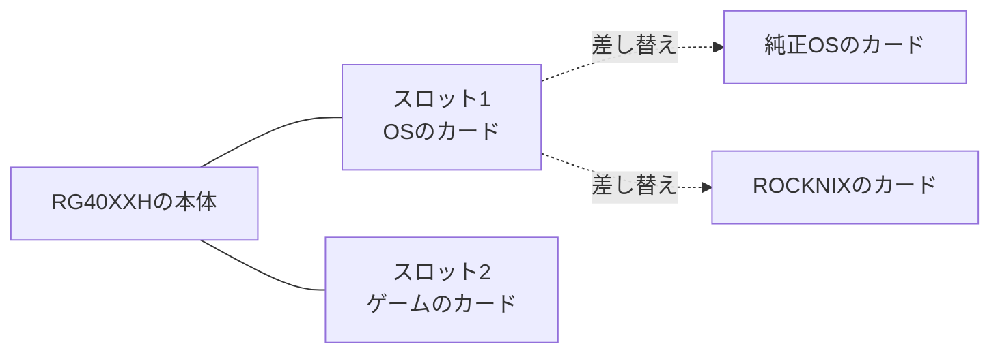
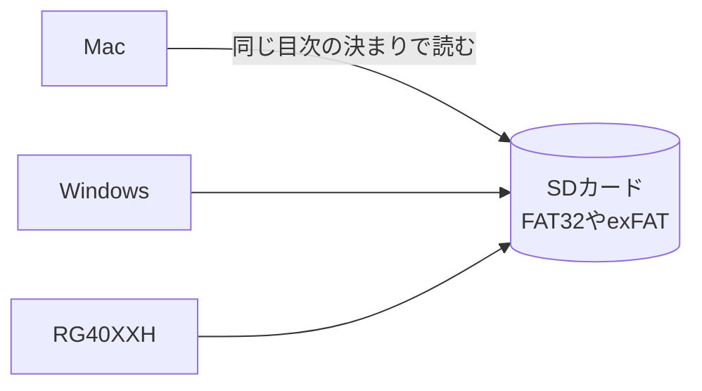

# RG40XXHの全体像

この記事から20番までの6本は、RG40XXHでゲームを遊ぶ流れを、目に見えるところから順にたどる連載です。コンピュータサイエンスを学んでいない読み手を想定し、用語は出てきたところで説明します。この記事では、機械の全体を三つの層に分けて眺め、ゲームのファイルとSDカードの中身までを扱います。

| 番号 | 記事 | 扱う層 |
|---|---|---|
| 15 | RG40XXHの全体像(この記事) | 全体、ファイル、SDカード |
| 16 | [エミュレーターとメニュー](16-emulator-and-menu.md) | アプリ |
| 17 | [セーブの仕組み](17-save-data.md) | アプリとファイル |
| 18 | [OSの仕組み](18-os.md) | OS |
| 19 | [電源を入れてから](19-boot.md) | OSと本体の境目 |
| 20 | [CPUと機械語](20-cpu.md) | 本体 |

仕組みの説明は、ROCKNIXのソースコードを読んで確かめました。参照したのは、[ROCKNIX/distribution](https://github.com/ROCKNIX/distribution)のコミット `ae41127` です。実機での確認はまだしていません。実機で確かめるべき点は、本文の中でその都度書きます。

## 昔のゲーム機との違い

GBAやDS、PSPは、その機種のソフトを動かすために作られた専用の機械でした。カートリッジやUMDを差し込むと、本体の中の専用の部品が、ソフトを読んで動かします。

RG40XXHは作りが違います。中身は、スマートフォンに近い汎用の部品です。GBAの部品もDSの部品も入っていません。その代わりに、GBAやDSのふりをするソフトを動かして、昔のゲームを遊びます。昔のゲーム機のふりができる小さなコンピュータ、と考えると近いでしょう。

部品の主な仕様は、[主要機種の違い](02-devices.md)にまとめた掌机圈の数値で次のとおりです。

| 項目 | RG40XXH |
|---|---|
| 画面 | 4.0インチ、縦横比4:3 |
| SoC(CPUなどをまとめたチップ) | Allwinner H700 |
| メモリ | 1GB LPDDR4 |
| ストレージ | SDカード(スロットは2つ) |
| 無線 | Wi-Fi 5、Bluetooth 4.2 |
| 重さ | 208g |

## 三つの層で見る

コンピュータは、三つの層に分けて考えると分かりやすくなります。スマートフォンと並べると、次のようになります。

| 層 | スマートフォン | RG40XXH |
|---|---|---|
| アプリ | LINE、カメラ、ゲーム | ゲーム一覧のメニュー、エミュレーター、ゲームのファイル |
| OS | iOS、Android | Linux(純正のもの、またはROCKNIXなど) |
| 本体 | CPU、メモリ、画面 | H700、1GBのメモリ、4インチの画面、ボタン、Wi-Fi |

下の層ほど、機械に近い層です。

- 本体は、手で触れる部品の集まりです。
- OSは、部品をまとめて動かす基本のソフトです。画面に何を出すか、電池をどう使うか、SDカードのどこに何を書くかを管理しています。
- アプリは、遊ぶために使うソフトです。RG40XXHでは、ゲームの一覧を出すメニューと、昔のゲーム機のふりをするエミュレーターが中心になります。

上の層は、下の層に支えられて動いています。メニューはOSに画面を出してもらい、OSは本体の部品に命令を送ります。連載は、この順番で上から降りていく構成です。

## OSはSDカードに入っている

スマートフォンでは、OSは本体の中の記憶の部品に入っています。RG40XXHには、内蔵のストレージがありません。OSもゲームも、SDカードに入っています。

このため、カードを差し替えるだけで、OSが入れ替わります。純正のカードを抜いてROCKNIXを書き込んだカードを挿せば、ROCKNIXの機械として起動し、純正のカードに戻せば元の機械に戻る仕組みです。



OSを入れ替えることや、入れ替えるためのOSを、CFW(カスタムファームウェア)と呼びます。[CFWを入れる手順](04-install-cfw.md)は、別のOSをSDカードに書き込む手順のことです。失敗しても、本体の部品が壊れるわけではありません。カードを書き直せば、やり直せます。この性質は、OSを学ぶ教材として大きな利点です。

2枚のカードの使い分けとしては、1枚目をOS用、2枚目をゲーム用にする形が考えられます。ROCKNIXは、2枚目のSDカードを、ext4、FAT32、exFATのどれでも起動時に認識します([CFWを入れる手順](04-install-cfw.md))。ゲームを入れ替えるときに、OSのカードを触らずに済みます。

## ゲームのファイルは数字の並び

ゲームのソフトは、写真や音楽と同じファイルです。ファイルの正体は0から255までの数が一列に並んだもので、この1つの数を1バイトと呼びます。

| ファイル | 数字が表しているもの | 読むもの |
|---|---|---|
| 写真(`.jpg`) | 点の色 | 写真のアプリ |
| 音楽(`.mp3`) | 音の波の形 | 音楽のアプリ |
| ゲーム(`.gba`) | ゲーム機への命令と、絵や文字などのデータ | GBA、またはGBAのふりをするエミュレーター |

ファイルの種類が違っても、中身はどれも数字の並びです。違いは、数字を誰がどう読むかだけです。ファイル名の末尾の `.gba` や `.jpg` は拡張子と呼び、数字の並びを何として読むかの目印になります。

ゲームのファイルは、人が書いた設計図から作られます。このリポジトリの [gbdk-coin](../examples/gbdk-coin) では、`main.c` という文章が、その設計図です。`main.c` は人が読めるC言語で書かれ、変換の道具(コンパイラ)を通すと、ゲームボーイが読める数字の並び `coin.gb` になります。変換の中身は、[CPUと機械語](20-cpu.md)で扱います。

## SDカードの中のフォルダ

SDカードの中を整理しているのは、フォルダとファイルです。本棚にたとえると、SDカードが本棚、フォルダが仕切り、ファイルが本です。

ROCKNIXでは、ゲームを機種ごとのフォルダに分けて置きます。GBAのゲームは `/storage/roms/gba`、ゲームボーイのゲームは `/storage/roms/gb` です([gba.conf](https://github.com/ROCKNIX/distribution/blob/ae41127cee7e3e81b1ab3b17b676d91be5165e61/config/emulators/gba.conf)、[gb.conf](https://github.com/ROCKNIX/distribution/blob/ae41127cee7e3e81b1ab3b17b676d91be5165e61/config/emulators/gb.conf))。

```
/storage/roms/
├── gb/
│   └── coin.gb
├── gba/
│   └── (GBAのゲーム)
└── ports/
    └── (PortMasterのゲームの起動スクリプト)
```

決まったフォルダに置く理由は、ゲームの一覧を出すメニューが、フォルダの場所でゲーム機の種類を判断するためです。違うフォルダに置いたゲームは、一覧に出ないか、正しく開けません。仕組みは [エミュレーターとメニュー](16-emulator-and-menu.md) で説明します。

先頭の `/storage` は、OSの中から見た場所の名前です。SDカードの中の、書き換えてよい領域を指しています。なぜ「書き換えてよい領域」と「そうでない領域」があるのかは、[OSの仕組み](18-os.md)で扱います。純正のOSでのフォルダの名前は、実機で確かめる予定です。

## 同じカードをMacでもRG40XXHでも読める理由

SDカードの中には、どのファイルがカードのどこにあるかを記録した目次があります。目次の書き方の決まりを、ファイルシステムと呼びます。FAT32やexFATが代表的なもので、Mac、Windows、Linuxのどれもが知っている書き方です。



デジタルカメラのSDカードをパソコンで読めるのと同じ理由です。ただし、ファイルシステムには種類があり、どのOSでも読めるとは限りません。たとえばROCKNIXがOSの領域に使うext4は、Macでは標準では読めません([CFWを入れる手順](04-install-cfw.md))。

## 遊ぶまでの流れ

電源を入れてからゲームを遊ぶまでの流れを、層と結びつけると次のようになります。それぞれの段階を、続きの記事で一つずつ掘り下げます。

| 段階 | 起きていること | 詳しい記事 |
|---|---|---|
| 電源を入れる | 小さなプログラムから順にOSを読み込む | [電源を入れてから](19-boot.md) |
| メニューが出る | OSがメニューのアプリを起動する | [OSの仕組み](18-os.md) |
| ゲームを選ぶ | メニューがフォルダを調べて一覧を作り、担当のエミュレーターに渡す | [エミュレーターとメニュー](16-emulator-and-menu.md) |
| 遊ぶ | エミュレーターがゲーム機のふりをして、命令を実行する | [CPUと機械語](20-cpu.md) |
| セーブする | エミュレーターがセーブの内容をファイルに書く | [セーブの仕組み](17-save-data.md) |

## この記事で出てくる中国語

中国語は、このリポジトリのほかの記事で出典を確認した語から、この記事の話題に関わるものを選びました。

| 中国語 | ピンイン | 日本語の意味 | 出典 |
|---|---|---|---|
| 掌机 | zhǎngjī | 携帯ゲーム機 | [掌机圈](https://zhangjiquan.com/handhelds) |
| 处理器 | chǔlǐqì | プロセッサー(SoC) | [RG-406V](https://zhangjiquan.com/handheld/rg-406v) |
| 内存 | nèicún | メモリ | [掌机圈 RG-35XX H](https://zhangjiquan.com/handheld/rg-35xx-h) |
| 存储 | cúnchǔ | ストレージ | [掌机圈 RG-35XX H](https://zhangjiquan.com/handheld/rg-35xx-h) |
| 操作系统 | cāozuò xìtǒng | OS | [RG-556](https://zhangjiquan.com/handheld/rg-556) |
| TF卡 | TF kǎ | microSDカード | [百度の検索結果](https://www.baidu.com/s?wd=RG40XXH%20%E5%88%B7%E6%9C%BA%20%E5%9B%BA%E4%BB%B6%20Knulli%20%E6%95%99%E7%A8%8B) |
| 根目录 | gēnmùlù | ルートフォルダ | [模拟器游戏 篇四](https://zhuanlan.zhihu.com/p/703325151) |

## 学べること

RG40XXHを、本体、OS、アプリの三つの層に分けると、それぞれの部品やソフトの役割が見えてきます。OSがSDカードに入っているので、カードを差し替えて違うOSを試し、同じ本体がどう変わるかを比べられます。ファイルが数字の並びであること、フォルダの場所と拡張子が意味を持つこと、ファイルシステムが機械の間の共通の決まりであることは、この先のすべての記事の前提です。次の [エミュレーターとメニュー](16-emulator-and-menu.md) では、アプリの層を掘り下げます。
