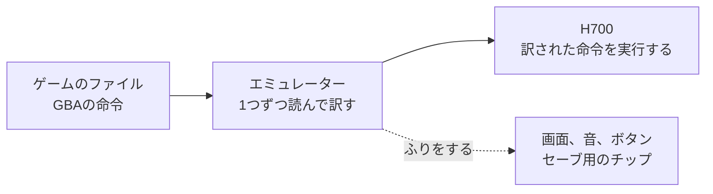
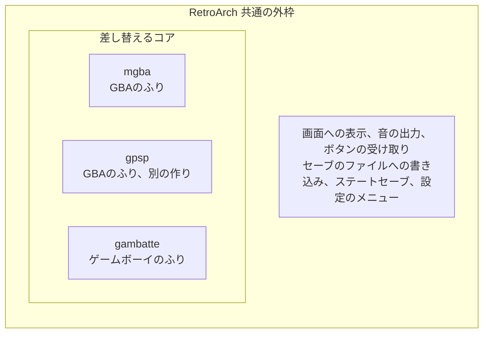
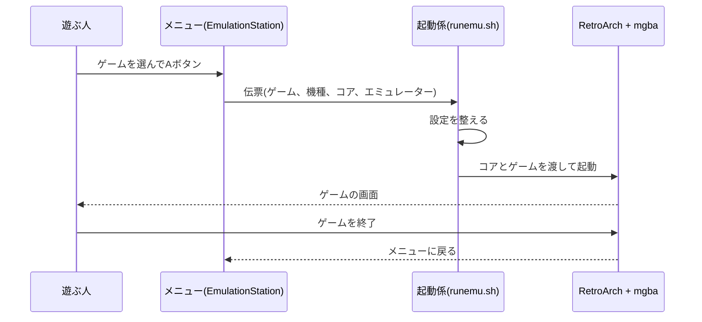

# エミュレーターとメニュー

[RG40XXHの全体像](15-rg40xxh-big-picture.md)の続きです。この記事では、三つの層のうち、いちばん上のアプリの層を扱います。ゲームの一覧を出すメニューが、どうやってゲームを見つけ、どのエミュレーターに渡しているのかを、ROCKNIXのソースコード(コミット `ae41127`)で確かめながら説明します。

## エミュレーターは通訳

RG40XXHの中には、GBAの部品は入っていません。GBAのゲームを動かしているのは、エミュレーターというソフトです。

ゲームのファイルに入っている命令は、そのゲーム機のCPUの言葉で書かれています。GBAのCPUはARM7TDMIで、[pokeemerald-expansion](https://github.com/rh-hideout/pokeemerald-expansion/blob/dfb0f84374230f4d462191601179b742f9f077df/Makefile)もこのCPU向けにビルドする設定です。RG40XXHのH700はCortex-A53です([H700のoptions](https://github.com/ROCKNIX/distribution/blob/ae41127cee7e3e81b1ab3b17b676d91be5165e61/projects/ROCKNIX/devices/H700/options))。どちらもARMの一族ですが、世代が違い、命令の言葉も違います。そのままでは、H700はGBAの命令を読めません。

エミュレーターは、この間に入る同時通訳にあたります。



エミュレーターが訳すのは、CPUの命令だけではありません。GBAの画面の描き方、音の出し方、ボタンの読み取り方、セーブ用のチップへの書き込みまで、GBAの部品のふりをすべて引き受けます。ゲームの側は、自分が本物のGBAの中で動いていると思って動きます。

## 訳す手間と、機種ごとの重さ

通訳には、手間がかかるものです。本物のGBAが1回で済ませる仕事を、エミュレーターは何回もの作業でまねします。そのため、元のゲーム機よりずっと速いCPUが必要です。

一般に、まねをするゲーム機が新しく複雑になるほど、エミュレーターは重くなります。GBAやゲームボーイは軽く、3Dの映像を描くPSPは重い部類です。RG40XXHでの目安は、[何が動くか](06-emulation.md)と[主要機種の違い](02-devices.md)にまとめています。そこで引いた資料では、FC、SFC、GBA、GB、PS1は問題なく動き、PSPとN64は一部が遊べる程度とされています。

## ゲーム一覧のメニュー

電源を入れると出てくるゲーム一覧は、EmulationStationというアプリです。ROCKNIXは、自分たちが手を入れた [emulationstation-next](https://github.com/ROCKNIX/emulationstation-next) を使っています([emulationstationのpackage.mk](https://github.com/ROCKNIX/distribution/blob/ae41127cee7e3e81b1ab3b17b676d91be5165e61/projects/ROCKNIX/packages/ui/emulationstation/package.mk))。

メニューの仕事は、図書館の受付係に近いものです。仕事は3つあります。

1. 決められたフォルダを調べて、ゲームのファイルを探す
2. 見つかったゲームを、機種ごとに一覧にして見せる
3. 選ばれたゲームを、担当のエミュレーターに渡す

受付係は、仕事のための名簿を1つ持っています。

## 受付係の名簿

名簿の名前は `es_systems.cfg` です。ROCKNIXは、機種ごとの設定ファイルを集めて、この名簿をビルドのときに組み立てます([config/functions](https://github.com/ROCKNIX/distribution/blob/ae41127cee7e3e81b1ab3b17b676d91be5165e61/distributions/ROCKNIX/config/functions)の `add_es_system`)。GBAの設定ファイルは次のとおりです([gba.conf](https://github.com/ROCKNIX/distribution/blob/ae41127cee7e3e81b1ab3b17b676d91be5165e61/config/emulators/gba.conf))。

```sh
SYSTEM_NAME="gba"
SYSTEM_FULLNAME="Game Boy Advance"
SYSTEM_MANUFACTURER="Nintendo"
SYSTEM_RELEASE="2001"
SYSTEM_HARDWARE="portable"
SYSTEM_PATH="/storage/roms/gba"
SYSTEM_EXTENSION=".gba .zip .7z"
SYSTEM_PLATFORM="gba"
SYSTEM_THEME="gba"
```

| 項目 | 意味 |
|---|---|
| `SYSTEM_FULLNAME` | メニューに出る機種の名前 |
| `SYSTEM_PATH` | ゲームを探すフォルダ |
| `SYSTEM_EXTENSION` | ゲームとして扱うファイルの拡張子 |
| `SYSTEM_THEME` | メニューの見た目に使うテーマ |

`add_es_system` は、これらの値から、名簿の1機種分を次の形で書き出します。

```xml
<system>
  <name>gba</name>
  <fullname>Game Boy Advance</fullname>
  <path>/storage/roms/gba</path>
  <extension>.gba .zip .7z</extension>
  <command>/usr/bin/runemu.sh %ROM% -P%SYSTEM% --core=%CORE% --emulator=%EMULATOR% --controllers="%CONTROLLERSCONFIG%"</command>
  ...
</system>
```

ゲームボーイの設定([gb.conf](https://github.com/ROCKNIX/distribution/blob/ae41127cee7e3e81b1ab3b17b676d91be5165e61/config/emulators/gb.conf))では、フォルダが `/storage/roms/gb`、拡張子が `.gb .gbc .zip .7z` です。この2つの設定から、次のことが分かります。

- `coin.gb` を `roms/gba` に置いても、一覧に出ません。GBAの名簿の拡張子に `.gb` がないためです。
- `.zip` や `.7z` で圧縮したままでも、ゲームとして扱われます。
- フォルダの名前と拡張子の両方が合って、はじめてゲームとして一覧に並びます。

PortMasterのゲームの棚は、少し毛色が違います([ports.conf](https://github.com/ROCKNIX/distribution/blob/ae41127cee7e3e81b1ab3b17b676d91be5165e61/config/emulators/ports.conf))。フォルダは `/storage/roms/ports`、拡張子は `.sh .appimage` で、ゲームのファイルではなく、起動用のスクリプトを並べる棚です。エミュレーターを通さずに動くゲームは、ここに並びます。

## 担当のエミュレーターを決める

名簿には、機種ごとに担当のエミュレーターの候補も書かれます。H700のGBAでは、次の候補が登録されます([emulators/package.mk](https://github.com/ROCKNIX/distribution/blob/ae41127cee7e3e81b1ab3b17b676d91be5165e61/projects/ROCKNIX/packages/virtual/emulators/package.mk))。

| エミュレーター | コア | 標準 |
|---|---|---|
| retroarch | mgba | 標準 |
| retroarch | vbam、vba_next、beetle_gba、skyemu | |
| retroarch | gpsp(H700などの機種で追加) | |
| mednafen | gba(H700などの機種で追加) | |

ゲームボーイでは、`retroarch` の `gambatte` が標準で、`sameboy`、`gearboy`、`mgba` などが候補です。標準でないものは、メニューの設定で、機種ごとやゲームごとに選び直せます。

ここで出てくるRetroArchとコアの関係は、次の図のようになっています。



RetroArchは、どのゲーム機にも共通する仕事を引き受ける外枠です。ROCKNIXが使っている版は、v1.22.2に修正を加えたものです([retroarchのpackage.mk](https://github.com/ROCKNIX/distribution/blob/ae41127cee7e3e81b1ab3b17b676d91be5165e61/projects/ROCKNIX/packages/emulators/libretro/retroarch/package.mk))。コアは、ゲーム機ごとに違う部分だけを受け持つ部品で、外枠に差し込んで使います。同じ外枠を使うので、どの機種のゲームでも、ボタンの割り当てやセーブの扱いがそろいます。

エミュレーターの中には、RetroArchを使わない単独のものもあり、H700向けの設定では、DSは `drastic-sa`、PSPは `ppsspp-sa` が標準です(emulators/package.mk)。末尾の `-sa` は standalone(単独)の略で、RetroArchの外で動くエミュレーターを指します。DSでは、RetroArchのコアの `melonds` や `desmume` も候補に入っています。

## Aボタンを押したあとに起きること

ゲームを選んでAボタンを押すと、受付係は名簿の `<command>` の欄にある `%ROM%` や `%CORE%` を、選ばれたゲームとコアで埋める仕組みです。伝票に記入するようなものです。

```sh
/usr/bin/runemu.sh /storage/roms/gba/game.gba -Pgba --core=mgba --emulator=retroarch --controllers="..."
```

この伝票は、起動係の [runemu.sh](https://github.com/ROCKNIX/distribution/blob/ae41127cee7e3e81b1ab3b17b676d91be5165e61/projects/ROCKNIX/packages/rocknix/sources/scripts/runemu.sh) が受け取ります。runemu.shは、伝票からコアとエミュレーターの名前を読み取ります。

```sh
CORE="${ARGUMENTS##*--core=}"  # read from --core= onwards
CORE="${CORE%% *}"  # until a space is found
EMULATOR="${ARGUMENTS##*--emulator=}"  # read from --emulator= onwards
EMULATOR="${EMULATOR%% *}"  # until a space is found
```

続いて、ゲームごとの設定を読み、CPUの動かし方や冷却の設定などを整えます。エミュレーターが `retroarch` なら、最終的に起動するのは次の形のRetroArchです。`-L` の後ろが差し込むコアのファイル、最後の `"${ROMNAME}"` が遊ぶゲームのファイルです。

```sh
/usr/bin/${RABIN} -L /tmp/cores/${CORE}_libretro.so --config ${RETROARCH_TEMP_CONFIG} --appendconfig ${RETROARCH_APPEND_CONFIG} "${ROMNAME}"
```

全体の流れを、図にまとめました。



## 自作ゲームを一覧に並べるには

自作のゲームも、同じ名簿の決まりに従えば、市販のゲームと同じように一覧に並びます。

| 自作ゲーム | 置くフォルダ | 拡張子 | 起動のされ方 |
|---|---|---|---|
| [gbdk-coin](../examples/gbdk-coin) の `coin.gb` | `/storage/roms/gb` | `.gb` | RetroArchとゲームボーイのコアで開く |
| [love2d-coin](../examples/love2d-coin) をPortMaster向けにしたもの | `/storage/roms/ports` | `.sh` | 起動スクリプトをそのまま実行する |

PortMaster向けの起動スクリプトの書き方は、[自作ゲームを作る方法](14-making-games.md)にまとめています。実機で一覧に出るかどうかは、まだ確かめていません。

## この記事で出てくる中国語

中国語は、このリポジトリのほかの記事で出典を確認した語から、この記事の話題に関わるものを選びました。

| 中国語 | ピンイン | 日本語の意味 | 出典 |
|---|---|---|---|
| 模拟器 | mónǐqì | エミュレーター | [模拟器游戏 篇四](https://zhuanlan.zhihu.com/p/703325151) |
| 模拟器支持 | mónǐqì zhīchí | エミュレーターの対応状況 | [RG-556](https://zhangjiquan.com/handheld/rg-556) |
| 前端 | qiánduān | フロントエンド | [模拟器游戏 篇四](https://zhuanlan.zhihu.com/p/703325151) |
| 配置 | pèizhì | 設定 | [天马G前端的使用](https://blog.csdn.net/fanged/article/details/152960565) |
| 启动脚本 | qǐdòng jiǎoběn | 起動スクリプト | [天马G前端的使用](https://blog.csdn.net/fanged/article/details/152960565) |
| 封面 | fēngmiàn | カバー画像 | [模拟器游戏 篇四](https://zhuanlan.zhihu.com/p/703325151) |

ゲームの一覧を出すメニューは、中国語圏では「前端」(フロントエンド)と呼ばれます。中国語圏で広く使われる天马Gも、同じ役目のアプリです([フロントエンドと天馬G](05-frontend-tianma-g.md))。

## 学べること

メニューは、名簿の設定ファイルに書かれた「フォルダ、拡張子、担当のエミュレーター」に従って動いています。ゲームが一覧に出ないときは、置いたフォルダと拡張子を確かめれば、たいてい原因が分かります。エミュレーターは、ゲーム機の命令を訳し、部品のふりをするソフトで、RetroArchという外枠とコアという部品に分かれた作りです。次の [セーブの仕組み](17-save-data.md) では、エミュレーターがゲームのセーブをどう扱っているかを見ます。
