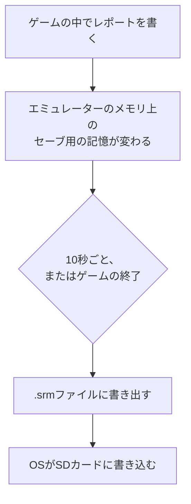
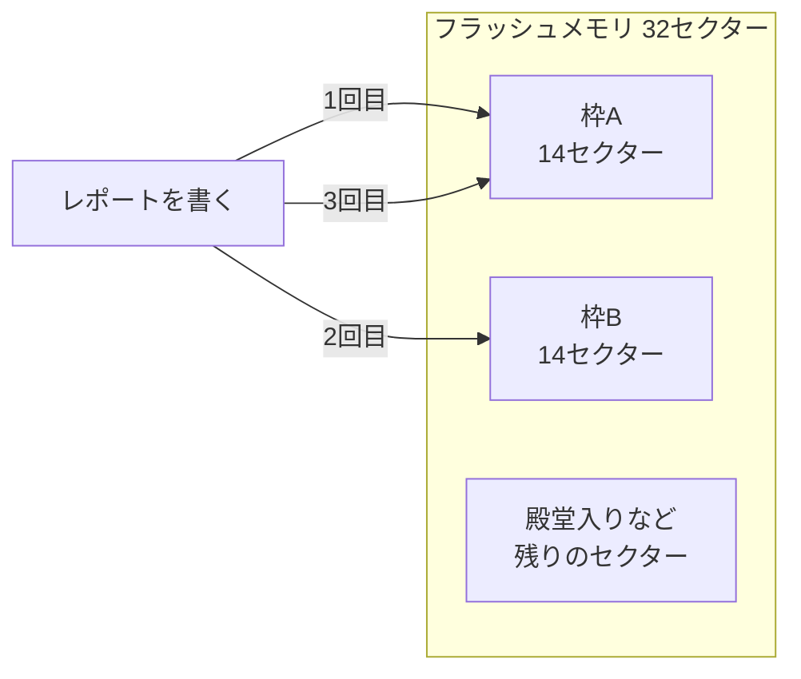

# セーブの仕組み

[エミュレーターとメニュー](16-emulator-and-menu.md)の続きです。この記事では、ゲームのセーブが、本物のカートリッジではどこに残り、RG40XXHではどのファイルになるのかを扱います。最後に、自作のゲームとポケモン エメラルドのセーブの中身を、ソースコードで確かめます。

## セーブは2種類ある

遊ぶ人から見たセーブは、2種類です。

| | ゲームのセーブ | ステートセーブ |
|---|---|---|
| やり方 | ポケモンなら「レポートを書く」 | エミュレーターのメニューから |
| 誰の機能か | ゲーム | エミュレーター |
| 本物のゲーム機にあるか | ある | ない |
| いつ保存できるか | ゲームが許す場面だけ | いつでも(戦闘中でも) |

2つの違いを理解するには、本物のカートリッジの中を知るのが近道です。

## カートリッジの中の2種類の記憶

カートリッジには、性質の違う2種類の記憶があります。

| 記憶 | 中身 | 書き換え |
|---|---|---|
| ROM | ゲーム本体(命令、絵、音、文字) | できない |
| セーブ用の記憶 | セーブの内容 | できる |

ROMは Read Only Memory の略で、「読むだけの記憶」という意味です。ゲームのファイルを「ROM」と呼ぶのは、ここから来ています。何回遊んでも、ROMの中身は1バイトも変わりません。ゲームの中で何かが変わったことを残すには、書き換えられる別の記憶が要ります。

セーブ用の記憶の作りは、ゲームによって違います。以下は、ソースコードから確かめられる2つの例です。

- ポケモン クリスタルは、カートリッジの種類を `MBC3+TIMER+RAM+BATTERY` と指定しています([pokecrystalのMakefile](https://github.com/pret/pokecrystal/blob/5beda23ffa505f62e1dad7e3d7c214d1737b3358/Makefile))。時計(TIMER)と、電池(BATTERY)で中身を保つRAMを積む種類です。RAMは電気が来ている間だけ中身を覚えている記憶なので、電池が中身を支えています。
- ポケモン エメラルドのソースには、1Mビット(128KB)のフラッシュメモリを扱う処理があり、セーブはそこに書かれます([agb_flash_1m.c](https://github.com/rh-hideout/pokeemerald-expansion/blob/dfb0f84374230f4d462191601179b742f9f077df/src/agb_flash_1m.c))。フラッシュメモリは、電気が来ていなくても中身を覚えています。

## RG40XXHでは、セーブ用の記憶がファイルになる

RG40XXHには、セーブ用のチップがありません。そこでエミュレーターは、セーブ用の記憶のふりをします。ゲームが「セーブ用の記憶に書き込め」と命令すると、エミュレーターはその内容を、SDカードのファイルに書き出します。

RetroArchでは、このファイルの拡張子が `.srm` です([file_path_special.h](https://github.com/libretro/RetroArch/blob/015298c2e3bb7361207fc1098d3757f645e58595/file_path_special.h)の `FILE_PATH_SRM_EXTENSION`)。ファイルの名前は、ゲームのファイルと同じ名前で、拡張子だけが変わります。

### 置き場所はゲームの隣

ROCKNIXのH700向けのRetroArchの設定([retroarch.cfg](https://github.com/ROCKNIX/distribution/blob/ae41127cee7e3e81b1ab3b17b676d91be5165e61/projects/ROCKNIX/packages/emulators/libretro/retroarch/sources/H700/retroarch.cfg))には、次の行があります。

```ini
savefile_directory = "~/.config/retroarch/saves"
savefiles_in_content_dir = "true"
```

`savefiles_in_content_dir` が `true` なので、セーブのファイルは、ゲームのファイルと同じフォルダに置かれる設定です。ステートセーブの置き場所は、起動のたびに設定を整えるスクリプトが、`/storage/roms/savestates/` の下の機種ごとのフォルダに決めています([setsettings.sh](https://github.com/ROCKNIX/distribution/blob/ae41127cee7e3e81b1ab3b17b676d91be5165e61/projects/ROCKNIX/packages/rocknix/sources/scripts/setsettings.sh)の `SNAPSHOTS="${ROMS_DIR}/savestates"`)。設定どおりなら、GBAのゲームを1本遊んだあとのフォルダは、次のようになるはずです。

```
/storage/roms/
├── gba/
│   ├── game.gba        ゲーム本体。遊んでも変わらない
│   └── game.srm        ゲームのセーブ。レポートを書くたびに変わる
└── savestates/
    └── gba/            ステートセーブ
```

実際のファイル名とフォルダは、実機で確かめます。

### ゲームとセーブが分かれている利点

ゲームとセーブが別のファイルなので、次のことができます。

- セーブだけをMacにコピーして、バックアップを取る
- `.srm` をゲームと一緒に別の機械へ移し、続きから遊ぶ
- ゲームのファイルを入れ直しても、セーブはそのまま残る

## ステートセーブは作業台の写真

ステートセーブは、ゲームのセーブとは仕組みがまったく違うものです。

ゲームのセーブは、ゲームが「残すべき情報」を選んで、セーブ用の記憶に書くものです。手持ちのポケモン、いる場所、持っているバッジのように、ゲームの作り手が決めた情報だけが残ります。

ステートセーブは、エミュレーターが、その瞬間のゲーム機の中身をまるごと保存するものです。メモリの中身、画面と音の状態、CPUが次に実行する命令の位置まで含みます。作業台の上を写真に撮っておき、あとで写真のとおりに並べ直すようなものです。だから、戦闘の途中からでも再開できます。

| | ゲームのセーブ | ステートセーブ |
|---|---|---|
| 別のエミュレーターで読めるか | 読める | 多くの場合、読めない(保存の形式がエミュレーターごとに違う) |
| エミュレーターを更新しても読めるか | 読める | 読めなくなることがある |
| 本物のカートリッジに戻せるか | 吸い出しの機器があれば戻せる | 戻せない |

長く残したい進行はゲームのセーブで残し、ステートセーブは少しの中断に使う、という使い分けが安全です。

## 書いたはずのセーブが消える理由

レポートを書いたのに、次に起動したら消えていた、ということが起こり得ます。原因は、書き込みのタイミングにあります。

RetroArchのソースの説明では、`autosave_interval` は、セーブ用の記憶を一定の間隔でファイルに書き出す間隔(秒)です。0にすると、この自動の書き出しは止まります([config.def.h](https://github.com/libretro/RetroArch/blob/015298c2e3bb7361207fc1098d3757f645e58595/config.def.h))。ROCKNIXのH700向けの設定では、この値は10です(retroarch.cfg の `autosave_interval = "10"`)。



レポートを書いた直後に電源を切ると、ファイルへの書き出しがまだ済んでいない場合があります。さらに、OSもSDカードへの書き込みを少し溜めてから行います。OSの側の事情は、[OSの仕組み](18-os.md)で扱う話題です。遊び終わったら、ゲームをメニューから終了し、シャットダウンしてから電源を切る習慣をつけておくと安全です。

## セーブの中身を覗く

セーブのファイルも、中身は数字の並びになっています。中身が分かりやすい例を2つ見ます。

### 自作のゲームのセーブは2バイト

このリポジトリの [gbdk-coin-plus](../examples/gbdk-coin-plus) は、最高点をセーブ用のRAMに保存するゲームで、`main.c` の保存の処理は次のとおりです。

```c
#define SAVE_MAGIC 0x4B

static void save_best(void) {
    ENABLE_RAM;
    *(uint8_t *)0xA000 = SAVE_MAGIC;
    *(uint8_t *)0xA001 = best;
    DISABLE_RAM;
}
```

| 行 | していること |
|---|---|
| `ENABLE_RAM` | セーブ用のRAMへの書き込みを許可する |
| `0xA000` に `SAVE_MAGIC` | 1バイト目に、目印の `0x4B`(75)を書く |
| `0xA001` に `best` | 2バイト目に、最高点を書く |
| `DISABLE_RAM` | 書き込みの許可を戻す |

`0xA000` は、ゲームボーイがセーブ用のRAMに割り当てている番地です。目印を置く理由は、新品のRAMの中身が決まっていないことにあります。読み込むときは、1バイト目が75なら2バイト目を最高点として使い、そうでなければ0点から始めます(`load_best`)。

`Makefile` の `-Wm-yt0x1B` は、このカートリッジが電池つきのRAMを積むことを、ROMの見出しに書く指定です。エミュレーターは、この見出しを読んで、セーブ用のファイルを用意します。最高点が12点なら、セーブのファイルの先頭は次のようになるはずです。実機かエミュレーターで遊んで確かめると、自分の点数が数字として見えます。

```
先頭のバイト  75  12  ...
              目印 最高点
```

### エメラルドのセーブは、壊れにくい作り

ポケモン エメラルドのセーブは、もっと慎重に作られています。[save.h](https://github.com/rh-hideout/pokeemerald-expansion/blob/dfb0f84374230f4d462191601179b742f9f077df/include/save.h)の定義を読むと、次の表のとおりでした。

| 定義 | 値 | 意味 |
|---|---|---|
| `SECTORS_COUNT` | 32 | セーブの領域は32個のセクター(区画)に分かれる |
| `NUM_SAVE_SLOTS` | 2 | セーブの枠は2つある |
| `NUM_SECTORS_PER_SLOT` | 14 | 1つの枠は14セクター |
| `SECTOR_SIGNATURE` | `0x8012025` | 正しいセクターに付く目印 |

各セクターの末尾には、検算用のチェックサム、目印、何回目に書いたかのカウンターが付きます。



レポートを書くたびに、2つの枠へ交互に書きます。書いている途中で電源が切れても、もう一方の枠には、前回のレポートが無事に残る仕組みです。読み込むときは、目印とチェックサムが正しく、カウンターが大きいほうの枠を使います。「レポートを書いています。電源を切らないでください」という表示の裏には、この仕組みがあります。

## この記事で出てくる中国語

中国語は、このリポジトリのほかの記事で出典を確認した語から、この記事の話題に関わるものを選びました。

| 中国語 | ピンイン | 日本語の意味 | 出典 |
|---|---|---|---|
| 备份 | bèifèn | バックアップ | [百度の検索結果](https://www.baidu.com/s?wd=RG40XXH%20%E5%88%B7%E6%9C%BA%20%E5%9B%BA%E4%BB%B6%20Knulli%20%E6%95%99%E7%A8%8B) |
| 内存卡 | nèicúnkǎ | メモリーカード | [CNFansの検索結果](https://cnfans.com/search?keywords=RP5%E9%A2%84%E8%A3%85%E5%A4%A9%E9%A9%AC&searchType=keywords) |
| 电池 | diànchí | 電池 | [掌机圈 RG-35XX H](https://zhangjiquan.com/handheld/rg-35xx-h) |
| 金手指 | jīn shǒu zhǐ | チートコード | [口袋改版资源吧](https://tieba.baidu.com/f?kw=%E5%8F%A3%E8%A2%8B%E6%94%B9%E7%89%88%E8%B5%84%E6%BA%90) |
| 口袋妖怪 | kǒudài yāoguài | ポケモン | [口袋妖怪改版吧](https://tieba.baidu.com/f?kw=%E5%8F%A3%E8%A2%8B%E5%A6%96%E6%80%AA%E6%94%B9%E7%89%88) |

金手指(チートコード)は、セーブとは別の仕組みで、遊んでいる最中のメモリの値を書き換えるものです。

## 学べること

カートリッジには、変わらないROMと、書き換えられるセーブ用の記憶があります。エミュレーターは、セーブ用の記憶を `.srm` のファイルとして扱い、ROCKNIXのH700向けの設定では、ゲームと同じフォルダに置き、10秒ごとに書き出します。ステートセーブは、エミュレーターがゲーム機の中身をまるごと保存する、別の仕組みです。セーブの中身も数字の並びで、自作のゲームなら2バイト、エメラルドなら壊れにくいように枠を2つ交互に使う作りでした。次の [OSの仕組み](18-os.md) では、ファイルの書き込みを実際に行っているOSの層に降ります。
