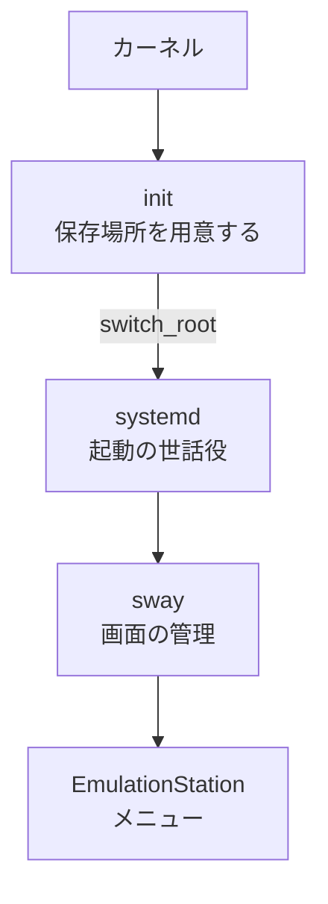
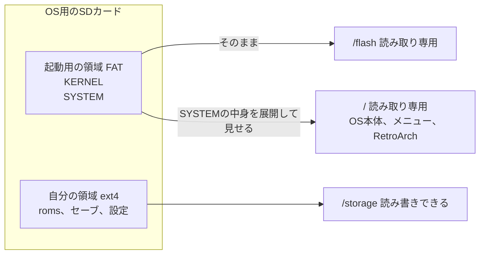
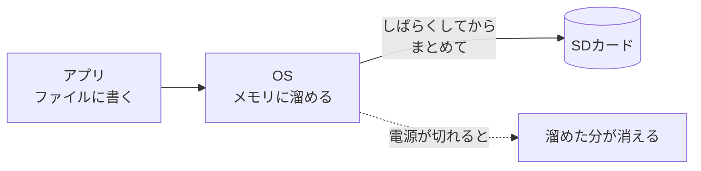

# OSの仕組み

[セーブの仕組み](17-save-data.md)の続きです。この記事では、アプリの層からひとつ降りて、OSの層を扱います。OSが何をしているのか、メニューを誰が起動しているのか、ROCKNIXがファイルの置き場所をどう分けているのかを、ROCKNIXのソースコード(コミット `ae41127`)で確かめます。

## OSはビルの管理会社

OSの役目は、ビルの管理会社に近いものです。メニューやRetroArchのようなアプリを、ビルに入っているお店だとすると、OSはその建物を管理する会社にあたります。

| ビル | RG40XXH |
|---|---|
| お店 | アプリ(メニュー、RetroArch、Wi-Fiの設定など) |
| 管理会社 | OS(Linux) |
| 電気、水道 | 電池の電力、CPUの計算時間 |
| 共用の設備 | 画面、スピーカー、Wi-Fi |
| 部屋割り | メモリの割り当て |
| 倉庫 | SDカード |

お店は、建物の配線を直接いじりません。画面に絵を出したいとき、SDカードのファイルを読みたいときは、管理会社に頼みます。間に管理会社が入ることには、2つの利点があります。

1つ目は、ぶつからないことです。メニューとRetroArchが同時に画面へ絵を出そうとしたら、画面が乱れます。管理会社が、どのお店に画面を使わせるかを決めます。

2つ目は、お店が建物ごとの違いを気にしなくて済むことです。RetroArchは、RG40XXHでもパソコンでも動きます。画面やボタンの部品の違いは、OSが吸収して、アプリには同じ形で見せているからです。

## OSの主な仕事

OSの仕事は、大きく3つに分けられます。

| 仕事 | 内容 | RG40XXHでの例 |
|---|---|---|
| 部品の取り次ぎ | 画面、音、ボタン、Wi-Fiなどの部品を、アプリが使える形にする | ボタンが押されたことを、前に出ているアプリに伝える |
| プログラムの起動と見張り | どのプログラムをいつ動かすかを決め、止まったら対処する | メニューを起動し、落ちたら起動し直す |
| ファイルの管理 | SDカードのどこに何があるかを覚え、読み書きを代行する | ゲームやセーブのファイルを読み書きする |

OSの中心になる部分を、カーネルと呼びます。部品の取り次ぎを受け持つ小さなプログラムが、ドライバです。

## Linuxという銘柄

OSにはいくつかの種類があります。

| OS | 使われている主な機械 |
|---|---|
| Linux | RG40XXH、サーバー、多くの組み込み機器 |
| Android | スマートフォン。カーネルはLinux |
| macOS、iOS | Mac、iPhone |
| Windows | パソコン |

ROCKNIX、Knulli、muOSは、どれもLinuxをもとにした、携帯ゲーム機向けの詰め合わせです([OSの選択肢](03-os.md))。同じLinuxでも、使うカーネルの系統が違います。KnulliのRG40XX Hのページは、カーネルをAllwinnerのBSP 4.9.170としています(記事03)。ROCKNIXのH700向けの設定は、カーネルの系統を指定しておらず、kernel.orgで公開されているLinux 7.1.2に、ROCKNIXのパッチを当てて使う設定です([linuxのpackage.mk](https://github.com/ROCKNIX/distribution/blob/ae41127cee7e3e81b1ab3b17b676d91be5165e61/packages/linux/package.mk))。BSPはメーカーが用意したカーネル、kernel.orgのものはLinuxの本流のカーネルです。

## メニューを起動しているのは誰か

電源を入れてから、メニューが出るまでには、いくつものプログラムが順に動きます。起動の前半は [電源を入れてから](19-boot.md) で扱うので、ここではカーネルが動き出したあとを見ます。



最初に動くinitは、SDカードの領域を用意したあと、`switch_root` という命令で、本来のOSの中身に切り替え、systemdに役目を渡します([init](https://github.com/ROCKNIX/distribution/blob/ae41127cee7e3e81b1ab3b17b676d91be5165e61/packages/sysutils/busybox/scripts/init))。

```sh
exec /usr/bin/busybox switch_root /sysroot /usr/lib/systemd/systemd $INIT_ARGS
```

systemdは、起動の世話役です。どのプログラムを、どの順番で、どの条件で起動するかを書いた設定ファイル(サービスと呼びます)を読み、そのとおりに起動します。

H700のROCKNIXは、画面の管理にswayを使う設定です([H700のoptions](https://github.com/ROCKNIX/distribution/blob/ae41127cee7e3e81b1ab3b17b676d91be5165e61/projects/ROCKNIX/devices/H700/options)の `WINDOWMANAGER="swaywm-env"`)。swayを使う機種向けのメニューのサービスは、[essway.service](https://github.com/ROCKNIX/distribution/blob/ae41127cee7e3e81b1ab3b17b676d91be5165e61/projects/ROCKNIX/packages/ui/emulationstation/system.d/essway.service)です。

```ini
[Unit]
Description=EmulationStation-with-Sway
Requires=sway.service
After=sway.service

[Service]
Type=simple
Environment=HOME=/storage
EnvironmentFile=/etc/profile
ExecStart=/usr/bin/start_es.sh
WorkingDirectory=/storage
Restart=always
RestartSec=2

[Install]
WantedBy=rocknix.target
```

| 行 | 意味 |
|---|---|
| `Requires=sway.service`、`After=sway.service` | swayが必要で、swayが起動してから起動する |
| `Environment=HOME=/storage` | このプログラムの自分の場所を `/storage` にする |
| `ExecStart=/usr/bin/start_es.sh` | 起動するときに実行するファイル |
| `Restart=always`、`RestartSec=2` | 止まったら、2秒後に必ず起動し直す |

最後の2行が、見張りの仕事の例です。メニューが何かの理由で落ちても、systemdが2秒後に起動し直します。メニューもRetroArchも、結局は `/usr/bin` などに置かれたファイルで、OSがそれを読み込んで動かしています。

## 書き換えられない場所と、自分の場所

ROCKNIXのファイルの置き場所は、3つに分かれた作りです。init での扱いは、次の表のとおりです。

| OSの中の場所 | 中身 | initでの扱い |
|---|---|---|
| `/flash` | SDカードの起動用の領域(FAT)。`KERNEL` と `SYSTEM` のファイル | 読み取り専用(`ro`)でつなぐ |
| `/` | `SYSTEM` というファイルの中身。OS本体、メニュー、RetroArch、コア | 読み取り専用(`ro,loop`)でつなぐ |
| `/storage` | SDカードのもう1つの領域(ext4)。ゲーム、セーブ、設定 | 読み書きできる形(`rw`)でつなぐ |

`/` の中身が、`/flash` の中の `SYSTEM` という1つのファイルである点が、ROCKNIXの特徴になっています。init は、このファイルを、中身が詰まった1枚のディスクのように扱い(`loop`)、読み取り専用でつなぎます。



たとえるなら、OS本体は金庫に入った教科書で、`/storage` は自分のノートです。この分け方には、次の利点があります。

- 設定を変えて動かなくなっても、OS本体は元のまま残ります。ノートを汚しても、教科書は無事です。
- 更新が簡単です。init は、`/storage/.update` に置かれた更新用のファイル(`.tar`、`.img.gz`、`.img`)を起動時に探し、`KERNEL` と `SYSTEM` を差し替えます(init の `check_update`)。
- メニューの設定の `HOME=/storage` や、ゲームの置き場所の `/storage/roms` は、どちらもこの自分の場所を指しています。

初回の起動では、`/storage` の領域を、カードの残りいっぱいまで広げる処理が動きます([fs-resize](https://github.com/ROCKNIX/distribution/blob/ae41127cee7e3e81b1ab3b17b676d91be5165e61/packages/sysutils/busybox/scripts/fs-resize))。イメージを書き込んだ直後の `/storage` は32MBしかなく(後述の記事19)、初回の起動で、カードの容量に合わせて広がる仕組みです。

## 書き込みは溜めてから出す

OSは、SDカードへの書き込みを、すぐには行わないことがあります。いったんメモリに溜めておき、ある程度まとまってからSDカードに書きます。郵便を1通ずつ出さずに、溜めてからまとめて出すようなものです。

SDカードへの書き込みは、メモリへの書き込みに比べてずっと遅いので、まとめたほうが全体として速く済みます。その代わり、溜めている間に電源が切れると、まだ出していない分は失われます。



溜めた分を、今すぐすべてSDカードに書き出す命令が `sync` です。正しくシャットダウンすると、OSは溜めた分を書き出してから電源を切ります。ROCKNIXの [update.sh](https://github.com/ROCKNIX/distribution/blob/ae41127cee7e3e81b1ab3b17b676d91be5165e61/projects/ROCKNIX/devices/H700/bootloader/update.sh) も、起動用の領域を書き換えたあと、`sync` で書き出してから読み取り専用に戻す作りです。

```sh
# mount $BOOT_ROOT ro
sync
mount -o remount,ro $BOOT_ROOT
```

[セーブの仕組み](17-save-data.md)で見たとおり、エミュレーターの側にも、セーブを10秒ごとにファイルへ書き出すという待ち時間があります。遊び終わったら、ゲームを終了し、メニューからシャットダウンしてから電源を切ると、どちらの待ちも片づいた状態で終われます。

## MacとRG40XXHは遠い親戚

macOSとLinuxは別のOSですが、どちらもUNIXという古いOSの考え方を受け継いだOSです。ファイルの場所を `/` から始まる道筋で書くこと、`ls` や `cp` のようなコマンドを使うことは、共通しています。MacのターミナルでSDカードのファイルを調べる操作の多くは、RG40XXHの中でもそのまま通じるものです。この性質は、ネットワーク越しにRG40XXHの中を調べるときに役立ちます。

## この記事で出てくる中国語

中国語は、このリポジトリのほかの記事で出典を確認した語から、この記事の話題に関わるものを選びました。

| 中国語 | ピンイン | 日本語の意味 | 出典 |
|---|---|---|---|
| 系统 | xìtǒng | システム、OS | [CSDN](https://blog.csdn.net/fanged/article/details/152960565) |
| 开源系统 | kāiyuán xìtǒng | オープンソースのOS | [掌机圈 RG-35XX H](https://zhangjiquan.com/handheld/rg-35xx-h) |
| 安卓 | ānzhuō | Android | [掌机圈 RG-556](https://zhangjiquan.com/handheld/rg-556) |
| 驱动 | qūdòng | ドライバ | [模拟器游戏 篇四](https://zhuanlan.zhihu.com/p/703325151) |
| 闪退 | shǎntuì | アプリが突然落ちること | [模拟器游戏 篇四](https://zhuanlan.zhihu.com/p/703325151) |
| 权限 | quánxiàn | 権限 | [天马G前端的使用](https://blog.csdn.net/fanged/article/details/152960565) |

## 学べること

OSは、アプリと部品の間に入って、部品の取り次ぎ、プログラムの起動と見張り、ファイルの管理を受け持っています。ROCKNIXでは、カーネルのあとにinit、systemd、sway、メニューの順に起動し、メニューが落ちてもsystemdが起動し直します。OS本体を読み取り専用の1つのファイルにまとめ、ゲームや設定を書き換えられる `/storage` に分けているので、壊れにくく、更新もしやすい作りです。書き込みを溜める仕組みがあるので、電源を切る前のシャットダウンが大事になります。次の [電源を入れてから](19-boot.md) では、カーネルが動き出す前に何が起きているかを見ます。
