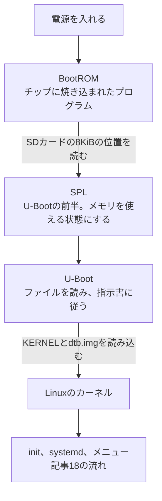
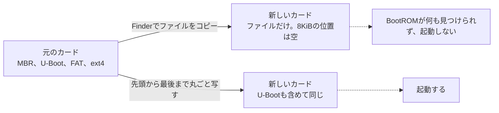

# 電源を入れてから

[OSの仕組み](18-os.md)の続きです。この記事では、電源を入れてから、カーネルが動き出すまでに何が起きているかを扱います。SDカードの「見えない場所」、[CFWを入れる手順](04-install-cfw.md)に出てくる `dtb.img` の正体、DDR3版とDDR4版の違いを、ROCKNIXのソースコード(コミット `ae41127`)で確かめます。

## 2つの困りごと

[OSの仕組み](18-os.md)では、メニューを起動するのはOSだと説明しました。では、そのOSを起動するのは誰でしょうか。

1つ目の困りごとは、順番です。OSはSDカードに入っています。SDカードを読むにはプログラムが必要ですが、そのプログラムもSDカードの中にあります。電源を入れた直後は、まだ何のプログラムも動いていません。

2つ目の困りごとは、作業台です。RG40XXHには1GBのメモリがありますが、電源を入れた直後は、このメモリをまだ使えません。メモリは、決まった手順で設定してはじめて使える部品だからです。使えるのは、チップの中にある小さな記憶だけです。

この2つを、小さなプログラムから大きなプログラムへ、順に役目を渡していく形で解決します。起動を英語でbootと言うのは、靴(boot)のつまみ紐を自分で引っ張って自分を持ち上げる、という言い回しから来ています。

## 起動のリレー



役目を渡すたびに、できることが増えていく流れです。

| 段階 | どこで動くか | できること |
|---|---|---|
| BootROM | チップの中。書き換えられない | 決まった位置を読むことだけ。ファイルは分からない |
| SPL | チップの中の小さな記憶 | 1GBのメモリを使える状態にする |
| U-Boot | 1GBのメモリ | ファイルシステムを読み、指示書に従ってカーネルを読み込む |
| カーネル | 1GBのメモリ | OSとして、すべての部品を扱う |

## SDカードの見えない場所

BootROMは、ファイルというものを知りません。決まった位置を読むことしかできません。そのため、次のSPLとU-Bootは、ファイルとしてではなく、SDカードの決まった位置に直接書かれています。

ROCKNIXのイメージ作成のスクリプトは、H700用のU-Bootを、カードの先頭から8KiBの位置にそのまま書き込みます([bootloader/mkimage](https://github.com/ROCKNIX/distribution/blob/ae41127cee7e3e81b1ab3b17b676d91be5165e61/projects/ROCKNIX/bootloader/mkimage))。

```sh
dd if="${RELEASE_DIR}/3rdparty/bootloader/H700_${SUBDEVICE}_u-boot-sunxi-with-spl.bin" of="${DISK}" bs=1K seek=8 conv=fsync,notrunc
```

`bs=1K seek=8` が、1KiB単位で8つ進んだ位置、つまり8KiBの位置に書くという意味です。ファイル名の `with-spl` は、SPLとU-Bootが1つにまとめられていることを表しています。H700のU-Bootのビルドの設定には、セキュリティにかかわる小さなプログラム(ATFのBL31)をSPLに含める、という説明もあります([u-boot-DDR4のpackage.mk](https://github.com/ROCKNIX/distribution/blob/ae41127cee7e3e81b1ab3b17b676d91be5165e61/projects/ROCKNIX/devices/H700/packages/u-boot-DDR4/package.mk))。

8KiBの位置に何があればよいかは、U-Bootのソースが手がかりになります。[sunxi_image.h](https://github.com/u-boot/u-boot/blob/8d7bc8add17bbc69a58dfe0002eea039dd2dc1bc/include/sunxi_image.h)は、Allwinnerのチップ向けの起動用イメージの見出しを定義していて、その目印を `eGON.BT0` としています。

### SDカードの地図

イメージ作成の設定([distributions/ROCKNIX/options](https://github.com/ROCKNIX/distribution/blob/ae41127cee7e3e81b1ab3b17b676d91be5165e61/distributions/ROCKNIX/options))と、作成のスクリプト([scripts/mkimage](https://github.com/ROCKNIX/distribution/blob/ae41127cee7e3e81b1ab3b17b676d91be5165e61/scripts/mkimage))から、書き込んだ直後のSDカードの並びは次の表のとおりです。セクターは、カードを512バイトずつに区切った単位です。

| 位置 | 中身 | 決めている設定 |
|---|---|---|
| 0セクター目 | MBR(パーティションの目次) | `PARTITION_TABLE="msdos"` |
| 8KiBの位置 | SPLとU-Boot。ファイルではない | `bs=1K seek=8` |
| 32768セクター目(16MiB)から2GB | 起動用の領域(FAT、名前は `ROCKNIX`) | `SYSTEM_PART_START=32768`、`SYSTEM_SIZE=2048` |
| その後ろの32MB | 自分の領域(ext4、名前は `STORAGE`) | `STORAGE_SIZE=32` |

自分の領域が32MBしかないのは、初回の起動で、カードの残りいっぱいまで広げる作りだからです([OSの仕組み](18-os.md))。

### ダミーのイメージで確かめたこと

この調査では、上の設定値どおりの配置で、中身がダミーのイメージを作って確かめました。MBRのパーティションの表を読むと、次の数が並んでいました。数は小さい桁から順に並べて書かれます(リトルエンディアン)。

| 区画 | 起動の印 | 種類 | 開始のセクター | セクター数 |
|---|---|---|---|---|
| 1つ目 | `80`(起動できる) | `0c`(FAT32) | `00 80 00 00` = 32768 | `00 00 40 00` = 4194304(2GiB) |
| 2つ目 | `00` | `83`(Linux) | `00 80 40 00` = 4227072 | `00 00 01 00` = 65536(32MiB) |

MBRの最後の2バイトは `55 aa` で、これがMBRであることの目印です。

16MiBより手前は、どのファイルシステムにも属していません。MacのFinderやWindowsのエクスプローラーからは見えない場所です。この調査では、ファイルだけを別のカードの形のイメージにコピーし、8KiBの位置が空のままになることも確かめました。



付属のSDカードを保存しておきたいときは、ファイルをコピーするのではなく、カードの先頭から最後までを丸ごと写し取ります。

## DDR3版とDDR4版がある理由

SPLの大事な仕事は、メモリを使える状態にすることです。メモリの種類によって、その手順が違います。

ROCKNIXは、H700向けにU-Bootを2種類ビルドし、イメージもDDR3版とDDR4版の2種類を作ります([config.xml](https://github.com/ROCKNIX/distribution/blob/ae41127cee7e3e81b1ab3b17b676d91be5165e61/projects/ROCKNIX/config.xml))。DDR4版のU-Bootの設定名は `anbernic_rg35xx_h700_lpddr4_defconfig` で、メモリの種類に合わせた設定を使っています(u-boot-DDR4のpackage.mk)。

起動後の更新のスクリプト([update.sh](https://github.com/ROCKNIX/distribution/blob/ae41127cee7e3e81b1ab3b17b676d91be5165e61/projects/ROCKNIX/devices/H700/bootloader/update.sh))は、メモリにかかっている電圧を読んで、どちらのU-Bootを書き込むかを決めています。

```sh
case "$DCDC3_MICROVOLTS" in
  1200000)
    UBOOT_BIN="H700_DDR3_u-boot-sunxi-with-spl.bin"
    ;;
  1100000)
    UBOOT_BIN="H700_DDR4_u-boot-sunxi-with-spl.bin"
    ;;
esac
```

1.2Vならば DDR3版、1.1Vならば DDR4版です。RG40XXHのメモリは、掌机圈ではLPDDR4と記載されています([主要機種の違い](02-devices.md))。DDR4版が合うはずですが、ダウンロードの前に、ROCKNIXの機種のページで確かめます。

## U-Bootの指示書

U-Bootは、FATの起動用の領域にある `extlinux/extlinux.conf` を読み、そこに書かれたとおりにカーネルを読み込みます。H700では、イメージ作成時に次の内容で作られます(bootloader/mkimage の `mkimage_extlinux`、config.xml の `fdt="dtb.img"`、H700のoptions の `EXTRA_CMDLINE`)。

```
LABEL ROCKNIX
  LINUX /KERNEL
  FDT /dtb.img
  APPEND boot=LABEL=ROCKNIX disk=LABEL=STORAGE quiet console=ttyS0,115200 console=tty0 systemd.debug_shell=ttyS0
```

| 行 | 意味 |
|---|---|
| `LINUX /KERNEL` | カーネルは、FATの `KERNEL` というファイル |
| `FDT /dtb.img` | DTBは、FATの `dtb.img` というファイル |
| `APPEND boot=LABEL=ROCKNIX` | 起動用の領域は、`ROCKNIX` という名前の領域 |
| `APPEND disk=LABEL=STORAGE` | 自分の領域は、`STORAGE` という名前の領域 |

`APPEND` の行は、カーネルとinitに渡す伝言です。init は、この名前を手がかりに、[OSの仕組み](18-os.md)の `/flash` と `/storage` をつなぎます。

## DTBは機械の間取り図

カーネルは、DTB(デバイスツリー)という間取り図を受け取って、画面やボタンやLEDが、チップのどの線につながっているかを知ります。同じH700を使う機種でも、画面の部品やボタンの配線は機種ごとに違うものです。

ROCKNIXのイメージは、1枚でH700を使う多くの機種に対応しています。カーネルは共通で、機種ごとのDTBを `device_trees` のフォルダにまとめて入れています。

```
FAT(起動用の領域)
├── KERNEL
├── SYSTEM
├── extlinux/extlinux.conf
├── device_trees/
│   ├── sun50i-h700-anbernic-rg35xx-h.dtb
│   ├── sun50i-h700-anbernic-rg40xx-h.dtb
│   ├── sun50i-h700-anbernic-rg40xx-h-v2-panel.dtb
│   └── (ほかの機種)
└── dtb.img   ← 自分で置く
```

### RG40XXHの間取り図の中身

DTBの元になるのは、DTSという文章です。RG40XX H用のDTS([sun50i-h700-anbernic-rg40xx-h.dts](https://github.com/ROCKNIX/distribution/blob/ae41127cee7e3e81b1ab3b17b676d91be5165e61/projects/ROCKNIX/devices/H700/linux/dts/allwinner/sun50i-h700-anbernic-rg40xx-h.dts))は38行しかありません。RG35XX Plusの間取り図を読み込み、違うところだけを書き足す形だからです。

```dts
#include "sun50i-h700-anbernic-rg35xx-plus.dts"

/ {
	model = "Anbernic RG40XX H";
	compatible = "anbernic,rg40xx-h", "allwinner,sun50i-h700";
	rocknix-dt-id = "sun50i-h700-anbernic-rg40xx-h";
};
```

| 書き足している部分 | 内容 |
|---|---|
| `model`、`compatible` | 機種の名前と、どの機種向けかの印 |
| `rocknix-dt-id` | ROCKNIXが機種を見分けるための名前 |
| `&joypad` | スティックの軸の向きを反転する設定など |
| `&uart5` | シリアル通信の端子(UART)を有効にする |
| `&leds` | RGBのLEDがつながっている線(PI7) |
| `&panel` | 画面の部品の種類(`anbernic,rg40xx-panel`) |

画面の新しい版のDTS([v2-panel](https://github.com/ROCKNIX/distribution/blob/ae41127cee7e3e81b1ab3b17b676d91be5165e61/projects/ROCKNIX/devices/H700/linux/dts/allwinner/sun50i-h700-anbernic-rg40xx-h-v2-panel.dts))は、さらに短い14行です。RG40XX Hの間取り図を読み込み、画面の部品の種類を `anbernic,rg40xx-v2-panel` に変えているだけでした。2つのDTBの違いは、画面の部品だけだと分かります。画面が乱れたら、もう一方を試すことになりそうです。どちらが合うかは、実機で確かめます。

### dtb.imgを人がコピーする理由

指示書には `FDT /dtb.img` という固定の名前しか書かれていません。起動の時点のソフトには、どの機種に挿されたかを知る手段がありません。そのため、[CFWを入れる手順](04-install-cfw.md)では、自分の機種のDTBを `device_trees` からコピーし、`dtb.img` という名前で置きます。人が機種を教えているわけです。

一度起動すれば、カーネルは間取り図の `rocknix-dt-id` で自分の機種を知っています。更新のスクリプトは、その名前を `/proc/device-tree/rocknix-dt-id` から読み、同じ名前のDTBで `dtb.img` を差し替えます(update.sh)。手作業が最初の1回だけで済むのは、このためです。

```sh
DT_ID=$(cat /proc/device-tree/rocknix-dt-id)
UPDATE_DTB_SOURCE="$BOOT_ROOT/device_trees/$DT_ID.dtb"
if [ -f "$UPDATE_DTB_SOURCE" ]; then
  echo "Updating dtb.img from $(basename $UPDATE_DTB_SOURCE)..."
  cp -f "$UPDATE_DTB_SOURCE" "$BOOT_ROOT/dtb.img"
fi
```

## うまく起動しないときの見当

起動の順番が分かると、どこで止まったかの見当がつきます。次の表は仕組みから考えた目安で、実機ではまだ確かめていません。

| 症状 | 止まった段階の見当 | 考えられる原因 |
|---|---|---|
| 画面が暗いまま何も起きない | BootROMからU-Bootまで | 書き込みの失敗、ファイルのコピーだけで作ったカード、DDR3版とDDR4版の取り違え |
| 起動しているが、画面が乱れる | カーネルとDTB | `dtb.img` の版が合っていない |
| ロゴは出るが、メニューまで進まない | initからsystemdまで | `/storage` の用意や、メニューの起動 |

## この記事で出てくる中国語

中国語は、このリポジトリのほかの記事で出典を確認した語から、この記事の話題に関わるものを選びました。

| 中国語 | ピンイン | 日本語の意味 | 出典 |
|---|---|---|---|
| 刷机 | shuā jī | 機器のOSを書き換えること | [百度の検索結果](https://www.baidu.com/s?wd=RG40XXH%20%E5%88%B7%E6%9C%BA%20%E5%9B%BA%E4%BB%B6%20Knulli%20%E6%95%99%E7%A8%8B) |
| 固件 | gùjiàn | ファームウェア | [百度の検索結果](https://www.baidu.com/s?wd=RG40XXH%20%E5%88%B7%E6%9C%BA%20%E5%9B%BA%E4%BB%B6%20Knulli%20%E6%95%99%E7%A8%8B) |
| 格式化 | géshìhuà | フォーマットすること | [百度の検索結果](https://www.baidu.com/s?wd=RG40XXH%20%E5%88%B7%E6%9C%BA%20%E5%9B%BA%E4%BB%B6%20Knulli%20%E6%95%99%E7%A8%8B) |
| 读卡器 | dúkǎqì | カードリーダー | [百度の検索結果](https://www.baidu.com/s?wd=RG40XXH%20%E5%88%B7%E6%9C%BA%20%E5%9B%BA%E4%BB%B6%20Knulli%20%E6%95%99%E7%A8%8B) |
| 变砖 | biànzhuān | 機器が起動しなくなること(いわゆる文鎮化) | [百度の検索結果](https://www.baidu.com/s?wd=RG40XXH%20%E5%88%B7%E6%9C%BA%20%E5%9B%BA%E4%BB%B6%20Knulli%20%E6%95%99%E7%A8%8B) |
| 启动速度 | qǐdòng sùdù | 起動の速さ | [CSDN](https://blog.csdn.net/fanged/article/details/152960565) |

## 学べること

電源を入れた直後は、プログラムも動いておらず、メモリも使えません。そこで、BootROM、SPL、U-Boot、カーネルの順に、小さなものから役目を渡していきます。BootROMは決まった位置しか読めないので、最初のプログラムはSDカードのファイルシステムの外に置かれ、カードの保存は丸ごと写す必要があります。カーネルは、DTBという間取り図で機種の部品の配置を知る仕組みでした。`dtb.img` は、起動前のソフトに機種を教えるために、人が置くファイルでした。次の [CPUと機械語](20-cpu.md) では、いちばん下の層で、CPUが実際に何をしているかを見ます。
