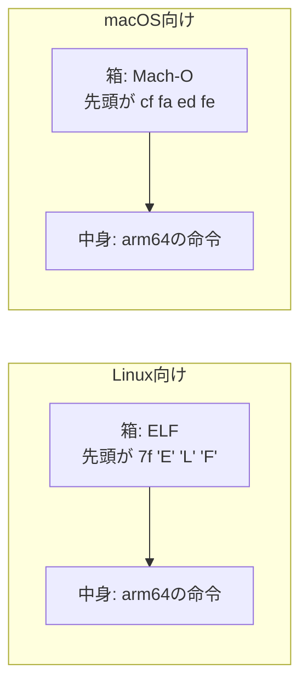
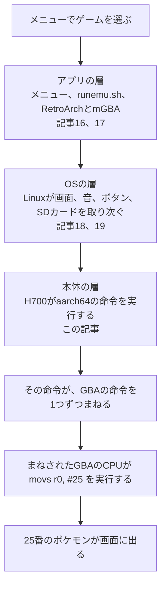

# CPUと機械語

[電源を入れてから](19-boot.md)の続きで、連載の最後の記事です。三つの層のいちばん下、本体の中心にあるCPUが、実際に何をしているのかを扱います。小さなプログラムを、RG40XXH向け、Mac向け、パソコン向けに変換して比べ、最後にポケモン エメラルドの中で、最初のポケモンが決まる瞬間の命令を読みます。

## CPUは命令を1つずつこなす作業員

CPUがしていることは、驚くほど単純です。命令を1つずつ読んで実行する作業員にたとえられます。作業員は、3つのものを使って仕事をします。

| もの | たとえ | 正式な名前 |
|---|---|---|
| 今、何番目の命令を読んでいるか | 指示書に挟んだしおり | プログラムカウンター |
| 数十個だけの小さな記憶 | 手元のメモ欄 | レジスター |
| 命令とデータを置いておく場所 | 作業台 | メモリ |

作業員がひたすら繰り返すのは、次の4つです。


1つ1つの命令は、足す、比べる、メモリから数を読む、別の位置へ移る、といった小さな仕事です。その代わり、とても速く進みます。RG40XXHのH700は、ROCKNIXのページで標準1.4GHz、設定で1.5GHzとされています([中華ゲーム機の全体像](01-overview.md))。1.5GHzは、1秒間に15億回の時を刻む速さです。

## 自作の関数を命令に変換する

次の小さな関数を書き、RG40XXHのCPU(aarch64)向けに変換しました。変換には `aarch64-linux-gnu-gcc` を、変換後の中身を読むには `aarch64-linux-gnu-objdump` を使いました。

```c
int add_coin(int score) {
    return score + 10;
}
```

変換後の命令は、2つだけでした。

```
11002800    add  w0, w0, #0xa
d65f03c0    ret
```

| 部分 | 意味 |
|---|---|
| `11002800` | 1つ目の命令を数字にしたもの。CPUが実際に読むのはこれ |
| `add w0, w0, #0xa` | 人が読めるように訳したもの。`w0` に10を足して `w0` に戻す |
| `w0` | レジスターの0番。ここに点数が入っている |
| `#0xa` | 16進数の10 |
| `d65f03c0` と `ret` | 呼び出した場所に戻る命令 |

[RG40XXHの全体像](15-rg40xxh-big-picture.md)で、ゲームのファイルは数字の並びだと書きました。その数字の多くは、このような命令を1つずつ数字にしたものです。

## 箱と中身

同じCPUの命令でも、OSが違うと、そのままでは動きません。このことを、1行の関数を3通りに変換して確かめました。

```c
int add(int a, int b) { return a + b; }
```

`clang` で、Linux向けのaarch64、macOS向けのarm64(Apple Siliconのこと)、Linux向けのx86_64(IntelやAMDのCPU)の3通りに変換しました。

| 変換先 | `file` の判定 | 先頭の4バイト | 中の命令 |
|---|---|---|---|
| Linux、aarch64 | `ELF 64-bit LSB relocatable, ARM aarch64` | `7f 45 4c 46` | `0b000020` `d65f03c0` |
| macOS、arm64 | `Mach-O 64-bit arm64 object` | `cf fa ed fe` | `0b000020` `d65f03c0` |
| Linux、x86_64 | `ELF 64-bit LSB relocatable, x86-64` | `7f 45 4c 46` | `8d 04 37` `c3` |

1行目と2行目を比べると、中の命令は同じ数字でした。どちらも `add w0, w1, w0` と `ret` です。Apple SiliconとH700は、命令の言葉(命令セット)が同じarm64だからです。一方、x86_64の命令は、まったく違う数字になりました。

違うのは、命令を包んでいる箱の形です。



- CPUが読むのは、中身の命令だけです。
- OSが読むのは、箱の形です。Linuxは、先頭が `7f 45 4c 46`(ELFという形式の目印)でないファイルを、プログラムとして読み込みません。macOSは、Mach-Oという別の形式を使います。
- ELFの箱には、どのCPU向けかを書く欄もあります。先頭から18バイト進んだ位置の2バイトは、aarch64向けが `b7 00`(183)、x86_64向けが `3e 00`(62)でした。`readelf -h` で読むと、それぞれ `AArch64` と `Advanced Micro Devices X86-64` と表示されます。

同じCPUを積んでいても、MacのアプリをRG40XXHでそのまま動かせないのは、箱が違うからです。逆に、Apple SiliconのMacの上でLinuxを動かせば、RG40XXHと同じ形の箱と中身を作れます。動かすには、使うライブラリの版などの条件も合わせる必要があります。

## 違うCPUの命令は実行できない

この調査で使った環境は、x86_64のCPUのLinuxでした。点数を3回足して表示するプログラムをaarch64向けに変換し、そのまま実行すると、Linuxは次のエラーを返しました。

```
cannot execute binary file: Exec format error
```

ELFの箱のCPUの欄が、自分のCPUと合わないためです。x86_64の作業員にとって、`11002800` は意味の通じない数字です。

次に、qemu(`qemu-aarch64`)というエミュレーターを通して、同じファイルを実行しました。

```
coin! score=10
coin! score=20
coin! score=30
```

今度は動きました。qemuが、aarch64の命令を1つずつ読み、x86_64の命令に訳しながら実行したからです。

| この調査の環境 | RG40XXH |
|---|---|
| aarch64の命令 → qemu → x86_64のCPU | GBAの命令 → mGBA → H700 |

[エミュレーターとメニュー](16-emulator-and-menu.md)で説明した通訳は、まさにこれです。

## 最初のポケモンが決まる命令

最後に、ポケモン エメラルドの中を覗きます。[pokeemerald-expansion](https://github.com/rh-hideout/pokeemerald-expansion)は、エメラルドのソースコードを復元したプロジェクトをもとにした、改造の基盤です([ポケモンのROM hack](08-pokemon-hacking.md))。その `GetStarterPokemon` は、選んだモンスターボールの番号から、最初のポケモンの番号を返す関数です([starter_choose.c](https://github.com/rh-hideout/pokeemerald-expansion/blob/dfb0f84374230f4d462191601179b742f9f077df/src/starter_choose.c))。

```c
u16 GetStarterPokemon(u16 chosenStarterId)
{
    if (chosenStarterId > STARTER_MON_COUNT)
        chosenStarterId = 0;
    return sStarterMon[chosenStarterId];
}
```

`sStarterMon` は、最初のポケモン3匹の番号を並べた表です。元のソースでは、キモリ(252)、アチャモ(255)、ミズゴロウ(258)が入っています。この調査では、表の1匹目をピカチュウ(25)に変えてビルドし、変換後の命令を `arm-none-eabi-objdump` で取り出しました。GBAのCPUのThumbという命令で、1つの命令がおもに2バイトです。

```
0403    lsls r3, r0, #16
0c1b    lsrs r3, r3, #16
2019    movs r0, #25
2b03    cmp  r3, #3
d803    bhi  (最後の命令へ)
4a02    ldr  r2, [表の位置]
005b    lsls r3, r3, #1
18d2    adds r2, r2, r3
8910    ldrh r0, [r2, #8]
4770    bx   lr
```

| 命令 | していること |
|---|---|
| `lsls`、`lsrs` | 選んだボールの番号を、`r3` に整えて入れる |
| `movs r0, #25` | 返す値の欄 `r0` に、先に25を入れておく |
| `cmp r3, #3` と `bhi` | 番号が3より大きければ、25のまま最後へ飛ぶ |
| `ldr r2, [表の位置]` | 表がメモリのどこにあるかを読む |
| `lsls r3, r3, #1`、`adds` | 番号を2倍して表の位置に足す(1匹分が2バイトのため) |
| `ldrh r0, [r2, #8]` | 表からポケモンの番号を読み、`r0` に入れる |
| `bx lr` | 呼び出した場所に戻る |

3つ目の命令の数字 `2019` に注目すると、下の `19` は16進数の25です。番号が範囲の外だったときの答えは、表の0番目の値、つまりピカチュウの25になります。コンパイラは、この答えを、命令の中に直接書き込んでいました。改造前のビルドでは、ここはキモリの252で、16進数の `FC` が入ります。

ゲームの中のピカチュウは、ROMの表の中の25と、命令に書き込まれた25という、2か所の数字として存在していました。

### GBAとRG40XXHの命令の違い

| | GBA | RG40XXH |
|---|---|---|
| CPU | ARM7TDMI | Cortex-A53(H700) |
| 命令の言葉 | ARMとThumb(上の例はThumbで、1命令がおもに2バイト) | AArch64(1命令が4バイト) |
| レジスターの名前 | `r0`、`r1` など | `w0`、`x0` など |

どちらもARMの一族ですが、世代が違い、命令の言葉も違います。RG40XXHでGBAのゲームを動かすには、mGBAのようなエミュレーターが必要です。GBAのCPUの種類は、pokeemerald-expansionの [Makefile](https://github.com/rh-hideout/pokeemerald-expansion/blob/dfb0f84374230f4d462191601179b742f9f077df/Makefile) の `-mcpu=arm7tdmi` で、H700のCPUの種類は、ROCKNIXの [H700のoptions](https://github.com/ROCKNIX/distribution/blob/ae41127cee7e3e81b1ab3b17b676d91be5165e61/projects/ROCKNIX/devices/H700/options) の `TARGET_CPU="cortex-a53"` で確かめられます。

## 連載の全体をつなげる

メニューでゲームを選んでから、最初のポケモンが画面に出るまでを、連載の各記事と結びつけると次のようになります。



## 確かめた環境

この記事の実験の環境は、x86_64のUbuntu 24.04です。aarch64向けの変換には `gcc-aarch64-linux-gnu` と `clang` を、実行には `qemu-user` の `qemu-aarch64` を使いました。ポケモンのビルドは、pokeemerald-expansionのコミット `dfb0f84` の [INSTALL.md](https://github.com/rh-hideout/pokeemerald-expansion/blob/dfb0f84374230f4d462191601179b742f9f077df/INSTALL.md) のUbuntu向けの手順に従い、`make` で `pokeemerald.gba` を作りました。ビルドしたROMには任天堂の絵や音楽が含まれるため、配布しません。

## この記事で出てくる中国語

中国語は、このリポジトリのほかの記事で出典を確認した語から、この記事の話題に関わるものを選びました。

| 中国語 | ピンイン | 日本語の意味 | 出典 |
|---|---|---|---|
| 处理器 | chǔlǐqì | プロセッサー(SoC) | [RG-406V](https://zhangjiquan.com/handheld/rg-406v) |
| 内存 | nèicún | メモリ | [掌机圈 RG-35XX H](https://zhangjiquan.com/handheld/rg-35xx-h) |
| 模拟器 | mónǐqì | エミュレーター | [模拟器游戏 篇四](https://zhuanlan.zhihu.com/p/703325151) |
| 开源 | kāiyuán | オープンソース | [开源掌机吧](https://tieba.baidu.com/f?kw=%E5%BC%80%E6%BA%90%E6%8E%8C%E6%9C%BA) |
| 改版 | gǎibǎn | 改造版 | [口袋妖怪改版吧](https://tieba.baidu.com/f?kw=%E5%8F%A3%E8%A2%8B%E5%A6%96%E6%80%AA%E6%94%B9%E7%89%88) |

## 学べること

CPUは、しおり、メモ欄、作業台を使って、数字で書かれた命令を1つずつ実行しています。プログラムのファイルは、OSが読む箱(ELFやMach-O)と、CPUが読む中身(命令)の2層でできていて、どちらかが合わなければ動きません。CPUの言葉が違えば、エミュレーターが訳して実行します。ポケモンの最初の1匹は、ROMの表と命令の中に書き込まれた、ただの数字でした。連載の6本で、ゲームを選ぶところから、CPUの命令までが一本につながります。自作のゲームの作り方は、[自作ゲームを作る方法](14-making-games.md)で扱っています。
