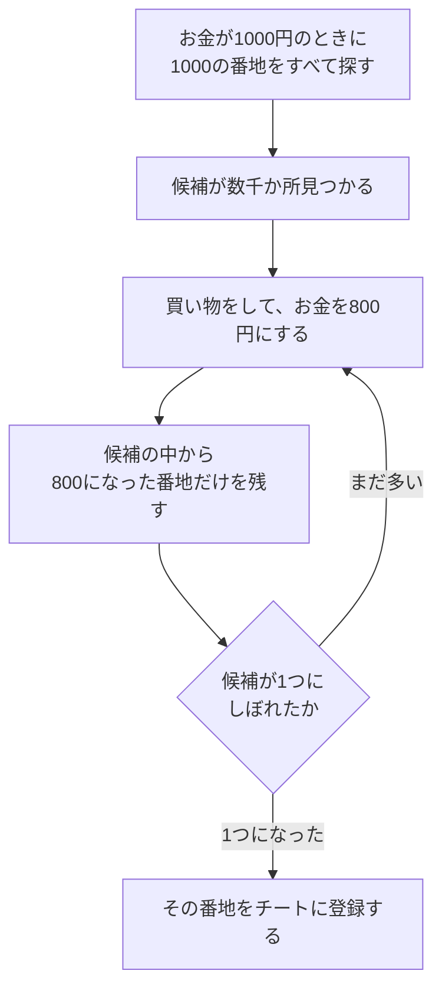
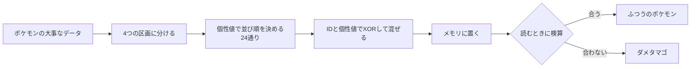

# チートとパススルー

[CPUと機械語](20-cpu.md)までの連載では、ゲームのファイルとプログラムの仕組みを、止まった状態で読んできました。この記事では、動いているゲームのメモリを読み書きする話を扱います。前半はチート、後半はパススルーと呼ばれる改造です。どちらも、遊んでいる最中のゲームの数字を、外から覗いたり書き換えたりする技術です。

説明は、次のソースコードとガイドを、コミットを固定して確かめながら進めます。

| 出典 | コミット | 使う場所 |
|---|---|---|
| [pokeemerald-expansion](https://github.com/rh-hideout/pokeemerald-expansion) | `dfb0f84` | GBAのメモリの地図、エメラルドの書き換え対策 |
| [mGBA](https://github.com/mgba-emu/mgba) | `3a5e34b` | GBAのチートコードの種類 |
| [RetroArch](https://github.com/libretro/RetroArch) | `015298c` | チートの機能、外から命令を送る機能 |
| [ROCKNIX](https://github.com/ROCKNIX/distribution) | `ae41127` | RG40XXHでの標準の設定 |
| [ai-game-modding-guides](https://github.com/trevaintdead/ai-game-modding-guides) | `54a9809` | パススルーの改造の設計、守るべきこと |

## 3種類の調べ方

AIでゲームを改造する人向けのガイド集の13章は、ゲームの調べ方を3つに分けています([13-reverse-engineering-and-the-law.md](https://github.com/trevaintdead/ai-game-modding-guides/blob/54a980970606f71996e6f25723d42fb9a95aaae5/guides/13-reverse-engineering-and-the-law.md))。

| 調べ方 | 中身の見え方 | このリポジトリでの例 |
|---|---|---|
| ブラックボックス | 中は見ない。入れたものと出てきたものだけを見る | 遊んで試す。セーブのファイルを覗く |
| グレーボックス | 動いているときのデータだけを見る | この記事のチートと、メモリの読み取り |
| ホワイトボックス | プログラムの中身をすべて読む | ポケモンの復元プロジェクト、逆アセンブル(記事20) |

ガイドは、できる限りブラックボックスを選ぶよう勧めています。何も写さないので、著作権の問題が起きないからです。この記事の話は、その次のグレーボックスにあたります。

## GBAのメモリの地図

チートを理解するには、まずゲーム機のメモリのどこに何があるかを知る必要があります。pokeemerald-expansionのリンカの設定([ld_script_modern.ld](https://github.com/rh-hideout/pokeemerald-expansion/blob/dfb0f84374230f4d462191601179b742f9f077df/ld_script_modern.ld))には、GBAの3つの領域が、次のように書かれています。

| 領域 | 始まりの番地 | 大きさ | 書き換え | 中身 |
|---|---|---|---|---|
| EWRAM | `0x02000000` | 256KB | できる | 大きな作業台。セーブするデータの元など |
| IWRAM | `0x03000000` | 32KB | できる | 小さくて速い作業台 |
| ROM | `0x08000000` | 32MB | できない | カートリッジのゲーム本体 |

番地は、メモリの中の住所です。ROMは書き換えられないので、チートが書き換えるのは、EWRAMやIWRAMの作業台の数字です。

自分でビルドしたエメラルドでは、記号の一覧から、データの番地を調べられます。この調査のビルドでは、セーブするデータの元になる `gSaveblock1` が `0x0200fea4`、`gSaveblock2` が `0x02013bf4`、ゲームの全体を管理する `gMain` が `0x030066c0` にありました。番地は、ビルドの設定や改造の内容で変わります。

## チートの正体

### チートコードは小さなプログラム

チートコードは、昔から、ゲームの最中にメモリの数字を書き換える機器やソフトで使われてきました。中国語圏では金手指と呼ばれます([ポケモンのROM hack](08-pokemon-hacking.md))。

GBAのエミュレーターのmGBAは、4種類のチートコードの形式を読めます([cheats.h](https://github.com/mgba-emu/mgba/blob/3a5e34be33dc7f8f707e5bc9db69e8a430046f21/include/mgba/internal/gba/cheats.h)の `enum GBACheatType`)。

| 形式 | 名前の由来 |
|---|---|
| CodeBreaker | 同名のチート機器 |
| GameShark | 同名のチート機器 |
| Pro Action Replay | 同名のチート機器 |
| VBA | エミュレーターのVisualBoyAdvanceの形式 |

CodeBreakerの命令の一覧を見ると、チートコードが小さなプログラムであることが分かります。

| 命令(`cheats.h` の名前) | していること |
|---|---|
| `CB_ASSIGN_1`、`CB_ASSIGN_2` | 決まった番地に、決まった値を書く |
| `CB_FILL` | 決まった範囲を、同じ値で埋める |
| `CB_IF_EQ`、`CB_IF_NE`、`CB_IF_GT`、`CB_IF_LT` | 番地の値が条件に合うときだけ、次の命令を実行する |

いちばん単純なチートは、「この番地に、この値を書き続ける」というものです。たとえばお金が入っている番地に大きな値を書き続ければ、お金が減らなくなります。条件の命令を組み合わせると、「ボタンを押しているときだけ書く」といった動きも作れます。

### RetroArchのチートの機能

RetroArchにも、チートの機能があります([cheat_manager.h](https://github.com/libretro/RetroArch/blob/015298c2e3bb7361207fc1098d3757f645e58595/cheat_manager.h))。チートの種類は、書き方が違うだけで、考え方はチート機器と同じです。

| 種類(`CHEAT_TYPE_`) | していること |
|---|---|
| `SET_TO_VALUE` | 決まった値にする |
| `INCREASE_VALUE`、`DECREASE_VALUE` | 値を増やす、減らす |
| `RUN_NEXT_IF_EQ` など | 条件に合うときだけ、次のチートを実行する |

RetroArchには、チートを自分で探すための、メモリの検索の機能もあります。検索の種類は、次の9つです(`CHEAT_SEARCH_TYPE_`)。

| 種類 | 探すもの |
|---|---|
| `EXACT` | ちょうどその値の番地 |
| `LT`、`LTE`、`GT`、`GTE` | 前回より小さい、以下、大きい、以上の番地 |
| `EQ`、`NEQ` | 前回と同じ、違う番地 |
| `EQPLUS`、`EQMINUS` | 前回よりちょうどいくつ増えた、減った番地 |

### メモリを検索してチートを作る手順

お金の番地を探す場合、考え方は次のようになります。



ゲームの中身のプログラムは読まず、動いているときの数字の変化だけを見ています。グレーボックスの典型です。

## エメラルドの書き換え対策

この手順は、多くのゲームで通用します。ところが、エメラルドでは、そのままでは通用しにくい作りになっています。pokeemerald-expansionのソースには、メモリの書き換えに備えた仕組みが3つありました。

### お金は暗号化されている

お金を読む関数とお金を書く関数([money.c](https://github.com/rh-hideout/pokeemerald-expansion/blob/dfb0f84374230f4d462191601179b742f9f077df/src/money.c))は、次のようになっています。

```c
return *moneyPtr ^ gSaveBlock2Ptr->encryptionKey;
...
*moneyPtr = gSaveBlock2Ptr->encryptionKey ^ newValue;
```

`^` は、XORという、2つの数字をビットごとに混ぜる計算です。同じ鍵で2回XORすると元に戻ります。メモリには、本当の金額ではなく、鍵と混ぜた数字が入っています。そのため、1000円のときに1000を探しても、お金の番地は見つかりません。

### セーブするデータの置き場所が動く

セーブするデータの元の置き場所も、固定されていません([load_save.c](https://github.com/rh-hideout/pokeemerald-expansion/blob/dfb0f84374230f4d462191601179b742f9f077df/src/load_save.c))。

```c
offset = (offset + Random()) & (SAVEBLOCK_MOVE_RANGE - 4);

gSaveBlock2Ptr = (void *)(&gSaveblock2) + offset;
*sav1_LocalVar = (void *)(&gSaveblock1) + offset;
gPokemonStoragePtr = (void *)(&gPokemonStorage) + offset;
```

置き場所を、乱数で決めた分だけずらしています。ずらす幅の上限は、[load_save.h](https://github.com/rh-hideout/pokeemerald-expansion/blob/dfb0f84374230f4d462191601179b742f9f077df/include/load_save.h)で128バイト(`SAVEBLOCK_MOVE_RANGE 128`)と決められています。ずらすための空きを確保する構造体には、`SaveBlock1ASLR` という名前が付けられていました。ASLRは、パソコンのOSが攻撃を防ぐために、プログラムの置き場所を毎回ずらす仕組みの名前です。

ずらす処理(`MoveSaveBlocks_ResetHeap`)は、地図を読み込むとき([overworld.c](https://github.com/rh-hideout/pokeemerald-expansion/blob/dfb0f84374230f4d462191601179b742f9f077df/src/overworld.c))と、戦闘を始めるとき([battle_main.c](https://github.com/rh-hideout/pokeemerald-expansion/blob/dfb0f84374230f4d462191601179b742f9f077df/src/battle_main.c)の `CB2_InitBattle`)に呼ばれます。同じ処理の最後では、お金などの暗号化の鍵も新しく作り直しています(`encryptionKey = Random32()`)。

つまり、町を移動したり戦闘を始めたりするたびに、データの番地と、お金を混ぜる鍵の両方が変わります。一度見つけた番地は、すぐに使えなくなります。

### ポケモンのデータは、混ぜて、並べ替えて、検算されている

ポケモン1匹のデータも、守られています([pokemon.c](https://github.com/rh-hideout/pokeemerald-expansion/blob/dfb0f84374230f4d462191601179b742f9f077df/src/pokemon.c))。

| 守り方 | ソースの該当箇所 | 内容 |
|---|---|---|
| 混ぜる | `EncryptBoxMon`、`DecryptBoxMon` | 大事な部分を、トレーナーのIDと、ポケモンごとの個性値(personality)でXORする |
| 並べ替える | `GetSubstruct` の `personality % 24` | 大事な部分は4つの区画に分かれ、その並び順が、個性値によって24通りに変わる |
| 検算する | `CalculateBoxMonChecksum`、`IsBadEgg` | 区画の数字の合計が、記録されたチェックサムと合わなければ、そのポケモンを「ダメタマゴ」にする |

書き換え方を間違えてチェックサムが合わなくなると、ポケモンが「ダメタマゴ」に変わります。ダメタマゴの正体は、データがおかしくなっていると判断されたポケモンでした。



これらの仕組みが、どこまでチートを防ぐ目的で入れられたのかは、ソースからは分かりません。ただ、固定の番地に固定の値を書くだけの単純なチートが、エメラルドでは効きにくい作りになっていることは確かです。

## RetroArchを外から操作する

ここからは、チートの考え方を、RG40XXHとMacの間で使う話です。

RetroArchには、ネットワーク越しに命令を受け取る機能があります。受け付けるのはUDPという方式で、標準の番号(ポート)は55355です([command.c](https://github.com/libretro/RetroArch/blob/015298c2e3bb7361207fc1098d3757f645e58595/command.c)、[config.def.h](https://github.com/libretro/RetroArch/blob/015298c2e3bb7361207fc1098d3757f645e58595/config.def.h))。命令の一覧は [command.h](https://github.com/libretro/RetroArch/blob/015298c2e3bb7361207fc1098d3757f645e58595/command.h) にあり、この記事に関係するのは次の4つです。

| 命令 | 内容 |
|---|---|
| `GET_STATUS` | 遊んでいるゲームの機種、名前、CRC32、遊んでいるか止まっているかを返す |
| `READ_CORE_MEMORY <番地> <バイト数>` | ゲーム機のメモリを読む |
| `WRITE_CORE_MEMORY <番地> <値>...` | ゲーム機のメモリに書く。ソースでは「破壊的」な命令に分類されている |
| `SHOW_MSG <文章>` | 画面にメッセージを出す |

`READ_CORE_MEMORY` の返事は、`READ_CORE_MEMORY` に続けて番地を16進数で書き、その後ろに読んだバイトを2桁の16進数で並べた1行です(command.c の `command_read_memory`)。

ROCKNIXのH700向けの設定では、この機能は標準で切ってあります([retroarch.cfg](https://github.com/ROCKNIX/distribution/blob/ae41127cee7e3e81b1ab3b17b676d91be5165e61/projects/ROCKNIX/packages/emulators/libretro/retroarch/sources/H700/retroarch.cfg)の `network_cmd_enable = "false"`、`network_cmd_port = "55355"`)。使うには、設定で有効にする必要があります。

ゲームの実績を集めるRetroAchievementsも、ゲームのメモリの値を使う仕組みです。command.h には、実績用の番地を使う命令(`READ_CORE_RAM`)もあり、`READ_CORE_MEMORY` はそれと区別して、ゲーム機の番地を使うと説明されています。RetroAchievementsも、同じ設定ファイルで標準では切ってあります(`cheevos_enable = "false"`)。

## パススルーの改造

### 2つのゲームを1つにする

パススルーの改造は、2つのゲームを同時に動かし、つないで1つのゲームのように見せる改造です。ガイド集の2章([02-passthrough-mods.md](https://github.com/trevaintdead/ai-game-modding-guides/blob/54a980970606f71996e6f25723d42fb9a95aaae5/guides/02-passthrough-mods.md))が、スカイリムの中でマインクラフトを遊べるようにしたSkyCraftを例に、仕組みを説明しています。

| 役割 | 担当するゲーム |
|---|---|
| 画面に描く、壁の当たり判定、NPC | スカイリム |
| プレイヤーの位置、ブロック、戦闘の計算 | マインクラフト(窓は隠して、裏で動かす) |

2つのゲームが同時に動くので、遊ぶ人は両方のゲームを持っている必要があります。ガイドは、ふつうの改造が「1つのゲームの中に、もう1つのゲームの中身を入れる」ものであるのに対し、パススルーは「どちらも、もう一方が動いていないと成り立たない」ものだという説明です。

### 2つのゲームの話し方

2つのゲームは、共有メモリでつながっています。2つのプログラムが、同じメモリの区画を同時に開いて読み書きする方法です。片方が書けば、もう片方からすぐに見えます。同じ機械の中でしか使えません。

SkyCraftの共有メモリの中は、次のように区切られています(ガイド2章)。

| 区画 | 中身 | たとえ |
|---|---|---|
| 先頭の見出し | 目印の数字、取り決めの版、両方のプロセスの番号、心拍 | 交換日記の表紙 |
| 最新の値の欄 | プレイヤーの位置、カメラ、何コマ目か | ホワイトボード |
| 2本のリングバッファ | 1回だけ起きる出来事(ブロックを置いた、攻撃が当たった) | 片道ずつの連絡帳 |
| 起こすための合図 | 待っている側を起こす | 呼び鈴 |

最新の値の欄は、seqlockという方法で書きます。書く側は、書き始めと書き終わりに番号を進めます。読む側は、読む前と後で番号を比べ、途中で書き換えられていたら読み直す決まりです。ホワイトボードを読んでいる最中に書き換えられても、気づける仕組みです。

1回だけ起きる出来事は、上書きされると消えてしまうので、ホワイトボードではなくリングバッファに入れます。リングバッファは、輪の形に並んだ箱に、順番に書いていく連絡帳です。読む側は、読んだところまで印を付けて進みます。

### 設計の3つの決まり

ガイド2章は、書き始める前にエージェントに伝えるべき決まりを3つ挙げています。

1. 取り決めは1か所で定義し、両方の言語のコードをそこから作る。SkyCraftは、取り決めからC++とJavaの両方のコードを作っている
2. すべて決まった大きさで、リトルエンディアンで並べる
3. 片方が落ちても、もう片方は生き残る。心拍で相手の停止に気づき、マインクラフトが落ちたらスカイリムの操作をプレイヤーに返し、スカイリムが落ちたらマインクラフトを止める

これらは、連載で見てきた仕組みと同じ考え方です。ELFのファイルの先頭の目印(記事20)、MBRのリトルエンディアンの数字(記事19)、エメラルドのセーブの目印と2つの枠(記事17)は、どれも、おかしくなったデータを使わないための工夫でした。

### 作る順番

ガイド9章([09-worked-example-passthrough-mod.md](https://github.com/trevaintdead/ai-game-modding-guides/blob/54a980970606f71996e6f25723d42fb9a95aaae5/guides/09-worked-example-passthrough-mod.md))は、最初から最後までの流れを、エージェントへの指示文つきで説明しています。

1. どちらのゲームが、何の値の持ち主かを先に決める。SkyCraftでは、画面を描くスカイリムではなく、マインクラフトがプレイヤーの位置の持ち主
2. 値を1つだけ送る。プレイヤーの位置を毎コマ送り、送った値と受け取った値を両方の記録に残して比べる
3. 逆向きにも1つ送る
4. 機能を1つずつ足し、そのたびに遊んで確かめてから記録する
5. カクつきを直す。2つのゲームでメモリも約2倍要る
6. セーブと読み込みを合わせる。2つのゲームにそれぞれのセーブがあるため

9章は、時間がかかる4つの原因として、ゲームの版が変わって改造が動かなくなること、2つのゲームの座標の決め方の違い、2つのセーブ、画面とコマの時計の取り合いを挙げています。

## RG40XXHでの小さなパススルー

SkyCraftのような改造は、Windows版の大きなゲームを2つ同時に動かす前提で、メモリ1GBのRG40XXHには向きません。ただ、考え方はRG40XXHとMacの組み合わせにも当てはまります。

| | SkyCraft | RG40XXHとMac(構想) |
|---|---|---|
| つなぎ方 | 同じ機械の共有メモリ | Wi-Fi越しのUDP(RetroArchの命令) |
| 値の持ち主 | プレイヤーの位置はマインクラフト | ゲームの状態はRG40XXHのエミュレーター |
| 見出しの確認 | 目印と版の番号 | `GET_STATUS` でゲームの名前とCRC32を確かめる |
| 相手の停止の検知 | 心拍 | 一定の間隔で `GET_STATUS` を送り、返事が来るかを見る |
| 最初の1歩 | プレイヤーの位置を1つ送る | 番地を1つ読み、Macの画面に表示する |

たとえば、RG40XXHで遊んでいる自作のエメラルドから、Macのプログラムが数字を1つ読み、画面に表示する、という形が最初の1歩になります。前の節で見たとおり、エメラルドのデータの多くは置き場所が動くので、決まった番地を読むだけでは足りません。自分でビルドしたROMなら、記号の一覧と、置き場所を指すポインターの番地(`gSaveBlock1Ptr` など)が分かるので、ポインターを読んでから本体を読む、という2段階の読み方で対応できるはずです。

この節の構想は、まだ実機で確かめていません。RetroArchの `READ_CORE_MEMORY` が、mGBAのコアでGBAの番地をそのまま受け付けるかどうかも、実機で確かめる必要があります。

## 守ること

ガイド集の6章([06-rules-legal-and-publishing.md](https://github.com/trevaintdead/ai-game-modding-guides/blob/54a980970606f71996e6f25723d42fb9a95aaae5/guides/06-rules-legal-and-publishing.md))には、改造全般の決まりが書かれています。チートとパススルーに関係するものは、次のとおりです。

- 1人用のゲームか、オフラインのゲームだけを対象にする。オンラインのゲームや、チート対策(アンチチート)のあるゲームには手を出さない。アンチチートを回避する道具や設定や手順は、決して公開しない
- 自動で操作する場合は、使っている人に先に確かめる
- リポジトリにゲームのファイルを入れない

この記事の範囲では、次の点も加えておきます。

- `WRITE_CORE_MEMORY` やチートで書き換える前に、セーブのファイルを保存しておく。[セーブの仕組み](17-save-data.md)で見たとおり、セーブは `.srm` のファイルにまとまっています
- 自分でビルドしたROMや、吸い出したROMを配らない([ROMとBIOSの扱い方](12-roms-and-bios.md))

## この記事で出てくる中国語

中国語は、このリポジトリのほかの記事で出典を確認した語から、この記事の話題に関わるものを選びました。

| 中国語 | ピンイン | 日本語の意味 | 出典 |
|---|---|---|---|
| 金手指 | jīn shǒu zhǐ | チートコード | [口袋改版资源吧](https://tieba.baidu.com/f?kw=%E5%8F%A3%E8%A2%8B%E6%94%B9%E7%89%88%E8%B5%84%E6%BA%90) |
| 模拟器 | mónǐqì | エミュレーター | [模拟器游戏 篇四](https://zhuanlan.zhihu.com/p/703325151) |
| 内存 | nèicún | メモリ | [掌机圈 RG-35XX H](https://zhangjiquan.com/handheld/rg-35xx-h) |
| 口袋妖怪 | kǒudài yāoguài | ポケモン | [口袋妖怪改版吧](https://tieba.baidu.com/f?kw=%E5%8F%A3%E8%A2%8B%E5%A6%96%E6%80%AA%E6%94%B9%E7%89%88) |
| 配置 | pèizhì | 設定 | [天马G前端的使用](https://blog.csdn.net/fanged/article/details/152960565) |

## 学べること

チートは、動いているゲームのメモリの番地を見つけて、数字を書き換える技術です。チートコードは「この番地にこの値」と条件を組み合わせた小さなプログラムで、RetroArchのメモリの検索を使えば、プログラムを読まずに番地を探せます。エメラルドは、お金を鍵で混ぜ、データの置き場所を動かし、ポケモンのデータを混ぜて並べ替えて検算するので、単純なチートが効きにくい作りでした。パススルーの改造は、2つのプログラムの間で数字をやり取りする技術で、目印、版、心拍、相手が止まったときの備えという、連載で見てきた考え方の組み合わせでできています。RG40XXHでは、RetroArchの命令を使えば、Wi-Fi越しに同じ考え方を小さく試せる見込みです。
