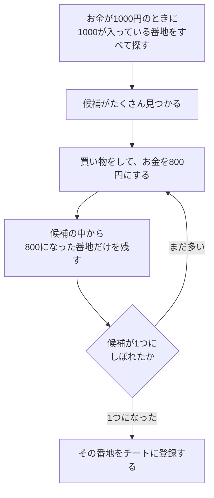
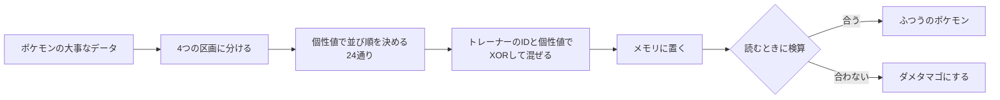
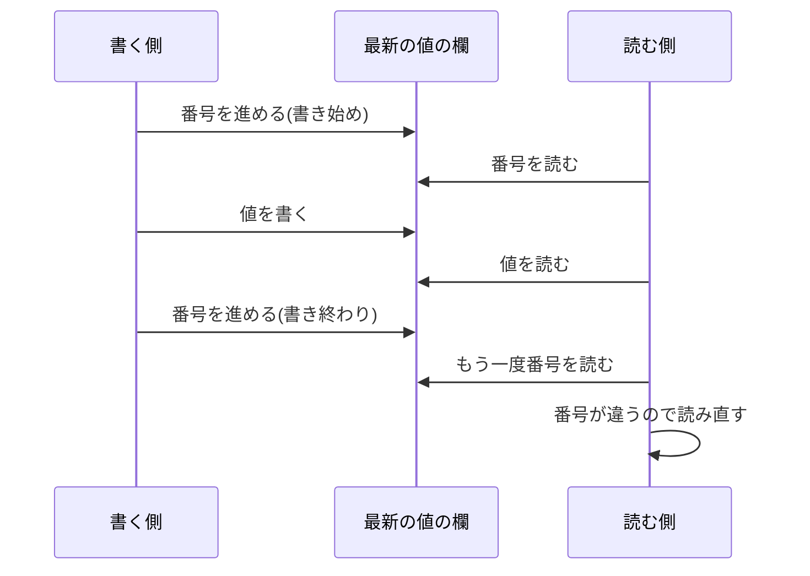

# チートとパススルー

[CPUと機械語](20-cpu.md)までの連載では、ゲームのファイルとプログラムを、止まった状態で読んできました。この記事では、動いているゲームのメモリを、外から読んだり書き換えたりする話を扱います。前半はチート、後半はパススルーと呼ばれる改造です。どちらも、遊んでいる最中のゲームの数字に、外から手を伸ばす技術です。

最後には、RG40XXHとMacの間で、同じ考え方を小さく試す方法を考えます。

## この記事の出典

説明は、次のソースコードとガイドを、コミットを固定して確かめながら進めます。用語の説明には、Wikipediaなどの解説ページへのリンクも本文の中に置きました。

| 出典 | コミット | 使う場所 |
|---|---|---|
| [pokeemerald-expansion](https://github.com/rh-hideout/pokeemerald-expansion) | `dfb0f84` | GBAのメモリの地図、エメラルドの書き換え対策 |
| [mGBA](https://github.com/mgba-emu/mgba) | `3a5e34b` | GBAの番地の一覧、チートコードの形式 |
| [libretro/mgba](https://github.com/libretro/mgba) | `e31759b` | ROCKNIXが使うmGBAのコア(RetroArch向けの部品) |
| [RetroArch](https://github.com/libretro/RetroArch) | `015298c` | チートの機能、外から命令を送る機能 |
| [ROCKNIX](https://github.com/ROCKNIX/distribution) | `ae41127` | RG40XXHでの標準の設定 |
| [ai-game-modding-guides](https://github.com/trevaintdead/ai-game-modding-guides) | `54a9809` | パススルーの改造の進め方、守るべきこと |
| [SkyCraft](https://github.com/chasmlol/SkyCraft) | `bfcaf17` | パススルーの改造の設計 |

## 3種類の調べ方

AIでゲームを改造する人向けのガイド集 ai-game-modding-guides の13章([13-reverse-engineering-and-the-law.md](https://github.com/trevaintdead/ai-game-modding-guides/blob/54a980970606f71996e6f25723d42fb9a95aaae5/guides/13-reverse-engineering-and-the-law.md))は、ゲームの調べ方を3つに分けています。

| 調べ方 | 中身の見え方 | このリポジトリでの例 |
|---|---|---|
| ブラックボックス | 中は見ない。入れたものと出てきたものだけを見る | 遊んで試す。[セーブのファイル](17-save-data.md)を覗く |
| グレーボックス | 動いているときのデータだけを見る | この記事のチートと、メモリの読み取り |
| ホワイトボックス | プログラムの中身をすべて読む | ポケモンの復元プロジェクト、[逆アセンブル](20-cpu.md) |

ガイドは、できる限りブラックボックスを選ぶよう勧めています。何も写さないので、著作権の問題が起きないからです。この記事の話は、その次のグレーボックスにあたります。プログラムそのものは読まず、動いているゲームの数字だけを見ます。

## GBAのメモリの地図

チートを理解する出発点は、ゲーム機のメモリのどこに何があるかです。番地は、メモリの中の住所です。GBAの番地の割り当ては、mGBAのソース([memory.h](https://github.com/mgba-emu/mgba/blob/3a5e34be33dc7f8f707e5bc9db69e8a430046f21/include/mgba/internal/gba/memory.h)の `GBA_BASE_`)で次のように定義されています。

| 始まりの番地 | 名前 | 中身 |
|---|---|---|
| `0x00000000` | BIOS | GBA本体に入っている小さなプログラム |
| `0x02000000` | EWRAM | 大きな作業台(256KB) |
| `0x03000000` | IWRAM | 小さくて速い作業台(32KB) |
| `0x04000000` | IO | ボタンや画面などの部品とやり取りするための領域 |
| `0x05000000` | PALETTE_RAM | 画面用の記憶(色の表) |
| `0x06000000` | VRAM | 画面用の記憶 |
| `0x07000000` | OAM | 画面用の記憶 |
| `0x08000000` | ROM0 | カートリッジのゲーム本体 |
| `0x0E000000` | SRAM | カートリッジのセーブ用の記憶 |

ROMの領域は書き換えられません。チートが書き換えるのは、EWRAMやIWRAMの作業台の数字です。[セーブの仕組み](17-save-data.md)で見たセーブ用の記憶は、`0x0E000000` からの領域にあたります。

pokeemerald-expansionのリンカの設定([ld_script_modern.ld](https://github.com/rh-hideout/pokeemerald-expansion/blob/dfb0f84374230f4d462191601179b742f9f077df/ld_script_modern.ld))も、EWRAMを `0x2000000` から256K、IWRAMを `0x3000000` から32K、ROMを `0x8000000` から32Mと定めていて、mGBAの定義と一致します。

### 自分でビルドしたゲームなら、番地が分かる

自分でビルドしたエメラルドなら、プログラムの記号の一覧からデータの番地を調べられ、この調査のビルドでは次のとおりでした。番地は、ビルドの設定や改造の内容で変わります。

| 記号 | 番地 | 領域 | 中身 |
|---|---|---|---|
| `gSaveblock1` | `0x0200fea4` | EWRAM | セーブするデータの元(お金、かばんなど) |
| `gSaveblock2` | `0x02013bf4` | EWRAM | セーブするデータの元(暗号化の鍵など) |
| `gSaveBlock1Ptr` | `0x030051c4` | IWRAM | `gSaveblock1` の今の置き場所を指す番地 |
| `gMain` | `0x030066c0` | IWRAM | ゲーム全体の管理 |

`gSaveBlock1Ptr` のように、別のデータの置き場所を記録した変数を、ポインターと呼びます。ポインターが必要な理由は、後のエメラルドの節で見ていく話です。

## チートの正体

### チートコードは小さなプログラム

チートの機器は、ゲームのメモリの数字を書き換えるための製品でした。GBA向けには、[GameShark](https://en.wikipedia.org/wiki/GameShark)、[Code Breaker](https://en.wikipedia.org/wiki/Code_Breaker)、[Action Replay](https://en.wikipedia.org/wiki/Action_replay_max_gba/ds)がありました。中国語圏では、チートコードを金手指と呼びます([ポケモンのROM hack](08-pokemon-hacking.md))。

GBAのエミュレーターのmGBAは、4種類のチートコードの形式を読めます([cheats.h](https://github.com/mgba-emu/mgba/blob/3a5e34be33dc7f8f707e5bc9db69e8a430046f21/include/mgba/internal/gba/cheats.h)の `enum GBACheatType`)。

| 形式(`GBA_CHEAT_`) | 由来 |
|---|---|
| `CODEBREAKER` | Code Breaker |
| `GAMESHARK` | GameShark |
| `PRO_ACTION_REPLAY` | Pro Action Replay |
| `VBA` | エミュレーターのVisualBoyAdvance |

Code Breakerの命令の一覧(同じファイルの `CB_`)を見ると、チートコードが小さなプログラムであることが分かります。

| 命令 | していること |
|---|---|
| `CB_ASSIGN_1`、`CB_ASSIGN_2` | 決まった番地に、決まった値を書く |
| `CB_FILL` | 決まった範囲を、同じ値で埋める |
| `CB_OR_2`、`CB_AND_2` | 番地の値の一部のビットを立てる、消す |
| `CB_IF_EQ`、`CB_IF_NE`、`CB_IF_GT`、`CB_IF_LT` | 番地の値が条件に合うときだけ、次の命令を実行する |

いちばん単純なチートは、「この番地に、この値を書き続ける」というものです。お金が入っている番地に大きな値を書き続ければ、お金が減らなくなります。条件の命令を組み合わせれば、「この番地の値が10より小さいときだけ書く」のように、場面を選んで書き換えることもできます。

### RetroArchのチートの機能

[RetroArch](https://github.com/libretro/RetroArch)にも、チートの機能があります([cheat_manager.h](https://github.com/libretro/RetroArch/blob/015298c2e3bb7361207fc1098d3757f645e58595/cheat_manager.h))。チートの種類(`CHEAT_TYPE_`)は、チートの機器と同じ考え方です。

| 種類 | していること |
|---|---|
| `SET_TO_VALUE` | 決まった値にする |
| `INCREASE_VALUE`、`DECREASE_VALUE` | 値を増やす、減らす |
| `RUN_NEXT_IF_EQ`、`RUN_NEXT_IF_NEQ`、`RUN_NEXT_IF_LT`、`RUN_NEXT_IF_GT` | 条件に合うときだけ、次のチートを実行する |

RetroArchが書き換えてよいメモリは、エミュレーターのコアが知らせます。ROCKNIXが使うmGBAのコア([mgba-lrのpackage.mk](https://github.com/ROCKNIX/distribution/blob/ae41127cee7e3e81b1ab3b17b676d91be5165e61/projects/ROCKNIX/packages/emulators/libretro/mgba-lr/package.mk)で `libretro/mgba` の `e31759b` を指定)は、IWRAMとEWRAMに `RETRO_MEMDESC_SYSTEM_RAM` という印を付けています。ソースのコメントは、その目的を「RetroArchがチートのためにこのメモリを触れるようにする」と書いています([libretro.c](https://github.com/libretro/mgba/blob/e31759b24e7a4e3899285ff720d7b573ac328ae7/src/platform/libretro/libretro.c))。ROMの領域には、書き換えられないことを表す `RETRO_MEMDESC_CONST` が付いています。

### メモリを検索してチートを作る

RetroArchには、チートを自分で探すための、メモリの検索の機能もあります。検索の種類(`CHEAT_SEARCH_TYPE_`)は9つです。

| 種類 | 残す番地 |
|---|---|
| `EXACT` | ちょうど指定した値の番地 |
| `LT`、`LTE`、`GT`、`GTE` | 前回より小さい、以下、大きい、以上になった番地 |
| `EQ`、`NEQ` | 前回と同じ、違う番地 |
| `EQPLUS`、`EQMINUS` | 前回よりちょうどいくつ増えた、減った番地 |

お金の番地を探す場合、考え方は次のようになります。



値を変えるたびに候補を減らしていき、最後に残った番地が、お金の番地です。ゲームのプログラムは読まず、動いているときの数字の変化だけを見ています。グレーボックスの典型です。

ゲームの実績を集める[RetroAchievements](https://retroachievements.org/)も、同じ考え方で作られています。公式の説明([How RA Works](https://docs.retroachievements.org/general/how-ra-works.html))によると、実績は、ゲームのメモリの値と、作者が書いた条件を比べて判定されます。実績の作者は、遊んでいる最中のメモリを調べて、使う番地を探すという説明です。同じゲームでも版によって番地が違うことがある、という注意もあります([Rom versions](https://retroachievements.org/forums/topic/3481?comment=24755))。ROCKNIXのH700向けのRetroArchの設定では、RetroAchievementsは標準で切ってあります([retroarch.cfg](https://github.com/ROCKNIX/distribution/blob/ae41127cee7e3e81b1ab3b17b676d91be5165e61/projects/ROCKNIX/packages/emulators/libretro/retroarch/sources/H700/retroarch.cfg)の `cheevos_enable = "false"`)。

## エメラルドの書き換え対策

この検索の手順は、多くのゲームで通用します。ところが、エメラルドでは、そのままでは通用しにくい作りになっていました。pokeemerald-expansionのソースには、メモリの書き換えに備えた仕組みが3つあります。

### 1. お金は鍵で混ぜてある

お金を読む処理と書く処理([money.c](https://github.com/rh-hideout/pokeemerald-expansion/blob/dfb0f84374230f4d462191601179b742f9f077df/src/money.c))は、次のとおりです。

```c
return *moneyPtr ^ gSaveBlock2Ptr->encryptionKey;
...
*moneyPtr = gSaveBlock2Ptr->encryptionKey ^ newValue;
```

`^` は、[排他的論理和](https://ja.wikipedia.org/wiki/%E6%8E%92%E4%BB%96%E7%9A%84%E8%AB%96%E7%90%86%E5%92%8C)(XOR)という計算です。2つの数字を、ビットごとに混ぜます。同じ鍵でもう一度XORすると、元に戻る性質があります。

説明のために鍵を `0x5A3C9E17` として計算した結果が、次の表です。

| | 16進数 | 10進数 |
|---|---|---|
| 本当の金額 | `0x000003E8` | 1000 |
| 鍵 | `0x5A3C9E17` | |
| メモリに置かれる数字(金額 XOR 鍵) | `0x5A3C9DFF` | 1513922047 |
| もう一度鍵でXORした結果 | `0x000003E8` | 1000 |

メモリには、1000ではなく、1513922047という数字が入っています。だから、1000を探しても、お金の番地は見つかりません。

鍵で混ぜてあるのは、お金だけではありません。鍵を新しくする処理(`ApplyNewEncryptionKeyToAllEncryptedData`)が対象にしているのは、ゲームの記録(`GameStats`)、かばんの道具(`BagItems`)、きのみのこな(`BerryPowder`)、お金(`money`)、カジノのコイン(`coins`)の5つです([load_save.c](https://github.com/rh-hideout/pokeemerald-expansion/blob/dfb0f84374230f4d462191601179b742f9f077df/src/load_save.c))。

### 2. データの置き場所が動く

セーブするデータの元の置き場所も、固定されていません。同じload_save.cの `SetSaveBlocksPointers` は、次のように置き場所を決めています。

```c
// Offset is the sum of the trainer id bytes
void SetSaveBlocksPointers(u16 offset)
{
    ...
    offset = (offset + Random()) & (SAVEBLOCK_MOVE_RANGE - 4);

    gSaveBlock2Ptr = (void *)(&gSaveblock2) + offset;
    *sav1_LocalVar = (void *)(&gSaveblock1) + offset;
    gPokemonStoragePtr = (void *)(&gPokemonStorage) + offset;
```

トレーナーのIDのバイトの合計に乱数を足し、その結果からずらす量を決めています。[load_save.h](https://github.com/rh-hideout/pokeemerald-expansion/blob/dfb0f84374230f4d462191601179b742f9f077df/include/load_save.h)では `SAVEBLOCK_MOVE_RANGE` が128なので、`& (128 - 4)` の計算により、ずらす量は0から124までの4の倍数、32通りのどれかです。ずらすための余白を確保する構造体には、`SaveBlock1ASLR` という名前が付けられていました。[ASLR](https://ja.wikipedia.org/wiki/%E3%82%A2%E3%83%89%E3%83%AC%E3%82%B9%E7%A9%BA%E9%96%93%E9%85%8D%E7%BD%AE%E3%81%AE%E3%83%A9%E3%83%B3%E3%83%80%E3%83%A0%E5%8C%96)は、パソコンのOSが攻撃を防ぐために、データの位置をランダムに置く技術の名前です。

ずらす処理(`MoveSaveBlocks_ResetHeap`)は、地図を読み込む処理([overworld.c](https://github.com/rh-hideout/pokeemerald-expansion/blob/dfb0f84374230f4d462191601179b742f9f077df/src/overworld.c)の `ResetMirageTowerAndSaveBlockPtrs`)と、戦闘を始める処理([battle_main.c](https://github.com/rh-hideout/pokeemerald-expansion/blob/dfb0f84374230f4d462191601179b742f9f077df/src/battle_main.c)の `CB2_InitBattle`)から呼ばれます。同じ処理の最後では、鍵も新しく作り直しています。

```c
// create a new encryption key
encryptionKey = Random32();
ApplyNewEncryptionKeyToAllEncryptedData(encryptionKey);
gSaveBlock2Ptr->encryptionKey = encryptionKey;
```

つまり、町を移動したり戦闘を始めたりするたびに、データの番地と、お金を混ぜる鍵の両方が変わる可能性があるわけです。前の表で、鍵を `0x13579BDF` に変えて計算し直すと、同じ1000円がメモリでは `0x13579837`(324507703)になります。一度見つけた番地や数字が、次の場面では使えなくなることがある、ということです。

ゲームの中のプログラムは、ずれた後の置き場所を、`gSaveBlock1Ptr` などのポインターで追いかけています。外からデータを読むときも、先にポインターを読んで今の置き場所を知る必要があります。

### 3. ポケモンのデータは、混ぜて、並べ替えて、検算してある

ポケモン1匹のデータも守られています([pokemon.c](https://github.com/rh-hideout/pokeemerald-expansion/blob/dfb0f84374230f4d462191601179b742f9f077df/src/pokemon.c))。大事な部分(`secure`)は、4つの区画に分かれています。pokeemerald-expansionの定義([pokemon.h](https://github.com/rh-hideout/pokeemerald-expansion/blob/dfb0f84374230f4d462191601179b742f9f077df/include/pokemon.h))では、区画ごとに次の情報が入ります。

| 区画 | 入っている主な情報 |
|---|---|
| `PokemonSubstruct0` | ポケモンの種類、持ち物、経験値、なつき度 |
| `PokemonSubstruct1` | 覚えている技 |
| `PokemonSubstruct2` | 努力値 |
| `PokemonSubstruct3` | ポケルス、出会った場所、出会ったときのレベルなど |

この4つの区画を守る方法は、3つです。

| 守り方 | ソースの該当箇所 | 内容 |
|---|---|---|
| 混ぜる | `EncryptBoxMon`、`DecryptBoxMon` | 大事な部分を、トレーナーのID(`otId`)と個性値(`personality`)でXORする |
| 並べ替える | `GetSubstruct` の `personality % 24` | 4つの区画の並び順を、個性値で決める。4つの並べ方は24通り |
| 検算する | `CalculateBoxMonChecksum`、`IsBadEgg` | 区画の数字を足し合わせた値が、記録されたチェックサムと合うかを確かめる |



検算が合わないと、`IsBadEgg` はそのポケモンに「ダメタマゴ」の印を付け、タマゴとして扱います。ポケモンの百科事典Bulbapediaの[Bad Egg](https://bulbapedia.bulbagarden.net/wiki/Bad_Egg)の項目も、ダメタマゴ(英語版では Bad EGG)を、データの検算が合わないポケモンを扱う仕組みとして説明しています。挙がっている原因は、データの破損と、チートや外部の道具で検算をし直さずにデータを書き換えたことです。

### 対策から分かること

これらの仕組みが、どこまでチートを防ぐ目的で入れられたのかは、ソースからは分かりません。確かなのは、固定の番地に固定の値を書くだけの単純なチートが、エメラルドでは効きにくい作りになっていることです。

| チートの手順 | エメラルドで起きること |
|---|---|
| 1000円のときに1000を探す | お金は鍵で混ぜてあるので、見つからない |
| 見つけた番地に書き続ける | 地図の読み込みや戦闘のたびに、番地と鍵が変わり得る |
| ポケモンのデータを書き換える | 検算が合わなくなり、ダメタマゴになる |

## RetroArchを外から操作する

ここからは、メモリを読む考え方を、RG40XXHとMacの間で使う話です。

### ネットワークの命令の仕組み

RetroArchには、ネットワーク越しに命令を受け取る機能があります([command.c](https://github.com/libretro/RetroArch/blob/015298c2e3bb7361207fc1098d3757f645e58595/command.c))。受け付ける方式は[UDP](https://ja.wikipedia.org/wiki/UDP)です。標準の番号(ポート)は55355で、機能そのものはRetroArchの標準では切ってあります([config.def.h](https://github.com/libretro/RetroArch/blob/015298c2e3bb7361207fc1098d3757f645e58595/config.def.h)の `DEFAULT_NETWORK_CMD_ENABLE false`)。ROCKNIXのH700向けの設定でも、`network_cmd_enable = "false"`、`network_cmd_port = "55355"` です([retroarch.cfg](https://github.com/ROCKNIX/distribution/blob/ae41127cee7e3e81b1ab3b17b676d91be5165e61/projects/ROCKNIX/packages/emulators/libretro/retroarch/sources/H700/retroarch.cfg))。

命令の一覧は [command.h](https://github.com/libretro/RetroArch/blob/015298c2e3bb7361207fc1098d3757f645e58595/command.h) にあります。この記事に関係するのは、次の4つです。

| 命令 | 内容 |
|---|---|
| `GET_STATUS` | 遊んでいるか止まっているかと、ゲームの機種、名前、CRC32を返す |
| `READ_CORE_MEMORY <番地> <バイト数>` | ゲーム機のメモリを読む |
| `WRITE_CORE_MEMORY <番地> <値>...` | ゲーム機のメモリに書く。ソースでは「破壊的」(`CMD_INFO_DESTRUCTIVE`)な命令に分類されている |
| `SHOW_MSG <文章>` | 画面にメッセージを出す |

### メモリを読む命令の細かい決まり

`READ_CORE_MEMORY` の処理(command.c の `command_read_memory`)を読むと、次の決まりが分かります。

- 番地は16進数、バイト数は10進数で書く
- 1回に読めるのは16384バイトまで(`COMMAND_READ_NBYTES_MAX`)
- 返事は、`READ_CORE_MEMORY` の後ろに番地を16進数で書き、読んだバイトを2桁の16進数で並べた1行
- コアがメモリの地図を知らせていなければ `-1 no memory map defined`、番地がどの領域にも当たらなければ `-1 no descriptor for address` と返す
- 返事は、命令を送ってきた相手に送り返す

たとえば、この調査のビルドの `gSaveBlock1Ptr` を読むなら、やり取りの形は次のようになります。返事の `XX` の部分が、読んだ4バイトです。

```
送る:   READ_CORE_MEMORY 30051c4 4
返事:   READ_CORE_MEMORY 30051c4 XX XX XX XX
```

この命令の番地は、ゲーム機の番地です。command.h の説明も、実績用の番地を使う別の命令(`READ_CORE_RAM`)と区別して、`READ_CORE_MEMORY` は「system address」を使うと書いています。前の節で見たとおり、ROCKNIXが使うmGBAのコアは、IWRAMを `0x03000000`、EWRAMを `0x02000000` として、GBAの番地のままRetroArchに知らせています。そのため、GBAの番地で読める作りになっているはずです。実機での動作は、まだ確かめていません。

## パススルーの改造

### 2つのゲームを1つにする

パススルーの改造は、2つのゲームを同時に動かし、つないで1つのゲームのように見せる改造です。代表例の[SkyCraft](https://github.com/chasmlol/SkyCraft)は、スカイリムの中でマインクラフトを遊べるようにしています。設計書([DESIGN.md](https://github.com/chasmlol/SkyCraft/blob/bfcaf178524b92c2cdeb88e4ce0f13ef9ded6f32/docs/DESIGN.md))の最初の方針は、「どちらのゲームも作り直さない」です。マインクラフトは、自分の移動、当たり判定、戦闘の計算を、改造せずにそのまま動かします。

| 役割 | 担当するゲーム |
|---|---|
| 画面に描く、壁の当たり判定、NPC | スカイリム |
| プレイヤーの位置と物理の計算 | マインクラフト(窓は隠して、裏で動かす) |
| プレイヤーの体力 | マインクラフト |

ガイド集の2章([02-passthrough-mods.md](https://github.com/trevaintdead/ai-game-modding-guides/blob/54a980970606f71996e6f25723d42fb9a95aaae5/guides/02-passthrough-mods.md))は、ふつうの改造が「1つのゲームの中に、もう1つのゲームの中身を入れる」ものであるのに対し、パススルーは「どちらも、もう一方が動いていないと成り立たない」ものだという説明です。2つのゲームが同時に動くので、遊ぶ人は両方のゲームを持っている必要があります。

### 2つのゲームの話し方

2つのゲームは、[共有メモリ](https://ja.wikipedia.org/wiki/%E5%85%B1%E6%9C%89%E3%83%A1%E3%83%A2%E3%83%AA)でつながっています。2つのプログラムが、同じメモリの区画を同時に開いて読み書きする方法です。片方が書けば、もう片方からすぐに見えます。同じ機械の中でしか使えません。

SkyCraftの設計書によると、共有メモリの名前は `Local\SkyCraft_v1` で、中は次のように区切られています。

| 区画 | 中身 | たとえ |
|---|---|---|
| 見出し(header) | 目印の数字、取り決めの版、両方のプロセスの番号、心拍 | 交換日記の表紙 |
| 最新の値の欄 | `PlayerState`(プレイヤー)、`CameraState`(カメラ)、`FrameSync`(何コマ目か) | ホワイトボード |
| 2本のリングバッファ | スカイリムからマインクラフトへ、マインクラフトからスカイリムへの出来事 | 片道ずつの連絡帳 |
| 名前付きのイベント | 待っている側を起こす合図 | 呼び鈴 |

### ホワイトボードとseqlock

最新の値の欄は、[seqlock](https://en.wikipedia.org/wiki/Seqlock)という方法で守られています。Wikipediaの説明によると、書く側の決まりは、書き始めと書き終わりに番号を1つずつ進めることです。読む側は、読む前と読んだ後の番号を比べ、違っていたら、途中で書き換えられたと分かるので読み直します。ホワイトボードを読んでいる最中に書き換えられても、気づける仕組みです。



同じWikipediaの項目は、seqlockが、ポインターを含むデータには使えないとも書いています。書く側がポインターの指す先を変えてしまうと、読む側がすでに辿ったポインターが、意味を失うためです。

### 連絡帳とリングバッファ

1回だけ起きる出来事(ブロックを置いた、攻撃が当たった)は、ホワイトボードに書くと、次の書き込みで消えてしまいます。そこで、[リングバッファ](https://ja.wikipedia.org/wiki/%E3%83%AA%E3%83%B3%E3%82%B0%E3%83%90%E3%83%83%E3%83%95%E3%82%A1)に順番に書きます。リングバッファは、端と端をつないで輪の形にして使う、データの一時的な置き場です。書く位置が最後まで行くと、先頭に戻ります。SkyCraftの2本のリングバッファは、どちらも書く側と読む側が1つずつの、SPSC(single producer, single consumer)という形です。

### 設計の3つの決まり

ガイド集の2章は、書き始める前にエージェントに伝えるべき決まりを3つ挙げています。

1. 取り決めは1か所で定義し、両方の言語のコードをそこから作る。SkyCraftは、取り決めからC++とJavaの両方のコードを作り、両方の並び方を自動のテストで確かめている
2. すべて決まった大きさで、リトルエンディアンで並べる
3. 片方が落ちても、もう片方は生き残る。心拍で相手の停止に気づき、マインクラフトが落ちたらスカイリムの操作をプレイヤーに返し、スカイリムが落ちたらマインクラフトを止める

これらは、連載で見てきた仕組みと同じ考え方です。[ELFの先頭の目印](20-cpu.md)、[MBRのリトルエンディアンの数字](19-boot.md)、[エメラルドのセーブの目印と2つの枠](17-save-data.md)は、どれも、おかしくなったデータを使わないための工夫でした。

### 作る順番

ガイド集の9章([09-worked-example-passthrough-mod.md](https://github.com/trevaintdead/ai-game-modding-guides/blob/54a980970606f71996e6f25723d42fb9a95aaae5/guides/09-worked-example-passthrough-mod.md))は、最初から最後までの流れを、エージェントへの指示文つきで説明しています。

1. 組み合わせを選ぶ。画面を担当するゲームには改造を読み込む道具(mod loader)が、裏で動くゲームには改造のための仕組み(mod API)が必要
2. どちらのゲームが、何の値の持ち主かを先に決める。SkyCraftでは、画面を描くスカイリムではなく、マインクラフトがプレイヤーの位置の持ち主
3. 値を1つだけ送る。プレイヤーの位置を毎コマ送り、送った値と受け取った値を、両方の記録に残して比べる
4. 逆向きにも1つ送る
5. 機能を1つずつ足し、そのたびに遊んで確かめてから記録する
6. カクつきを直す。2つのゲームを動かすので、メモリもおよそ2倍要る
7. セーブと読み込みを合わせる。2つのゲームに、それぞれのセーブがあるため

9章は、うまくいく組み合わせとして、スカイリム、Fallout 4、Outer Wildsとマインクラフトの組み合わせなどを挙げています。時間がかかる原因として挙がっているのは、ゲームの版が変わって改造が動かなくなること、2つのゲームの座標の決め方の違い、2つのセーブ、画面とコマの時計の取り合いの4つです。

### うまくいかない考え

ガイド集の2章には、うまくいかない考えの表もあります。

| 考え | 理由 |
|---|---|
| オンラインのゲームを、裏で動く側に使う | 範囲外。ガイドの6章の決まりに反する |
| 改造の土台もソースもないゲームを、画面を担当する側に使う | 先にエンジン全体を解析することになる |
| 裏で動くゲームを、画面に何も描かずに動かす | 画面を重ねることが要なので、描かなければ成り立たない |
| LinuxやmacOSで動く改造にする | 改造の土台がWindows向けの道具だから |
| 2つ目のゲームの素材を一緒に配る | 配るのはコードと準備の手順だけ。ゲームは遊ぶ人が用意する |

## RG40XXHでの小さなパススルー

SkyCraftのような改造は、Windows版の大きなゲームを2つ同時に動かす前提です。メモリ1GBのLinuxの機械であるRG40XXHには向きません。ただ、2つのプログラムが数字をやり取りする考え方は、RG40XXHとMacの組み合わせにも当てはまります。

| | SkyCraft | RG40XXHとMac |
|---|---|---|
| つなぎ方 | 同じ機械の共有メモリ | Wi-Fi越しのUDP(RetroArchの命令) |
| 値の持ち主 | プレイヤーの位置はマインクラフト | ゲームの状態は、RG40XXHのエミュレーター |
| 見出しの確認 | 目印と版の番号 | `GET_STATUS` で、ゲームの名前とCRC32を確かめる |
| 相手の停止の検知 | 心拍 | 一定の間隔で `GET_STATUS` を送り、返事が来るかを見る |
| 最初の1歩 | プレイヤーの位置を1つ送る | 番地を1つ読み、Macの画面に表示する |

### 考えられる手順

ここから先は、ソースで確かめた仕組みを組み合わせた手順の案です。実機では、まだ試していません。

1. RG40XXHのRetroArchの設定で、ネットワークの命令を有効にする
2. Macから `GET_STATUS` を送り、自分でビルドしたエメラルドが動いていることを確かめる
3. `READ_CORE_MEMORY` で `gSaveBlock1Ptr` を読み、今の置き場所を知る
4. その置き場所から、知りたいデータの番地を計算して読む
5. もう一度 `gSaveBlock1Ptr` を読み、手順3と同じ値かを確かめる。違っていれば、途中で置き場所が動いたので読み直す

UDPは、送ったデータが届くことを保証しない方式です([UDP](https://ja.wikipedia.org/wiki/UDP))。返事が来なかったときは、命令を送り直す作りにします。

手順5は、seqlockの読む側と同じ発想です。エメラルドは、地図の読み込みや戦闘の開始でデータの置き場所を動かすので、ポインターを読んでから本体を読むまでの間に、置き場所が変わることがあり得ます。前後で同じ値かを確かめれば、そのずれに気づけます。

読みたいデータがお金のように鍵で混ぜてある場合は、鍵も読んでXORで戻すことが必要です。ポケモンのデータを読む場合は、個性値で並べ替えて、IDと個性値で混ぜてあることを考えて、元に戻す必要があります。

## 守ること

ガイド集の6章([06-rules-legal-and-publishing.md](https://github.com/trevaintdead/ai-game-modding-guides/blob/54a980970606f71996e6f25723d42fb9a95aaae5/guides/06-rules-legal-and-publishing.md))には、改造全般の決まりが書かれています。チートとパススルーに関係するものは、次のとおりです。

- 1人用のゲームか、オフラインのゲームだけを対象にする。オンラインのゲームや、チート対策(アンチチート)のあるゲームには手を出さない。アンチチートを回避する道具、設定、手順は、決して公開しない
- 長い自動の操作を始める前や、ゲームのフォルダに何かを入れる前には、使っている人に確かめる
- リポジトリにゲームのファイルを入れない

RetroArchのネットワークの命令については、ソースのコメント(command.c の `command_network_new`)が注意を書いています。待ち受ける場所を指定しないと、すべてのネットワークの入り口で命令を受け付けるので、同じネットワークにいる誰でも、コアの読み込みやメモリの書き込みの命令を送れてしまいます。同じ機械からしか使わないなら、`network_cmd_bind_address = "127.0.0.1"` を設定できる、という説明です。MacからRG40XXHを操作する場合は、自宅のような信頼できるネットワークだけで有効にし、使い終わったら切るのが安全です。

この記事の範囲では、次の点も加えておきます。

- チートや `WRITE_CORE_MEMORY` で書き換える前に、[セーブのファイル](17-save-data.md)を保存しておく。エメラルドでは、書き換え方を間違えると、ポケモンがダメタマゴになります
- 自分でビルドしたROMや、吸い出したROMを配らない([ROMとBIOSの扱い方](12-roms-and-bios.md))

## この記事で出てくる中国語

中国語は、このリポジトリのほかの記事で出典を確認した語から、この記事の話題に関わるものを選びました。

| 中国語 | ピンイン | 日本語の意味 | 出典 |
|---|---|---|---|
| 金手指 | jīn shǒu zhǐ | チートコード | [口袋改版资源吧](https://tieba.baidu.com/f?kw=%E5%8F%A3%E8%A2%8B%E6%94%B9%E7%89%88%E8%B5%84%E6%BA%90) |
| 模拟器 | mónǐqì | エミュレーター | [模拟器游戏 篇四](https://zhuanlan.zhihu.com/p/703325151) |
| 内存 | nèicún | メモリ | [掌机圈 RG-35XX H](https://zhangjiquan.com/handheld/rg-35xx-h) |
| 口袋妖怪 | kǒudài yāoguài | ポケモン | [口袋妖怪改版吧](https://tieba.baidu.com/f?kw=%E5%8F%A3%E8%A2%8B%E5%A6%96%E6%80%AA%E6%94%B9%E7%89%88) |
| 备份 | bèifèn | バックアップ | [百度の検索結果](https://www.baidu.com/s?wd=RG40XXH%20%E5%88%B7%E6%9C%BA%20%E5%9B%BA%E4%BB%B6%20Knulli%20%E6%95%99%E7%A8%8B) |
| 配置 | pèizhì | 設定 | [天马G前端的使用](https://blog.csdn.net/fanged/article/details/152960565) |

## 学べること

チートは、動いているゲームのメモリの番地を見つけて、数字を書き換える技術です。チートコードは「この番地にこの値」と条件を組み合わせた小さなプログラムで、RetroArchのメモリの検索を使えば、プログラムを読まずに番地を探せます。エメラルドは、お金を鍵で混ぜ、データの置き場所を動かし、ポケモンのデータを混ぜて並べ替えて検算するので、単純なチートが効きにくい作りでした。

パススルーの改造は、2つのプログラムの間で数字をやり取りする技術で、目印、版、心拍、相手が止まったときの備えという、連載で見てきた考え方の組み合わせでできています。RG40XXHでは、RetroArchのネットワークの命令と、GBAの番地を知らせるmGBAのコアを使えば、Wi-Fi越しに同じ考え方を小さく試せる作りになっています。試すときは、信頼できるネットワークで、セーブを保存してから始めるのが安全です。
