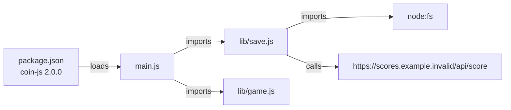
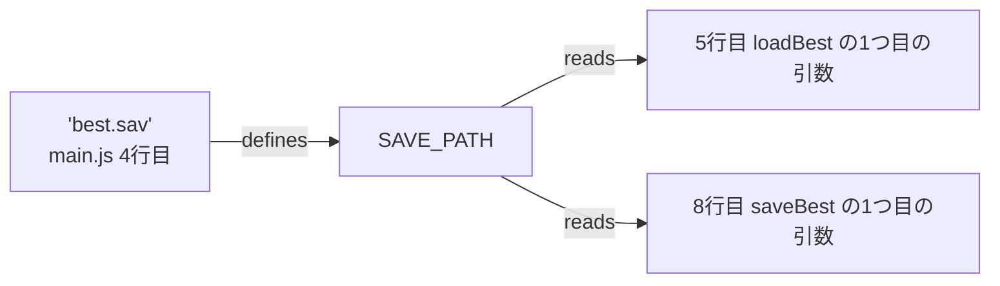

# REAでリバースエンジニアリングを体験する

[チートとパススルー](21-cheats-and-passthrough.md)では、動いているゲームのメモリを外から覗く話をしました。この記事では、AIエージェント向けのリバースエンジニアリングの道具 [REA](https://github.com/morluto/rea) を実際にダウンロードして動かし、4つの実験をします。

1. RG40XXHのSDカードと同じ並びのイメージを作り、REAで分解する
2. 小さなゲームの動きだけを見て作り直し、元と作り直しをREAで比べる
3. .NETのゲームを、実行せずに覗き、版の違いを比べる
4. JavaScriptのゲームを、実行せずに読み、版の違いを比べる

機械語の中身を読む実験は、量が多いため、次の [REAとGhidraで機械語を読む](23-rea-and-ghidra.md) に分けました。

題材は、すべてこの記事のために自分で作ったものか、配布元が公開しているものです。実験はx86_64のUbuntu 24.04で行いました。実験で使ったソースは [examples/rea-lab](../examples/rea-lab) に置いています。

## REAとは

REAは、「あらゆるものをリバースエンジニアリング」を掲げる道具です。[日本語のREADME](https://github.com/morluto/rea/blob/472b72a53068a8e2ec78fe239d687023482daaa7/README_ja.md)によると、ソースコードのないアプリを、エージェントに調べさせ、仕組みと根拠を示させるためのものです。機械語のプログラム(ELF、Mach-O、PE)、JavaScriptやElectronのアプリ、.NETのプログラム、Webサイトを扱えます。ライセンスはMITで、npmでは `rea-agents` という名前で配られています。

READMEが書いているREAの立場は、次の3つです。

- 元のソースコードを復元したり、アプリ全体を自動で複製したりするとは主張しない
- 解析は手元の機械で行い、調べるプログラムを外のサービスへ送らない
- 結果には、根拠と制限を含める

この記事で使ったのは、npmの `rea-agents` 4.1.0です。ソースの引用は、GitHubのコミット `472b72a` から行い、引用した処理がnpmの4.1.0にも同じ形で入っていることを確かめました。

### REAもELFの18バイト目を見ている

REAは、プログラムの種類を、ファイルの先頭の数バイトで見分けています([binaryTarget.ts](https://github.com/morluto/rea/blob/472b72a53068a8e2ec78fe239d687023482daaa7/src/domain/binaryTarget.ts))。先頭が `7f 45 4c 46` ならELFとして扱い、先頭から18バイト進んだ位置の数字で、CPUの種類を決めます。

| 18バイト目からの数字 | REAの判定 |
|---|---|
| 3 | x86(32ビット) |
| 62 | x86_64 |
| 40 | arm(32ビット) |
| 183 | arm64 |

[CPUと機械語](20-cpu.md)では、aarch64向けのファイルのこの位置が `b7 00`(183)、x86_64向けが `3e 00`(62)でした。REAも、同じ場所を同じように読んでいます。

## 準備したもの

| もの | 版 | 入手先 | 役目 |
|---|---|---|---|
| REA | 4.1.0 | npm の `rea-agents` | 本体 |
| Binwalk | 3.1.0 | crates.ioからビルド | ファームウェアの中から、知っている形式の目印を探す |
| Unblob | 26.6.4 | PyPI | ファームウェアの中身を取り出す |
| 7z、sasquatch | — | Ubuntuのパッケージと、ソースからのビルド | Unblobが、FATとsquashfsを取り出すときに使う |
| Mono(`mcs`) | 6.8.0.105 | Ubuntuのパッケージ | 実験3のC#を変換し、動かす |
| Node.js | 22.22.0 | — | 実験4のJavaScriptを動かす |
| u-boot-sunxi | 2024.01+dfsg-1ubuntu5 | Ubuntu 24.04のARM向けの配布所 | 本物のAllwinner用のU-Boot |

BinwalkとUnblobの版は、REAの[ファームウェアの解析の説明](https://github.com/morluto/rea/blob/472b72a53068a8e2ec78fe239d687023482daaa7/docs/firmware-analysis.md)が指定しているものに合わせました。REAは、これらの道具を自分では入れません。道具の場所は、環境変数 `REA_BINWALK_COMMAND` と `REA_UNBLOB_COMMAND` で教えます。

機械語の中身を読むには、Ghidra、Hopper、IDA Proのどれかの解析エンジンが必要です。この記事の実験は、解析エンジンがなくても動くものに絞りました。Ghidraを使う実験は、[次の記事](23-rea-and-ghidra.md)で行います。

## 実験1:SDカードのイメージを分解する

### 教材のイメージを作る

[電源を入れてから](19-boot.md)で読んだROCKNIXのSDカードの並びに合わせて、教材用のイメージを作りました。起動用の領域は、本物の2GBではなく64MBに縮めています。

| 位置 | 中身 |
|---|---|
| 0セクター目 | MBR(パーティションの目次) |
| 8KiBの位置 | 本物のAllwinner用のU-Boot |
| 32768セクター目から64MB | FAT。`KERNEL`、`SYSTEM`、`extlinux/extlinux.conf`、DTB |
| その後ろの32MB | ext4。`roms/gb/best.sav` |

`KERNEL` とDTBは、中身が数十バイトの見本です。`SYSTEM` は、ROCKNIXと同じsquashfsの形式で作り、中に `/usr/bin/coin_term` を1本入れました。これは、実験2で使うゲームを、RG40XXHのCPU向け(aarch64)に変換したものです。

U-Bootは、Ubuntuの `u-boot-sunxi` に入っているOrange Pi Zero Plus2用のものを使いました。このパッケージには、RG40XXHのH700向けのものはありません。Orange Pi Zero Plus2はAllwinnerのH5というチップの機械で、同じAllwinnerの起動の形式の見本として使っています。

### 本物のU-Bootの先頭を読む

イメージの8KiBの位置の16バイトは、次のとおりでした。

```
16 00 00 ea  65 47 4f 4e 2e 42 54 30  7d 6b 15 13
             e  G  O  N  .  B  T  0
```

U-Bootのソースの [sunxi_image.h](https://github.com/u-boot/u-boot/blob/8d7bc8add17bbc69a58dfe0002eea039dd2dc1bc/include/sunxi_image.h) は、この見出しを `struct boot_file_head` として定義しています。

| バイト | 定義の名前 | 意味 |
|---|---|---|
| `16 00 00 ea` | `b_instruction` | 本物のプログラムへ飛ぶ1つの命令 |
| `eGON.BT0` | `magic` | 目印 |
| `7d 6b 15 13` | `check_sum` | 検算用の数字 |

先頭の4バイトを32ビットのARMの命令として読むと、`b 0x60`(0x60番地へ飛ぶ)になりました。見出しを飛び越えて、その先のプログラムへ進む命令です。記事19で書いた目印 `eGON.BT0` が、本物のファイルにも入っていることを確かめられました。

### 目印を探す(inspect-firmware-regions)

まず、中身を取り出さずに、目印だけを探しました。

```sh
export REA_BINWALK_COMMAND=/path/to/binwalk
rea inspect-firmware-regions lab.img --json
```

Binwalkが見つけたのは、次の1件だけでした。

```
offset 0  mbr  "DOS Master Boot Record, partition: FAT32, partition: Linux"
```

結果には、REAが付けた制限が4つ添えられていました。1つ目は、「目印が見つかっても、区画が正しいこと、暗号化されていないこと、動くときの配置は分からない」という内容です。目印を探す道具は、あくまで「知っている形が、ここにありそうだ」と教えるだけです。

### 中身を取り出す(extract-firmware)

次に、Unblobで中身を取り出しました。

```sh
export REA_UNBLOB_COMMAND=/path/to/unblob
rea extract-firmware lab.img out --json
```

1回目と2回目は、途中で止まりました。止まった理由は、足りない道具の名前つきで返ってきます。

| 回 | REAの報告 | したこと |
|---|---|---|
| 1回目 | 入力全体について、`7z` が見つからない(`ExtractorDependencyNotFoundReport`) | Ubuntuの `7zip` を入れた |
| 2回目 | FATから出てきた `SYSTEM` について、`sasquatch` が見つからない | [sasquatch](https://github.com/onekey-sec/sasquatch) をソースからビルドした |
| 3回目 | 足りない道具の報告はなし | 取り出しが最後まで進んだ |

3回目の結果を木の形に並べると、次のようになります。

```
lab.img
├── 0-16777216.unknown               … 先頭の16MiB(MBRとU-Boot)は「不明」のまま
├── 16777216-83886080.fat_extract/   … FATの中身
│   ├── KERNEL
│   ├── extlinux/extlinux.conf
│   ├── device_trees/sun50i-h700-anbernic-rg40xx-h.dtb
│   ├── SYSTEM
│   └── SYSTEM_extract/              … squashfsの中身
│       ├── etc/os-release
│       └── usr/bin/coin_term        ← RG40XXH向けのゲーム
├── 83886080-117440512.extfs_extract/
│   └── roms/gb/best.sav             ← 2バイトのセーブ
└── 117440512-118489088.padding      … 末尾の余白
```

取り出した `coin_term` のSHA-256は、イメージに入れる前のファイルと一致しました(`fee30d64…`)。

3回目でも、取り出しの範囲(coverage)は `partial`(一部)と報告されました。先頭の16MiBが「不明」のまま残ったためです。この実験では、BinwalkもUnblobも、Allwinnerの `eGON.BT0` の見出しを見分けませんでした。この部分は、記事19の知識で読むことになります。

### 取り出したゲームを調べる(inspect-artifact)

最後に、取り出したゲームをREAに調べさせました。

```sh
rea inspect-artifact out/.../SYSTEM_extract/usr/bin/coin_term --json
```

REAは、形式をELFと判定しました。そのうえで、次のことを結果に書いています。

- まだ調べていない枝(`unexplored_branches`)として、「形式ごとの解析が必要。`open_binary` は実行していない」
- 次に試すこと(`next_probes`)として、「関数の解析の前に、解析エンジンを1つ選んで `open_binary` を実行する」

解析エンジンがない状態では、ここから先には進めません。REAは、進めなかったことを、進めなかったと書いて止まります。この続きは、Ghidraを入れてから、[次の記事](23-rea-and-ghidra.md)で行います。

## 実験2:動きだけを見て作り直す

### 元のゲーム

端末で遊ぶ、コイン集めのゲームをC言語で書きました([coin_term.c](../examples/rea-lab/coin_term.c))。

- 幅10マスの1行で、`@` が自分、`$` がコイン
- `a` で左、`d` で右に動く。コインを取ると10点で、コインは別の場所へ移る
- `q` で終わる。最高点を超えたら、`best.sav` に、[gbdk-coin-plus](../examples/gbdk-coin-plus) と同じ形の2バイト(目印の `0x4B` と点数)で保存する

### 動きを記録する(capture-process)

REAの `capture-process` は、プログラムを決まった操作で動かし、画面に出た文字、終わり方、ファイルの変化を記録します([process-capture.md](https://github.com/morluto/rea/blob/472b72a53068a8e2ec78fe239d687023482daaa7/docs/process-capture.md))。操作は、JSONのシナリオに書きます。

```json
{
  "executable": "/path/to/coin_term",
  "working_directory": "/path/to/run",
  "filesystem_observation_paths": ["/path/to/run"],
  "events": [
    { "type": "input", "at_ms": 300, "data": "ddddddd\r" },
    { "type": "input", "at_ms": 800, "data": "q\r" }
  ],
  "normalization": { "ports": false, "time_bucket_ms": 1000 },
  "timeout_ms": 10000
}
```

この操作Aは、「右に7歩進んでから終わる」です。記録には、画面の様子、終了コード0、`best.sav` が作られたこととそのSHA-256が残りました。

```
[@......$..] score=0 best=0
[.@.....$..] score=0 best=0
...
[......@$..] score=0 best=0
[..$....@..] score=10 best=0
bye score=10
```

### 落とし穴1:標準の設定が、点数を伏せていた

最初の記録では、画面の `score=10` が `score=<port>` に置き換わっていました。REAは、比べる前の整え方(正規化)として、標準では、`:` か `=` の直後にある2桁から5桁の数字を、通信のポート番号と見なして伏せます([ProcessNormalization.ts](https://github.com/morluto/rea/blob/472b72a53068a8e2ec78fe239d687023482daaa7/src/application/ProcessNormalization.ts)の `(?<=[:=])\d{2,5}\b`)。

このままでは、点数が違っても気づけません。上のシナリオでは、`"ports": false` で、この整え方を切っています。道具の標準の設定が、見たい違いを隠すことがある、という例です。

### 作り直す

操作Aの記録だけを見て、同じゲームをPythonで作り直しました([coin_rebuild.py](../examples/rea-lab/coin_rebuild.py))。記録から分かったのは、次のことです。

- 幅は10マス。`@` は0から、`$` は7から始まる
- `d` で右に1マス動く
- `$` を取ると10点。7の次のコインは2
- 終わるときに、`best.sav` へ `0x4B` と点数の2バイトを書く

左の壁にぶつかったときの動きは、記録にありません。作り直しでは、ここを「反対側へ回り込む」と推測して書きました。記録にない部分を推測で埋めると何が起きるかを確かめるためです。

### 比べる(compare-process-captures)

元と作り直しを、同じ2つの操作で記録して比べました。

| 操作 | 元(C言語) | 作り直し(Python) |
|---|---|---|
| A:右に7歩(記録を取った操作) | 10点。`best.sav` は `75 10` | 画面も `best.sav` も同じ |
| B:左に2歩、右に1歩(試していない操作) | 左の壁で止まり、最後は1マス目 | 右端へ回り込み、最後は9マス目 |

操作Bの最後の画面は、次のように違いました。

```
元        [.@.....$..] score=0 best=0
作り直し  [.......$.@] score=0 best=0
```

記録を取った操作では同じでも、記録していない場面では違う動きになるわけです。REAの説明も、「観測が欠けていても、2回の実行が同じだったことにはならない」と書いています。ブラックボックスで作り直すときは、試す操作を増やすほど、違いを見つけられます。

### 落とし穴2:REAの「同じ」は厳しい

REAの `compare-process-captures` は、操作Aでも「違いあり」(`changed`)と判定しました。画面の文字とセーブは同じだったので、何が違ったのかを記録で確かめました。

| 比べた項目 | 元(C言語) | 作り直し(Python) |
|---|---|---|
| 画面の出力の区切り | 29、123、90、3、14文字ずつ | 29、125、88、3、14文字ずつ |
| 終わってから落ち着くまで | 72ミリ秒 | 77ミリ秒 |
| ファイルを調べ直した時刻 | 918ミリ秒後 | 928ミリ秒後 |

違っていたのは、画面の出力が端末へ届いた区切り方と、時間の数字です。時刻を1秒単位にまとめる設定(`time_bucket_ms`)にしても、これらは違いとして残りました。REAは、違いがないと言い切れないときに「同じ」とは判定しません。判定の言葉だけを見ず、何が違うのかの中身まで確かめる必要があります。

### 落とし穴3:比べるには、作業のフォルダもそろえる

最初は、元と作り直しを別々のフォルダで動かしたため、比べる命令がエラーで止まりました。REAは、記録ごとに「比べるための約束」(comparison contract)を作り、それが同じ記録どうししか比べません([processComparison.ts](https://github.com/morluto/rea/blob/472b72a53068a8e2ec78fe239d687023482daaa7/src/domain/processComparison.ts))。約束には、作業のフォルダ、観察するフォルダ、端末の大きさ、操作の時刻、整え方の設定などが入ります([processScenario.ts](https://github.com/morluto/rea/blob/472b72a53068a8e2ec78fe239d687023482daaa7/src/domain/processScenario.ts)の `processComparisonContract`)。動かすプログラムそのものは約束に入らないので、元と作り直しを比べられます。同じフォルダで、毎回 `best.sav` を消してから記録し直すと、比べられるようになりました。

## 実験3:.NETのプログラムを実行せずに覗く

同じルールのコイン集めを、C#で書きました([CoinGame.cs](../examples/rea-lab/CoinGame.cs))。Ubuntuの `mono-mcs` で `CoinGame.exe` に変換し、REAに読ませました。REAは、.NETのプログラムを読み込まず、実行もせずに調べます([managed-code-analysis.md](https://github.com/morluto/rea/blob/472b72a53068a8e2ec78fe239d687023482daaa7/docs/managed-code-analysis.md))。

```sh
rea inspect-managed-members CoinGame.exe --json
```

結果からは、次のことが読み取れました。

| 分かったこと | 結果の中身 |
|---|---|
| 型 | `CoinGame` |
| 変数(フィールド) | `SaveMagic`(1バイト)、`X`、`Coin`、`Score`(4バイトの整数) |
| 関数(メソッド) | `.ctor`、`Move`、`SaveBest`、`Main` |
| 呼び出し | `SaveBest` が `File.WriteAllBytes` を、`Main` が `Move` と `Console.WriteLine` を呼ぶ |
| 変数の読み書き | `Move` が `X`、`Coin`、`Score` を読み書きする |

機械語に変換したCのプログラムでは、関数や変数の名前は、多くの場合残りません。.NETのプログラムは、機械語ではなく中間の言葉(CIL)で配られ、名前や型の情報が一緒に入っています。ガイド集のFAQ([07-faq.md](https://github.com/trevaintdead/ai-game-modding-guides/blob/54a980970606f71996e6f25723d42fb9a95aaae5/guides/07-faq.md))も、Terraria、Stardew Valley、Celesteのような.NETのゲームは、ILSpyという道具で読みやすいC#に戻せると説明しています。同じFAQが始めやすいゲームとして挙げる中にも、TerrariaとStardew Valleyが入っていました。

### 版が変わると、MODの目印はどうなるか(compare-managed-members)

.NETのゲームを改造するMODには、ゲームの関数を書き換えるものが多くあります。そのための道具として、ガイド集の8章([08-mod-loaders-and-script-extenders.md](https://github.com/trevaintdead/ai-game-modding-guides/blob/54a980970606f71996e6f25723d42fb9a95aaae5/guides/08-mod-loaders-and-script-extenders.md))が挙げるのは、HarmonyやMonoModです。Harmonyの[説明](https://github.com/pardeike/Harmony/blob/e7872dc17008bc0ca2b3de1f53fd4120dbd7a17c/Documentation/articles/annotations.md)では、書き換える関数を、型と名前と引数の型で指定します。たとえば `String.IndexOf(char, int)` を書き換える指定は、`[HarmonyPatch(typeof(String), "IndexOf", new Type[] { typeof(char), typeof(int) })]` です。ゲームが更新されて、関数の形が変わったら、MODはどうなるでしょうか。

これを確かめるため、`CoinGame.cs` の「次の版」を作りました([CoinGame2.cs](../examples/rea-lab/CoinGame2.cs))。わざと、次の5か所を変えています。

| 変えたところ | 1版 | 2版 |
|---|---|---|
| 点数の型 | `int Score` | `long Score` |
| 残りの数 | なし | `int Lives = 3` を足した |
| 動く関数 | `Move(char key)` | `Move(char key, int steps)`(歩数を足した) |
| 保存する関数 | `SaveBest(string, int)` | `SaveBestScore(string, long)`(名前と型を変えた) |
| 機械語のライブラリ | 使わない | `libc` の `getpid` を直接呼ぶ `GetProcessId` を足した |

2つの版を、REAに比べさせました。

```sh
rea compare-managed-members v1/CoinGame.exe v2/CoinGame.exe --json
```

| REAの判定 | 当てはまったもの |
|---|---|
| 同じ(`unchanged`) | `SaveMagic` |
| 中身が変わった(`changed`) | `.ctor`(`Lives = 3` の初期化が増えた)、`Main` |
| 消えた(`removed`) | `Move(char)`、`SaveBest` |
| 増えた(`added`) | `Move(char, int)`、`SaveBestScore`、`GetProcessId`、`long Score` |
| 決められない(`unknown`) | 4バイトの整数の欄。1版は `X`、`Coin`、`Score`、2版は `X`、`Coin`、`Lives` |

`Move` は、名前が同じでも、引数の形が変わったので、「消えた」と「増えた」の組として出ました。1版の `Move(char)` を目印にしたMODは、2版では、同じ形の関数を見つけられません。

最後の行も大事です。4バイトの整数の欄は、どちらの版にも3つずつあります。REAは、型が同じ欄が複数あるとき、名前だけでは対応を決めず、「決められない」と報告しました。結果の制限の欄にも、「名前だけを、対応付けの根拠にはしない」と書かれています。人が見れば `X` と `X` は同じに見えますが、名前が同じでも、役目まで同じとは限らないからです。

ガイド集の9章([09-worked-example-passthrough-mod.md](https://github.com/trevaintdead/ai-game-modding-guides/blob/54a980970606f71996e6f25723d42fb9a95aaae5/guides/09-worked-example-passthrough-mod.md))は、SkyCraftを例に、MODが対象にするゲームの版を1つに決めて、READMEに書くよう勧めています。ゲームの更新で壊れる場所を、1か所にまとめるためです。REAの比べる機能は、更新で何が変わったのかを、根拠つきで確かめる道具になります。

### 機械語との境目を探す(inspect-managed-native-boundaries)

2版の `GetProcessId` が呼ぶのは、Linuxの `libc` という機械語のライブラリです。.NETの外へ出るこの境目も、実行せずに調べられます。

```sh
rea inspect-managed-native-boundaries v2/CoinGame.exe --json
```

REAは、`GetProcessId` が `libc` の `getpid` を呼ぶ宣言(P/Invoke)を、1件見つけました。そのうえで、制限の欄に、次のように書いています。

- 見つけたのは宣言だけで、`libc` や `getpid` が本当にあるかは確かめていない
- Unityの一部のゲームで使われるIL2CPPのように、.NETを機械語に変換してから配る形は、この道具だけでは読めない。機械語の解析エンジンが別に必要

.NETの名前が読めるのは、境目のこちら側までです。境目の向こうは、[次の記事](23-rea-and-ghidra.md)で扱う、機械語の解析の世界になります。

## 実験4:JavaScriptのゲームを、実行せずに読む

REAは、JavaScriptで書かれたアプリも扱えます。同じルールのコイン集めを、Node.jsで書きました([coin-js](../examples/rea-lab/coin-js))。

| ファイル | 中身 |
|---|---|
| `package.json` | アプリの名前、版、最初に動かすファイル(`main.js`) |
| `main.js` | セーブを読み、操作を受け取り、最高点を超えたら保存する |
| `lib/game.js` | 動きと点数のルール |
| `lib/save.js` | `best.sav` を、2バイト(`0x4B` と点数)で読み書きする |

### 全体の地図を作る(analyze-javascript-application)

```sh
rea analyze-javascript-application coin-js/v1 --json
```

REAは、JavaScriptを実行せず、文字として読んで構文を解き、ファイルどうしの関係を「アプリの地図」(JavaScript Application Graph)にまとめます([javascript-application-workflows.md](https://github.com/morluto/rea/blob/472b72a53068a8e2ec78fe239d687023482daaa7/docs/javascript-application-workflows.md))。今回は、関係するファイル4つのうち、JavaScriptの3つを解析しました。

結果の中に、気になる判定が1つありました。`main.js` が、`electron-main`(Electronのアプリの、最初に動く部分)と分類されていたのです。このアプリはElectronを使っていません。`package.json` の `main` の欄から、そう分類したと結果に書かれていました(`mechanism: package.json:main`)。REAの分類は、根拠と一緒に読む必要があります。

### 2版を作って比べる(compare-application-versions)

2版では、セーブをJSONの形に変え、点数をサーバーへ送る `submitScore` を足しました。送り先は、実在しない名前として予約されている `.invalid`([RFC 2606](https://www.rfc-editor.org/rfc/rfc2606))を使った `scores.example.invalid` にしてあります。

```js
async function submitScore(score) {
  await fetch('https://scores.example.invalid/api/score', {
    method: 'POST',
    body: JSON.stringify({ score }),
  });
}
```

1版と2版の地図を比べると、ファイルの単位では、次のようになりました。

| もの | REAの判定 | 根拠 |
|---|---|---|
| `main.js`、`lib/game.js` | 同じ | 中身のSHA-256が一致 |
| `lib/save.js` | 変わった | 中身と性質が違う |
| `package.json` | 変わった | 版が `1.0.0` から `2.0.0` に変わった |
| `https://scores.example.invalid/api/score` | 増えた | `fetch` の呼び出しから見つけた通信先 |

`main.js` を1文字も変えていなくても、「アプリの中で読み込まれる部品」の単位では、`main.js` や `lib/game.js` も「消えた」と「増えた」の組として出ました。記録を見ると、地図の部品の識別子は、版ごとに有効なもの(`stability: artifact-version`)です。REAの説明は、版をまたいでの対応付けを、中身のハッシュの一致や、構造の指紋などで段階的に行い、あいまいな対応は作らないと書いています。比べた結果は、どの単位の判定なのかを確かめてから読みます。

### 通信先までの道をたどる(trace-application-feature)

2版の地図で、`lib/save.js` から出発して、関係をたどらせました。

```sh
rea trace-application-feature trace.json --json
```



`lib/save.js` から通信先までの道が、1本見つかりました。ここで注意することがあります。`main.js` は `submitScore` を一度も呼んでいません。実際に動かしても、通信は起きません。それでも地図には、`lib/save.js` が通信先を「呼ぶ」と描かれます。REAの制限の欄は、「静的に見つけた読み込みや通信先は、実際に動いたことの証明ではない」と書いています。地図が示すのは「起こりうること」で、「起きたこと」を確かめる方法は、実験2のように動かすことです。

### 値の流れをたどる(trace-javascript-semantics)

最後に、文字 `"best.sav"` が、どこへ流れていくかをたどりました。

```sh
rea trace-javascript-semantics semantics.json --json
```



`main.js` の4行目で定義した `SAVE_PATH` が、5行目の `loadBest` と、8行目の `saveBest` に渡ることが分かりました。ただし、たどれたのは `main.js` の中までで、`lib/save.js` の関数の中には入っていません(たどった関数の数は0)。

同じ `best.sav` を、`trace-application-feature` の文字の検索で探すと、一致は0件でした。同じ検索で `scores.example` を探すと、通信先が1件見つかりました。同じ文字を探すのでも、命令によって見える範囲が違います。

## 守ること

REAで調べるものは、この記事のように、自分で作ったものか、配布元が公開しているものから始めるのが安全です。他人のプログラムを調べるときの考え方は、[チートとパススルー](21-cheats-and-passthrough.md)で紹介したガイド集の13章にあります。動かして観察する方法(ブラックボックス)を先に選び、逆コンパイルは、観察では答えが出ないときに限る、という考え方です。

REAの `capture-process` は、プログラムを今のユーザーの権限で動かします。REAの説明も、これはサンドボックスではないと書いています。中身の分からないプログラムは、この機能で動かさないでください。

## この記事で出てくる中国語

中国語は、このリポジトリのほかの記事で出典を確認した語から、この記事の話題に関わるものを選びました。

| 中国語 | ピンイン | 日本語の意味 | 出典 |
|---|---|---|---|
| 固件 | gùjiàn | ファームウェア | [百度の検索結果](https://www.baidu.com/s?wd=RG40XXH%20%E5%88%B7%E6%9C%BA%20%E5%9B%BA%E4%BB%B6%20Knulli%20%E6%95%99%E7%A8%8B) |
| 开源 | kāiyuán | オープンソース | [开源掌机吧](https://tieba.baidu.com/f?kw=%E5%BC%80%E6%BA%90%E6%8E%8C%E6%9C%BA) |
| 解压 | jiěyā | 解凍する | [模拟器游戏 篇四](https://zhuanlan.zhihu.com/p/703325151) |
| 备份 | bèifèn | バックアップ | [百度の検索結果](https://www.baidu.com/s?wd=RG40XXH%20%E5%88%B7%E6%9C%BA%20%E5%9B%BA%E4%BB%B6%20Knulli%20%E6%95%99%E7%A8%8B) |

## 学べること

REAは、調べた結果に根拠と制限を必ず付ける道具でした。SDカードのイメージの分解では、足りない道具を名指しで報告し、扱えない部分を「不明」として残しました。動きの比較では、記録していない場面の違いを見つけられる一方で、標準の整え方が違いを隠したり、細かな時間の違いまで「違い」と数えたりしました。.NETのプログラムは、名前と型が残るので、実行しなくても構造を読めます。版の違いを比べる機能は、.NETでもJavaScriptでも、名前だけで対応を決めず、決められないものは「決められない」と報告しました。JavaScriptの地図は、通信先のような「起こりうること」を、実行せずに見せてくれます。道具の判定をそのまま信じず、根拠と制限まで読むことが、リバースエンジニアリングの基本です。
