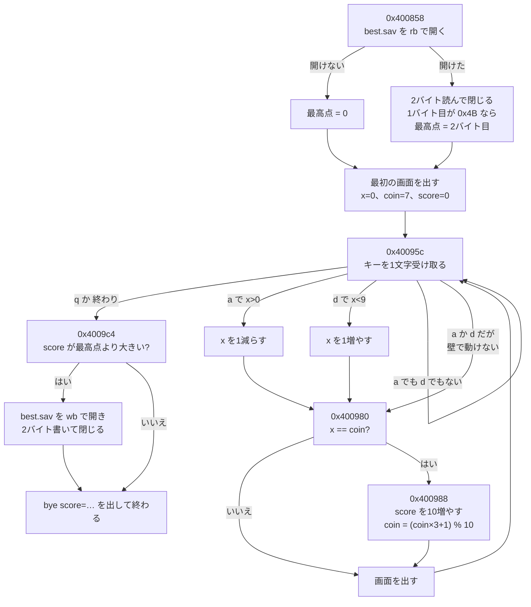

# REAとGhidraで機械語を読む

[REAでリバースエンジニアリングを体験する](22-rea-hands-on.md)では、SDカードのイメージを分解して、RG40XXH向けのゲーム `coin_term` を取り出しました。ただし、中身の機械語を読む手前で止まっています。読むには、解析エンジンが必要だったからです。

この記事では、解析エンジンのGhidraを入れて、その続きをします。

1. 文字列を手がかりに、セーブを扱う関数を見つける
2. 関数の流れを図にして、疑似コード(C言語に似た形)に戻す
3. 関数の名前を消したプログラムで、同じことを試す
4. 読んだ結果を使って、1バイト書き換え、点数を5倍にする
5. 改造したポケモン エメラルドの関数も読む

[CPUと機械語](20-cpu.md)で、命令を1つずつ読む練習をしました。この記事では、道具に命令をまとめて読ませ、人が読みやすい形に戻します。実験はx86_64のUbuntu 24.04で行い、REAは記事22と同じnpmの `rea-agents` 4.1.0を使いました。使ったスクリプトは [examples/rea-lab](../examples/rea-lab) に置いています。

## Ghidraを用意する

[Ghidra](https://github.com/NationalSecurityAgency/ghidra)は、アメリカの国家安全保障局(NSA)が公開している、無料のリバースエンジニアリングの道具です。REAの[インストールの説明](https://github.com/morluto/rea/blob/472b72a53068a8e2ec78fe239d687023482daaa7/docs/installation.md)によると、REAはGhidra 12.1.4と、64ビットのJDK 21を使います。対応しているのは、Linux x64とmacOS(x64、arm64)です。

ふつうは、Ghidraの[GitHubのリリース](https://github.com/NationalSecurityAgency/ghidra/releases)からダウンロードします。この実験の環境では、そのダウンロードが拒否されました。そこで、Docker Hubで公開されている `blacktop/ghidra:12.1.4` というイメージから、Ghidraのフォルダだけを取り出して使いました。取り出したフォルダの `Ghidra/application.properties` で、版が12.1.4であることを確かめています。Macで試すときは、公式のリリースを使ってください。

場所は、環境変数で教えます。

```sh
export GHIDRA_INSTALL_DIR=/path/to/ghidra_12.1.4_PUBLIC
export JAVA_HOME=/path/to/jdk-21
rea doctor --json
```

`rea doctor` は、Ghidraの版、`analyzeHeadless`(画面なしでGhidraを動かすための入り口)、JDKの版の3つを確かめて、すべて `healthy`(問題なし)と報告しました。

## 文字列から関数をたどる

調べるのは、[記事22の実験1](22-rea-hands-on.md#実験1sdカードのイメージを分解する)でSDカードのイメージから取り出した `coin_term` です。中身は、記事22の実験2のコイン集めをaarch64向けに変換したもので、関数の名前が残っています。

リバースエンジニアリングでは、まず手がかりになる文字列を探します。このゲームは `best.sav` に保存するので、この文字列を探しました。

```sh
rea search coin_term best.sav --provider ghidra --json
```

`best.sav` は、アドレス `0x453648` にありました。次に、この文字列を使っている場所(参照)を調べます。

```sh
rea xrefs coin_term 0x453648 --json
```

参照は `0x400894` と `0x400a34` の2か所でした。名前で関数を探すと、`main` が `0x400858` から始まっていて、2か所とも `main` の中です。

この2つの手順は、`rea trace` の1回にまとめられます。文字を探し、参照を集め、参照がどの関数の中にあるかまで調べます。

```sh
rea trace coin_term best.sav --json
```

結果には、2か所の参照のそれぞれについて、「`main`(`0x400858` から `0x400a67` までの528バイト)の中」と書かれていました。

REAは、命令を動かすたびに、ゲームをGhidraへ読み込ませて解析し、終わると消します(結果の制限の欄に、そう書かれています)。この実験では、命令1回に30秒から40秒かかりました。

## 関数の全体を調べる

`rea function` は、1つの関数について、疑似コード、命令、呼び出す関数、呼ばれる場所、使う文字、処理の区切りなどを、まとめて返します。

```sh
rea function coin_term main --json
```

`main` が呼ぶ関数は、次の8つでした。

| 関数 | 役目 |
|---|---|
| `fopen64`、`fread`、`fwrite`、`fclose` | `best.sav` を開いて、読み書きして、閉じる |
| `fgetc` | キーを1文字受け取る |
| `draw` | 1行を画面に出す |
| `___printf_chk` | 最後の `bye score=…` を出す |
| `__stack_chk_fail` | 関数の作業場所(スタック)が壊されたことに気づいたときに止める |

最後の `__stack_chk_fail` は、元のソースにはありません。コンパイラが、安全のために自動で足した仕組みです。

`main` を呼ぶ場所は、`0x400678` の1か所でした。ここは、[名前を消したとき](#名前を消すとどうなるか)に、もう一度出てきます。

### 処理の流れを図にする

`rea function` の結果には、処理の区切り(基本ブロック)が22個と、それぞれの次に進む先が入っていました。基本ブロックは、途中で分かれ道のない、ひと続きの命令のまとまりです。22個を、命令の中身と合わせて、役目ごとにまとめると、次の図になります。



この図は、[CPUと機械語](20-cpu.md)で見た「命令が、上から順に、ときどき飛びながら進む」様子を、関数1つ分の大きさで描いたものです。図の中の `0x400988` は、あとで[書き換える](#1バイト書き換えて点数を5倍にする)命令の場所です。

## 疑似コードに戻す

`main` を、Ghidraに疑似コード(C言語に似た形)へ戻させました。

```sh
rea decompile coin_term 0x400858 --json
```

結果のうち、セーブを読むところと、キーを受け取るところを抜き出します。

```c
  pFVar2 = fopen64("best.sav","rb");
  if (pFVar2 == (FILE *)0x0) {
    uVar7 = 0;
  }
  else {
    sVar3 = fread(&local_60,1,2,pFVar2);
    fclose(pFVar2);
    uVar7 = 0;
    if (((int)sVar3 == 2) && (uVar7 = (uint)local_5f, local_60 != 'K')) {
      uVar7 = 0;
    }
  }
  draw(0,7,0,uVar7);
  ...
    iVar1 = fgetc((_IO_FILE *)stdin);
    if (iVar1 == 0x71 || iVar1 == -1) {
      ...
    }
    if (iVar1 == 0x61 && 0 < iVar4) break;
    if (iVar1 == 100 && iVar4 < 9) {
      iVar4 = iVar4 + 1;
      goto LAB_00400980;
    }
    ...
        iVar6 = iVar6 + 10;
        iVar5 = (iVar5 * 3 + 1) % 10;
```

元のソースと見比べると、次のことが分かります。

| 疑似コード | 元のソース | 読み方 |
|---|---|---|
| `local_60 != 'K'` | `b[0] == SAVE_MAGIC` | 目印の `0x4B` は、文字の `K` と同じ数字なので、Ghidraは文字として表示した |
| `0x71`、`0x61`、`100` | `'q'`、`'a'`、`'d'` | キーの文字が、数字のまま出ている |
| `iVar4`、`iVar5`、`iVar6` | `x`、`coin`、`score` | 変数の名前は残らない。役目から名前を付け直すのが、読む人の仕事 |
| `load_best` と `save_best` がない | 2つの関数がある | 1回しか呼ばない関数を、コンパイラが `main` の中へ埋め込んだ |

最後の行は、変換するときの最適化によるものです。このゲームは `-O1` で変換しました。GCCの[最適化の説明](https://gcc.gnu.org/onlinedocs/gcc/Optimize-Options.html)によると、`-O1` では、1回しか呼ばれない `static` の関数を、呼び出し元に埋め込みます(`-finline-functions-called-once`)。疑似コードの関数の分け方は、元のソースと同じとは限りません。

### 「% 10」は、掛け算になっていた

疑似コードの `(iVar5 * 3 + 1) % 10` は、元のソースの `(coin * 3 + 1) % WIDTH` と同じです。ところが、命令のほうを読むと、10で割る命令は使われていませんでした。`rea function` の命令の一覧から、その部分を抜き出します。

```
mov   w25, #0x6667
movk  w25, #0x6666, lsl #16   … w25 = 0x66666667
add   w20, w20, w20, lsl #1   … coin × 3
add   w0, w20, #0x1           … + 1
smull x20, w0, w25            … 0x66666667 を掛ける
asr   x20, x20, #34           … 34ビット右へずらす(2の34乗で割る)
```

2の34乗(17179869184)を10で割ると、1717986918.4です。これを切り上げた1717986919が、16進数の `0x66666667` です。「`0x66666667` を掛けて、2の34乗で割る」と、「10で割る」と同じ答えになります。コンパイラ(GCC)は、決まった数で割るところを、このような掛け算とずらしに置き換えていました。Ghidraは、この並びを見て、`% 10` に戻して表示しました。命令をそのまま読むより、疑似コードのほうが早く意味をつかめる例です。

## 記事22の実験2の答え合わせ

[記事22の実験2](22-rea-hands-on.md#実験2動きだけを見て作り直す)では、左の壁での動きを記録していなかったため、作り直しでは「回り込む」と推測しました。疑似コードには、その答えが書いてあります。

```c
    if (iVar1 == 0x61 && 0 < iVar4) break;   /* a で、0より右にいるときだけ左へ */
    if (iVar1 == 100 && iVar4 < 9) {         /* d で、9より左にいるときだけ右へ */
```

左右の端では、それ以上動かずに止まります。回り込みはしません。動きを見るだけでは推測で埋めるしかなかった部分が、中身を読むと確かめられます。一方で、操作Bの記録を取れば、中身を読まなくても同じ答えにたどり着けました。[チートとパススルー](21-cheats-and-passthrough.md)で紹介したガイド集の考え方のとおり、観察で答えが出るなら、そちらを先に使えます。

## 名前を消すと、どうなるか

配られるプログラムは、関数の名前を消してあることがあります(ストリップ)。同じゲームから名前を消して、同じ手順を試しました。

```sh
aarch64-linux-gnu-strip -o coin_term_stripped coin_term
```

文字列の `best.sav` と、それを使う2か所(`0x400894` と `0x400a34`)は、名前があるときと同じように見つかりました。違ったのは、次の2つです。

- `main` という名前の関数が見つからない。ほかの関数は、`FUN_004007b0` のように、アドレスから作った名前になる
- `0x400858` を疑似コードに戻そうとすると、REAは「入力が正しくない」というエラーを返す。Ghidraが、ここを関数の始まりとして登録していないため

`rea trace` で同じことを調べると、違いがはっきりします。2か所の参照のどちらにも、「関数の中にない」(`found: false`、`reason: not_in_procedure`)と書かれていました。参照のある場所は分かっても、それを含む関数を、Ghidraが知らないのです。

プログラムの入り口(`0x400640`)を疑似コードに戻すと、次のようになりました。

```c
void entry(undefined8 param_1)
{
  ...
  FUN_00400b54(&DAT_00400674,in_stack_00000000,&stack0x00000008,0,0,param_1);
  FUN_004002c0();
}
```

入り口は、`0x400674` のアドレスを、別の関数に渡しています。`0x400674` の8バイトを読みました。

```sh
rea read-bytes coin_term_stripped 0x400674 --length 8 --json
```

結果は `1f2003d5 78000014` でした。aarch64の逆アセンブラ(`aarch64-linux-gnu-objdump`)で読むと、「何もしない」(`nop`)と「`0x400858` へ飛ぶ」(`b 0x400858`)の2命令です。名前のあるほうで確かめると、`0x400674` は `__wrap_main`、`0x400858` は `main` という名前でした。つまり、入り口から2回たどると、`main` に着きます。

## Ghidraを直接動かす

REAの命令の一覧(`rea --help`)と[インストールの説明](https://github.com/morluto/rea/blob/472b72a53068a8e2ec78fe239d687023482daaa7/docs/installation.md)では、関数を新しく登録する命令は見つけられませんでした。説明によると、Ghidraに対するREAの操作は、関数の名前と説明を書き込むもの以外は、読むだけです。そこで、Ghidraに付いている `analyzeHeadless` を直接使いました。Ghidraには、Javaで書いた小さなプログラム(スクリプト)を、解析のあとに動かす仕組みがあります。次のスクリプトは、指定したアドレスに関数がなければ登録し、疑似コードを出力します([DecompAt.java](../examples/rea-lab/DecompAt.java))。

```java
Address a = toAddr(getScriptArgs()[0]);
Function f = getFunctionAt(a);
if (f == null) {
    disassemble(a);
    f = createFunction(a, null);
}
DecompInterface d = new DecompInterface();
d.openProgram(currentProgram);
DecompileResults r = d.decompileFunction(f, 60, monitor);
println(r.getDecompiledFunction().getC());
```

```sh
analyzeHeadless ./proj lab -import coin_term_stripped -deleteProject \
  -scriptPath ./scripts -postScript DecompAt.java 0x400858
```

結果の始まりは、次のとおりです。

```c
undefined8 FUN_00400858(void)
{
  ...
  lVar4 = FUN_00401e50("best.sav",&DAT_00453640);
  if (lVar4 == 0) {
    uVar7 = 0;
  }
  else {
    iVar2 = FUN_00401e70(&cStack_60,1,2,lVar4);
    FUN_00401870(lVar4);
    ...
    if ((iVar2 == 2) && (uVar7 = (uint)bStack_5f, cStack_60 != 'K')) {
```

ゲームの処理の形は、名前があるときと同じです。ただし、`fopen64` や `fread` のようなライブラリの関数も、名前を失って `FUN_` になりました。このゲームは、ライブラリをプログラムの中にまとめて入れる形(`-static`)で変換したため、ライブラリの関数も名前ごと消えています。

ここからは、引数から関数の役目を推理します。`FUN_00401e50` に渡されているのは、`"best.sav"` と `DAT_00453640` の2つです。`0x453640` の中身は `rb` という文字でした。ファイルの名前と `rb`(読み込み用に開く)を受け取るので、ファイルを開く関数だろうと見当がつきます。名前のあるほうで確かめると、`0x401e50` は `fopen` でした。同じように、`0x401e70` は `fread`、`0x401870` は `fclose` です。

| アドレス | 名前を消したとき | 名前があるとき |
|---|---|---|
| `0x400858` | 関数として見つからない | `main` |
| `0x401e50` | `FUN_00401e50` | `fopen` |
| `0x401e70` | `FUN_00401e70` | `fread` |
| `0x401870` | `FUN_00401870` | `fclose` |
| `0x4007b0` | `FUN_004007b0` | `draw` |


REAには、すでにある関数に名前や説明を付ける命令もあります。名前を消した版の `0x4007b0` に、名前を付けてみました。

```sh
rea annotate-native-function coin_term_stripped 0x4007b0 --name draw_row --comment "row of 10 cells"
```

結果には、新しい名前 `draw_row` と説明が入った、関数の情報が返ってきました。ただし、REAの説明によると、この書き込みは、解析を閉じると消えます。プログラムのファイル自体は書き換えません。名前のない関数に、役目から名前を付けていく作業が、リバースエンジニアリングの大部分です。Ghidraの画面で作業すれば、付けた名前をプロジェクトに保存できます。

## 1バイト書き換えて、点数を5倍にする

ここまでは読むだけでした。最後に、読んだ結果を使って、ゲームを書き換えます。コインを取ったときの点数を、10点から50点にします。

### 書き換える場所を決める

[処理の流れの図](#処理の流れを図にする)で、点数を増やす命令は `0x400988` でした。この命令を、REAに分解させます。

```sh
rea inspect-native-instruction coin_term 0x400988 --json
```

| 項目 | 結果 |
|---|---|
| 命令 | `add w21,w21,#0xa`(`w21` に10を足す) |
| ファイルの中のバイト | `b5 2a 00 11` |
| 長さ | 4バイト |

`w21` が点数で、`#0xa` が10です。バイトが `b5 2a 00 11` と、命令の数字 `0x11002ab5` とは逆の順に並んでいるのは、aarch64が、小さい桁から順にメモリへ置く決まり(リトルエンディアン)だからです。

次に、この命令が、ファイルの先頭から何バイト目にあるかを調べます。Ghidraが表示するアドレスは、プログラムがメモリに置かれたときの位置で、ファイルの中の位置とは違います。

```sh
rea address-to-file-offset coin_term 0x400988 --json
```

答えは2440バイト目でした。

### 命令を作り直す

aarch64の `add` の命令では、足す数は、32ビットのうち10ビット目から21ビット目までの12ビットに入っています。`0x11002ab5` から取り出すと `0xa`(10)です。ここを50(`0x32`)に変えると、命令は `0x1100cab5`、ファイルに書くバイトは `b5 ca 00 11` になります。変わるのは、2バイト目の `2a` が `ca` になる、1バイトだけです。

```sh
cp coin_term coin_term_x50
printf '\xb5\xca\x00\x11' | dd of=coin_term_x50 bs=1 seek=2440 conv=notrunc
```

書き換えたファイルを、REAに疑似コードへ戻させると、点数の行が次のように変わっていました。

```c
        iVar6 = iVar6 + 0x32;   /* 0x32 は 50 */
```

### 動かして確かめる

aarch64のプログラムは、x86_64の機械ではそのまま動きません。[CPUと機械語](20-cpu.md)と同じように、エミュレーターのQEMU(`qemu-aarch64`)を通して動かします。REAの `capture-process` のシナリオでは、動かすプログラムを `qemu-aarch64` にし、ゲームのファイルを引数に渡しました。

```json
{
  "executable": "/usr/bin/qemu-aarch64",
  "arguments": ["/path/to/coin_term_x50"],
  "working_directory": "/path/to/run",
  "filesystem_observation_paths": ["/path/to/run"],
  "events": [
    { "type": "input", "at_ms": 500, "data": "ddddddd\r" },
    { "type": "input", "at_ms": 1200, "data": "q\r" }
  ],
  "normalization": { "ports": false, "time_bucket_ms": 1000 },
  "timeout_ms": 15000
}
```

元のゲームと、書き換えたゲームを、同じ操作で記録しました。

| | 元 | 書き換え後 |
|---|---|---|
| 最後の画面 | `bye score=10` | `bye score=50` |
| `best.sav` | `4b 0a`(10点) | `4b 32`(50点) |
| 終了コード | 0 | 0 |

ねらいどおり、1バイトの書き換えで、点数は5倍です。セーブにも、50点が書かれています。

### 落とし穴:記録された「プログラムの指紋」はQEMUのもの

REAの記録には、動かしたプログラムのSHA-256(`executable_sha256`)が残ります。2つの記録を見比べると、この値は同じでした。REAが指紋を取ったのは、`executable` に書いた `qemu-aarch64` で、ゲームのファイルは引数の1つとして、パスだけが残っていたのです。

エミュレーターを通して動かすと、記録の上では「同じプログラムを、違う引数で動かした」ことになります。どのゲームを動かしたのかは、自分で `sha256sum` を取って、記録と一緒に残しておく必要があります。

`compare-process-captures` の判定は、今回も `changed` でした。最初の違いとして報告されたのは、点数ではなく、画面の出力の区切り方でした。[記事22の落とし穴2](22-rea-hands-on.md#落とし穴2reaの同じは厳しい)と同じで、判定の言葉だけでなく、中身を確かめる必要があります。

### 実機に持っていくなら

書き換えたファイルは、RG40XXHと同じaarch64向けです。ただし、ROCKNIXの `SYSTEM` はsquashfsで、読み込み専用です([OSの話](18-os.md))。中のファイルを差し替えるには、`SYSTEM` を作り直す必要があります。この記事では、実機での確認はしていません。

## エメラルドの関数も読む

[CPUと機械語](20-cpu.md)では、改造したエメラルドの `GetStarterPokemon` を、`arm-none-eabi-objdump` で命令に戻して読みました。今度は、最初のポケモンを3匹とも変えたビルドの `pokeemerald.elf`(36MB、GBAのARM向け)を、Ghidraで読みます。

最初はREAの `rea search` で関数を探したところ、330秒で時間切れ(`provider_timeout`)になりました。そこで、上のスクリプトを名前で関数を探す形に変えて([DecompByName.java](../examples/rea-lab/DecompByName.java))、`analyzeHeadless` で直接動かしました。解析には約5分かかり、記録には、デバッグ情報(DWARF)の一部を読めなかったというエラーが8行あります。それでも、解析そのものは「成功」で終わりました。

```c
undefined2 GetStarterPokemon(uint param_1)
{
  undefined2 uVar1;

  uVar1 = 0x19;
  if ((param_1 & 0xffff) < 4) {
    uVar1 = *(undefined2 *)(DAT_0820bc50 + (param_1 & 0xffff) * 2 + 8);
  }
  return uVar1;
}
```

記事20の命令の表と、1行ずつ対応しています。

| 疑似コード | 記事20の命令 | 意味 |
|---|---|---|
| `param_1 & 0xffff` | `lsls`、`lsrs` | 番号を16ビットに整える |
| `uVar1 = 0x19;` | `movs r0, #25` | 先に25(ピカチュウ)を入れておく |
| `< 4` | `cmp r3, #3` と `bhi` | 3より大きければ、25のまま返す |
| `DAT_0820bc50` | `ldr r2, [表の位置]` | 表の位置が書いてある場所 |
| `* 2 + 8` | `lsls r3, r3, #1`、`ldrh r0, [r2, #8]` | 番号を2倍し、8を足した位置から2バイト読む |

`0x0820bc50` の4バイトを読むと `0x08ca3f08` で、8を足した `0x08ca3f10` が、表 `sStarterMon` の位置でした。表の6バイトは `19 00 85 00 bf 01` で、25(ピカチュウ)、133(イーブイ)、447(リオル)です。

元のソースの条件は `chosenStarterId > STARTER_MON_COUNT`(3より大きい)で、Ghidraは同じ意味を `< 4` と書きました。そのため、番号が3のときは、3匹分しかない表の、次の2バイトを読みます。ソースでは見落としやすい境目も、疑似コードでは数字で見えます。

## HopperとIDA Proは試せなかった

[Hopper](https://www.hopperapp.com/)は、有料のリバースエンジニアリングの道具です。REAの[インストールの説明](https://github.com/morluto/rea/blob/472b72a53068a8e2ec78fe239d687023482daaa7/docs/installation.md)によると、HopperにはLinux向けの無料の体験版(demo)があり、REAの `rea setup` は、Hopperの公式のパッケージを確かめてから入れることができます。この実験の環境からは、Hopperの配布元に接続できなかったため、試していません。

IDA Proは、Hex-Raysが販売している有料の道具です。REAは、IDA Proを自分では入れず、[ida-pro-mcp](https://github.com/mrexodia/ida-pro-mcp)という別の道具を通して使います([IDAの説明](https://github.com/morluto/rea/blob/472b72a53068a8e2ec78fe239d687023482daaa7/docs/ida-provider.md))。IDA Proの入手と、ライセンスの用意は、使う人の仕事です。REAのREADMEによると、確かめられているのは、WindowsのIDA 9.3での動きです。この環境では、IDA Proを入手できなかったため、試していません。

REAの説明によると、エンジンごとに疑似コードの見た目は違い、REAはそれを同じものとして扱いません(`rea decompile` の結果にも、「Ghidraの出力で、Hopperの出力と文字が同じになるわけではない」と書かれていました)。

## 守ること

この記事で書き換えたのは、自分で作ったゲームです。他人のゲームを書き換えて配ることは、ゲームの利用規約や法律に触れることがあります。考え方は、[チートとパススルー](21-cheats-and-passthrough.md)で紹介したガイド集の13章を読んでください。観察で答えが出るなら観察を先に、という順番は、この記事でも同じでした。

REAの `capture-process` は、サンドボックスではありません([記事22](22-rea-hands-on.md#守ること))。QEMUを通しても、プログラムは今のユーザーの権限で動きます。

## 確かめた環境

| もの | 版 |
|---|---|
| OS | x86_64のUbuntu 24.04 |
| REA | npmの `rea-agents` 4.1.0 |
| Ghidra | 12.1.4(Docker Hubの `blacktop/ghidra:12.1.4` から取り出したもの) |
| JDK | OpenJDK 21.0.11(Ubuntuのパッケージ) |
| aarch64への変換 | `aarch64-linux-gnu-gcc -O1 -static` |
| aarch64の実行 | `qemu-aarch64`(Ubuntuの `qemu-user`) |

## 学べること

Ghidraを入れると、REAは、文字列から関数を見つけ、関数の流れと疑似コードを、根拠つきで返しました。疑似コードは元のソースとよく似ていましたが、変数の名前は消え、小さな関数は埋め込まれ、`% 10` は命令の上では掛け算になっていました。名前を消したプログラムでは、`main` さえ関数として見つからないので、入り口から命令をたどって、自分で見つけます。読んだ結果を使うと、1バイトの書き換えで、ゲームの点数を変えられました。一方で、エミュレーターを通すと記録の指紋がQEMUのものになるなど、道具の記録が何を指しているかは、毎回確かめる必要があります。HopperとIDA Proは、この環境では試せませんでした。
