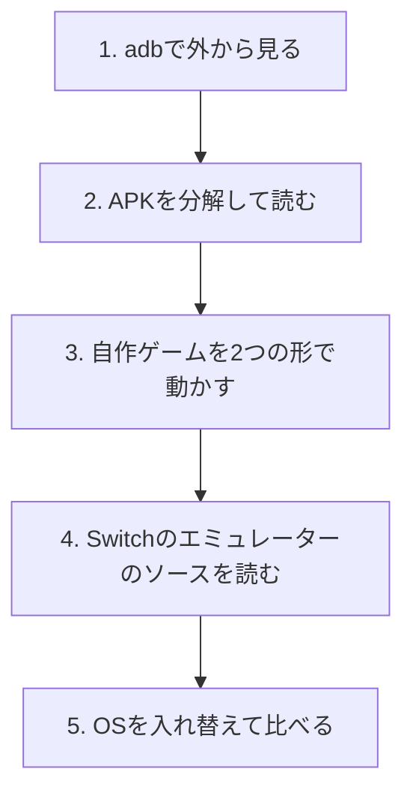
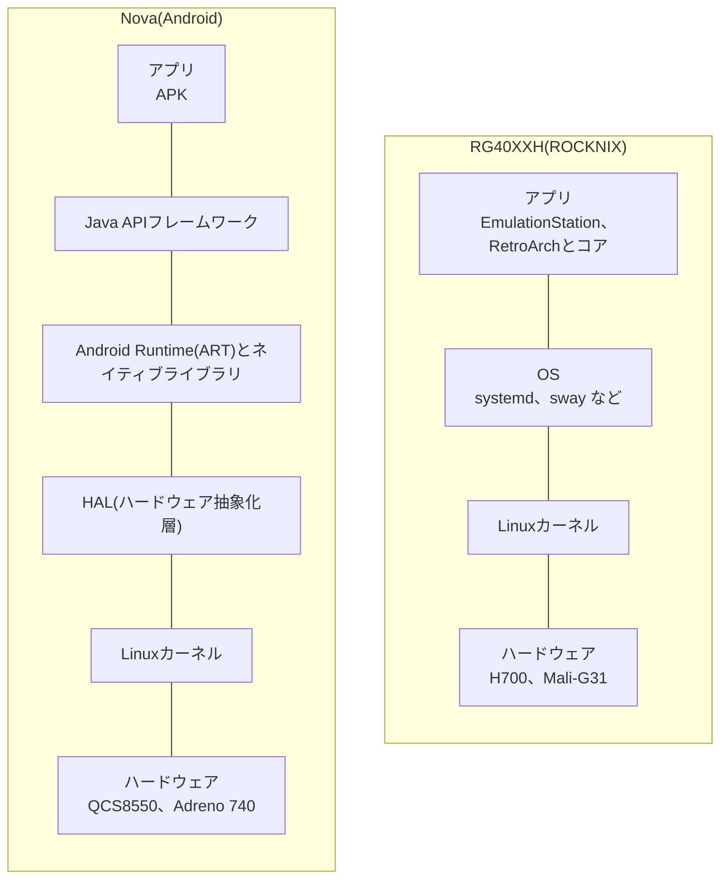
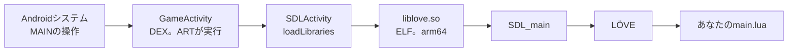
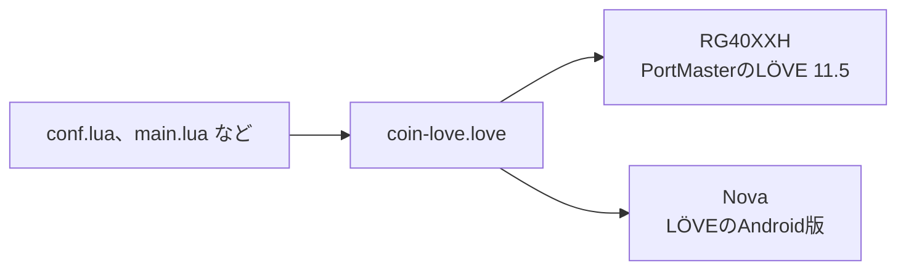

# Novaで学ぶAndroid:RG40XXHと比べる学習計画

[REAとGhidraで機械語を読む](23-rea-and-ghidra.md)までは、RG40XXHの中身を、Linuxの機械として読んできました。この記事では、次の1台に、Androidの携帯ゲーム機のRetroid Pocket Nova(以下、Nova)を選び、届いたあとに何をどの順で学ぶかを計画します。

計画だけでは、届くまで中身を確かめられません。そこで、Novaに入れるものと同じ種類のファイルを、先に読んでおくことにしました。LÖVEの公式のAndroid版(APK)をREAで分解し、アプリが起動してからゲームが動くまでの流れを、コードで追っています。さらに、[記事22](22-rea-hands-on.md)のコイン集めをLÖVEで作り直し、元のC言語版と同じ画面が出ることも確認しました。

## この記事の方針

方針は、次の4つに決めました。

- Androidの仕組みを学ぶこと
- 学んだことを、RG40XXHのLinuxと比べること
- NovaにLinux系のOSは入れず、AndroidだけでRG40XXHと比べること
- ゲームを入れたカードは買わず、遊ぶデータは自分で用意すること

Novaそのものは、まだ手元にありません。実機で確かめたことは1つもなく、確かめたのは、公式の資料、メーカーのページ、リポジトリ、そして、この環境(x86_64のUbuntu 24.04)で動かした実験の結果です。確かめていないことは、最後の欄にまとめました。

## Novaの仕様

| 項目 | 内容 | 出典 |
|---|---|---|
| チップ | QCS8550。Snapdragon 8 Gen 2から、携帯電話の通信部分を除いたもの | [LineageOS](https://wiki.lineageos.org/devices/RPN)、[Notebookcheck](https://www.notebookcheck.net/Retroid-Pocket-Nova-launches-as-4-3-Android-handheld-with-a-229-starting-price.1328608.0.html) |
| GPU | Adreno 740 | [掌机圈](https://zhangjiquan.com/handheld/retroid-pocket-nova) |
| メモリ | 8GBまたは12GB | [Retroid公式](https://www.goretroid.com/products/retroid-pocket-nova-handheld) |
| 保存領域 | 128GB(UFS 3.1)とmicroSDカードの差し込み口 | [Notebookcheck](https://www.notebookcheck.net/Retroid-Pocket-Nova-launches-as-4-3-Android-handheld-with-a-229-starting-price.1328608.0.html) |
| 画面 | 4.5インチ、4:3、AMOLED、1280×960、120Hz | [Notebookcheck](https://www.notebookcheck.net/Retroid-Pocket-Nova-launches-as-4-3-Android-handheld-with-a-229-starting-price.1328608.0.html) |
| 重さ | 255g | [掌机圈](https://zhangjiquan.com/handheld/retroid-pocket-nova) |
| 値段 | 8GB版が239ドルから(2026年10月3日の公式ショップの表示) | [購入ガイド](09-buying.md) |

画面の縦横比は、RG40XXHと同じ4:3です。同じゲームを、同じ画面の形のまま、2台で動かして比べられます。

## 用意するもの

Novaの本体のほかに必要なのは、MacとNovaをつなぐUSBケーブルです。microSDカードは、自作のゲームやデータを置く程度の使い道なので、空のカードで足ります。

ゲームを入れたカードは、買いません。中身は、天馬Gというメニューの画面と、市販ゲームのデータです([天馬Gの記事](05-frontend-tianma-g.md))。権利者の許可を得ていないデータが多いと考えられ、勉強にも要りません。[購入ガイド](09-buying.md)で見たとおり、中国の代行サービスの中には、この種類の商品を「権利侵害の疑い」で断るところもありました。

### メモリーカードの役目

RG40XXHでは、SDカードがすべてでした。OS、ゲーム、セーブが、1枚のカードに入っています([OSの記事](18-os.md)、[起動の記事](19-boot.md))。Novaは、OSが本体の内蔵ストレージに入っています。microSDカードは、追加のデータの置き場所です。

| | RG40XXH | Nova |
|---|---|---|
| OSの置き場所 | SDカード | 本体の内蔵ストレージ |
| 中を調べる方法 | SDカードをパソコンにつなぐ。SSHで入る方法もある([記事14](14-making-games.md)) | USBケーブルでMacとつなぎ、adbを使う |

そのため、Androidの勉強の中心は、SDカードへの書き込みではありません。MacとNovaをUSBケーブルでつないで、Macから操作することです。

## 学習の全体像

学ぶ順番は、外側から内側へ進む5段階です。



| 段階 | 学ぶこと | RG40XXHで対応する学習 |
|---|---|---|
| 1 | adbで、Novaの中を外から見る | SDカードの中身を調べる([OSの記事](18-os.md)、[起動の記事](19-boot.md)) |
| 2 | APKの中身を読む | ELFを読む([記事22](22-rea-hands-on.md)、[記事23](23-rea-and-ghidra.md)) |
| 3 | 同じゲームを、LinuxとAndroidで動かす | PortMasterでLÖVEを動かす([記事14](14-making-games.md)) |
| 4 | CPUが同じARMで、GPUが違うときの翻訳を読む | CPUと機械語([記事20](20-cpu.md)) |
| 5 | 元のAndroidと、ソースが公開されたAndroidを比べる | 起動の仕組みを読む([記事19](19-boot.md)) |

## Androidの全体像:RG40XXHのLinuxと並べる

細部に入る前に、2台の積み重なりを並べます。RG40XXHは、[記事15](15-rg40xxh-big-picture.md)で、本体、OS、アプリの3層に分けました。Androidの公式の説明([Platform architecture](https://developer.android.com/guide/platform))は、もう少し細かく分けています。



公式の説明から、読み取れることは次のとおりです。

- Androidの下の層も、Linuxカーネルです。ARTは、スレッドやメモリの低レベルの処理を、カーネルに頼っています。
- HALは、カメラやBluetoothのような部品ごとに、標準の窓口を用意する層です。フレームワークが部品を使うとき、システムがその部品用のライブラリを読み込みます。
- ARTは、アプリを、DEXという専用のバイトコードで実行します。Java(やKotlin)のソースは、d8のような道具で、DEXに変換されます。
- Android 5.0以降では、アプリごとに、自分のプロセスと自分のARTが用意されます。

つまり、カーネルまでは、RG40XXHもNovaも同じLinuxです。違いは、その上に何を載せるかにあります。RG40XXHは、LinuxのままのOSの上で、メニューとエミュレーターが動く作りです。Androidは、カーネルとアプリのあいだにHAL、ART、フレームワークを挟み、アプリを「APKという形」で扱う作りです。この記事の後半は、その「形」を実物で確かめる話になります。

## 段階1:adbで外から見る

adbは、Androidの端末にパソコンからつないで、操作する道具です([adbの公式の説明](https://developer.android.com/tools/adb))。使うには、端末の設定で「開発者向けオプション」を出し、USBデバッグを有効にします。LineageOSの[インストールの案内](https://wiki.lineageos.org/devices/RPN/install/)も、準備として、adbとfastbootが使えるパソコンと、USBデバッグの有効化を挙げています。

最初に使うのは、次の4つです。公式の説明に書かれている使い方で、Novaでは、まだ試していません。

| 命令 | 何をするか | 根拠 |
|---|---|---|
| `adb devices` | つながっている端末の一覧を出す。つながっていれば、端末の名前が「device」として出る | [adbの説明](https://developer.android.com/tools/adb) |
| `adb shell` | 端末の中で、Unixのコマンドを打つ。使える道具は `adb shell ls /system/bin` で調べられる | [adbの説明](https://developer.android.com/tools/adb) |
| `adb push 手元のファイル 端末の場所` | ファイルを端末へ送る | [adbの説明](https://developer.android.com/tools/adb) |
| `adb logcat` | 端末のログを出す。自分のアプリが `Log` クラスで書いたメッセージも含まれる | [logcatの説明](https://developer.android.com/tools/logcat) |

RG40XXHでは、SDカードを抜いて、中身を見ました。Androidでは、USBケーブルをつないだまま、同じ種類のことを行います。

RG40XXHでSSHを使うときと、いちばん違うのは、Androidのアプリの隔離でしょう。[公式の説明](https://developer.android.com/guide/components/fundamentals)によると、Androidはマルチユーザーの仕組みを持つLinuxで、アプリごとに別のユーザーが割り当てられます。システムがアプリごとに固有のユーザーIDを決め、そのアプリのファイルは、そのIDだけが読めるように権限が設定される、という説明です。アプリは基本的に、自分のプロセスと自分の仮想マシンで動きます。adbでつないだとき、他のアプリのデータがどこまで見えるかは、この隔離の影響を受けるはずで、どう見えるかはNovaで確かめます。

## 段階2:APKを分解して読む

届くのを待たず、Novaに入れるものと同じ種類のファイルを、先に読んでおきます。題材は、LÖVEの公式のAndroid版、`love-11.5-android.apk` です。[LÖVEのリリースのページ](https://github.com/love2d/love/releases/tag/11.5)から取得したもので、SHA-256は `10a804f8…`、大きさは7,719,206バイトでした。RG40XXHのPortMasterもLÖVE 11.5を使うため、同じ版の2つの姿を比べられます。

### ファイルの形を見る

APKは、zipファイルです。`unzip -l` で、中身を並べられます。

| 中のもの | 大きさや特徴 |
|---|---|
| `AndroidManifest.xml` | 10,172バイト。アプリの名前、権限、受け付ける操作を書いた表 |
| `classes.dex` | 1,048,564バイト。Javaのコードを変換した、DEXのバイトコード |
| `lib/arm64-v8a/` | 4つの共有ライブラリ(`liblove.so` など)。64ビットARM向け |
| `lib/armeabi-v7a/` | 同じ4つ。32ビットARM向け |
| `assets/dexopt/` | `baseline.prof` など。名前からDEXの最適化に関わるファイルと思われるが、中身は読んでいない |
| `res/` ほか | 画像や文字などの資源 |

全体では427個のファイルがあり、展開すると16,553,372バイトです。x86向けのライブラリは入っていません。NovaのCPUはARMなので、64ビットARM向けの `arm64-v8a` が使われるはずです。どちらが選ばれるかは、実機で確かめます。

[記事20](20-cpu.md)で、「箱の形」を、先頭のバイトで見分けました。同じことを、APKの中身でも行いました。

| ファイル | 先頭のバイト | 読み取れること |
|---|---|---|
| `lib/arm64-v8a/liblove.so` | `7f 45 4c 46`、18バイト目が `b7 00`(183) | ELFで、arm64向け |
| `lib/armeabi-v7a/liblove.so` | `7f 45 4c 46`、18バイト目が `28 00`(40) | ELFで、32ビットARM向け |
| `classes.dex` | `64 65 78 0a 30 33 35 00`(`dex\n035`) | DEX形式の目印 |
| `AndroidManifest.xml` | `03 00 08 00 …` | 文字のXMLではなく、バイナリのXML |

RG40XXHのゲームは、ELFの実行ファイルです。AndroidのAPKは、その中に、ELFの部品(`.so`)と、ARTが読むDEXの両方を、zipで包んでいます。

`liblove.so`(arm64版)が読み込む部品も、`readelf -d` で確かめました。`libGLESv2.so`と`libGLESv1_CM.so`があり、LÖVEが、AndroidでOpenGL ESを使うことが分かります。ほかに、`libopenal.so`、`libmpg123.so`、`libc++_shared.so`、`liblog.so`、`libandroid.so` などが並びます。

### REAでマニフェストを読む

[記事23](23-rea-and-ghidra.md)のREAには、APKを読む命令があります([REAの説明](https://github.com/morluto/rea/blob/472b72a53068a8e2ec78fe239d687023482daaa7/docs/android-analysis.md))。前提は、Java 17以上と、JADXをもとにした[jadx-headless-mcp](https://github.com/1013503897/jadx-headless-mcp)の0.7.1です。REAは、これらを自分では入れません。今回は、REAが指定する公開のJARを取得し、SHA-256(`6e5eacf5…`)がREAの記録と一致することを確かめてから使いました。使ったJDKは、OpenJDK 21です。

```sh
export REA_JADX_MCP_JAR=/path/to/jadx-headless-mcp-0.7.1-all.jar
rea inspect-android-package love-11.5-android.apk --json
```

1回の命令に、約10秒かかりました。結果の要点は、次のとおりです。

| 項目 | 結果 |
|---|---|
| パッケージ名 | `org.love2d.android` |
| 版 | `11.5a`(版番号32) |
| 最小のAndroid | API 16 |
| 対象のAndroid | API 34(Android 14) |
| クラスの数 | 928 |
| 資源の数 | 427 |
| 署名の検証 | 行っていない(`not_performed`) |

宣言された権限は、7つです。

| 権限 | 補足 |
|---|---|
| `READ_EXTERNAL_STORAGE`、`WRITE_EXTERNAL_STORAGE` | `maxSdkVersion` が28。Android 9(API 28)までの端末だけで使う |
| `INTERNET` | 通信 |
| `VIBRATE` | 振動 |
| `BLUETOOTH` | Bluetooth |
| `RECORD_AUDIO` | 録音 |
| `org.love2d.android.DYNAMIC_RECEIVER_NOT_EXPORTED_PERMISSION` | このアプリ自身が定義した権限。`protectionLevel` は `signature` |

マニフェストには、必須でない機能の宣言も並んでいます。タッチ画面、ゲームパッド、Bluetooth、USBホストは、いずれも `required="false"` で、なくても入れられるという宣言です。OpenGL ESの版は、`glEsVersion` が `0x20000`(2.0以上)でした。

### 受け付ける操作の宣言

`GameActivity`(ゲームを動かす画面)には、受け付ける操作(インテントフィルター)が、いくつか書かれています([インテントフィルターの公式の説明](https://developer.android.com/guide/topics/manifest/intent-filter-element)によると、アプリの部品が応えられる種類の操作を宣言するものです)。

| 受け付けるもの | 条件 |
|---|---|
| ファイルを開く操作(VIEW) | `file://` で、名前が `.love` で終わるもの |
| ファイルを開く操作 | `content://` で、種類が `application/x-love-game` のもの |
| ファイルを開く操作 | `content://` で、種類が `application/octet-stream` のもの |
| アプリの一覧から起動する操作(MAIN、LAUNCHER) | ランチャーの一覧に出る |
| USB機器をつないだ操作 | `USB_DEVICE_ATTACHED` |

つまり、ファイル管理アプリで `.love` を開くと、LÖVEのAndroid版が、「このファイルを開ける」と名乗り出る仕組みです。[love-androidのREADME](https://github.com/love2d/love-android/blob/4c65fff4f8b38693aca5d91bc06f254f86a97adf/README.md)の説明、「ファイル管理アプリで `.love` を開けば動く」は、この宣言に支えられています。

別の部品の `DownloadActivity` は、`http` と `https` で `.love` で終わるURLを開く操作を、受け付けます。

### 名前が残るもの、消えるもの

REAでクラスを検索すると、`org.love2d.android` の下に14個ありました。

```sh
rea search-android-classes love-11.5-android.apk org.love2d.android --json
```

`DownloadActivity`、`DownloadService`、`GameActivity`、`R`、`SelectorActivity` は、名前が残っています。残りは、`a`、`b`、`c`、…、`i` という1文字の名前です。SDLの部品も、90個のうち、`SDLActivity` のように名前が残るものと、`a`、`a0`、`b1` のように消えたものに分かれます。

名前が残っているのは、マニフェストに書かれたクラスと、資源の `R` です。残りは、変換のときに短い名前に置き換えられたと考えられます。[記事23](23-rea-and-ghidra.md)で、名前を消したELFで、`FUN_00401e50` のような名前になったのと同じ種類の出来事です。読む人が、役目から名前を付け直します。

## 段階2の続き:アプリが起動してからゲームが動くまで

`GameActivity` の中身を、REAで読みました。メソッドは33個、変数は17個あります。

```sh
rea inspect-android-class love-11.5-android.apk org.love2d.android.GameActivity --json
rea inspect-android-method love-11.5-android.apk org.love2d.android.GameActivity handleIntent --json
```

### 親のクラスと、ライブラリの読み込み

`GameActivity` の親は、SDLActivityです。SDLActivityには100個のメソッドがあり、`loadLibraries`、`getMainFunction`、`nativeRunMain` などが入っています。

`GameActivity` が書き換えているのは、読み込むライブラリの一覧です。

```java
protected String[] getLibraries() {
    return new String[]{"c++_shared", "mpg123", "openal", "love"};
}
```

SDLActivityの側は、この一覧を順に読み込みます。

```java
public void loadLibraries() {
    for (String str : getLibraries()) {
        SDL.loadLibrary(str);
    }
}
```

最後の「love」が、`liblove.so` にあたります。起動する関数の名前は、SDLActivityの側で `"SDL_main"` と決まっています。`liblove.so` を `strings` で見ると、`SDL_main` の文字も見つかりました。SDLの `SDLMain` クラスの `run` は、ここまでに集めた名前を、ネイティブの `nativeRunMain` に渡す役目を持ちます。

```java
String mainSharedObject = SDLActivity.mSingleton.getMainSharedObject();
String mainFunction = SDLActivity.mSingleton.getMainFunction();
...
SDLActivity.nativeRunMain(mainSharedObject, mainFunction, arguments);
```

これで、APKの中の鎖がつながりました。



RG40XXHでは、PortMasterの起動スクリプトが、LÖVEの実行ファイルを呼び、LÖVEが `main.lua` を動かしました。Androidでは、Android側のJavaの層が1枚多く、そこから同じLÖVE(`liblove.so`)に渡されます。

### ゲームのデータを、どう見つけるか

`GameActivity.onCreate` は、`handleIntent` を呼びます。REAの `trace-android-references` で、`handleIntent` の呼び出し元を調べると、`onCreate` と `onNewIntent` の2つでした。

```sh
rea trace-android-references love-11.5-android.apk org.love2d.android.GameActivity --method-name handleIntent --json
```

`handleIntent` の中身は、次の分岐になっています(要点だけを抜き出します)。

```java
String scheme = data.getScheme();
if (scheme.equals("file")) {
    // main.lua を指していれば、その親のフォルダ。そうでなければ、そのファイル
    gamePath = ...;
} else if (scheme.equals("content")) {
    // アプリのキャッシュの場所へ、ファイルをコピーして使う
    String str = getCacheDir().getPath() + "/" + (最後の名前 または "game.love")...;
    if (copyAssetFile(getContentResolver().openInputStream(data), str)) {
        gamePath = str;
        this.storagePermissionUnnecessary = true;
    }
} else {
    // 対応していない形。エラーの画面を出す
}
```

操作でゲームが渡されなかったときは、`getGamePath` が、別の2つの道を試します。

| 順番 | 条件 | 動き |
|---|---|---|
| 1 | 操作でファイルが渡された | 上の `handleIntent` の分岐 |
| 2 | APKの中にゲームを埋め込んである(`embed` が真) | `assets` の `game.love` を、キャッシュへコピーして使う(`copyGameInsideArchive`) |
| 3 | どちらでもない | `getExternalFilesDir("games")` の下の `lovegame/main.lua` を探す(`checkLovegameFolder`) |

3番目の `getExternalFilesDir` は、アプリ専用の外部ストレージの場所です。[公式の説明](https://developer.android.com/training/data-storage/app-specific)によると、そこに置いたファイルは、アプリをアンインストールすると、消えます。Android 9(API 28)までの端末では、`/sdcard/lovegame/main.lua` も探します。

この3つの条件は、そのまま、Novaで自作のゲームを動かす3つの道に対応します。

| 道 | やること | 向いている場面 |
|---|---|---|
| ファイル管理アプリから開く | `.love` を、ファイル管理アプリで開く | 手軽に試す |
| adbで置く | `adb push` で、`lovegame/main.lua` を、アプリ専用の場所へ送る | 開発中に、何度も入れ替える |
| APKに埋め込む | `game.love` を `assets` に入れて、APKを作り直す | 完成したゲームを配る |

どの場所に置かれるかは、Novaで `adb` を使って確かめます。

この読み方は、「コードを読む前に、どこに何があるかを、先に当てる」練習になります。マニフェストの `.love` の宣言を見て、`handleIntent` の分岐を予想し、その予想が、コードと合っていました。

## 段階3:自作ゲームを2つの形で動かす

LÖVEのAndroid版の読み方が分かったので、動かすゲームを用意します。[記事22](22-rea-hands-on.md)のコイン集めを、LÖVEで作り直しました。ルールと、画面の文字の形を、元のC言語版に合わせてあります([coin-love](../examples/rea-lab/coin-love))。

### 作り直した

ゲームのルールは、`game.lua` に分けました。画面にも、ターミナルにも頼らない部分です。

```lua
function M.move(g, key)
  if key ~= "a" and key ~= "d" then return false end
  if key == "a" and g.x > 0 then g.x = g.x - 1 end
  if key == "d" and g.x < M.WIDTH - 1 then g.x = g.x + 1 end
  if g.x == g.coin then
    g.score = g.score + 10
    g.coin = (g.coin * 3 + 1) % M.WIDTH
    if g.coin == g.x then g.coin = (g.coin + 1) % M.WIDTH end
  end
  return true
end
```

最高点の保存も、C言語版と同じ形にしました。目印の `0x4B` と点数の、2バイトです。

```lua
love.filesystem.write("best.sav", string.char(game.SAVE_MAGIC, best))
```

`conf.lua` で、画面を640×480にしました。4:3で、Novaの1280×960のちょうど半分です。RG40XXHの画面の大きさは、この連載では確かめていません。

### 元のゲームと、同じ画面が出るか

画面を使わずに確かめられるように、`love . selftest ddddddd` のように、キー列を引数で渡す試験用の入り口を作りました。LÖVE 11.5(Ubuntuのパッケージ)を、仮想の画面(Xvfb)の上で動かしました。

```sh
xvfb-run -a love coin-love selftest ddddddd
```

出力は、記事22の操作A(右に7歩進んで、終わる)と、1行ずつ同じでした。

```
[@......$..] score=0 best=0
[.@.....$..] score=0 best=0
...
[......@$..] score=0 best=0
[..$....@..] score=10 best=0
bye score=10
```

C言語版の出力と、`diff` で比べて、画面の行はすべて一致しました。記事22で、元のゲームは左の壁で止まり、作り直しのPython版は回り込んで、操作Bで食い違いました。今回のLÖVE版は、記事23で疑似コードから読み取った、壁で止まる動きを写してあります。操作B(左に2歩、右に1歩)の最後の行も、C言語版と同じ `[.@.....$..]` でした。

保存した `best.sav` は、`4b 0a`(目印と10点)で、C言語版が書いたものと同じ形です。

### 包んで、2つの形にする

LÖVEのゲームは、zipに包むと、`.love` というファイルになります。

```sh
zip -r -X coin-love.love conf.lua game.lua main.lua save.lua
xvfb-run -a love coin-love.love selftest ddddddd
```

ここで、落とし穴を1つ確かめました。フォルダごとzipにすると、`main.lua` が1階層深くなります。その `.love` は、起動しませんでした(10秒待っても、出力はなく、終了しませんでした)。LÖVEの本体には、「`No code to run`、パッケージが間違っているかもしれない、`main.lua` はzipの一番上にあること」という文言が入っています。画面に出るエラーのため、この環境では、文言そのものは見ていません。



### RG40XXHの側:PortMasterの実例

PortMasterに登録されたLÖVEのゲームの作りを、1つ読みました。[100 Lil Jumps](https://github.com/PortsMaster/PortMaster-New/blob/82be96be2a0cca803990e9ac7ef57f8d2c017fa0/ports/100liljumps/100%20Lil%20Jumps.sh)の起動スクリプトです。フォルダは、次の形です。

```
100 Lil Jumps.sh          起動スクリプト
100liljumps/
  100liljumps.love        ゲーム本体(.love)
  100liljumps.ini         ボタンの割り当て
  conf/love/100 lil jumps/savefile.lua   セーブ
```

起動スクリプトの要点は、次の4行に絞れます。

```sh
export XDG_DATA_HOME="$CONFDIR"                       # セーブの場所を、ゲームのフォルダの中へ
source $controlfolder/runtimes/"love_11.5"/love.txt   # LÖVE 11.5の実行環境を読み込む
$GPTOKEYB2 "$LOVE_GPTK" -c "./100liljumps.ini" &      # ボタンを、キーボードの入力に変える
$LOVE_RUN "$GAMEDIR/100liljumps.love"                 # .love を動かす
```

1行目の `XDG_DATA_HOME` で、セーブの場所が決まる仕組みを、手元でも確かめました。`coin-love` を、`XDG_DATA_HOME=/tmp/xdgtest` で動かすと、`best.sav` は `/tmp/xdgtest/love/coin-love/best.sav` にできました。PortMasterのゲームのフォルダに `conf/love/<ゲームの名前>/` ができるのは、この仕組みによるものです。

もう1つ、気になる箇所があります。ROCKNIXでは、このゲームがPanfrostというグラフィックスドライバーに対応していません。スクリプトは、`glxinfo` が `OpenGL version string` を表示すると、Panfrostが使われていると判断し、「libMaliに切り替えてください」と表示して終了します。

```sh
if [[ "$CFW_NAME" = "ROCKNIX" ]]; then
  if glxinfo | grep -q "OpenGL version string"; then
    pm_message "This port does not support the Panfrost graphics driver. Switch to libMali to play."
```

同じLÖVEでも、GPUのドライバーの選び方で動くかどうかが変わる、という実例です。Android側でも、LÖVEは `libGLESv2.so` を使います。NovaのGPUドライバーの話は、段階4でもう一度出てきます。

### Androidの側

NovaでのLÖVEの動かし方は、段階2で読んだ3つの道のどれかです。まず、LÖVEのAndroid版を入れ、`coin-love.love` を、ファイル管理アプリから開きます。保存先は、アプリ専用の場所になるはずですが、どこにできるかは、`adb` で確かめます。

入力の面では、`coin-love` が、キーボードの `a` と `d` のほかに、ゲームパッドの十字キー(`dpleft`、`dpright`)も受け付けます。RG40XXHでは、`gptokeyb` がボタンをキーボードの入力に変えていました。Androidで十字キーの入力がLÖVEに届くかどうかは、実機で確かめるまで分かりません。マニフェストが宣言しているのは、ゲームパッドがなくても入れられること(`required="false"`)だけで、十字キーの扱いまでは読み取れないからです。

## 段階4:Switchのエミュレーターのソースを読む

NovaのSnapdragon 8 Gen 2相当のチップは、Switch初代のTegra X1より、ずっと新しいものです。それでも、Switchのエミュレーターで、全部のゲームが動くわけではありません。エミュレーターが通訳だからです。

| 部品 | Switch初代 | Nova |
|---|---|---|
| CPU | ARMのCortex-A57とA53 | ARMの高性能なコア |
| GPU | NVIDIAのMaxwell、256コア | QualcommのAdreno 740 |

表の出典は、[Switchのチップの解説](https://guru3d.com/story/nintendo-switch-houses-a-nvidia-tegra-x1-soc)と、[掌机圈のNovaのページ](https://zhangjiquan.com/handheld/retroid-pocket-nova)です。

CPUは、どちらもARMの仲間です。Switchのエミュレーターの[Eden](https://github.com/eden-emulator/mirror)には、AndroidでNCE(Native Code Execution)という方式があります。ゲームのCPUの命令を、ほとんど翻訳せず、そのまま実行する方式のことです。

GPUは、会社も設計も違うので、NVIDIA向けの絵の描き方を、Adreno向けに翻訳し直す必要があります。Edenの[説明](https://github.com/eden-emulator/mirror/blob/10bcd2d849843b146a79c61a21df615e1bdcfcde/docs/user/Architectures.md)も、NCEが使えるときは、GPUが性能の限界になりやすいと書いています。とくにAndroidでは、Adreno、Maliなどが、CPUに比べて弱いからです。

ROCKNIXの[Novaのページ](https://rocknix.org/devices/retroid/retroid-pocket-nova/)には、GPUのドライバーとして、FreedrenoとTurnipが書かれています。ドライバーは、翻訳した命令をGPUに渡す部品です。段階3で見たPanfrostとlibMaliの話と同じ種類の違いが、Adrenoにもあります。

### ソースの大きさ

Edenのリポジトリのうち、この話に関わる4つのフォルダの、ファイルの数を数えました。比べたのは、2026年10月5日のEdenと、yuzuの最後の時期(2024年3月3日、コミット `c280f95b1a4b2a415a26a7db9f2b9823042f2781`)です。

| フォルダ | 役目 | Eden | yuzuの最後 |
|---|---|---|---|
| `src/android` | Android版のアプリ | 583 | 413 |
| `src/dynarmic` | CPUの命令の翻訳 | 439 | 0 |
| `src/shader_recompiler` | GPUのシェーダーの翻訳 | 238 | 241 |
| `src/video_core` | 絵を描く部分 | 438 | 370 |

`src/dynarmic` は、yuzuの最後の時期の `src` には、ありませんでした。この記事では、その理由までは調べていません。

### 読めるソース

Switchのエミュレーターは、削除要請で、リポジトリが消えたり移ったりしてきました。ここには、この環境から中身を確かめられたものだけを載せます。

| もの | 場所 | 確かめたこと |
|---|---|---|
| Eden | [GitHubのミラー](https://github.com/eden-emulator/mirror) | GPLv3以降。Androidを含む。2024年3月3日までのyuzuの履歴が入っている |
| Ryujinx | [GitLabの保存用コピー](https://gitlab.com/dragonloverlord/ryujinxbackup) | MITライセンス。2024年10月1日に作られたコピー |
| Kenji-NX | [GitLab](https://gitlab.com/kenji-nx/Ryujinx) | MITライセンス。Ryujinxの2018年からの履歴が入っている |

yuzuは、2024年3月に、任天堂との和解で開発を終えました([The Sixth Axis](https://www.thesixthaxis.com/2024/03/05/switch-emulator-yuzu-shuts-down-in-2-4-million-settlement-with-nintendo/))。Edenのリポジトリで、`c280f95b1a4b2a415a26a7db9f2b9823042f2781` に切り替えると、終了直前のソースを読めます。

Switchのエミュレーターを使うには、自分のSwitchから取り出した鍵、ファームウェア、ゲームが必要です([Edenの手順](https://github.com/eden-emulator/mirror/blob/10bcd2d849843b146a79c61a21df615e1bdcfcde/docs/user/QuickStart.md))。Switchを持っていない間は、ソースを読む勉強だけにとどめます。

## 段階5:OSを入れ替えて比べる

NovaのメーカーのAndroidと、LineageOSを、入れ替えて比べます。LineageOSは、ソースコードが公開されているAndroidで、Novaは公式の対応機種です(コード名は `RPN`)。[インストールの案内](https://wiki.lineageos.org/devices/RPN/install/)の準備には、型番が `RPN` と一致すること、一度は元のOSを起動すること、Googleアカウントを外しておくことが書かれています。

案内の本文は、公式ページを直接開けなかったため、検索で取得した要約を使っています。作業するときは、公式ページを最初から読んでください。

この段階は、いちばん最後に回します。入れ替えは、本体の中へ書き込む作業で、RG40XXHのようにSDカードを差し替えるだけでは、元に戻せません。元のAndroidで、段階1から4を済ませてからにします。比べたいことは、次の3つです。

- 入っているアプリの一覧と、その権限の違い
- 同じAPKの動き方の違い
- 同じ `coin-love` の、動作と保存の違い

## 届いたら最初にすること

実機が届いたら、次の順で、「試せていないこと」を埋めます。

| 順番 | やること | 確かめる内容 |
|---|---|---|
| 1 | 型番と、Androidの版を調べる | 出品の「Android 13」の記載が正しいか |
| 2 | 開発者向けオプションを出し、USBデバッグを有効にする | `adb devices` で、Macに端末が出るか |
| 3 | `adb shell` で入り、`ls /system/bin` を見る | 使える道具の一覧 |
| 4 | `adb logcat` を流しながら、ゲームのアプリを起動する | 起動のときのログ |
| 5 | LÖVEのAndroid版を入れ、`coin-love.love` を開く | 動くか。十字キーが届くか。`best.sav` の場所 |
| 6 | `adb push` で、`lovegame/main.lua` を置く | 段階2で読んだ3番目の道が、実際に動くか |

## RG40XXHと比べた全体の表

| 比べること | RG40XXH | Nova |
|---|---|---|
| OSの置き場所 | SDカード | 内蔵ストレージ |
| OSの入れ替え | SDカードを書き換える | adbとfastbootを使い、本体の中へ書き込む |
| アプリの形 | ELF([CPUと機械語](20-cpu.md)) | APK。zipの中にDEXとELFを包む |
| 中身を読む道具 | REAでELFを読む | REAのAndroid用の命令でAPKを読む |
| LÖVEの動かし方 | PortMasterの起動スクリプトが、実行環境を呼ぶ | AndroidのGameActivityが、`liblove.so` を呼ぶ |
| セーブの場所 | `XDG_DATA_HOME` で、ゲームのフォルダの中へ | アプリ専用の場所(実機で確認) |
| GPU | Mali-G31 MP2。ドライバーの選び方で動かないゲームがある | Adreno 740。FreedrenoとTurnipが書かれている |
| 遊べるエミュレーター | 8〜16ビット機とPS1、一部のDCとPSPまで([エミュレーションの記事](06-emulation.md)) | 一部のSwitchまで |

## 試せていないこと

Novaの実機での動作は、手元にまだないため、すべて未確認です。具体的には、純正のAndroidの版、adbの4つの命令、LÖVEのAndroid版の動作、ゲームパッドの入力、`best.sav` の保存先が当たります。LineageOSのインストール手順の全文も、公式ページを直接開けなかったため、確かめていません。

読み取りの面では、LÖVEのAndroid版のAPKを、実行せずに読んだだけです。署名の検証は、REAが行っていません。APKの実際の動作は、確かめていません。REAのAndroid用の命令を、Macで動かせるかどうかも、未確認です。今回の読み取りは、Linux(x86_64のUbuntu)で行いました。

`coin-love` は、Linux上のLÖVE 11.5で動かしました。RG40XXHのPortMasterと、Androidでは、動かしていません。公式ショップから日本へ送るときの、送料と税を含めた総額も、まだ調べていません。

## 守ること

この記事で書いた作業の対象は、自分が持っている機械と、自分で用意したデータだけです。読んだAPKは、LÖVEの公式の配布物で、中身を書き換えたり、再配布したりはしていません。Switchのエミュレーターに使うデータも、自分のSwitchから取り出したものに限ります。

## この記事で出てくる中国語

| 中国語 | ピンイン | 日本語の意味 | 出典 |
|---|---|---|---|
| 安卓 | ānzhuō | Android | [掌机圈 RG-556](https://zhangjiquan.com/handheld/rg-556) |
| 模拟器 | mónǐqì | エミュレーター | [模拟器游戏 篇四](https://zhuanlan.zhihu.com/p/703325151) |
| 内存 | nèicún | メモリ | [掌机圈 RG-35XX H](https://zhangjiquan.com/handheld/rg-35xx-h) |
| 天马 | tiānmǎ | 天馬、メニューの画面の名前 | [CNFans](https://cnfans.com/search?keywords=RP5%E9%A2%84%E8%A3%85%E5%A4%A9%E9%A9%AC&searchType=keywords) |

## 学べること

NovaをRG40XXHと並べると、同じ「ゲームを動かす機械」が、LinuxとAndroidで別の作りになっていることを、実物で比べられます。カーネルまでは同じLinuxで、その上に、HAL、ART、フレームワークを挟んで、アプリをAPKという形で扱うのがAndroidです。APKは、zipの中に、マニフェスト、DEX、ELFの共有ライブラリを包んだ箱でした。名前が残るのはマニフェストに書かれたものだけで、残りは1文字の名前になる点は、名前を消したELFと同じです。LÖVEのAndroid版では、マニフェストの宣言から、`GameActivity`、SDL、`liblove.so`、`main.lua` へと、起動の鎖を追えました。ゲームの置き場所の3つの道も、コードから読めました。

自作のコイン集めは、C言語版とLÖVE版(Linux)で、同じ画面と同じセーブになりました。次の課題は、NovaのAndroidで、その同じゲームを動かすことです。Switchのエミュレーターが一部しか動かない理由は、CPUが同じARMでも、GPUの翻訳が重いことにありました。その大きさは、ソースの規模からも確かめられます。実機が届いたら、「届いたら最初にすること」の表を、上から順に埋めていきましょう。
