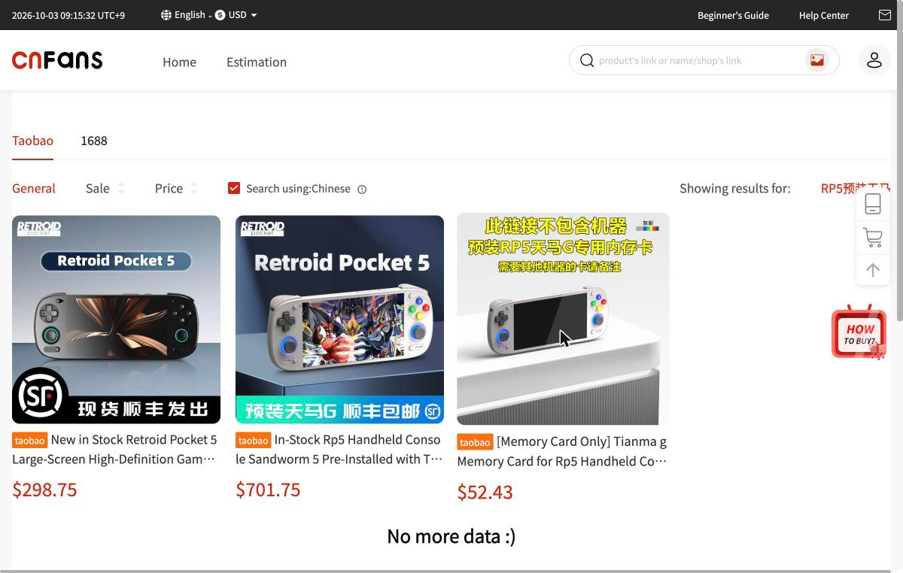
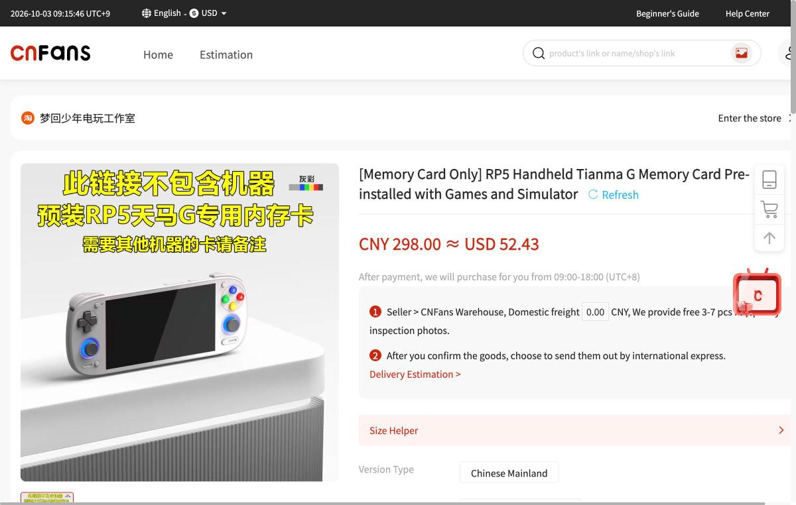
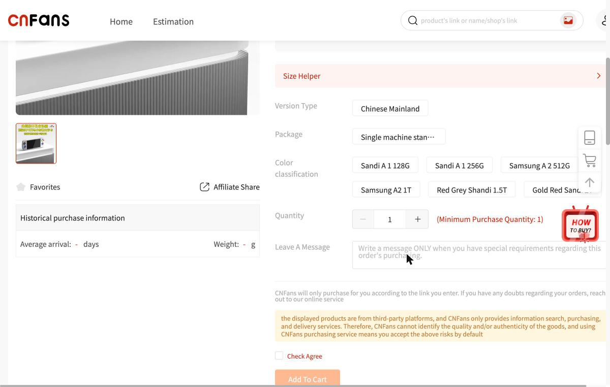

# CNFansの出品と規約

種類は、淘宝や1688の商品を代行購入する海外向けのサービスです。URLは https://cnfans.com/ で、検索は `https://cnfans.com/search?keywords=<中国語>&searchType=keywords` の形です。信頼度は販売元で、ページの記載を、そのまま事実として扱えます。ただし、商品そのものの品質は、CNFansが保証しないと明記しています。ブラウザの確認は、2026年10月3日に行いました。各商品のURLは、ツールの出力で伏せられたため、検索の画面から開く方法で記録しています。

## 使い方の観察

ログインなしで検索でき、結果は米ドルで表示されます。通貨は、AUD、CAD、CHF、EUR、GBP、NZD、PLN、RON、SEK、USD、CNYから選べ、日本円はありません。言語は、英語、ドイツ語、オランダ語、スペイン語、フランス語、イタリア語、ポーランド語、ポルトガル語、ルーマニア語、スウェーデン語、中国語から選べます。検索結果の画面には、「Search using: Chinese」のチェックがあり、中国語のキーワードで検索する設定になっています。商品名は、機械翻訳された英語です。

商品ページには、商品名、価格(元と米ドル)、「After payment, we will purchase for you from 09:00-18:00 (UTC+8)」(支払い後、中国時間の9時から18時の間に代わりに購入します)、「Seller > CNFans Warehouse」の流れ、国内送料、3〜7枚の検品写真、国際配送の選択、オプション(色、容量など)が並びます。オプションを切り替えても、価格の表示は変わりませんでした。商品ページの下には、「Product Detail」、「Specification Parameter」、「Shopping Agent Guidance」、「After Sales Service」、「Service Promise」のタブがあります。

## アフターサービスの説明

電子機器とデジタル商品は、検品の対象が、外観に問題がないか、付属品がそろっているかに限られ、電源を入れて機能を確認することはできません。倉庫に着いたあと、5日以内に返品を申請できます。返品の費用は、1点あたり約0.75ドルの手数料と、返送料で、合計が約3ドルです。特注の商品は返品できません。

送れない品物の説明は、ナイフ類、ライター、液体や食品(果汁、酒、チーズ、カニなど)、種子、磁気部品などを挙げています。薬、液体、クリーム、粉、化粧品は、中国の輸出の規制があるとあります。税関の扱いは、国によって異なると書かれています。

## 天馬G入りのRetroid Pocket 5の出品

「RP5预装天马」で検索すると、3件が出ました。

1件目は、題名に、Android 13、天馬G入り、Moonlight Box(月光宝盒)、おまけ付きと書かれた本体の出品(298.75ドル)で、開こうとすると「商品に権利侵害の疑いがあり、代行購入できません」という英語のメッセージが表示されました。同じ検索で、281.15ドルの本体の出品も、同じメッセージでした。701.75ドルの出品は、開くとCNFansのトップページに戻されました。

3件目の、「【メモリーカードのみ】RP5用の天馬Gメモリーカード、ゲームとエミュレーター入り」(52.43ドル、298元)は、ページを開けました。店の名前は「梦回少年电玩工作室」です。画像には、「此链接不包含机器」、「预装RP5天马G专用内存卡」、「需要其他机器的卡请备注」と書かれています。オプションは、Sandisk A1の128GBと256GB、Samsung A2の512GBと1TB、Sandiskの1.5TBと2TBの6種類です。ページの説明は、「此商品链接只有内存卡 请知悉」と書き、玩家が届いたあとで、チュートリアルに従ってインストールすると説明しています。さらに、ほかの機種(Odin 2、Odin 2 mini、RP5、RP4PRO)の専用のカードが必要なら、備考に書くよう案内しています。「Specification Parameter」の欄は、ブランドが「Game Kiddy」、画面サイズが6インチ、対応機種がps1などと、出品者が適当に入力したとみられる値で、RP5の実際の仕様と合いません。

## RG406Vの出品

RG406Vの出品には、色と容量のオプションが20種類以上あり、「ゲームなし」と「ゲームカード入り」、フロントエンドの「公式」と「天馬」の組み合わせがありました。ページの画像には、対応機種として、PS2、WII、NGC、3DS、PSP、DC、SS、PS1、NDS、N64、ARCADE、FBA、NEOGEOなどが並び、「支持用户自下载相关格式游戏」(ユーザーが自分でゲームをダウンロードして遊ぶ形式)と書かれています。チップは「虎贲T820」と、画像で確認できました。
