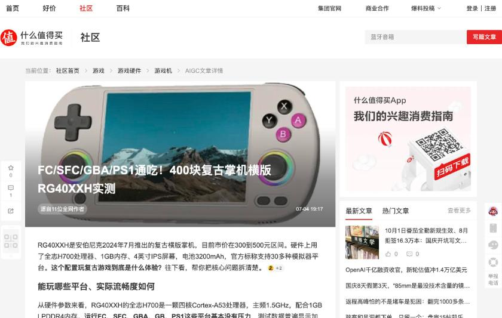

# 什么值得买のAI生成記事

種類は、什么值得买の社区に載った記事で、ページの上部に「AIGC文章詳細」と表示されます。信頼度はAI生成です。記事の末尾に「内容由AI生成」と書かれ、本文の根拠として、複数の参考ページが並べられます。数値と評価の裏づけとしては、そのまま使えません。この調査で読んだのは、次の2本です。

## 2026开源掌机红黑榜

URLは https://post.smzdm.com/p/aww5ev54/ で、題名は「2026开源掌机红黑榜:百元R36S到旗舰RG556,真实体验告诉你谁值得买」、日付は7月2日です。「源自9位全网作者」とあり、全体が、複数の情報源をAIがまとめた文章です。

内容は6つの節です。ブランドの位置づけ、チップの比較、OSの選択、価格帯、評判、比較の観点です。ブランドの説明は、Miyooを小型で200元以内の機種で人気のブランド(生産が少なく「猴里谢」と呼ばれる)、Anbernicを品ぞろえの広いブランド(2017年に、IPS画面のRG350を出した)、老張(GKD)をOSの最適化に強いブランド、R36Sを百元の入門機としています。チップは、H700とRK3566が中堅、RK3326が入門で、RG556とRetroid Pocket 5が上位と書きます。OSは、Miyoo Mini PlusにOnion OS、H700のAnbernic機にmuOSとKnulli、R36SにArkOSとRocknixが向くとし、2026年6月のROCKNIXの安定版で、SteamとVita3Kが加わり、対応機種が49から66に増えたと書いています。価格帯は、100〜200元(R36S)、300〜500元(RG35XX、PowKiddy X55)、1000〜3000元(Retroid Pocket 5、RG556)に分けています。

## FC/SFC/GBA/PS1通吃!400块复古掌机横版RG40XXH实测

URLは https://post.smzdm.com/p/aqrg0rx2/ で、日付は7月4日、「源自11位全网作者」です。

RG40XXHを、2024年7月に出たAnbernicの横型で、市価が300〜500元の機種と紹介しています。H700、1GB、4インチIPS、電池3200mAhで、公式は30以上のエミュレーターに対応するとしています。FC、SFC、GBA、GB、PS1は問題なく動き、PSPとN64は一部が遊べるとします。画面は4インチ640×480で200PPI、重さは208g、ボタンは導電ゴムです。横型でMini HDMI出力とWi-Fiと蓝牙を持つ点を、PowKiddy RGB30とRGB20SXとの比較で挙げています。参考の一覧には、搜狐の記事、掌机圈のページ、Alibabaの英語の記事、Amazonの商品ページなどがあります。ページの下のコメントには、「200出头,PSP的三国无双,实况足球都挺好,流畅」というものがあり、折りたたまれています。
