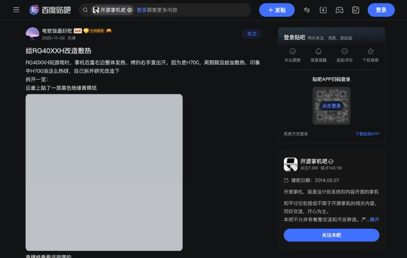

# 貼吧のRG40XXH放熱改造

種類は、百度貼吧の开源掌机吧の投稿です。URLは https://tieba.baidu.com/p/10191425150 、題名は「给RG40XXH改造散热」、投稿日は2025年11月6日、投稿者は天津のユーザーです。信頼度は個人で、写真つきの実体験です。コメントは11件で、すべて読めました。

## 投稿の内容

投稿者は、RG40XXHで遊ぶと、背面の右側が熱くなり、右手が汗ばむため、分解して調べました。H700なので、Anbernic(投稿では「周割」)は放熱を付けなかったと推測し、H700がそれほど熱かった記憶はなかったと書いています。分解すると、背面のカバーには黒い絶縁紙の「青稞纸」が貼られていました。厚さは0.5mmで、投稿者は、貼らないほうがよいと感じました。その下には、電池を動かさないための厚さ2mmの発泡材が2枚ありました。

動画で見たH700系のSoCに、熱伝導パッドと銅箔を使う方法を参考に、ネットで買った熱伝導パッドを貼りました。H700の上に1枚貼れば足りたが、最初に貼る向きを間違えたので、全部に貼ったそうです。H700に使ったパッドは、厚さ5.5mmが合い、電池とカバーの隙間が2mmなので、電池が動かないよう適当なものを貼れば足ります。試すと、背面で熱いのはH700の真上の小さな部分だけになり、右手は熱くなくなりました。

投稿者は、H700は全力で動かしても極端には熱くならず、熱をカバーに逃がせば、熱がこもらないと結論しています。最後に、RG40XXHの十字キーに軽い誤入力があるが、BluetoothとWi-Fiがあることは便利で、コントローラーをつないで遊ぶ体験がよいと書いています。

## コメント

別のユーザーは、シリコンのパッドを置くだけでよかったのにと書いています。ほかのユーザーは、海外のレビューでも、40XXHは発熱が問題と言われていた、と書いています。投稿者は、セットトップボックスでH700を使うときは、アルミの放熱片を貼るだけで、ファンもいらないほどで、メーカーが放熱を付けなかったのが残念だと返しています。「効果は本当にあるのか」という質問に、投稿者は、H700は高温でもフリーズしないので、メーカーは付けなかったが、パッドを付ければ温度は下がる、必須ではない、と答えています。

別のコメントは、「H700は、PS1を2倍の解像度にすると重い」と書きました。投稿者は、フィルターとマスクを切れば止まらず、ドリームキャストのエミュレーターも、640×480に設定すれば止まらないと返しました。銅箔の厚さを聞かれて、約0.1mmの紙のような薄さと答え、熱伝導パッドの厚さと種類を聞かれて、いちばん安いもので十分、40XXHなら5mmか、2.5mmを2枚重ねればよい、と答えています。
